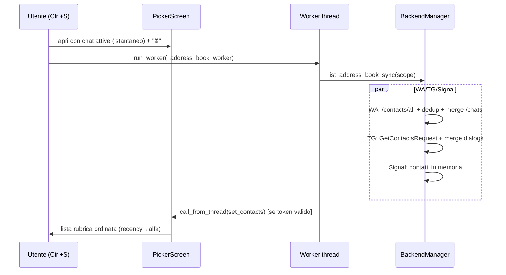
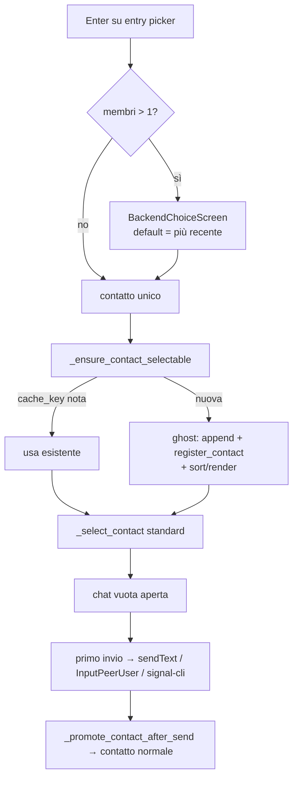

# DESIGN — Ctrl+S rubrica completa (no grouping)

**Progetto:** `/home/rob/signal-tui-client` — client TUI Python/Textual multi-backend (Signal, WhatsApp, Telegram)
**Tipo:** specifica implementativa per lo sviluppatore. Nessun codice completo: firme, pseudocodice, schemi, riferimenti riga per riga al codice esistente.
**Baseline test:** suite attuale `507 passed` (non deve mai scendere).

---

## 1. Obiettivo e scope

### Obiettivo

Oggi **Ctrl+S** (`tui/app.py:64` → `action_open_contact_picker` → `tui/pickers.py:46 _open_contact_picker`) apre `ContactPickerScreen` (`contact_picker.py`) popolato con `self._filtered_contacts()` (`tui/contacts.py:83`): **solo contatti con chat attive**, filtrati per protocollo. La feature estende Ctrl+S alla **rubrica completa** dei 3 backend:

| Backend | Oggi (chat attive) | Domani (rubrica) | Fonte verificata |
|---|---|---|---|
| Signal | rubrica già completa (~36) | invariata | `listContacts` RPC (`backends/signal.py:_load_contacts_rpc`) |
| WhatsApp | ~325 chat da `GET /api/{session}/chats` (97% JID `@lid`) | ~563 contatti con numero da `GET /api/contacts/all?session=default` (duplicati 2x) + mappa `@lid`→numero via `GET /api/{session}/contacts/{jid}` | verificato funzionante |
| Telegram | 5 dialoghi da `get_dialogs` (`backends/telegram.py:258`) | ~165 contatti da `GetContactsRequest(hash=0)` (ogni `User` ha `access_hash`) | verificato funzionante |

Il picker mostra la rubrica aggregata ordinata **recency → alfabetico** (riuso semantica `_contact_sort_key`), e alla selezione di un contatto **senza chat attiva** apre/crea la chat sul backend giusto (*open-or-create*).

### IN scope

- Nuovo contratto backend `list_address_book()` + implementazioni WA/TG/Signal.
- Aggregazione in `BackendManager`.
- `ContactPickerScreen`: sourcing asincrono con stato di caricamento, raggruppamento logico *solo nel picker* dello stesso contatto su più backend, sub-scelta backend, filtro protocollo interno, ricerca estesa al numero.
- Open-or-create in `_select_contact` (`tui/contacts.py:366`) con stato "chat fantasma".
- Cache persistente della mappa `@lid`→numero WhatsApp.
- Test unitari, UI (pilot), integrazione, fixture da dati reali anonimizzati.

### OUT of scope (esplicito)

- **Nessuna modifica alla contact list principale**: composizione (resta = chat attive), rendering, `_render_contact_list`, `_apply_contact_visibility`.
- **Nessun raggruppamento per contatto nella lista principale** (il raggruppamento multi-backend esiste SOLO dentro il picker).
- Nessuna modifica a Ctrl+W sulla lista principale (`action_cycle_protocol_filter`, `tui/contacts.py:352`).
- Nessuna modifica a resync/storico (`resync_history`, `fetch_history`) oltre a quanto serve all'open-or-create.
- Nessuna modifica allo schema SQLite (`backend/db.py`).
- Nessuna stima in giorni: solo aree di lavoro ordinate (§8).

---

## 2. Contratto backend: `list_address_book()`

**File:** `backends/base.py`

### Firma

```python
class ChatBackend(ABC):
    # ─── Address book (rubrica completa) ─────────────────────────────

    def list_address_book_sync(self, force: bool = False) -> list[ChatContact]:
        """Rubrica COMPLETA del backend (non solo chat attive).

        Bloccante: chiamare SOLO da worker thread (pattern esistente di
        send_message_sync / mark_read_sync).  NON solleva mai eccezioni:
        in caso di errore remoto ritorna l'ultima copia cached o [].
        Default: i contatti già caricati (self.contacts) marcati come
        rubrica — sufficiente per backend la cui lista è già completa.
        """
        ...

    async def list_address_book(self) -> list[ChatContact]:
        """Wrapper async del contratto (symmetry con list_contacts);
        delega a list_address_book_sync via asyncio.to_thread."""
        ...
```

**Perché sync-first e non async puro:** tutti i punti d'uso reali nella TUI sono worker thread (`run_worker(..., thread=True)`); i backend esistenti espongono già varianti `*_sync` (`send_message_sync`, `mark_read_sync`, `connect_sync`). L'async resta come wrapper per contratto.

### Cache per-backend (contratto interno)

Ogni implementazione mantiene:

- `self._address_book: list[ChatContact] | None` — ultima rubrica costruita;
- `self._address_book_ts: float` — `time.monotonic()` del build;
- TTL default **300 s** (`get_address_book_ttl_s()`, §6). `force=True` ignora il TTL.
- In caso di errore durante un refresh: si serve la copia cached (stale) se presente, altrimenti `[]`, e si logga. **Mai eccezioni verso il chiamante.**

### Arricchimento `ChatContact.extras` (schema nuovo)

Nessuna modifica al dataclass `ChatContact` (`models.py`): tutto viaggia in `extras` (pattern già usato per `last_message_ts`, `aci`, `jid`, `username`...).

| Chiave extras | Tipo | Backend | Significato |
|---|---|---|---|
| `phone` | `str` (solo cifre, no `+`) | WA, TG, Signal | Numero normalizzato E.164 senza `+`. Chiave di raggruppamento cross-backend nel picker e di match nella ricerca. |
| `is_chat_active` | `bool` | tutti | Il contatto ha una chat/dialogo attivo sul backend. |
| `address_book` | `bool` (`True`) | tutti | Provenienza: entry prodotta da `list_address_book_sync`. |
| `last_message_ts` | `int` (ms), 0 default | tutti | Già esistente (`models.py:76` property); 0 = nessuna chat attiva → coda alfabetica. |
| `lid` | `str` | WA | JID `@lid` originale della chat attiva (se l'id usato per i messaggi è un lid). |
| `lid_unresolved` | `bool` | WA | Chat attiva `@lid` non ancora risolta a numero: entry standalone non raggruppabile. |
| `access_hash` | `str` (int serializzato) | TG | Obbligatorio per `InputPeerUser(user_id, access_hash)` all'invio verso contatti senza dialogo. |
| `source` | `str` | WA/TG | `"wa_book"` \| `"wa_chats"` \| `"tg_book"` \| `"tg_dialogs"` — debug/telemetria. |
| `ghost` | `bool` | UI (§5) | Inserito nella lista principale via open-or-create, non ancora confermato da un sync. |

Chiavi esistenti riusate: `jid` (WA), `username` (TG), `is_group`/`is_channel` (TG), `aci`/`number` (Signal), `read_outbox_max_id` (TG).

**Regola di identità:** `ChatContact.id` resta l'indirizzo a cui il backend sa inviare E che coincide con la chiave di cache esistente quando la chat esiste (`backend.cache` è keyed by raw id; la UI cache è keyed by `contact_cache_key(protocol, id)`, `models.py:36`). Questo vincolo guida il merge WA (§3.1).

### Gestione errori (contratto)

- `list_address_book_sync` **non solleva mai**: errori loggati (`logger.warning` con `exc_info=True`), risultato parziale o stale-cache.
- Il chiamante distingue i fallimenti tramite `BackendManager.address_book_errors` (§3.4), non tramite eccezioni.

---

## 3. Implementazione per backend

### 3.1 WhatsApp — `backends/whatsapp_rest.py` + `backends/whatsapp.py`

#### a) REST client: nuovi metodi in `WhatsAppRESTClient`

```python
def list_all_contacts(self) -> list[dict] | None:
    """GET /api/contacts/all?session={session_name}  (timeout=10)

    Ritorna la lista raw WAHA: [{"id": "393331234567@c.us" | {"_serialized": ...},
    "name": str|None, "pushname": str|None, ...}].  Normalizza via
    _unwrap_contacts (già esistente, whatsapp_rest.py:257).
    None su errore di trasporto/HTTP (contratto _request esistente)."""


def resolve_contact(self, jid: str) -> dict | None:
    """GET /api/{session_name}/contacts/{jid}  (timeout=5, path percent-encoded
    con quote(jid, safe="") — stesso pattern di download_media, whatsapp_rest.py:390).
    Risposta attesa: {"id": "39333...@c.us", ...} → mappa @lid → numero."""


def check_number_exists(self, phone_digits: str) -> bool | None:
    """GET /api/contacts/check-exists?phone={digits}&session={session_name} (timeout=5).
    Parse tollerante: {"exists": bool} oppure {"numberExists": bool}.
    None se endpoint assente/errore (best-effort, §5)."""
```

#### b) Dedup 2x della rubrica — funzione pura in `backends/whatsapp.py`

```python
def _dedup_book_contacts(raw: list[dict]) -> list[dict]:  # pure, unit-testable
```

- **Chiave:** cifre del numero estratte da `id` (`_serialized` se dict), scartando `@c.us`/`@s.whatsapp.net` e ogni non-cifra. Entry con chiave vuota o `@broadcast`/`@newsletter`/`@g.us` → scartate.
- **Criterio del vincitore** tra duplicati dello stesso numero (in ordine):
  1. preferisci entry con `name` non vuoto (nome rubrica telefono) su una con solo `pushname`;
  2. a parità, preferisci dominio `@c.us`;
  3. a parità, prima occorrenza (stabile).
- Output: `[{"phone": "393331234567", "name": str, "pushname": str|None}]`.

#### c) Cache persistente `@lid` → numero

- **Path:** `CACHE_DIR / "wa_lid_map.json"` (`CACHE_DIR = backend/db.py:15`, `~/.local/share/signal-tui-client`).
- **Schema JSON:**

```json
{
  "version": 1,
  "entries": {
    "220988985864200@lid": {
      "phone": "393331234567",
      "name": "Mario Rossi",
      "resolved_at": 1755500000
    },
    "111222333444@lid": { "phone": null, "resolved_at": 1755500000 }
  }
}
```

- **TTL:** positivi 30 giorni (`get_wa_lid_cache_ttl_days()`); negativi (`phone: null`) 24 h — poi ri-tenta.
- **Implementazione su `WhatsAppBackend`:** `_lid_map: dict` in-memory caricato lazy da disco, `_lid_lock = threading.Lock()`, scrittura **atomica** (file tmp + `os.replace`), save **debounced** (una volta a fine batch del resolver, non per item). Funzioni: `_lid_cache_load()`, `_lid_cache_save()`, `_lid_lookup(jid) -> str | None` (solo memoria), `_lid_resolve_remote(jid) -> str | None` (REST + aggiorna cache).

#### d) Lazy vs bulk — decisione

**Al load della rubrica: ZERO chiamate di rete per i lid** (si usa solo la cache). I lid attivi non in cache vengono risolti da un **resolver in background**:

```python
def start_lid_resolver(self) -> None:   # idempotente, daemon thread interno
```

- Prende i `@lid` delle chat attive (`self.contacts`) non in cache, max **30 per run**, intervallo **0,3 s** tra GET (rate-limit gentile verso WAHA), poi `_lid_cache_save()` e invalida `self._address_book` (il prossimo Ctrl+S beneficia).
- Avviato alla prima `list_address_book_sync` e, se già connesso, anche a fine `connect_sync`. Opportunistico: anche il flusso webhook può chiamare `_lid_resolve_remote` quando arriva un messaggio da un lid sconosciuto (fuori scope minimo, annotato come miglioria opzionale).

*Alternativa scartata:* bulk eager di ~315 GET al caricamento → troppo lento e aggressivo sul server; con la cache persistente il costo si ammortizza su pochi run.

#### e) `WhatsAppBackend.list_address_book_sync(force=False)`

Pseudocodice del merge (rubrica ∪ chat attive):

```
se cache fresca e not force → ritorna self._address_book
book  = _dedup_book_contacts(rest.list_all_contacts() or [])     # 563 → ~dedup
chats = self.contacts                                            # da /chats (attive)
by_phone = {}
for b in book:
    cc = ChatContact(id=f"{b.phone}@c.us", display_name=b.name or b.pushname or "+"+b.phone,
                     protocol="whatsapp",
                     extras={"phone": b.phone, "jid": id, "address_book": True,
                             "is_chat_active": False, "source": "wa_book"})
    by_phone[b.phone] = cc
out_extra = []                                                   # gruppi + lid irrisolti
for chat in chats:
    if chat.id endswith "@g.us":
        marcare is_chat_active=True, source="wa_chats" → out_extra (gruppi SOLO da /chats)
        continue
    phone = cifre(chat.id) se "@c.us" else _lid_lookup(chat.id)  # cache-only
    if phone and phone in by_phone:                              # MERGE
        e = by_phone[phone]
        e.id = chat.id                # continuity: cache key + send path esistenti
        e.extras["is_chat_active"] = True
        e.last_message_ts = chat.last_message_ts     # ms, da /chats (last_ts)
        if chat.id endswith "@lid": e.extras["lid"] = chat.id
        # display_name: vince il nome rubrica (già su e) se quello chat è vuoto/JID
    elif phone:                          # chat attiva @c.us NON in rubrica
        out_extra.append(clone(chat, is_chat_active=True, source="wa_chats", phone=phone))
    else:                                # @lid NON risolto
        out_extra.append(clone(chat, is_chat_active=True, lid_unresolved=True))
self._address_book = list(by_phone.values()) + out_extra
```

Note:
- **Id merged = JID della chat attiva** (anche `@lid`): invio e storico restano quelli già funzionanti. L'`id` `@c.us` da rubrica si usa SOLO per contatti senza chat attiva (open-or-create, §5).
- `unread` non serve al picker (i badge vivono in `app._unread_counts`): non propagato.
- ts sorgente chat: `WhatsAppRESTClient.list_contacts` già normalizza in ms (`last_ts`, `whatsapp_rest.py:225-254`).

### 3.2 Telegram — `backends/telegram.py`

#### a) Fetch rubrica (coroutine sul loop Telethon esistente)

```python
async def _fetch_address_book(self) -> list[ChatContact]:
    """telethon.functions.contacts.GetContactsRequest(hash=0) → list[User]."""


def list_address_book_sync(self, force: bool = False) -> list[ChatContact]:
    """TTL cache come da contratto; esegue _fetch_address_book via
    asyncio.run_coroutine_threadsafe(..., self._loop).result(timeout=20).
    Se non connesso / FloodWait / RPCError → stale cache o [] (mai raise)."""
```

Costruzione per `User` (riuso di `_entity_to_contact`, `telegram.py:202`, esteso):
- salta `bot=True` e account eliminati ("Deleted Account");
- `id=str(user.id)`, `display_name=first+last | username | phone | id`;
- extras: `phone` (cifre, **può essere ""** — vedi caso sotto), `username`, `access_hash=str(user.access_hash)`, `is_group=False`, `address_book=True`, `source="tg_book"`.

**Caso "Mamma Vod" (contatto senza numero):** incluso con `phone=""`; ricerca per nome funziona; invio via `InputPeerUser` + `access_hash` (non serve il numero). Non raggruppabile cross-backend (nessuna chiave telefono).

#### b) Merge con i dialoghi (gruppi/canali SOLO da `get_dialogs`)

```
dialogs_by_id = {int(c.id): c for c in self.contacts}   # già caricati a connect
for u in users:
    cc = build(u)
    d = dialogs_by_id.pop(int(u.id), None)
    if d: cc.last_message_ts = d.last_message_ts
          cc.extras["is_chat_active"] = True
          cc.extras["read_outbox_max_id"] = d.extras.get(...)   # se presente
    entries.append(cc)
entries.extend(dialogs_by_id.values())   # gruppi/canali + utenti non-rubrica con dialogo
# Lookup esteso: _contacts_by_id include ANCHE i book user (serve a _identify_contact
# e al send-fallback).  self.contacts resta SOLO dialogs → lista principale invariata.
```

#### c) Send verso contatti senza dialogo (prerequisito open-or-create)

Nuovo helper interno, usato da entrambi i path di invio (`send_message` e `send_message_sync`, `telegram.py:399/428`):

```python
async def _resolve_input_entity(self, eid: int):
    """1) get_input_entity(eid) — fast path (entity già in sessione Telethon);
    2) fallback: InputPeerUser(eid, int(access_hash)) da _contacts_by_id[eid].extras
       (telethon.tl.types.InputPeerUser, import lazy come già fatto altrove);
    3) se nessun access_hash → RuntimeError("Telegram: access_hash mancante per <eid>")."""
```

Dopo il primo invio riuscito Telethon cache-a l'entity in sessione e il fast path torna a bastare.

### 3.3 Signal — `backends/signal.py`

Quasi nulla: `listContacts` RPC è già la rubrica completa. Override minimale:

```python
def list_address_book_sync(self, force: bool = False) -> list[ChatContact]:
    """list(self.contacts) con extras arricchiti in-place-safe:
    phone = cifre di c.id (l'id Signal È il numero E.164),
    address_book=True, is_chat_active = (last_message_ts > 0).
    last_message_ts è già recuperato da SQLite in _set_contacts (signal.py:249)."""
```

### 3.4 Aggregazione — `backends/manager.py`

```python
class BackendManager:
    address_book_errors: dict[
        str, str
    ]  # protocol → errore (ultimo run); reset a ogni call

    def list_address_book_sync(
        self, protocols: set[str] | None = None, force: bool = False
    ) -> list[ChatContact]:
        """Rubrica aggregata dei backend registrati (filtrata per protocols se dato).
        Fan-out parallelo: ThreadPoolExecutor(max_workers=3), future.result(timeout=25)
        per backend; eccezione/timeout di UN backend → log + address_book_errors +
        si continua con gli altri (risultato parziale ammesso).  Concatena e ritorna."""
```

Il fan-out parallelo è sicuro: WA = REST sincrono, TG = coroutine sul suo loop dedicato, Signal = memoria; nessuno stato condiviso tra backend.

---

## 4. Picker UI

**File:** `contact_picker.py` (modello+schermate), `tui/pickers.py` (wiring asincrono).

### 4.1 Modello: raggruppamento "stessa persona" (SOLO nel picker)

```python
@dataclass
class PickerEntry:
    key: str                          # "phone:393331234567" | "raw:<protocol>:<id>"
    display_name: str                 # miglior nome tra i membri
    members: dict[str, ChatContact]   # protocol → contatto

def normalize_phone(s: str) -> str:        # solo cifre; "" se niente cifre
def group_by_person(contacts: list[ChatContact]) -> list[PickerEntry]:
    """Chiave: normalize_phone(extras.phone | id se Signal | id se @c.us).
    MAI per: id Telegram (user_id numerico NON è un telefono), @lid irrisolti,
    @g.us, phone=="" → chiave "raw:..." unica (entry singola)."""

def entry_default_contact(e: PickerEntry) -> ChatContact:
    """Default = membro con last_message_ts maggiore ('più recente');
    tiebreak deterministico: signal > whatsapp > telegram.
    Se config picker_preferred_backend è impostato e presente tra i membri → vince lui."""
```

*Alternativa scartata:* righe duplicate per protocollo (rumore visivo su ~770 contatti) e selezione automatica silenziosa del default (l'utente deve poter scegliere il backend non-più-recente).

### 4.2 Ricerca e ordinamento

- `search_contacts(contacts, query, max_results=50)` (`contact_picker.py:31`): **estesa** a matchare anche `extras["phone"]` (firma invariata, test esistenti verdi — il campo è additivo).
- Nuova `search_entries(entries, query, max_results=50) -> list[PickerEntry]`: match substring case-insensitive su `display_name`, `id` e `phone` di **ogni membro**; query vuota → tutti (cappati).
- **Ordinamento:** riuso esatto della semantica di `_contact_sort_key` (`tui/contacts.py:18`): (1) con messaggi per `-last_message_ts`; (2) senza messaggi con nome, alfabetico; (3) "solo numero" in coda. **Refactor di supporto:** estrarre la chiave come funzione module-level `contact_sort_key(c)` in `contact_picker.py` e far delegare `ContactListMixin._contact_sort_key` (direzione import `tui.contacts → contact_picker`: nessun ciclo, `tui/__init__.py` è vuoto). Le entry si ordinano per il membro default.
- **Max risultati renderizzati: 50** (come oggi; costante `PICKER_MAX_RESULTS`, override via config §6). La lista sorgente completa resta in memoria; il cap riguarda solo i `ListItem`.

### 4.3 Schermate

**`ContactPickerScreen`** — modifiche backward-compatible:

```python
def __init__(
    self,
    contacts: list[ChatContact] | None = None,
    *,
    protocol_filter: str = "all",
    loading: bool = False,
): ...
def set_contacts(self, contacts: list[ChatContact]) -> None:
    """Chiamata dal worker via call_from_thread.  Guard: if not self.is_mounted: return.
    Ri-costruisce entries, ri-applica query corrente e filtro, re-render."""
```

- Stato loading: footer `⏳ Caricamento rubrica completa…` (il titolo resta); l'input `#contact-search` resta attivo e la ricerca riparte sui dati completi all'arrivo.
- Label riga: emoji concatenate dei membri ordinati per (ts desc, priorità) + nome, es. `💬📱 Mario Rossi`; entry singola = come oggi (`protocol_emoji`).
- **Binding interno Ctrl+W** (`Binding("ctrl+w", "cycle_filter", priority=True)` sul modal): cicla `all → signal → whatsapp → telegram` **client-side** sulle entries già caricate (nessun refetch); footer mostra il filtro attivo. Con filtro specifico, Enter su entry multi-membro sceglie direttamente il membro di quel protocollo.

**`BackendChoiceScreen(ModalScreen[ChatContact])`** — nuovo piccolo modale in `contact_picker.py`:

- Una riga per membro: `{emoji} {Protocollo} — ultimo msg {data relativa | "mai"}`; pre-selezionato il default "più recente"; Enter seleziona, Esc torna al picker (`dismiss(None)`).
- Flusso: Enter su entry con 1 membro → `dismiss(contact)` diretto; con >1 membri → `app.push_screen(BackendChoiceScreen(entry), cb)`; in `cb`: se scelto → `self.dismiss(contact)` del picker; se `None` → resta aperto il picker.

### 4.4 Sourcing asincrono — `tui/pickers.py`

```python
def _open_contact_picker(self) -> None:
    self._address_book_token += 1  # nuovo attributo app, int
    token = self._address_book_token
    scope = None if self._protocol_filter == "all" else {self._protocol_filter}
    screen = ContactPickerScreen(
        self._filtered_contacts(),  # fast path: chat attive subito
        protocol_filter=self._protocol_filter,
        loading=True,
    )

    def _on_done(contact):
        self._address_book_token += 1  # invalida worker in volo
        if contact:
            self._select_contact(contact)
        else:
            self._refresh_chat()  # comportamento esistente

    self.push_screen(screen, _on_done)
    self.run_worker(
        lambda: self._address_book_worker(token, scope, screen),
        thread=True,
        exclusive=False,
    )


def _address_book_worker(self, token, scope, screen) -> None:  # worker thread
    if wa := self.whatsapp_backend:
        wa.start_lid_resolver()  # idempotente
    contacts = self.manager.list_address_book_sync(protocols=scope)
    errors = dict(self.manager.address_book_errors)

    def _apply():  # UI thread
        if token != self._address_book_token or not screen.is_mounted:
            return
        screen.set_contacts(contacts)  # sostituisce il fast path
        if errors:
            self._status(f"⚠️ Rubrica parziale: {', '.join(errors)}")

    self.call_from_thread(_apply)
```

- **Timeout:** per-backend interni (WA REST 10 s, TG 20 s) + cap manager 25 s (§3.4). Mai bloccare la UI: tutta l'attesa vive nel worker.
- **Cancellazione:** token + `is_mounted` (sia Esc sia selezione invalidano).
- **Ri-apertura entro TTL (5 min):** i backend servono da cache → popolamento quasi istantaneo.



---

## 5. Open-or-create

**File:** `tui/contacts.py` (selezione), `backends/base.py` + backend (hook registrazione), `tui/send.py` (immutato, riceve il contatto già risolto).

### 5.1 Guard rilassata in `_select_contact` (`tui/contacts.py:366`)

Oggi la riga 375 `if contact not in self.contacts: return` scarta i contatti di sola rubrica. Sostituire con:

```python
def _ensure_contact_selectable(self, contact: ChatContact) -> ChatContact | None:
    """Ritorna il contatto CANONICO da usare per la chat:
    - se cache_key già in self.contacts → quello esistente (evita oggetti divergenti
      a parità di identità; il confronto per == su dataclass includerebbe extras);
    - altrimenti OPEN-OR-CREATE: marca extras['ghost']=True, append a self.contacts,
      registra nel backend via hook, _sort_contacts() + _render_contact_list(...)
      (il ramo 'superset' esistente appende in-place senza flash), ritorna contact.
    None se il backend del protocollo non è registrato → status '❌ backend non
    disponibile' e return da _select_contact."""
```

In `_select_contact`: `contact = self._ensure_contact_selectable(contact); if contact is None: return` — poi tutto il flusso esistente (banner, `_clear_chat`, `_chat_reload_token += 1`, `_load_messages_worker`, mark-read, highlight, focus) funziona invariato: `_contact_widgets` è keyed by `cache_key`.

### 5.2 Hook backend

```python
# backends/base.py (non-abstract):
def register_contact(self, contact: ChatContact) -> None:
    """Rende il contatto noto al backend (lookup per eventi/invio)."""
    if contact not in self.contacts:
        self.contacts.append(contact)
```

Override: WA aggiunge `_contacts_by_jid[contact.id] = contact`; TG `_contacts_by_id[int(contact.id)] = contact` (guard `ValueError`); Signal `_contacts_by_key[contact.cache_key] = contact`. Così `_identify_contact` e `_handle_message_event` (`tui/events.py:38`) riconoscono subito il ghost e non creano placeholder duplicati all'arrivo del primo messaggio.

### 5.3 Flusso per backend

| Backend | Apertura | Invio (via `send_message_sync` esistente) |
|---|---|---|
| **WhatsApp** | Chat vuota; `_load_messages_worker` fase 2 chiama `fetch_history(id, 50)` → WAHA risponde `[]` per chat mai esistita (tollerato). In background (worker): `check_number_exists(phone)` → se `False`, `_status("⚠️ {numero} non risulta su WhatsApp", 0)` informativo, **non bloccante**. | `POST /api/sendText` con `chatId = {phone}@c.us` — WAHA **crea la chat** lato server. Numero non iscritto/errore → `sendText` fallisce → path esistente: bolla `pending → failed` + `_status("❌ Send error: …")` (`tui/send.py:272`). |
| **Telegram** | Chat vuota (nessuno storico finché non c'è dialogo). | `_resolve_input_entity` (§3.2c): `InputPeerUser(user_id, access_hash)` da extras → `client.send_message`. Senza `access_hash` → `RuntimeError` → path failed esistente. Funziona anche per contatti senza numero ("Mamma Vod"). |
| **Signal** | Chat vuota. | `id` = numero E.164 (o ACI): signal-cli invia a destinatari arbitrari; numero non registrato → errore signal-cli → path failed esistente. |

### 5.4 Chat fantasma: lifecycle

- Il ghost compare nella lista principale (voluto: è la chat appena aperta), senza messaggi → sezione "senza messaggi" finché `_promote_contact_after_send` (`tui/contacts.py:56`) al primo invio non gli assegna `last_message_ts` → sale in cima. Non serve alcun rendering speciale: `extras["ghost"]` è solo un marker di debug.
- `mark_read_sync` sul ghost è no-op tollerato (WA: `POST /api/chats/{id}/read` su chat inesistente → `None`; TG/Signal: solo SQLite).
- **Dopo il primo messaggio:** WA — la chat compare in `/chats` al prossimo load; se WAHA la espone come `@lid`, vale il merge via `lid_map` (fino ad allora possibile doppia riga ghost-`@c.us`/lid: rischio residuo documentato §9). TG — diventa dialogo al prossimo `get_dialogs`. Signal — già rubrica; ts recuperato da SQLite.
- **Restart:** ghost con zero messaggi non ricompare (la lista principale resta = chat attive; la rubrica NON viene precaricata nella lista). Con messaggi: rientra come chat attiva per i motivi sopra. Accettato e documentato.



---

## 6. Dettagli trasversali

### Modelli (`models.py`)

- Nessuna modifica strutturale a `ChatContact` (extras copre tutto, §2). **Aggiunta opzionale consigliata:** property read-only `phone → str` (legge `extras["phone"]`, default `""`) per non duplicare `extras.get("phone","")` in picker/search/test.

### Config (`backends/config.py`, pattern esistente env → `config.json` → default)

| Getter | Env | Default |
|---|---|---|
| `get_address_book_ttl_s()` | `ADDRESS_BOOK_TTL_S` | `300` |
| `get_wa_lid_cache_ttl_days()` | `WA_LID_CACHE_TTL_DAYS` | `30` |
| `get_picker_max_results()` | `PICKER_MAX_RESULTS` | `50` |
| `get_picker_preferred_backend()` | `PICKER_PREFERRED_BACKEND` | `""` (= più recente) |

Path cache lid: `CACHE_DIR / "wa_lid_map.json"` (da `backend/db.py:15`; rispetta l'override usato nei test).

### Threading / concurrency (regole vincolanti)

1. **Mai I/O di rete sul thread UI**: tutto il sourcing vive in `_address_book_worker` (`run_worker(..., thread=True)`); il resolver lid è un daemon thread del backend; `check_number_exists` in worker.
2. Aggiornamenti UI solo via `call_from_thread` (pattern esistente in `tui/backend_connect.py`).
3. Cancellazione per **token + `is_mounted`** (come `_chat_reload_token`, `tui/contacts.py:403`).
4. TG: ogni chiamata Telethon via `run_coroutine_threadsafe(..., self._loop)` con `result(timeout=…)`; nessun accesso diretto al loop dal thread UI.
5. Cache lid: `threading.Lock` + scrittura atomica (tmp + `os.replace`), save debounced a fine batch.
6. `_ensure_contact_selectable` gira sul thread UI (chiamato da `_select_contact`); muta solo strutture UI-thread-owned.

### Performance (budget, ~770 contatti: 563 WA + 165 TG + 36 Signal)

- Apertura picker: 1 GET WA (`/contacts/all`) + 1 RPC TG (`GetContactsRequest`) + memoria Signal, **in parallelo** → attesa ≈ max(≈2 s) con UI libera e fast-path istantaneo (chat attive).
- Ri-apertura entro TTL → 0 rete.
- Dedup O(N), group O(N), search O(N) substring su ~770 → millisecondi; render cappato a 50 `ListItem`.
- Resolver lid: ≤30 GET throttled (0,3 s) ≈ 10 s di background **una tantum**, poi solo cache.
- Nessun polling aggiunto; nessun impatto sul poll worker (`tui/polling.py`).

---

## 7. Piano di test

**Baseline da mantenere verde: `507 passed`** (marker `integration` per i test pilot, come da `pyproject.toml`).

### Unit — nuovo `tests/test_address_book.py`

- **WA dedup** (`_dedup_book_contacts`): coppia duplicata stesso numero → 1 sola entry; vince `name` su solo-`pushname`; tiebreak `@c.us`; scarta `@g.us`/`@broadcast`/senza cifre.
- **WA REST parse**: `list_all_contacts` con mock `urllib.request.urlopen` (pattern `_json_response` di `tests/test_whatsapp_backend.py:48`); `id` come stringa e come dict `_serialized`; errore HTTP → `None`.
- **Lid cache**: load/save roundtrip su `tmp_path`; TTL positivi (30 gg) e negativi (24 h); scrittura atomica (file corrotto → riparte da `{}` senza raise); `_lid_lookup` non fa rete.
- **WA merge** (`list_address_book_sync`): 4 casi — chat `@c.us` presente in rubrica (merge, id=chat, ts propagato); chat `@c.us` non in rubrica (entry extra); `@lid` risolto da cache (merge + extras `lid`); `@lid` non risolto (standalone `lid_unresolved`, nessuna rete chiamata); gruppi `@g.us` inclusi marcati.
- **TG build+merge**: mock Telethon stile `tests/test_telegram.py` (`SimpleNamespace`/`AsyncMock`): `User` con/senza `phone` (caso "Mamma Vod"), skip `bot`/deleted, `access_hash` in extras; merge con dialogs (ts + `read_outbox_max_id`); gruppi/canali SOLO da dialogs; `_contacts_by_id` esteso, `self.contacts` invariato.
- **TG send fallback**: `_resolve_input_entity` — `get_input_entity` che solleva → costruito `InputPeerUser` con l'`access_hash` atteso; assenza hash → `RuntimeError` chiaro.
- **Signal**: markers `phone`/`address_book`/`is_chat_active`.
- **Manager**: aggregazione multi-backend; isolamento errore (un backend che solleva → `address_book_errors` popolato, altri risultati presenti); scoping per `protocols`.

### Unit — picker (`tests/test_contact_picker.py`, esteso)

- `normalize_phone` / `group_by_person`: stesso numero su Signal (`+39…`) e WA (`…@c.us`) → 1 entry, 2 membri; TG senza phone e `@lid` irrisolti → entry singole; gruppi mai raggruppati.
- `entry_default_contact`: vince ts maggiore; tiebreak signal>whatsapp>telegram; override da `picker_preferred_backend`.
- `search_entries`: match su nome, id e `phone`; `search_contacts` esteso al phone; query vuota → cap 50.
- Ordinamento: recency → alfabetico → "solo numero" in coda (stessa semantica di `_contact_sort_key`; il refactor a funzione condivisa è coperto dai test esistenti della lista).

### UI (pilot, marker `integration`, fixture `app_for_test` di `tests/conftest.py`)

- Apertura in loading con fast-path → `set_contacts` → lista completa; query digitata durante il load ri-applicata.
- Enter su entry multi-protocollo → `BackendChoiceScreen` con pre-selezione "più recente" → scelta → dismiss con il `ChatContact` giusto; Esc nel sub-modale torna al picker.
- Ctrl+W nel picker filtra client-side e forza il membro del protocollo scelto.
- Dismiss durante il load → nessun `set_contacts` applicato (token invalidato).

### Open-or-create — nuovo `tests/test_open_or_create.py`

- `_ensure_contact_selectable`: contatto noto → ritorna il canonico (stesso oggetto in lista); contatto nuovo → ghost append + `register_contact` chiamato sul backend giusto + re-render superset; protocollo senza backend → `None`.
- Ghost WA: `id == "{phone}@c.us"`; `check_number_exists` False → status warning; True/None → nessun warning.
- End-to-end send ghost TG (mock client): `send_message` ricevuto con `InputPeerUser`.
- Regressione guard: `_select_contact` con backend assente non apre nulla.

### Fixture da dati reali (privacy-safe)

- Script dev-only `scripts/dump_address_book_fixtures.py`: legge le risposte reali (`/api/contacts/all`, `/chats`, `GetContactsRequest` serializzato, `listContacts`) e scrive `tests/fixtures/{wa_contacts_all,wa_chats,tg_contacts,signal_contacts}.json` **anonimizzati** (numeri → `+39 0000NNNNNN` deterministici, nomi → "Contatto N"), preservando la *shape* dei dati reali: duplicati 2x, entry `@lid`, entry senza nome, contatti TG senza numero.
- Test di integrazione che caricano le fixture nei mock WAHA/Telethon e verificano conteggi dedup/merge sul dataset realistico.

---

## 8. Milestone (ordine di implementazione) e criteria di done

1. **Contratto + modelli + config** — `backends/base.py` (`list_address_book_sync` default + wrapper async + `register_contact` default), `models.py` (property `phone`, docstring extras), getter config §6.
   *Done:* unit test del default (ritorna `self.contacts` marcata); `507 passed` invariati; nessun altro file toccato.
2. **WhatsApp REST + rubrica** — `list_all_contacts`/`resolve_contact`/`check_number_exists` in `whatsapp_rest.py`; `_dedup_book_contacts`; lid cache (load/save/TTL); `list_address_book_sync` con merge §3.1e; `start_lid_resolver`.
   *Done:* `tests/test_address_book.py` sezione WA verde con fixture; nessuna chiamata lid al load (assert su mock: solo cache); `507+` verdi.
3. **Telegram + Signal + Manager** — `_fetch_address_book`/`list_address_book_sync` TG con merge dialogs e `_resolve_input_entity`; override Signal; `BackendManager.list_address_book_sync` con fan-out parallelo e `address_book_errors`.
   *Done:* test TG/Signal/manager verdi; send TG verso contatto senza dialogo funziona con mock; `507+` verdi.
4. **Picker** — `normalize_phone`/`PickerEntry`/`group_by_person`/`entry_default_contact`/`search_entries`; estrazione `contact_sort_key` condivisa; `ContactPickerScreen` (loading, `set_contacts`, Ctrl+W interno, label multi-emoji); `BackendChoiceScreen`; wiring `_open_contact_picker`/`_address_book_worker` in `tui/pickers.py`.
   *Done:* test unit picker + pilot verdi; Ctrl+S mostra fast-path subito e rubrica completa entro il timeout; Ctrl+W interno filtra senza refetch; `507+` verdi.
5. **Open-or-create + fixture reali + integrazione** — `_ensure_contact_selectable` + guard in `_select_contact`; override `register_contact`; check-exists WA background; script fixture anonimizzate + test integrazione; smoke manuale sui 3 backend reali.
   *Done:* `tests/test_open_or_create.py` verde; selezione di contatto senza chat apre chat fantasma e il primo invio va a buon fine su WA (`numero@c.us`), TG (`InputPeerUser`), Signal (numero); errore "numero non su WA" gestito con warning/failed senza crash; suite completa verde.

---

## 9. Rischi e mitigazioni

| Rischio | Probabilità | Impatto | Mitigazione |
|---|---|---|---|
| Formato `/api/contacts/all` diverso tra versioni WAHA (campi `id`/`name`/`pushname`) | Media | Rubrica WA vuota/parziale | Parse tollerante (`_unwrap_contacts`, id str/dict); test su fixture reali registrate; fallback: errore in `address_book_errors`, picker mostra gli altri backend |
| FloodWait/rate-limit Telethon su `GetContactsRequest` | Bassa | Rubrica TG assente una tantum | Catch `FloodWaitError`/RPCError → stale cache o `[]`; TTL 5 min riduce le chiamate; 1 sola RPC per apertura |
| Risoluzione `@lid` lenta/limitata da WAHA (~315 candidati) | Alta | Doppie righe rubrica/chat attiva nei primi giorni | Cache persistente + resolver background throttled (30/run, 0,3 s); entry irrisolte mostrate comunque (`lid_unresolved`); la situazione converge da sé |
| Ghost WA vs chat che rientra come `@lid` al sync successivo | Media | Doppia riga in lista finché il lid non è risolto | Merge via `lid_map` al prossimo load; residuo temporaneo documentato; nessuna perdita di messaggi (id stabile lato cache) |
| `_select_contact` con oggetti "uguali" ma non identici (dataclass `__eq__` include `extras`) | Media | Contatto non trovato / duplicato logico | `_ensure_contact_selectable` confronta SOLO `cache_key` e ritorna il canonico |
| Worker picker che scrive su schermo chiuso | Media | Glitch/errore | Token `_address_book_token` + guard `is_mounted` (pattern `_chat_reload_token`) |
| `sendText` a numero non iscritto WA | Media | Invio fallito | Pre-check `check_number_exists` (warning non bloccante) + path `pending→failed` esistente con messaggio chiaro |
| TG: `access_hash` assente (contatto da sorgente non-rubrica) | Bassa | Invio TG impossibile | `_resolve_input_entity` solleva `RuntimeError` esplicito → status failed; rubrica garantisce hash per i suoi contatti |
| Conflictto Ctrl+W globale vs picker | Bassa | Filtro sbagliato | Binding locale sul `ModalScreen` con `priority=True`; il filtro globale resta intoccato |
| Privacy delle fixture (rubriche reali nei test) | Media | Dati personali nel repo | Script anonimizzatore deterministico; numeri/nomi mai committati; `.gitignore` per export raw |
| Crescita conteggi (rubriche >5k) | Bassa | Apertura più lenta | Cap render 50, search O(N) accettabile; TTL evita refetch; eventuale futuro incremento `PICKER_MAX_RESULTS` via config |

---

*Fine del design. Riferimenti chiave per lo sviluppatore: `tui/pickers.py:46`, `contact_picker.py:31`, `tui/contacts.py:366`, `backends/base.py`, `backends/manager.py:62`, `backends/whatsapp.py:433`, `backends/whatsapp_rest.py:206`, `backends/telegram.py:258`, `backends/signal.py:200`, `models.py:48`, `backend/db.py:15`.*
