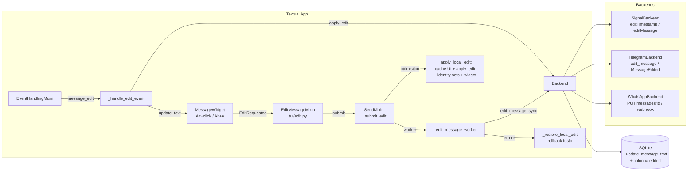

# DESIGN_EDIT_MESSAGES.md

## 1. Panoramica

### Obiettivo
Rendere **modificabili i messaggi testuali inviati** dall'utente e **gestire la ricezione di edit altrui** su tutti e tre i backend (Signal, Telegram, WhatsApp), con:

- flusso di invio edit **ottimistico** (bolla+cache+DB aggiornati subito, chiamata di rete in worker, rollback su errore), coerente con l'invio normale in `tui/send.py`;
- ricezione edit come **update in place** della bolla esistente, **mai** come nuovo messaggio (niente duplicati, niente bump unread);
- gestione corretta dell'**identità `(protocol, cache_key, ts, text)`** usata per il de-dup in `self._seen_message_ids` e `self._shown_in_log` quando il testo cambia.

### Scope
| In scope | Out of scope |
|---|---|
| Edit di messaggi **propri**, `msg_type == "text"` | Edit di media/caption, sticker |
| Edit ricevuti da altri (update bolla, per protocollo) | Edit history (multi-versione): si sovrascrive il testo |
| Indicatore " (modificato)" persistente | Delete for everyone |
| Echo del nostro edit da altro device linked (update idempotente) | Finestre temporali server: gestite come errore generico con rollback |

### Vincoli verificati sul repo
- Click sul messaggio = **reply** (non toccare): `UnreadReplyMixin.on_message_widget_message_clicked` in `tui/unread_reply.py`.
- **Textual 8.2.8** (verificato in `.venv`): `events.Click`/`MouseEvent` espone `shift`, **`meta`**, `ctrl` — il tasto **Alt arriva come `meta=True`** (bit 8 del mouse reporting SGR). `alt+enter` **non è affidabile**: il parser legacy (`textual/_xterm_parser.py`, `_sequence_to_key_events`) applica il prefisso `alt+` solo a nomi di tasto di un carattere (`if len(name) == 1 and alt`); `\r` → `enter` passa dal ramo `ANSI_SEQUENCES_KEYS` e perde il modificatore. **`alt+e` invece funziona** (ESC-prefix + carattere singolo).
- signal-cli 0.14.7 (`bin/`): confermato `--edit-timestamp <ts>` su `send` (help verificato); JSON-RPC `send` accetta `editTimestamp`.
- WAHA: `PUT /api/{session}/chats/{chatId}/messages/{messageId}` body `{"text": ..., "linkPreview": true}`; webhook di edit = evento `message` con **stesso id** e testo nuovo.
- Telegram (Telethon): `client.edit_message(entity, message_id, text)`; ricezione via `events.MessageEdited` (oggi `UpdateEditMessage` è loggato e ignorato nel handler `events.Raw`, `backends/telegram.py:258`).
- Il timestamp di un messaggio **non cambia mai** con l'edit, su nessun protocollo (Signal: identità = `targetSentTimestamp`; Telegram: `msg.date` resta l'originale, `msg.edit_date` è l'edit; WhatsApp: `timestamp` invariato). Questo semplifica il matching: **l'identità temporale è stabile, cambia solo il testo**.

---

## 2. Architettura della soluzione

### 2.1 Nuova capacità cross-protocollo su `ChatBackend` (`backends/base.py`)

Due metodi **opzionali con default** (pattern di `get_attachment_path`, non abstract: nessuna rottura per backend futuri):

```python
# backends/base.py — ChatBackend


def edit_message_sync(self, contact_id: str, message_id: str, new_text: str) -> bool:
    """Modifica un messaggio proprio già inviato.  Bloccante: chiamare da
    worker thread (come ``send_message_sync``).  Ritorna True se il backend
    ha accettato l'operazione.  Default: nessun supporto → False.

    Semantica di ``message_id`` per protocollo:
    - signal:   timestamp (ms) del messaggio originale, come stringa;
    - telegram: id server del messaggio (int come stringa);
    - whatsapp: Baileys message id (es. ``true_39...@c.us_ABC``).
    """
    return False


async def edit_message(self, contact_id: str, message_id: str, new_text: str) -> bool:
    """Wrapper async (symmetry con ``list_address_book``)."""
    return await asyncio.to_thread(
        self.edit_message_sync, contact_id, message_id, new_text
    )


def apply_edit(
    self,
    contact_id: str,
    message_id: str,
    new_text: str,
    *,
    is_mine: bool | None = None,
    edit_timestamp: int | None = None,
) -> dict | None:
    """Applica un edit (ricevuto o echo) a cache in-memory + SQLite.

    Punto UNICO di mutazione lato backend per gli edit (specchio di
    ``ingest_message`` per i messaggi nuovi).  Idempotente: se il testo
    è già ``new_text`` ritorna ``None`` (niente da fare).  Ritorna un dict
    ``{"message_id", "timestamp", "old_text", "text", "is_mine"}`` quando
    ha davvero modificato qualcosa, ``None`` altrimenti (target ignoto,
    media, testo identico).  Non aggiorna mai ``timestamp`` né ``id``.
    """
    return None
```

**Decisioni e alternative scartate:**
- **`edit_message(contact_id, message_id, text)` dedicato vs parametro `edit_...` su `send_message`**: scelto il metodo dedicato. `send_message` ha già 6 parametri e semantics di ritorno diverse per protocollo (Signal ritorna ts client, TG/WA id server); l'edit non ha quote/reply né crea una riga ottimistica nuova — un parametro in più renderebbe il contratto ambiguo.
- **`message_id` unico parametro vs `timestamp` separato per Signal**: scelto un solo parametro `message_id: str`; per Signal il chiamante passa `str(timestamp)`. Evita doppio parametro "usare l'uno o l'altro a seconda del protocollo".
- **`apply_edit` ritorna info** invece di bool: il chiamante UI ha bisogno di `old_text` e `timestamp` per la chirurgia dei set di identità e per trovare il widget senza un secondo scan.

### 2.2 Estensione `BackendManager` (`backends/manager.py`)

```python
def edit_message_sync(
    self, protocol: str, contact_id: str, message_id: str, new_text: str
) -> bool:
    """Instrada un edit al backend di *protocol*; False se assente/non supportato."""
    backend = self._backends.get(protocol)
    if backend is None:
        return False
    return backend.edit_message_sync(contact_id, message_id, new_text)
```

La UI userà `self.manager.get(protocol)` direttamente (pattern esistente di `_send_message_worker`), il metodo del manager è per simmetria/testabilità.

### 2.3 Nuovo tipo di evento: `ChatEvent(type="message_edit")` (`models.py`)

Scelto un **tipo evento nuovo** (non un flag sul payload `"message"`): il consumer `_handle_message_event` farebbe ingest come nuovo messaggio e il dedup per `(ts, text)` fallirebbe per costruzione. Un tipo separato ha un handler separato e **zero impatto** sul path esistente.

Aggiornare il docstring di `ChatEvent` in `models.py`:

```
- ``"message_edit"``: un messaggio esistente è stato modificato.
  payload: {"edit_message_id": str, "text": str, "timestamp": int (ts ORIGINALE),
            "edit_timestamp": int|None, "is_mine": bool, "sender": str,
            "contact": ChatContact|None, "msg_type": "text"}
```

I dict di cache (backend + UI) guadagnano la chiave opzionale `"edited": bool` (default assente/False → sempre letta con `.get("edited")`).

### 2.4 Vista d'insieme



---

## 3. Design per backend

### 3.1 Signal (`backends/signal.py`, `backend/rpc.py`)

#### Invio

**`backend/rpc.py`:**

1. `SignalRPCClient.send_message(...)`: nuovo parametro keyword `edit_timestamp: int | None = None`; se non `None` → `params["editTimestamp"] = edit_timestamp`. Nessun altro cambiamento (niente `timestamp` esplicito sugli edit: signal-cli assegna il ts dell'envelope di edit, che noi non usiamo come identità).
2. `_send_subprocess(message, recipient, quote_timestamp=None, quote_author=None, quote_message=None, edit_timestamp: int | None = None)`: se `edit_timestamp is not None` → `args.extend(["--edit-timestamp", str(edit_timestamp)])` (flag confermato su signal-cli 0.14.7).

**`backends/signal.py` — `SignalBackend`:**

```python
def edit_message_sync(self, contact_id: str, message_id: str, new_text: str) -> bool:
    """message_id = timestamp (ms) del messaggio originale, come stringa."""
    try:
        target_ts = int(message_id)
    except (TypeError, ValueError):
        return False
    if self._use_daemon and self._rpc:
        result = self._rpc.send_message(new_text, contact_id, edit_timestamp=target_ts)
        if "error" in result:
            raise RuntimeError(result["error"])
    else:
        _send_subprocess(new_text, contact_id, edit_timestamp=target_ts)
    return True
```

Le eccezioni (RuntimeError da RPC/subprocess) si propagano al worker UI, che fa rollback — stesso contratto di `_send_message_sync`.

#### Ricezione (`envelope.editMessage`)

Forma verificata (top-level, **non** dentro `dataMessage`):

```json
{"source": "+39...", "timestamp": 1755...,
 "editMessage": {"targetSentTimestamp": 1755...,
                 "dataMessage": {"timestamp": 1755..., "message": "testo nuovo"}}}
```

Oggi `_extract_message_data` ritorna `[]` per questi envelope → `envelope_to_event` ritorna `[]` → gli edit sono silenziosamente persi (nessun rischio di doppio processo). Modifica:

In `envelope_to_event` (`backends/signal.py:626`), **prima** del ramo typing, inserire:

```python
# in envelope_to_event, subito dopo la docstring:
edit_event = self._edit_envelope_to_event(envelope)
if edit_event is not None:
    return [edit_event]
```

Nuovo metodo (puro, unit-testabile):

```python
def _edit_envelope_to_event(self, envelope: dict) -> ChatEvent | None:
    """Riconosce un edit Signal e lo normalizza in ChatEvent("message_edit").

    Due forme gestite:

    1. Edit INCOMING dal contatto (forma verificata, top-level)::
           {"source": ..., "timestamp": <ts edit>,
            "editMessage": {"targetSentTimestamp": <ts originale>,
                            "dataMessage": {"timestamp": <ts edit>,
                                            "message": "testo nuovo"}}}
    2. Nostro edit fatto da UN ALTRO device linked (difensivo): il sync
       transcript incapsula l'edit dentro ``syncMessage.sentMessage``; i
       campi ``destination*`` restano fratelli di ``editMessage``, quindi
       ``_identify_contact_for_envelope`` funziona invariato.

    ``payload["timestamp"]`` è SEMPRE il timestamp del messaggio ORIGINALE
    (``targetSentTimestamp``): l'identità temporale non cambia con l'edit.
    """
    is_mine = False
    edit = envelope.get("editMessage")
    if not edit:
        sent = (envelope.get("syncMessage") or {}).get("sentMessage") or {}
        edit = sent.get("editMessage")
        is_mine = bool(edit)
    if not edit:
        return None

    target = edit.get("targetSentTimestamp")
    data = edit.get("dataMessage") or {}
    new_text = data.get("message") or ""
    if not target or not new_text:
        return None
    # Caption/media edit fuori scope: se il dataMessage trasporta attachment
    # lasciamo perdere (apply_edit rifiuterebbe comunque msg_type != "text").
    if data.get("attachments"):
        return None

    contact = self._identify_contact_for_envelope(envelope)
    if contact is None:
        return None

    sender = (
        "You"
        if is_mine
        else (
            envelope.get("sourceName")
            or envelope.get("sourceNumber")
            or envelope.get("source", "")
        )
    )
    return ChatEvent(
        type="message_edit",
        protocol=self.protocol,
        contact_id=contact.id,
        payload={
            "edit_message_id": str(target),
            "text": new_text,
            "timestamp": int(target),  # ts ORIGINALE
            "edit_timestamp": int(
                data.get("timestamp") or envelope.get("timestamp") or 0
            )
            or None,
            "is_mine": is_mine,
            "sender": sender,
            "contact": contact,
            "msg_type": "text",
        },
    )
```

**`SignalBackend.apply_edit`** (matching per timestamp — l'identità Signal È il ts):

```python
def apply_edit(
    self,
    contact_id: str,
    message_id: str,
    new_text: str,
    *,
    is_mine: bool | None = None,
    edit_timestamp: int | None = None,
) -> dict | None:
    from backend import _update_message_text

    try:
        target_ts = int(message_id)
    except (TypeError, ValueError):
        return None
    for msg in self.cache.get(contact_id, []):
        if int(msg.get("timestamp") or 0) != target_ts:
            continue
        if is_mine is not None and bool(msg.get("is_mine")) != bool(is_mine):
            continue
        if msg.get("msg_type", "text") != "text":
            return None  # mai riscrivere label media
        old_text = msg.get("text", "")
        if old_text == new_text:
            return None  # idempotente (echo nostro edit)
        msg["text"] = new_text
        msg["edited"] = True
        _update_message_text(
            contact_id,
            new_text,
            protocol=PROTOCOL_SIGNAL,
            timestamp=target_ts,
            old_text=old_text,
            is_mine=msg.get("is_mine"),
        )
        return {
            "message_id": str(target_ts),
            "timestamp": target_ts,
            "old_text": old_text,
            "text": new_text,
            "is_mine": bool(msg.get("is_mine")),
        }
    return None
```

Nota echo: signal-cli **non** produce un echo SSE per gli edit inviati via RPC da questo client → il nostro update ottimistico resta l'unico. Gli edit da altro device arrivano via ramo sync (2). Le receipt successive matchano per `targetSentTimestamp` (fuzzy ±1s in `_process_receipt`), invariato → nessuna interferenza.

---

## 3.2 Telegram (`backends/telegram.py`)

### Invio

```python
def edit_message_sync(self, contact_id: str, message_id: str, new_text: str) -> bool:
    """Edit via Telethon; gira sul loop dedicato (pattern di send_message_sync)."""
    if self._loop is None or self._client is None:
        raise RuntimeError("Telegram backend not connected")
    try:
        eid = int(contact_id)
        mid = int(message_id)
    except (TypeError, ValueError):
        raise ValueError("Invalid Telegram contact/message id") from None
    if mid <= 0:
        raise ValueError("Invalid Telegram message id")

    async def _edit() -> bool:
        entity = await self._resolve_input_entity(eid)
        await self._client.edit_message(entity, mid, new_text)
        return True

    future = asyncio.run_coroutine_threadsafe(_edit(), self._loop)
    return future.result(timeout=30)
```

### Ricezione (`events.MessageEdited`)

In `_connect_sync`, accanto alla registrazione di `events.NewMessage` (riga ~254):

```python
@self._client.on(events.MessageEdited)
async def _on_message_edited(event: Any) -> None:
    await self._handle_message_edited(event)
```

Handler (specchio di `_handle_new_message`, ma **senza download media** — scope solo testo):

```python
async def _handle_message_edited(self, event: Any) -> None:
    msg = event.message
    if msg is None or msg.chat_id is None:
        return
    # Solo testo: caption/media edit fuori scope.
    if msg.photo or msg.document or msg.sticker or msg.video or msg.voice or msg.audio:
        return
    new_text = msg.text or ""
    if not new_text.strip():
        return  # edit di sola formattazione/altro
    chat_id = str(msg.chat_id)
    ts = int(msg.date.timestamp() * 1000) if msg.date else 0
    edit_ts = (
        int(msg.edit_date.timestamp() * 1000)
        if getattr(msg, "edit_date", None)
        else None
    )
    self._events.put(
        ChatEvent(
            type="message_edit",
            protocol=PROTOCOL_TELEGRAM,
            contact_id=chat_id,
            payload={
                "edit_message_id": str(msg.id),
                "text": new_text,
                "timestamp": ts,  # msg.date = ts ORIGINALE
                "edit_timestamp": edit_ts,
                "is_mine": bool(getattr(msg, "out", False)),
                "sender": "",  # risolto lato UI se serve
                "contact": self._identify_contact(chat_id),
                "msg_type": "text",
            },
        )
    )
```

### `apply_edit` (match per server id)

```python
def apply_edit(
    self, contact_id, message_id, new_text, *, is_mine=None, edit_timestamp=None
) -> dict | None:
    from backend import _update_message_text

    for msg in self.cache.get(contact_id, []):
        if str(msg.get("id") or "") != str(message_id):
            continue
        if is_mine is not None and bool(msg.get("is_mine")) != bool(is_mine):
            continue
        if msg.get("msg_type", "text") != "text":
            return None
        old_text = msg.get("text", "")
        if old_text == new_text:
            return None  # echo del nostro edit: no-op
        msg["text"] = new_text
        msg["edited"] = True
        _update_message_text(
            contact_id,
            new_text,
            protocol=PROTOCOL_TELEGRAM,
            msg_id=str(message_id),
        )
        return {
            "message_id": str(message_id),
            "timestamp": int(msg.get("timestamp") or 0),
            "old_text": old_text,
            "text": new_text,
            "is_mine": bool(msg.get("is_mine")),
        }
    return None
```

### Riconciliazione da storico (`fetch_recent_history` → `ingest_message`)

`fetch_recent_history` (chiamato da `tui/backend_connect.py:280` al connect) passa per `ingest_message`, che oggi su `mid in self._seen_msg_ids` ritorna `False` **senza aggiornare il testo**: un edit fatto mentre la TUI era chiusa resterebbe stale. Modifica minimale dentro il ramo esistente:

```python
# in ingest_message, dentro `if mid and mid in self._seen_msg_ids:`
entry = next(
    (m for m in self.cache.get(contact_id, []) if str(m.get("id") or "") == str(mid)),
    None,
)
if (
    entry is not None
    and entry.get("msg_type", "text") == "text"
    and entry.get("text", "") != text
    and text
):
    self.apply_edit(contact_id, str(mid), text)
return False
```

Nessun evento UI qui: lo storico è caricato prima del render (o la chat si riapre), quindi la cache corretta basta.

---

## 3.3 WhatsApp (`backends/whatsapp_rest.py`, `backends/whatsapp.py`)

### REST (`backends/whatsapp_rest.py`)

```python
def edit_message(self, chat_id: str, message_id: str, text: str) -> dict | None:
    """WAHA ``PUT /api/{session}/chats/{chatId}/messages/{messageId}``.

    Body ``EditMessageRequest``: ``{"text": ..., "linkPreview": true}``.
    I path segment sono percent-encoded (pattern di ``resolve_contact``):
    gli id Baileys contengono ``@``/``=`` che romperebbero l'URL.
    Ritorna il messaggio aggiornato, ``None`` su errore (contratto _request).
    """
    from urllib.parse import quote

    return self._request(
        "PUT",
        f"/api/{self.session_name}/chats/{quote(chat_id, safe='')}"
        f"/messages/{quote(message_id, safe='')}",
        {"text": text, "linkPreview": True},
    )
```

### Backend: invio

```python
def edit_message_sync(self, contact_id: str, message_id: str, new_text: str) -> bool:
    if not self._rest:
        return False
    return self._rest.edit_message(contact_id, message_id, new_text) is not None
```

### Rilevamento edit: `_detect_edit`

Il webhook di edit è un evento `message` con **stesso id** e testo diverso. Con il flusso attuale verrebbe ingerito come NUOVO messaggio (per incoming `_message_already_cached` fa `continue` su testo diverso prima di controllare l'id) → bolla duplicata. Helper condiviso (lettura cache, nessuna mutazione):

```python
def _detect_edit(
    self,
    contact_id: str,
    msg_id: str | None,
    text: str,
    is_mine: bool,
    ts_ms: int,
) -> dict | None:
    """Ritorna l'entry cached target di un edit, o None.

    1) Match per id (stabile per outgoing; per incoming stabile tra webhook
       e webhook, che è il caso dell'edit live).
    2) Fallback incoming per ts (±2s, candidato UNICO): gli id incoming
       possono differire tra webhook e REST (/api/messages), quindi un edit
       di un messaggio caricato via fetch_history potrebbe non matchare
       per id.  Il timestamp WhatsApp dell'edit è quello ORIGINALE.
    """
    if not text:
        return None
    entries = self.cache.get(contact_id, [])
    if msg_id:
        for msg in entries:
            if bool(msg.get("is_mine")) != bool(is_mine):
                continue
            if msg.get("msg_type", "text") != "text":
                continue
            if str(msg.get("id") or "") == str(msg_id):
                return msg if msg.get("text", "") != text else None
    if not is_mine and ts_ms:
        candidates = [
            m
            for m in entries
            if not m.get("is_mine")
            and m.get("msg_type", "text") == "text"
            and abs(int(m.get("timestamp") or 0) - ts_ms) <= 2000
            and m.get("text", "") != text
        ]
        if len(candidates) == 1:  # ambiguità → skip (vedi §9)
            return candidates[0]
    return None
```

### `handle_webhook` (due punti di modifica)

**(a) Path ack sintetico** (`backends/whatsapp.py:198-277`): dopo aver calcolato `ack_contact/ack_ts/ack_text/ack_id`, **prima** di costruire l'evento sintetico:

```python
if ack_id and self._detect_edit(ack_contact, str(ack_id), ack_text, True, ack_ts):
    ack_key = (ack_contact, str(ack_id), " ".join(str(ack_text).split()))
    if ack_key not in self._seen_message_keys:
        self._seen_message_keys.add(ack_key)
        self._enqueue_event(
            ChatEvent(
                type="message_edit",
                protocol=PROTOCOL_WHATSAPP,
                contact_id=ack_contact,
                payload={
                    "edit_message_id": str(ack_id),
                    "text": ack_text,
                    "timestamp": ack_ts,
                    "edit_timestamp": None,
                    "is_mine": True,
                    "sender": "You",
                    "contact": self._contacts_by_jid.get(ack_contact),
                    "msg_type": "text",
                },
            )
        )
    # niente evento sintetico "message"; gli eventuali receipt (ack>=3)
    # prodotti da _event_from_raw proseguono invariati.
else:
    ...  # costruzione ack_msg_event come oggi
```

**(b) Loop eventi normali** (`backends/whatsapp.py:299-311`): per `event.type == "message"` con `mid`, prima del dedup check:

```python
hit = self._detect_edit(
    event.contact_id,
    str(mid),
    event.payload.get("text") or "",
    bool(event.payload.get("is_mine")),
    int(event.payload.get("timestamp") or 0),
)
if hit is not None:
    event = ChatEvent(
        type="message_edit",
        protocol=PROTOCOL_WHATSAPP,
        contact_id=event.contact_id,
        payload={
            "edit_message_id": str(hit.get("id") or mid),
            "text": event.payload.get("text") or "",
            "timestamp": int(hit.get("timestamp") or 0),  # ts ORIGINALE
            "edit_timestamp": int(event.payload.get("timestamp") or 0) or None,
            "is_mine": bool(hit.get("is_mine")),
            "sender": event.payload.get("sender", ""),
            "contact": self._contacts_by_jid.get(event.contact_id),
            "msg_type": "text",
        },
    )
# dedup per (contact, id, testo NUOVO) invariato: i retry dello stesso
# edit vengono scartati, l'edit (chiave diversa dall'originale) passa.
```

### `fetch_history` (e quindi `resync_history`, che lo invoca)

Nel loop di `fetch_history` (`backends/whatsapp.py:825-847`), prima di `ingest_message`:

```python
if self._detect_edit(
    contact_id,
    str(payload.get("id") or ""),
    payload.get("text", ""),
    is_mine,
    int(payload.get("timestamp") or 0),
):
    self.apply_edit(
        contact_id,
        str(payload.get("id")),
        payload.get("text", ""),
        is_mine=is_mine,
    )
    continue
self.ingest_message(...)  # come oggi
```

Così uno storico WAHA (che riporta il testo **già editato** con id/ts originali) aggiorna la riga esistente invece di inserire un duplicato (ricordo che `_dedup_messages_by_id` partiziona per `(protocol, contact, msg_id, text)`: due righe con stesso id e testo diverso sopravvivrebbero entrambe).

### `apply_edit`

```python
def apply_edit(
    self, contact_id, message_id, new_text, *, is_mine=None, edit_timestamp=None
) -> dict | None:
    from backend import _update_message_text

    target = None
    for msg in self.cache.get(contact_id, []):
        if str(msg.get("id") or "") == str(message_id):
            if is_mine is not None and bool(msg.get("is_mine")) != bool(is_mine):
                continue
            target = msg
            break
    if target is None or target.get("msg_type", "text") != "text":
        return None
    old_text = target.get("text", "")
    if old_text == new_text:
        return None  # echo nostro edit: no-op
    target["text"] = new_text
    target["edited"] = True
    # niente _sort_contact_cache: il timestamp non cambia
    if target.get("id"):
        _update_message_text(
            contact_id, new_text, protocol=PROTOCOL_WHATSAPP, msg_id=str(target["id"])
        )
    else:
        _update_message_text(
            contact_id,
            new_text,
            protocol=PROTOCOL_WHATSAPP,
            timestamp=int(target.get("timestamp") or 0),
            old_text=old_text,
        )
    return {
        "message_id": str(target.get("id") or message_id),
        "timestamp": int(target.get("timestamp") or 0),
        "old_text": old_text,
        "text": new_text,
        "is_mine": bool(target.get("is_mine")),
    }
```

---

## 4. Flusso UI

### 4.1 `MessageWidget` (`ui_components.py`)

**(a) Nuovo messaggio `EditRequested`** — classe annidata separata da `MessageClicked` (non estendere `MessageClicked` con un flag: i due intenti restano distinguibili per tipo e l'handler del reply non va toccato). L'handler Textual derivato sarà `on_message_widget_edit_requested`:

```python
class EditRequested(Message):
    """Posted on Alt+click / Alt+e: request to edit this (own) message."""

    def __init__(
        self, text, timestamp, sender, is_mine, status, message_id=None
    ) -> None:
        super().__init__()
        self.text = text
        self.timestamp = timestamp
        self.sender = sender
        self.is_mine = is_mine
        self.status = status
        self.message_id = message_id
```

**(b) Alt+click** — firma di `on_click` estesa con l'evento (Textual lo consente; il modificatore **Alt arriva come `meta`**, verificato sul parser SGR di Textual 8.2.8: `buttons & 8 → meta`):

```python
def on_click(self, event: events.Click) -> None:
    if event.meta:  # Alt+click → edit
        self.post_message(
            self.EditRequested(
                text=self._msg_text,
                timestamp=self._msg_timestamp,
                sender=self._msg_sender,
                is_mine=self._msg_is_mine,
                status=self._status,
                message_id=self._message_id,
            )
        )
        return
    self.post_message(self.MessageClicked(...))  # invariato (reply)
```

**(c) Controparte tastiera** — `alt+enter` scartato (il parser legacy di Textual 8.2.8 aggiunge il prefisso `alt+` solo ai nomi di tasto di un carattere; `enter` perde il modificatore — verificato in `_xterm_parser.py`). Scelta definitiva: **`alt+e`** sul widget focuseato (i `MessageWidget` sono `can_focus = True`):

```python
BINDINGS: ClassVar[list] = [
    Binding("alt+e", "request_edit", "Edit message", show=False),
]


def action_request_edit(self) -> None:
    self.post_message(
        self.EditRequested(
            text=self._msg_text,
            timestamp=self._msg_timestamp,
            sender=self._msg_sender,
            is_mine=self._msg_is_mine,
            status=self._status,
            message_id=self._message_id,
        )
    )
```

**(d) `update_text` + indicatore " (modificato)"** — refactoring minimo: estrarre la costruzione del contenuto da `__init__` in `_build_content()`; nuovo parametro `edited: bool = False` in `__init__`; suffisso `" (modificato)"` quando `_edited` (valutazione costi/benefici: costo ≈ zero, atteso su tutte e tre le app ufficiali, e la colonna DB §5 lo rende persistente → **si fa**):

```python
def _build_content(self):
    text = self._msg_text + (" (modificato)" if self._edited else "")
    if self._sender_color and self._msg_sender:
        rt = RichText()
        rt.append(f"<{self._msg_sender}:> ", style=self._sender_color)
        rt.append(text)
        return rt
    return text


def update_text(self, new_text: str, edited: bool = True) -> None:
    """Rewrite the bubble text in place (no unmount/remount)."""
    self._msg_text = new_text
    self._edited = edited
    self.update(self._build_content())
    self.refresh()
```

Update in place scelto rispetto a remove+remount: niente ri-layout del `chat-log`, niente scroll jump, e `_msg_timestamp`/`_message_id` restano intatti (li usano receipt e `_update_message_widgets_status`, che ricostruisce le mappe a ogni chiamata → nessuna invalidazione necessaria).

### 4.2 Nuovo mixin `tui/edit.py` — `EditMessageMixin`

Registrato in `SignalTUI` (`tui/app.py`): aggiungere alla lista basi (dopo `SendMixin`) e `self._editing_message: dict | None = None` in `__init__` (accanto a `self._reply_to`, riga 143).

```python
class EditMessageMixin:
    def on_message_widget_edit_requested(
        self, event: MessageWidget.EditRequested
    ) -> None:
        if self._download_mode:
            return
        if not event.is_mine:
            self._status("❌ You can only edit your own messages", 0)
            return
        if event.status in ("pending", "failed"):
            self._status("❌ Message not sent yet — cannot edit", 0)
            return
        contact = self.selected_contact
        if contact is None:
            return
        cache_key = contact.cache_key
        entry = next(
            (
                m
                for m in self._cache.get(cache_key, [])
                if m.get("is_mine")
                and int(m.get("timestamp") or 0) == int(event.timestamp)
            ),
            None,
        )
        if entry is None:
            self._status("❌ Message not found in cache", 0)
            return
        if entry.get("msg_type", "text") != "text":
            self._status("❌ Only text messages can be edited", 0)
            return
        protocol = contact.protocol
        message_id = entry.get("id") or event.message_id
        if protocol == PROTOCOL_SIGNAL:
            message_id = str(int(event.timestamp))  # identità Signal = ts
        elif not message_id:
            self._status("❌ Server message ID unavailable — reopen the chat", 0)
            return
        # Mutua esclusione reply/edit:
        self._cancel_reply()
        self._cancel_edit()  # edit precedente
        widget = next(
            (
                c
                for c in self.chat_log.children
                if isinstance(c, MessageWidget)
                and c._msg_timestamp == event.timestamp
                and c._msg_text == event.text
            ),
            None,
        )
        self._editing_message = {
            "protocol": protocol,
            "contact_id": contact.id,
            "cache_key": cache_key,
            "timestamp": int(event.timestamp),
            "message_id": str(message_id),
            "old_text": entry.get("text", ""),
            "_widget": widget,
        }
        if widget is not None:
            widget.set_selected(True)
        ta = self.query_one("#message-input", MessageTextArea)
        ta.text = entry.get("text", "")
        try:
            ta.move_cursor(ta.document.end)
        except Exception:
            logger.debug("cursor-to-end failed", exc_info=True)
        ta.focus()
        self._update_reply_bar()

    def _cancel_edit(self) -> None:
        editing = getattr(self, "_editing_message", None)
        if editing is not None:
            w = editing.get("_widget")
            if w is not None:
                try:
                    w.set_selected(False)
                except Exception:
                    logger.debug("deselect edit widget failed", exc_info=True)
        self._editing_message = None
        self._update_reply_bar()
```

**Banner**: si **riusa `#reply-bar`** (nessun nuovo CSS, stati mutuamente esclusivi). Modifica a `_update_reply_bar` (`tui/unread_reply.py:87`) — ramo edit **prima** di quello reply:

```python
editing = getattr(self, "_editing_message", None)
if editing is not None:
    t = editing.get("old_text", "")
    if len(t) > 60:
        t = t[:57] + "..."
    text_widget.update(f"✏️ Modifica: {t}")
    bar.remove_class("reply-bar-hidden")
    bar.styles.display = "block"
elif self._reply_to:
    ...  # invariato
```

Il bottone ✕ esistente (`#reply-cancel`): in `on_button_pressed` (`tui/app.py:281`) chiamare **entrambi** `self._cancel_reply()` e `self._cancel_edit()` (idempotenti). In `_select_contact` (`tui/contacts.py:436`) aggiungere `self._cancel_edit()` dopo `self._cancel_reply()`.

### 4.3 Submit in modalità editing (`tui/send.py`)

Hook in `on_message_text_area_submitted`, **dopo** normalizzazione emoji/empty-check e **prima** della cattura di `reply_data`:

```python
if self._editing_message is not None:
    self._submit_edit(message)
    event.text_area.text = ""
    return
```

```python
def _submit_edit(self, new_text: str) -> None:  # in EditMessageMixin
    snap = self._editing_message
    old_text = snap["old_text"]
    if new_text == old_text:
        self._cancel_edit()
        return
    self._apply_local_edit(snap, new_text)  # ottimistico
    self._cancel_edit()
    self.run_worker(
        lambda: self._edit_message_worker(snap, old_text, new_text),
        exclusive=False,
        thread=True,
    )


def _apply_local_edit(self, snap: dict, new_text: str) -> None:
    """Ottimistico: cache UI + cache backend + DB + identity sets + widget."""
    entry = next(
        (
            m
            for m in self._cache.get(snap["cache_key"], [])
            if m.get("is_mine") and int(m.get("timestamp") or 0) == snap["timestamp"]
        ),
        None,
    )
    if entry is not None:
        entry["text"] = new_text
        entry["edited"] = True
    backend = self.manager.get(snap["protocol"])
    if backend is not None:
        backend.apply_edit(
            snap["contact_id"], snap["message_id"], new_text, is_mine=True
        )
    self._rewrite_message_identity(
        snap["protocol"],
        snap["cache_key"],
        snap["timestamp"],
        snap["old_text"],
        new_text,
        snap["message_id"],
    )
    w = snap.get("_widget")
    if w is not None and w.is_mounted:
        w.update_text(new_text)


def _rewrite_message_identity(
    self, protocol, cache_key, ts, old_text, new_text, message_id=None
) -> None:
    """L'identità (ts, text) cambia col testo: senza questa chirurgia
    ``_refresh_chat`` rimonterebbe il messaggio editato come NUOVO (duplicato)
    e la guardia ``_shown_in_log`` di ``_add_message`` non lo riconoscerebbe."""
    for s in (self._seen_message_ids, self._shown_in_log):
        s.discard((protocol, cache_key, int(ts), old_text))
        s.add((protocol, cache_key, int(ts), new_text))
        if message_id:
            s.discard((protocol, cache_key, str(message_id), old_text))
            s.add((protocol, cache_key, str(message_id), new_text))
    # _seen_timestamps NON si tocca: il timestamp non cambia mai.
```

**Worker + rollback:**

```python
def _edit_message_worker(self, snap: dict, old_text: str, new_text: str) -> None:
    backend = self.manager.get(snap["protocol"])
    if backend is None:
        self.call_from_thread(
            self._restore_local_edit,
            snap,
            old_text,
            f"no backend for {snap['protocol']}",
        )
        return
    try:
        ok = backend.edit_message_sync(snap["contact_id"], snap["message_id"], new_text)
    except Exception as e:  # noqa: BLE001
        self.call_from_thread(self._restore_local_edit, snap, old_text, str(e))
        return
    if not ok:
        self.call_from_thread(
            self._restore_local_edit, snap, old_text, "edit rejected by server"
        )
    else:
        self.call_from_thread(self._status, "✏️ Message edited")


def _restore_local_edit(self, snap: dict, old_text: str, error: str) -> None:
    """UI thread: ripristino completo del testo originale."""
    entry = next(
        (
            m
            for m in self._cache.get(snap["cache_key"], [])
            if m.get("is_mine") and int(m.get("timestamp") or 0) == snap["timestamp"]
        ),
        None,
    )
    if entry is not None:
        entry["text"] = old_text
        entry["edited"] = False
    backend = self.manager.get(snap["protocol"])
    if backend is not None:
        backend.apply_edit(
            snap["contact_id"], snap["message_id"], old_text, is_mine=True
        )  # riscrive cache backend + DB
    self._rewrite_message_identity(
        snap["protocol"],
        snap["cache_key"],
        snap["timestamp"],
        snap["new_text"] if "new_text" in snap else old_text,
        old_text,
        snap["message_id"],
    )
    w = snap.get("_widget")
    if w is not None and w.is_mounted:
        w.update_text(old_text, edited=False)
    self._status(f"❌ Edit failed: {error}", 0)
```

(Nota implementativa: `_submit_edit` salva `snap = {**self._editing_message, "new_text": new_text}` così `_restore_local_edit` ha la chiave per l'identity-surgery inversa.)

Nessuna transizione di status (`pending`/`sent`) sulla bolla durante l'edit: il messaggio era già `sent`, l'edit è ortogonale alle receipt; l'errore è segnalato via rollback + status bar. `_promote_contact_after_send` non viene chiamato (l'edit non riordina la lista contatti).

---

## 5. Persistenza (`backend/db.py`)

**Nuovo helper** (stile di `_update_message_status_by_id`: doppia chiave, ritorna `rowcount > 0`):

```python
def _update_message_text(
    contact_number: str,
    new_text: str,
    protocol: str,
    msg_id: str | None = None,
    timestamp: int | None = None,
    old_text: str | None = None,
    is_mine: bool | None = None,
    mark_edited: bool = True,
) -> bool:
    """Riscrive il testo di una riga esistente (edit di un messaggio).

    Match per ``(protocol, contact_number, msg_id)`` quando disponibile,
    altrimenti ``(protocol, contact_number, timestamp)``; ``old_text`` e
    ``is_mine`` sono vincoli difensivi opzionali.  ``mark_edited`` pilota la
    colonna ``edited`` (il rollback la riporta a 0).
    """
    _init_db()
    with _DB_LOCK:
        conn = sqlite3.connect(_backend.DB_FILE)
        try:
            if msg_id is not None:
                where = "protocol = ? AND contact_number = ? AND msg_id = ?"
                params: list = [protocol, contact_number, msg_id]
            elif timestamp is not None:
                where = "protocol = ? AND contact_number = ? AND timestamp = ?"
                params = [protocol, contact_number, timestamp]
            else:
                return False
            if old_text is not None:
                where += " AND text = ?"
                params.append(old_text)
            if is_mine is not None:
                where += " AND is_mine = ?"
                params.append(int(is_mine))
            cursor = conn.execute(
                f"UPDATE messages SET text = ?, edited = ? WHERE {where}",
                [new_text, 1 if mark_edited else 0, *params],
            )
            conn.commit()
            return cursor.rowcount > 0
        finally:
            conn.close()
```

**Colonna `edited`** — decisione: **sì**. Costo: un `ALTER` idempotente gated da `PRAGMA user_version` (pattern esistente). Beneficio: il suffisso " (modificato)" sopravvive al restart (le app ufficiali di tutti e tre i protocolli mostrano l'indicatore). Alternativa scartata: sovrascrivere solo `text` (zero schema churn) → indicatore perso al riavvio, UX incoerente.

- `_SCHEMA_VERSION = 2 → 3`.
- In `_migrate_protocol_schema`: `if "edited" not in columns: conn.execute("ALTER TABLE messages ADD COLUMN edited INTEGER NOT NULL DEFAULT 0")` (prima dell'update di `user_version`).
- Nel `CREATE TABLE` di `_init_db` aggiungere `edited INTEGER NOT NULL DEFAULT 0` per i DB freschi.
- `_load_cache`: aggiungere `"edited": bool(row["edited"])` al dict di riga.
- `_add_message_to_cache`: invariato (default 0).
- Esportare `_update_message_text` in `backend/__init__.py` (import da `.db` + `__all__`).

Propagazione `edited` al render: `_build_message_widgets` e `_load_all_messages`/`_add_message` passano `edited=msg.get("edited", False)` al nuovo parametro di `MessageWidget`.

---

## 6. Ricezione edit altrui (end-to-end)

Dispatch in `_handle_event` (`tui/events.py:21`):

```python
if event.type == "message_edit":
    return self._handle_edit_event(event)
```

```python
def _handle_edit_event(self, event: ChatEvent) -> bool:
    """Applica un edit ricevuto: backend cache + DB (via apply_edit),
    cache UI, identity sets e widget — senza mai creare una bolla nuova."""
    backend = self.manager.get(event.protocol)
    if backend is None:
        return False
    apply_edit = getattr(backend, "apply_edit", None)
    if apply_edit is None:
        return False
    payload = event.payload
    new_text = payload.get("text", "")
    edit_id = payload.get("edit_message_id")
    if edit_id is None or not new_text:
        return False

    contact = payload.get("contact")
    if contact is None:
        identify = getattr(backend, "_identify_contact", None)
        if identify is not None:
            contact = identify(event.contact_id)
    if contact is None:
        contact = ChatContact(
            id=event.contact_id, display_name=event.contact_id, protocol=event.protocol
        )

    # Single mutation point: cache backend + SQLite.  Idempotente:
    # testo già nuovo / target ignoto / media → None → no-op.
    info = apply_edit(
        event.contact_id,
        str(edit_id),
        new_text,
        is_mine=payload.get("is_mine"),
        edit_timestamp=payload.get("edit_timestamp"),
    )
    if not info:
        return False

    # Mirror nella cache UI + chirurgia identità.
    cache_key = contact.cache_key
    ui_msgs = self._cache.get(cache_key) or []
    target = next(
        (
            m
            for m in ui_msgs
            if m.get("id") is not None and str(m["id"]) == str(info["message_id"])
        ),
        None,
    )
    if target is None:
        target = next(
            (
                m
                for m in ui_msgs
                if int(m.get("timestamp") or 0) == int(info["timestamp"])
                and bool(m.get("is_mine")) == bool(info["is_mine"])
                and m.get("text") == info["old_text"]
            ),
            None,
        )
    if target is not None:
        self._rewrite_message_identity(
            event.protocol,
            cache_key,
            info["timestamp"],
            info["old_text"],
            new_text,
            target.get("id") or info["message_id"],
        )
        target["text"] = new_text
        target["edited"] = True

    # Widget, solo se la chat è aperta (altrimenti il prossimo render
    # leggerà il testo già aggiornato dalla cache).
    if self.selected_contact and self.selected_contact.cache_key == cache_key:
        self.call_from_thread(self._update_edited_widget, info, new_text)
    return True


def _update_edited_widget(self, info: dict, new_text: str) -> None:
    try:
        for child in self.chat_log.children:
            if not isinstance(child, MessageWidget):
                continue
            if child._message_id and str(child._message_id) == str(info["message_id"]):
                child.update_text(new_text)
                return
            if (
                child._msg_timestamp == info["timestamp"]
                and child._msg_text == info["old_text"]
            ):
                child.update_text(new_text)
                return
    except Exception:
        logger.debug("edited widget update failed", exc_info=True)
```

Effetti collaterali **esplicitamente esclusi**: niente bump unread (l'edit non passa mai per `ingest_message`), niente update di `contact.last_message_ts` (niente riordino lista), niente interazione con typing indicator.

**`_merge_backend_cache` (WhatsApp, chat aperta + `fetch_history` di fase 2)**: reso edit-aware — in `_find_existing` il match per `id` per incoming va **prima** del check sul testo (come già per outgoing); nel ramo "già presente" se il testo differisce → update `existing["text"]`, `existing["edited"] = True` e il metodo ritorna `True` (cache "cambiata" → `_render_chat_window` rimonta la finestra e i set di identità vengono ricostruiti da `_clear_chat`, quindi nessuna chirurgia manuale in questo path).

### Echo del nostro edit — distinzione per protocollo

| Protocollo | Echo del nostro edit | Esito |
|---|---|---|
| Signal | Nessun echo SSE per edit inviati via RPC; edit da altro device arriva come `syncMessage.sentMessage.editMessage` (`is_mine=True`) | Ottimismo resta / `apply_edit` aggiorna per ts |
| Telegram | `client.edit_message` scatena `MessageEdited` con `out=True` | `apply_edit` trova testo già nuovo → `None` → no-op |
| WhatsApp | Webhook `message` `fromMe` stesso id + testo **nuovo**: cache già ottimistica → `_detect_edit` **non** scatta (testi uguali) → evento `message` normale → `ingest_message` matcha per id (ramo `is_mine`) → `False` | Assorbito dal dedup esistente, zero bolle nuove. Edit da altro device (cache col testo vecchio) → `_detect_edit` scatta → update corretto |

```mermaid
sequenceDiagram
    participant P as Protocollo (SSE/WT/Webhook)
    participant B as Backend
    participant EV as _handle_edit_event
    participant UI as Cache UI + Widget
    participant DB as SQLite

    P->>B: edit (editMessage / MessageEdited / webhook message)
    B->>B: normalizza → ChatEvent("message_edit")
    B-->>EV: poll_once → _handle_event
    EV->>B: apply_edit(contact, id, new_text)
    B->>DB: _update_message_text (edited=1)
    B-->>EV: info {timestamp, old_text, ...} | None
    alt info != None
        EV->>UI: entry.text = new_text; identity surgery
        EV->>UI: call_from_thread → widget.update_text
    else None (echo nostro edit / ignoto / media)
        EV-->>EV: no-op, nessuna bolla nuova
    end
```

---

## 7. Piano di test (pytest, `tests/`)

**`tests/test_db_edit.py`** (nuovo; pattern di `test_db_schema_versioning.py`, fixture `tmp_cache_dir`):
- `_update_message_text` per `msg_id`: testo aggiornato, `edited=1`, ritorna True.
- Per `timestamp` + `old_text` guard: match solo sulla riga attesa; `old_text` errato → False, riga intatta.
- `mark_edited=False` → `edited=0` (rollback).
- Nessuna chiave (`msg_id=None, timestamp=None`) → False.
- Migrazione v2→v3: DB legacy senza colonna → `edited` aggiunta, idempotente (doppio `_init_db`), righe esistenti `edited=0`; `_load_cache` espone `"edited": bool`.

**`tests/test_edit_signal.py`** (nuovo; pattern di `test_backends.py`):
- `SignalRPCClient.send_message(..., edit_timestamp=123)` → `params["editTimestamp"] == 123` (patch `_call`); assente se None.
- `_send_subprocess(..., edit_timestamp=123)` → argv contiene `--edit-timestamp 123` (patch `backend._run_subprocess`).
- `SignalBackend.edit_message_sync` daemon (mock `_rpc.send_message`, `{"error": ...}` → RuntimeError) e subprocess (`_use_daemon=False`, patch `_send_subprocess`).
- `envelope_to_event` con envelope `editMessage` → esattamente 1 evento `message_edit`, payload `edit_message_id=str(target)`, `timestamp=target`, `is_mine=False`; **nessun** evento `message` (no duplicati).
- Variante sync `syncMessage.sentMessage.editMessage` → `is_mine=True`, contatto risolto via `destinationNumber`.
- Envelope malformato (no `targetSentTimestamp` / testo vuoto / con attachments) → `[]`.
- `apply_edit`: hit per ts aggiorna cache + DB; testo identico → None; media (`msg_type="image"`) → None; ts ignoto → None.

**`tests/test_telegram_edit.py`** (nuovo; pattern di `test_telegram.py` con mock loop/`run_coroutine_threadsafe`):
- `_handle_message_edited` → `ChatEvent` corretto (`edit_message_id`, ts originale da `msg.date`, `edit_timestamp` da `msg.edit_date`, `is_mine=msg.out`); media edit skippato; testo vuoto skippato.
- `edit_message_sync`: chiama `client.edit_message(entity, int(id), text)`; id non numerico → ValueError.
- `ingest_message` con id noto e testo diverso → `apply_edit` invocato, ritorna False, nessuna riga nuova; `fetch_recent_history` con messaggio editato → cache/DB aggiornati.

**`tests/test_edit_whatsapp.py`** (nuovo; pattern di `test_whatsapp_backend.py`):
- `WhatsAppRESTClient.edit_message` → metodo PUT, path con `quote` (`@c.us` → `%40`), body `{"text", "linkPreview"}` (patch `_request`).
- `handle_webhook`: cache pre-seed con `(id, "vecchio")` → webhook `message` con stesso id e `"nuovo"` → in coda un `message_edit`, **zero** eventi `message`; retry identico → deduplicato (`_seen_message_keys`).
- Echo nostro edit (fromMe, testo già nuovo in cache) → evento `message` normale → `ingest_message` dedup per id → nessuna bolla nuova.
- `_detect_edit` fallback ts: candidato unico → hit; due candidati nello stesso secondo → None (ambiguità).
- Path ack sintetico (`message.ack` con body nuovo) → `message_edit`, non evento sintetico.
- `fetch_history` con messaggio editato → `apply_edit`, count righe DB invariato.

**`tests/test_ui_components.py`** (estensione):
- `update_text`: `_msg_text` aggiornato, contenuto renderizzato con suffisso " (modificato)", prefisso `sender_color` preservato.
- `on_click` con `events.Click(..., meta=True)` → `EditRequested`; `meta=False` → `MessageClicked` (regressione reply).
- `action_request_edit` (alt+e) → `EditRequested`.

**`tests/test_edit_flow.py`** (nuovo, `@pytest.mark.integration`, fixture `app_for_test`/`app_for_test_with_mocks`, `run_test()`):
- Gate: edit su messaggio altrui / media / pending → rifiutato, `_editing_message` resta None.
- `EditRequested` su proprio testo → stato settato, `#reply-bar` visibile con "✏️", `MessageTextArea.text` pre-caricato, focus sull'input.
- Submit in editing → cache UI aggiornata, `_seen_message_ids`/`_shown_in_log` contengono la nuova identità e NON la vecchia, widget aggiornato, `edit_message_sync` chiamato con `(contact_id, message_id, new_text)`; input svuotato; bar nascosta.
- Fallimento backend → rollback: testo originale ovunque + status "❌ Edit failed".
- `message_edit` in arrivo con chat aperta → widget aggiornato, `len(chat_log.children)` invariato, `_unread_counts` invariato; con chat chiusa → cache/DB aggiornati, nessun crash.
- Doppio edit consecutivo; mutua esclusione reply↔edit (aprire l'edit cancella il reply e viceversa).
- Dopo edit, `_refresh_chat()` non rimonta nulla (no duplicati).

---

## 8. Fasi di implementazione

| # | Fase | File | Criterio di completamento |
|---|---|---|---|
| 1 | **DB** | `backend/db.py` (`_update_message_text`, colonna `edited`, `_SCHEMA_VERSION=3`, `_load_cache`), `backend/__init__.py` (export) | `test_db_edit.py` + `test_db_schema_versioning.py` green |
| 2 | **Contratti** | `backends/base.py` (`edit_message_sync`/`edit_message`/`apply_edit` con default), `backends/manager.py` (router), `models.py` (docstring `message_edit`) | test contratto: default `False`/`None`; suite esistente green |
| 3 | **Signal** | `backend/rpc.py` (`editTimestamp`, `--edit-timestamp`), `backends/signal.py` (`edit_message_sync`, `_edit_envelope_to_event`, hook in `envelope_to_event`, `apply_edit`) | `test_edit_signal.py` green |
| 4 | **Telegram** | `backends/telegram.py` (`edit_message_sync`, `_handle_message_edited` + registrazione handler, `apply_edit`, ramo edit in `ingest_message`) | `test_telegram_edit.py` green |
| 5 | **WhatsApp** | `backends/whatsapp_rest.py` (`edit_message`), `backends/whatsapp.py` (`edit_message_sync`, `_detect_edit`, `handle_webhook` (a)+(b), `fetch_history`, `apply_edit`) | `test_edit_whatsapp.py` green |
| 6 | **UI** | `ui_components.py` (`EditRequested`, `meta` click, `alt+e`, `update_text`, `_build_content`, `edited`), `tui/edit.py` (nuovo mixin), `tui/send.py` (hook submit), `tui/events.py` (`_handle_edit_event`, `_update_edited_widget`), `tui/unread_reply.py` (barra), `tui/contacts.py` + `tui/app.py` (wiring, `_cancel_edit`) | `test_ui_components.py` + `test_edit_flow.py` green |
| 7 | **Riconciliazione + regressione** | `tui/chat_view.py` (`_merge_backend_cache` edit-aware) | `pytest -m "not integration"` tutto green + integration |

Ordine motivato: DB e contratti prima (le fasi 3-5 li usano); backend prima della UI (la UI chiama `apply_edit`/`edit_message_sync` già esistenti); `_merge_backend_cache` per ultimo perché verificabile solo a flusso completo.

---

## 9. Rischi e mitigazioni

| Rischio | Impatto | Mitigazione |
|---|---|---|
| **Identità `(ts, text)` non aggiornata** dopo edit → `_refresh_chat` rimonta il messaggio come nuovo (duplicato) o `_shown_in_log` non lo riconosce | Alto | `_rewrite_message_identity` centralizzata, chiamata sia nel path ottimistico sia in `_handle_edit_event`; test dedicato no-duplicati |
| **Echo del nostro edit** crea duplicati | Alto | Per protocollo (§6): Signal nessun echo; Telegram `apply_edit` idempotente; WhatsApp assorbito dal dedup per id di `ingest_message` perché l'ottimismo aggiorna la cache **prima** della chiamata REST |
| **Finestre temporali server** (WhatsApp ~15 min, Telegram ~48 h, Signal ~24 h — policy lato server, non forzate dai nostri client) | Medio | Errore/rifiuto → `_restore_local_edit` + status bar. Nessun gate client-side per età (fragile, non documentato stabilmente) |
| **Alt+click catturato dal window manager** Linux (Alt+drag sposta finestra) | Medio | Controparte tastiera `alt+e` sempre disponibile sul widget focuseato |
| `alt+enter` non generato dal parser legacy Textual 8.2.8 (prefisso `alt+` solo per tasti singolo-carattere — verificato nel sorgente) | — | Scartato a priori; scelta `alt+e` |
| **Id incoming WhatsApp instabile webhook vs REST** (`_message_already_cached` documenta id diversi tra le due fonti) → edit di un messaggio caricato da `fetch_history` non matchato per id | Medio | Fallback per ts ±2 s con **candidato unico**; caso ambiguo (due messaggi stesso secondo) → skip e riconciliazione al prossimo `fetch_history` |
| **WAHA non invia echo** dell'edit (dipende dalla versione) | Basso | Stato ottimistico già corretto; `fetch_history` riporta testo editato con stesso id → `apply_edit` no-op idempotente |
| Forma `editMessage` diversa su signal-cli futuri/vecchi | Basso | Parsing difensivo → `None` → comportamento attuale (edit ignorato), nessuna regressione |
| **Concorrenza**: `apply_edit`/`ingest_message` girano su poll/webhook thread; widget su UI thread | Basso | DB serializzato da `_DB_LOCK`; update widget solo via `call_from_thread`; `_detect_edit` è read-only |
| Receipt dopo edit | Basso | ts e id invariati → `_process_receipt` (fuzzy ts Signal) e `process_receipt` per id (TG/WA) matchano invariati; `_update_message_widgets_status` ricostruisce le mappe a ogni chiamata |
| `_prune_cache` (200 righe/contatto) | Basso | La riga editata conserva ts originale → pruning invariato |
| Edit su gruppi | Basso | Gate `is_mine` lato UI; rilevamento edit altrui in gruppi WA funziona per id (sender resolution invariata) |

---

**Note finali per lo sviluppatore**: nessuna nuova dipendenza; nessun nuovo CSS (riuso `#reply-bar`); i punti di contatto col codice esistente sono esattamente quelli elencati (hook `envelope_to_event`, registrazione handler Telethon, due innesti in `handle_webhook` + uno in `fetch_history`, hook submit in `send.py`, dispatch in `events.py`, estensione `_update_reply_bar`, `_select_contact`, `on_button_pressed`). Il path di reply e il dedup esistenti restano comportamentalmente invariati per ogni evento non-edit.
