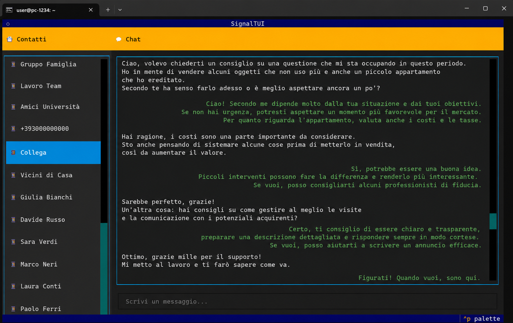

# Signal TUI Client

A terminal-based (TUI) Signal client built with [Textual](https://textual.textualize.io/).

Uses `signal-cli` daemon via JSON-RPC over HTTP for fast operations, with automatic fallback to subprocess if the daemon is unavailable.


*Main chat interface*


*Fullscreen image viewer modal*


*Fullscreen image viewer modal (alternate view)*

## Features

- 📱 Full contact list with unread badges
- 💬 Real-time message receiving and sending
- 🖼️ Native terminal image rendering (via `catimg`) with fullscreen modal viewer
- 📜 Message history with local cache (last 200 messages per contact, 3-day retention)
- 🔗 Device linking via QR code
- ⚡ Daemon mode for fast JSON-RPC communication
- 🔄 Automatic fallback to subprocess if daemon is not running
- ↩️ Reply to messages — click any message to quote it in your reply
- 😊 Emoji picker (`Ctrl+E`) with category navigation, search, and `:alias:` auto-completion
- 📥 Download mode (`Ctrl+D`) — serve message text or attachments via temporary HTTP server for download
- ✅ Message delivery and read receipts — sent messages show status: sent (italic), delivered (bold), read (normal)

## Prerequisites

- **Python 3.10+**
- **signal-cli** — download and place in `./bin/` directory (see Installation)
- **catimg** — for rendering images in the terminal (optional; falls back to text placeholder if missing)
- A linked Signal account (see Device Linking)

## Installation

### 1. Clone the repository

```bash
git clone https://github.com/Bu3nd14/signal-tui-client.git
cd signal-tui-client
```

### 2. Install Python dependencies

```bash
pip install -r requirements.txt
```

### 3. Download signal-cli

Download the latest `signal-cli` release for your platform:

```bash
# Example for Linux x86_64
mkdir -p bin
cd bin
wget https://github.com/AsamK/signal-cli/releases/latest/download/signal-cli-X.Y.Z-Linux.tar.gz
tar xzf signal-cli-X.Y.Z-Linux.tar.gz
rm signal-cli-X.Y.Z-Linux.tar.gz
cd ..
```

The app will automatically find `signal-cli` in the `./bin/signal-cli-*/` directory.

### 4. Install catimg (optional, for image rendering)

```bash
sudo apt install catimg
```

### 5. Configure your phone number

Set your Signal phone number via environment variable:

```bash
export SIGNAL_USER_NUMBER="+1234567890"
```

Or create a `config.json` file in the project root:

```json
{
    "user_number": "+1234567890"
}
```

> **Note:** `config.json` is in `.gitignore` and will not be committed.

## Device Linking

Before using the client, you need to link your Signal account:

```bash
python3 link_account.py
```

This will display a QR code. Scan it with the Signal app on your phone (Settings → Linked Devices → Link New Device).

## Usage

```bash
python3 signal_tui.py
```

### Controls

| Key | Action |
|-----|--------|
| `↑` / `↓` | Navigate contact list |
| `Enter` | Select contact / open chat |
| `Enter` (on image) | Open image in fullscreen modal |
| `Escape` / `q` (in modal) | Close image modal |
| `Click` / `Enter` (on message) | Select message to reply to |
| `✕` button | Cancel reply selection |
| Type message + `Enter` | Send message (with quote if replying) |
| `Ctrl+E` | Open emoji picker |
| `Ctrl+D` | Toggle download mode |
| `Ctrl+N` / `Ctrl+P` | Navigate emoji suggestions / emoji picker categories |
| `Ctrl+Q` | Quit |
| `Ctrl+C` | Quit |

### Emoji

Press **`Ctrl+E`** to open the emoji picker. Inside the picker:

- **`Tab`** / **`Shift+Tab`** — move focus between: category tabs → emoji grid → search bar
- **`Ctrl+N`** / **`Ctrl+P`** — switch between emoji categories
- **`←`** / **`→`** / **`↑`** / **`↓`** — navigate the emoji grid
- **`Enter`** — insert the selected emoji at the cursor position
- **`Escape`** — close the picker without inserting

You can also type `:alias:` shortcuts directly in the message input (e.g. `:smile:` → 😊, `:heart:` → ❤️). A completion popup will appear as you type; use `Ctrl+N`/`Ctrl+P` to navigate and `Enter` to confirm.

### Download Mode

Press **`Ctrl+D`** to enter download mode, then click any message to serve it for download:

- **Text messages** are served as `.txt` files
- **Images and attachments** are served with their original filename and extension

A persistent HTTP server starts on port **10042** (first download only) and stays alive for the duration of the app. The download URL is shown in a selectable `Input` widget — use **Tab** to focus it, then **Cmd+C / Ctrl+C** to copy the URL and paste it into your browser.

> **Note:** You need to open port **10042** on your server's firewall for downloads to work.

> **macOS users:** The download URL is shown in a selectable `Input` widget, but **Terminal.app** does not allow copying text from Textual widgets with `Cmd+C`. For the best experience, use **[iTerm2](https://iterm2.com/)** (free) which supports clipboard access from terminal applications.

### Tips

- The app starts the `signal-cli` daemon automatically on first launch
- Messages are cached locally in `~/.local/share/signal-tui-client/messages.json`
- Only the last 20 messages are shown when opening a chat; click "Load more" to see all cached messages
- Unread messages are shown with a `*N` badge next to the contact name
- Sent messages show their delivery status: sent (italic), delivered (bold), read (normal)

## Project Structure

```
signal-tui-client/
├── signal_tui.py          # Main TUI application (Textual App)
├── backend.py             # Backend: signal-cli communication, cache, data models
├── ui_components.py       # Custom Textual widgets (MessageWidget, ImageWidget, DownloadLinkWidget, …)
├── emoji_picker.py        # Emoji picker modal screen and auto-completion widget
├── emoji_data.py          # Emoji database (categories, aliases, search index)
├── link_account.py        # Device linking script (QR code)
├── requirements.txt       # Python dependencies
├── config.json            # Local configuration (not committed)
├── BUGS.md                # Known bugs and limitations
├── bin/                   # signal-cli binaries (not committed)
└── LICENSE                # GPLv3
```

## License

This project is licensed under the GNU General Public License v3.0. See [LICENSE](LICENSE) for details.
