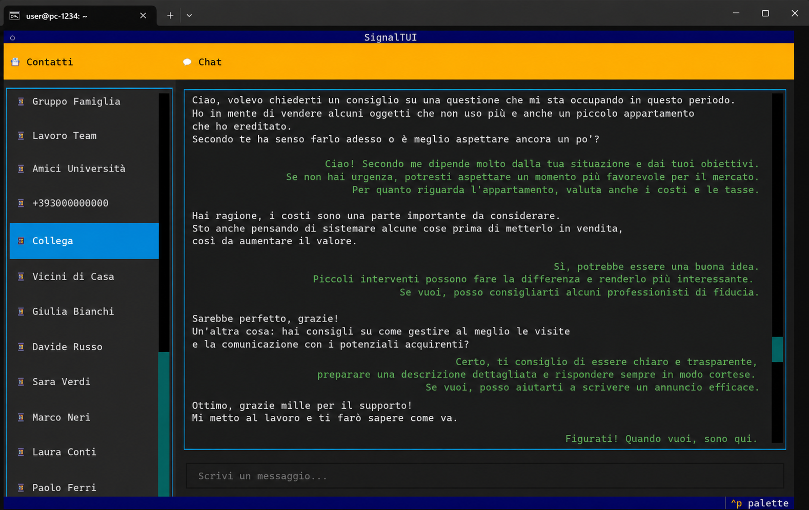

# Signal TUI Client

A terminal-based (TUI) Signal client built with [Textual](https://textual.textualize.io/).

Uses `signal-cli` daemon via JSON-RPC over HTTP for fast operations, with automatic fallback to subprocess if the daemon is unavailable.


*Main chat interface*


*Fullscreen image viewer modal*


*Fullscreen image viewer modal (alternate view)*

## Features

- 📱 Full contact list with unread badges
- 💬 Real-time message receiving and sending
- 🖼️ Native terminal image rendering (via `catimg`) with fullscreen modal viewer
- 📜 Message history with local cache (last 200 messages per contact, 3-day retention)
- 🔗 Device linking via QR code
- ⚡ Daemon mode for fast JSON-RPC communication
- 🔄 Automatic fallback to subprocess if daemon is not running
- ↩️ Reply to messages — click any message to quote it in your reply
- 😊 Emoji picker (`Ctrl+E`) with category navigation, search, and `:alias:` auto-completion
- 📥 Download mode (`Ctrl+D`) — serve message text or attachments via temporary HTTP server for download
- ✅ Message delivery and read receipts — sent messages show status: sent (italic), delivered (bold), read (normal)

## Prerequisites

- **Python 3.10+**
- **Java 25 (JRE)** — required by `signal-cli` (the JVM build). Without it, `signal-cli` will not start.
- **signal-cli** — download and place in `./bin/` directory (see Installation)
- **catimg** — for rendering images in the terminal (optional; falls back to text placeholder if missing)
- A linked Signal account (see Device Linking)

> **Note:** A Python virtual environment (venv) is **recommended** but not strictly required. See [Virtual environment](#virtual-environment-optional-but-recommended).

## Installation

### Option A — Automatic installation (recommended)

The easiest way is to use the provided `install.sh` script, which checks prerequisites, downloads the correct `signal-cli` build, creates a virtual environment and installs the Python dependencies:

```bash
git clone https://github.com/Bu3nd14/signal-tui-client.git
cd signal-tui-client
./install.sh
```

The script supports several options:

```bash
./install.sh --no-venv            # install without creating a virtual environment
./install.sh --version 0.14.7     # download a specific signal-cli version
./install.sh --skip-signal-cli    # skip downloading signal-cli (if already present)
./install.sh --update             # update signal-cli to the latest version
./install.sh --help               # show usage
```

### Option B — Manual installation

#### 1. Clone the repository

```bash
git clone https://github.com/Bu3nd14/signal-tui-client.git
cd signal-tui-client
```

#### 2. Install Python dependencies

It is recommended to use a virtual environment (see [Virtual environment](#virtual-environment-optional-but-recommended)):

```bash
pip install -r requirements.txt
```

#### 3. Download signal-cli

Download the **JVM build** of `signal-cli` (the full `signal-cli-X.Y.Z.tar.gz` archive, **not** the `-Linux-client` or `-Linux-native` variants):

```bash
# Example for Linux x86_64 — replace X.Y.Z with the actual version (e.g. 0.14.7)
mkdir -p bin
cd bin
wget https://github.com/AsamK/signal-cli/releases/download/vX.Y.Z/signal-cli-X.Y.Z.tar.gz
tar xzf signal-cli-X.Y.Z.tar.gz
rm signal-cli-X.Y.Z.tar.gz
cd ..
```

> **⚠️ Important — which build to download:**
> - ✅ **`signal-cli-X.Y.Z.tar.gz`** — the **JVM build** (full archive with `bin/signal-cli` + `lib/*.jar`). This is the **correct** one: it includes the `daemon` command (JSON-RPC over HTTP) that this client uses, and it produces the `./bin/signal-cli-*/bin/signal-cli` structure the app expects.
> - ❌ **`signal-cli-X.Y.Z-Linux-client.tar.gz`** — this is only a **JSON-RPC client** (a single native executable). It does **not** include the `daemon` command, so it cannot start the JSON-RPC server this client needs. **Do not use it.**
> - ❌ **`signal-cli-X.Y.Z-Linux-native.tar.gz`** — the GraalVM native build. It does not produce the `./bin/signal-cli-*/bin/signal-cli` structure the app expects. **Do not use it.**
>
> The `releases/latest/download/` URL does **not** work with a versioned filename (the filename changes with each release). You must use the explicit `releases/download/vX.Y.Z/` URL and replace `X.Y.Z` with the actual version (e.g. `0.14.7`). The `install.sh` script resolves the latest version automatically.

The app will automatically find `signal-cli` in the `./bin/signal-cli-*/` directory.

#### 4. Install catimg (optional, for image rendering)

```bash
sudo apt install catimg
```

#### 5. Configure your phone number

Set your Signal phone number via environment variable:

```bash
export SIGNAL_USER_NUMBER="+1234567890"
```

Or create a `config.json` file in the project root:

```json
{
    "user_number": "+1234567890"
}
```

> **Note:** `config.json` is in `.gitignore` and will not be committed.

## Virtual environment (optional but recommended)

A Python virtual environment is **recommended** to avoid polluting your system Python and to prevent dependency conflicts. It is **not strictly required** — the app is a standalone script launched with `python3 signal_tui.py`.

> **Note:** On many Linux distributions, `pip install` at the system level is blocked (PEP 668 / "externally-managed-environment"). In that case a virtual environment is **required**.

```bash
# Create the virtual environment
python3 -m venv .venv

# Activate it
source .venv/bin/activate

# Install dependencies
pip install -r requirements.txt
```

To deactivate the environment later, run `deactivate`. The `install.sh` script creates and uses the virtual environment automatically (unless you pass `--no-venv`).

## Updating signal-cli

Signal's servers change over time, and `signal-cli` releases older than ~3 months may stop working. To update `signal-cli` to the latest version, run:

```bash
./install.sh --update
```

This downloads the latest JVM build, extracts it into `./bin/`, and removes the previous version(s).

## Device Linking

Before using the client, you need to link your Signal account:

```bash
python3 link_account.py
```

This will display a QR code. Scan it with the Signal app on your phone (Settings → Linked Devices → Link New Device).

## Usage

```bash
python3 signal_tui.py
```

### Controls

| Key | Action |
|-----|--------|
| `↑` / `↓` | Navigate contact list |
| `Enter` | Select contact / open chat |
| `Enter` (on image) | Open image in fullscreen modal |
| `Escape` / `q` (in modal) | Close image modal |
| `Click` / `Enter` (on message) | Select message to reply to |
| `✕` button | Cancel reply selection |
| Type message + `Enter` | Send message (with quote if replying) |
| `Ctrl+E` | Open emoji picker |
| `Ctrl+D` | Toggle download mode |
| `Ctrl+N` / `Ctrl+P` | Navigate emoji suggestions / emoji picker categories |
| `Ctrl+Q` | Quit |
| `Ctrl+C` | Quit |

### Emoji

Press **`Ctrl+E`** to open the emoji picker. Inside the picker:

- **`Tab`** / **`Shift+Tab`** — move focus between: category tabs → emoji grid → search bar
- **`Ctrl+N`** / **`Ctrl+P`** — switch between emoji categories
- **`←`** / **`→`** / **`↑`** / **`↓`** — navigate the emoji grid
- **`Enter`** — insert the selected emoji at the cursor position
- **`Escape`** — close the picker without inserting

You can also type `:alias:` shortcuts directly in the message input (e.g. `:smile:` → 😊, `:heart:` → ❤️). A completion popup will appear as you type; use `Ctrl+N`/`Ctrl+P` to navigate and `Enter` to confirm.

### Download Mode

Press **`Ctrl+D`** to enter download mode, then click any message to serve it for download:

- **Text messages** are served as `.txt` files
- **Images and attachments** are served with their original filename and extension

A persistent HTTP server starts on port **10042** (first download only) and stays alive for the duration of the app. The download URL is shown in a selectable `Input` widget — use **Tab** to focus it, then **Cmd+C / Ctrl+C** to copy the URL and paste it into your browser.

> **Note:** You need to open port **10042** on your server's firewall for downloads to work.

> **macOS users:** The download URL is shown in a selectable `Input` widget, but **Terminal.app** does not allow copying text from Textual widgets with `Cmd+C`. For the best experience, use **[iTerm2](https://iterm2.com/)** (free) which supports clipboard access from terminal applications.

### Tips

- The app starts the `signal-cli` daemon automatically on first launch
- Messages are cached locally in `~/.local/share/signal-tui-client/messages.json`
- Only the last 20 messages are shown when opening a chat; click "Load more" to see all cached messages
- Unread messages are shown with a `*N` badge next to the contact name
- Sent messages show their delivery status: sent (italic), delivered (bold), read (normal)

## Performance Profiling

Per profilare l'applicazione in termini di **CPU**, **RAM** e **I/O**, usa gli strumenti nella cartella `profiling/`:

```bash
# Monitoraggio risorse (CPU, RAM, I/O nel tempo)
python profiling/monitor_resources.py --duration 120
python profiling/analyze_resources.py

# Flamegraph CPU (py-spy — campiona tutti i thread)
./profiling/run_pyspy.sh 120

# Profiling RAM (tracemalloc)
python profiling/profile_memory.py --duration 120

# Profiling I/O (strace)
./profiling/run_strace.sh 120
```

Vedi [profiling/README.md](profiling/README.md) per istruzioni dettagliate, interpretazione dei risultati e i punti critici noti.

## Project Structure

```
signal-tui-client/
├── signal_tui.py          # Main TUI application (Textual App)
├── backend.py             # Backend: signal-cli communication, cache, data models
├── ui_components.py       # Custom Textual widgets (MessageWidget, ImageWidget, DownloadLinkWidget, …)
├── emoji_picker.py        # Emoji picker modal screen and auto-completion widget
├── emoji_data.py          # Emoji database (categories, aliases, search index)
├── link_account.py        # Device linking script (QR code)
├── install.sh             # Automatic installation script (downloads signal-cli, sets up venv)
├── requirements.txt       # Python dependencies
├── config.json            # Local configuration (not committed)
├── BUGS.md                # Known bugs and limitations
├── profiling/             # Performance profiling tools (CPU, RAM, I/O)
├── bin/                   # signal-cli binaries (not committed)
└── LICENSE                # GPLv3
```


## License

This project is licensed under the GNU General Public License v3.0. See [LICENSE](LICENSE) for details.
