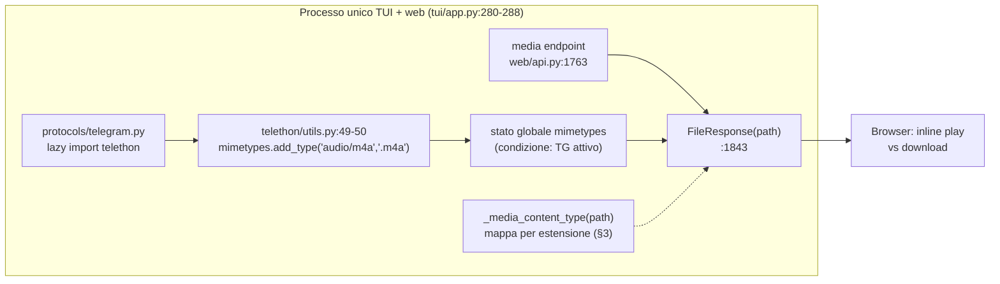

# DESIGN: Content-Type audio nel media endpoint — fix playback `.m4a`

> Redatto dall'architetto. Fix validato (APPROVATED) a seguito dell'analisi
> congiunta: voice note Signal `.m4a` servite come `audio/m4a` ⇒ Chrome propone
> il download invece di riprodurre inline.
>
> Stato: **approvato** — pronto per implementazione in un solo commit di fix.
> Perimetro: **solo** il ramo finale del media endpoint web (`web/api.py`).
> Nessuna modifica a TUI, DB, backend, frontend JS.

---

## 1. Obiettivo e non-obiettivi

### Obiettivo

Servire gli allegati audio dal media endpoint `/api/media/{proto}/{id}` con un
Content-Type **riproducibile inline dal browser**, in modo deterministico e
indipendente dallo stato globale di `mimetypes`. Fix minimale: normalizzazione
dell'header HTTP per estensione, con mappa audio esplicita.

### Non-obiettivi (espliciti)

- **Niente player inline `<audio>` nel frontend.** Le bolle media restano
  icone + click → `window.open` (pattern esistente, `web/static/app.js:705,
  838, 905`). Un player embedded richiede design UI separato (posizionamento
  nella bolla, gestione focus/keyboard, trascrizione).
- **Niente `Content-Disposition: attachment` forzato.** Il comportamento
  "inline vs download" è lasciato al browser; chi vuole il download usa il
  menu contestuale. Valutare solo se emergessero richieste UX concrete.
- **Niente intervento su `mimetypes` globale** (H1 è irrisolvibile al
  confine, §2).

---

## 2. Root cause (ipotesi verificate — CONFERMATE)

| # | Ipotesi | Evidenza | Stato |
|---|---|---|---|
| H1 | Telethon inquina `mimetypes` all'import | `telethon/utils.py:49-50`: `add_type('audio/m4a','.m4a')`, `add_type('audio/aac','.aac')`, eseguiti da `telethon/__init__.py` che importa `utils`. La contaminazione è **condizionata** a Telegram: `protocols/telegram.py` importa Telethon **lazy** dentro i metodi (`telethon` in testa assente, vedi import a r. 505+), quindi il bug si attiva quando il backend TG si connette — processo condiviso TUI+web (`tui/app.py:280-288`). | ✅ |
| H2 | Il media endpoint usa `mimetypes` | `web/api.py:1843`: `return FileResponse(path, headers=...)` senza `media_type` → Starlette chiama `mimetypes.guess_type` → `.m4a` ⇒ `audio/m4a`. | ✅ |
| H3 | `audio/m4a` non è inline-playable in Chrome | Chrome scarica; `audio/mp4`/`audio/aac`/`audio/ogg` sono riproducibili. | ✅ |
| H4 | I `.m4a` sono AAC in container MP4 | ffprobe: codec `aac`, formato `mov/mp4/m4a` ⇒ servirli `audio/mp4` playa **senza transcodifica**. | ✅ |

Nota sul pattern latente (H1): la stessa tabella Telethon registra anche
`video/avi` (r. 46), `image/x-tga` (r. 40), `image/vnd.adobe.photoshop`
(r. 42), `application/x-tgsticker` (r. 54). Il problema può ripresentarsi su
altre famiglie mime **non-audio**: la mappa esplicita va estesa allora, non
oggi (§6).

### Diagramma del flusso di contaminazione



---

## 3. Soluzione

### 3.1 Punto d'intervento (unico)

Solo il **ramo finale** del media endpoint, oggi `web/api.py:1843`
(`return FileResponse(path, headers={"Cache-Control": "private, max-age=86400"})`).

**NON** toccare:

- i rami thumbnail (`web/api.py:1783`, `:1825`, `:1838`): già
  `media_type="image/jpeg"` espliciti;
- il quote-media endpoint (`web/api.py:1892`, con la sua
  `mimetypes.guess_type(served_path.name)` già esplicita): serve solo
  thumbnail immagini; fuori perimetro.

### 3.2 Helper di normalizzazione

Nuovo helper module-level in `web/api.py` (nessuna dipendenza nuova; usa la
`import mimetypes` già a `web/api.py:7`):

```python
# ─── Audio MIME normalization ────────────────────────────────────
_AUDIO_MIME_BY_EXT: dict[str, str] = {
    ".m4a": "audio/mp4",  # AAC in MP4 container → inline-playable
    ".aac": "audio/aac",  # ADTS, status quo confermato
    ".oga": "audio/ogg",
    ".ogg": "audio/ogg",
    ".opus": "audio/ogg",
    ".mp3": "audio/mpeg",
    ".wav": "audio/wav",
    ".flac": "audio/flac",
}


def _media_content_type(path: Path) -> str | None:
    """MIME deterministico per audio; ``mimetypes`` per tutto il resto.

    Chiave sulla sola estensione lowercase del file risolto — mai su
    ``attachment_id`` né sul ``content_type`` persistito nel DB (per i
    ``.m4a`` il DB riporta erroneamente ``audio/aac``).
    """
    ext = path.suffix.lower()
    if ext in _AUDIO_MIME_BY_EXT:
        return _AUDIO_MIME_BY_EXT[ext]
    return mimetypes.guess_type(path.name)[0]
```

Applicazione nel ramo finale:

```python
media_type = _media_content_type(path)
return FileResponse(
    path,
    media_type=media_type,
    headers={"Cache-Control": "private, max-age=86400"},
)
```

### 3.3 Decisioni chiave sulle regole della mappa

| Regola | Motivazione |
|---|---|
| `.m4a` → `audio/mp4` (il fix) | H4: AAC in MP4 container, inline-playable senza transcodifica. |
| `.aac` → `audio/aac` (status quo) | ADTS ≠ MP4; rimapparlo a `audio/mp4` sarebbe un bug inverso. |
| `.oga/.ogg/.opus` → `audio/ogg` | Unifichiamo stati osservati "playanti" e presenti nel DB. |
| `.mp3/.wav/.flac` espliciti (opzionale, raccomandato) | Blindano contro contaminazioni future (H1 latente). |
| Tutto il resto → fallback `mimetypes.guess_type` | Immagini/video/documenti mantengono il comportamento attuale; la mappa si applica **solo** ad audio. |
| Chiave su `path.suffix.lower()` del Path risolto | Deterministica, inaffidabilità di `attachment_id` e `content_type` DB evitate (§7). |

### 3.4 Coerenza upload ↔ serving

`web/uploads.py:35` dichiara già `"audio/mp4": {".m4a"}` in
`_EXTENSIONS_BY_MIME` (r. 25-39). Il fix allinea serving e upload sulle
stesse etichette MIME; nessuna modifica all'upload.

---

## 4. Impatto e sicurezza

### 4.1 Rendering frontend (nessun impatto)

`web/static/app.js:740-746` classifica icone/rami tramite
`attachment.media_kind` dal payload `_messages` (campo DB), e i click su
`window.open(/api/media/...)` usano URL tramite `attachment.attachment_id`
(`app.js:705,838,905`). L'header HTTP Content-Type **non** è consultato per
il rendering: il fix è invisibile alla UI, cambia solo come il browser gestisce
l'URL aperto. Verificato sull'attuale static.

### 4.2 Trascrizione (nessun impatto)

L'endpoint `/transcribe/{proto}/{attachment_id}` (`web/api.py:1476-1488`)
e il servizio di trascrizione lavorano sul **path locale** risolto via
`manager.get_attachment_path`, non sull'header HTTP. Invariato.

### 4.3 Download voluto (nota UX)

Passare da "download forzato" a "inline play" cambia l'affordance sui
`window.open`: chi apre il file lo riproduce nel tab del browser. Accettato:
il download esplícito resta possibile via menu browser. Se la UX dovesse
richiedere download forzato per i non-audio, si documenta in un fix separato.

### 4.4 Sicurezza

- La mappa è **chiusa** (dict letterale): nessun controllo esterno sul MIME
  emesso; non si amplia la superficie di attacco.
- Path validation (`resolve` + `is_relative_to(root)`,
  `web/api.py:1808-1817`) invariata: il fix non abilita serving fuori root.
- `media_type` intralcio è lessicale/idempotente (nessun I/O aggiuntivo).

---

## 5. Test previsti

Estendere `tests/test_web_thumbs.py` riusando l'harness esistente `_client`
(r. 20-33: `FastAPI` + `create_api_router` + manager fittizio
`get_attachment_path`, `TestClient` sync).

Nuovi casi (tutti nel file esistente):

| # | Test | Asserzione |
|---|---|---|
| 1 | `.m4a` fittizio (byte arbitrari) servito via `/api/media/signal/<id>` | `Content-Type == audio/mp4` |
| 2 | stesso test con **contaminazione simulata**: `mimetypes.add_type('audio/m4a', '.m4a')` prima della richiesta | `Content-Type == audio/mp4` (indipendenza dimostrata) |
| 3 | `.aac` | `Content-Type == audio/aac` |
| 4 | `.oga` (o `.ogg`) | `Content-Type == audio/ogg` |
| 5 | non-audio (es. `.jpg`) | `Content-Type` da `mimetypes` (fallback, es. `image/jpeg`) |

La suite thumbnail esistente resta invariata: i rami thumbnail continuano a
emettere `image/jpeg` espliciti.

---

## 6. Casi limite

| Caso | Gestione |
|---|---|
| Estensione maiuscola (`.M4A`) | `path.suffix.lower()` prima della lookup (§3). |
| `.aac` | Esplicitamente **non rimappato** (§3.3): ADTS non è MP4. |
| quote-media | Endpoint non toccato (`web/api.py:1892`); gestisce solo thumbnail image. |
| Cache HTTP | `max-age=86400` (header invariato): un browser può tenere la risposta vecchia fino a 24h. Trascurabile in locale; se serve subito, hard-refresh o bump cache-buster manuale. |
| Pattern latente Telethon | Altri `add_type` (`video/avi`, `image/x-tga`, …) possono re-inquinare non-audio in futuro. Estendere la mappa solo quando emerso un secondo caso concreto; qui documentato. |
| Estensione sconosciuta | Fallback `mimetypes.guess_type(path.name)[0]` ⇒ risultato `None` ⇒ Starlette si comporta come oggi (default ignoto). Nessuna regressione. |

---

## 7. Decisioni scartate

| Alternativa | Motivo dello scarto |
|---|---|
| Discontaminare `mimetypes` dopo l'import Telethon (`del mimetypes._db` / monkeypatch) | Fragile: ordine di import non controllabile; altri moduli possono riattivare l'inquinamento; non deterministico in test. |
| Preferire `content_type` dal DB | Affidato erroneamente: i `.m4a` sono persistiti `audio/aac` in DB; chiave sbagliata. |
| Chiave su `attachment_id` | URL/identity opache (es. `tgref:`, `sent-*`): la suffisso del **Path risolto** è l'unica fonte affidabile. |
| Aggiungere ora player `<audio>` inline | Fuori scope (§1 Non-obiettivi); design separato con UI/UX. |
| Toccare quote-media | Il suo `guess_type` esplicito è adeguato alle thumbnail che serve; estendere il perimetro aumenta il rischio senza valore. |
| `Content-Disposition: attachment` forzato | Contrasto con l'obiettivo (inline play); opzione UX rimandata (§4.3). |

---

## 8. Piano di implementazione (un commit di fix)

1. `web/api.py`: aggiungere `_AUDIO_MIME_BY_EXT` + `_media_content_type` e
   usarli nel ramo finale del media endpoint (`:1843`).
2. `tests/test_web_thumbs.py`: aggiungere i 5 casi di §5.
3. Commit messaggio consigliato:
   `fix(web): normalizza Content-Type audio nel media endpoint (.m4a→audio/mp4)`.
