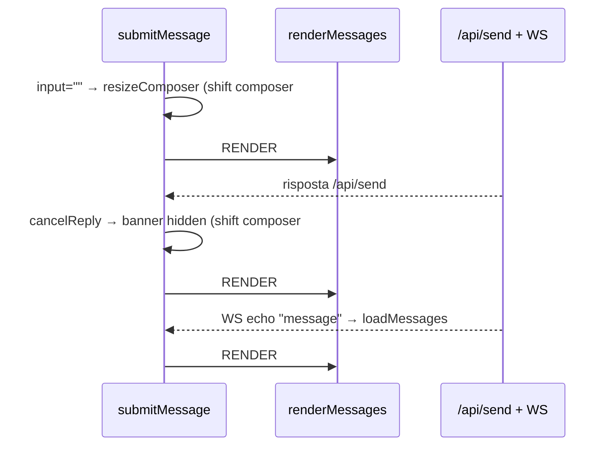

# DESIGN — Flickering della chat web: analisi e piano (archiviato)

> **Stato**: ARCHIVIATO. Analisi completa + design di dettaglio + tentativo di
> implementazione **scartato** per regressioni. Da riprendere più avanti con un
> approccio più conservativo.
>
> **Data**: 2026-09-01 · **Branch del tentativo**: `feat/chat-render-perf` (ELIMINATO, mai pushato)
>
> **File coinvolti**: `web/static/app.js` (~2298 righe), `web/static/style.css`, `web/api.py`, `web/static/index.html`

---

## 1. Sintomo

- **Bump verso l'alto della chat all'invio** quando nella finestra sono presenti **immagini** (PR #118 e #120 non lo eliminavano del tutto).
- **Flickering residuo dell'INTERA chat** (non solo le immagini), molto visibile quando la chat ha immagini e si **risponde** (reply). Non percepito su WhatsApp.
- **Immagini che "si ricaricano velocemente"** a ogni aggiornamento (spinner che lampeggia / miniatura ri-scaricata).

## 2. Cronologia dei tentativi

| Step | Cosa | Esito |
|---|---|---|
| PR #118 (`7c4ab7e`) | `wasAtBottom = !userScrolledUp \|\| geometricallyAtBottom` (soglia 80px), `scrollThreadToBottom` azzera il flag, `resizeComposer` riallinea via rAF | Riduce ma non elimina il bump con immagini |
| PR #120 (`00ff41e`) | Callback `onLoad` per-immagine che riancora al fondo se `wasAtBottom` | Ancora bump con immagini |
| Fix quote thumb (fast cycle) | `quoteThumbCache` per URL + `src` sincrono | Risolve il lampeggio delle miniature quote |
| Hardening quote thumb | LRU bound, dedup in-flight, invalidazione su errore, disposal optimistic | Verificato, con bug in-flight poi corretto |
| Fase 1 | `useCachedThumbnail` (spinner-free su cache-hit), `MEDIA_CACHE_LIMIT=300`, keying `messageNodes` | Ok |
| **Batch P0** (branch `feat/chat-render-perf`) | P0a (bottoni flex), P0b (status in-place), P0c (id da `/api/send` + skip echo), P1a (dims in cache), P1c (overflow-anchor) | **DISASTRO: regressioni (doppie bolle su Signal, spunte mancanti all'invio) → branch eliminato** |

## 3. Root-cause (analisi architetti, convergente)

### 3.1 "Tempesta di rebuild" all'invio di una reply
3 rebuild totali del DOM + 2-3 variazioni di altezza del composer + 2-4 snap di scroll entro ~1s:

Ogni `replaceChildren()` ri-rasterizza l'intero scrollport (le bolle hanno `box-shadow` e il pannello un gradiente). Nessuna animazione CSS sui `.message` (verificato): il flicker è DOM churn + repaint + scroll.

### 3.2 CLS immagini
- Le immagini **confermate** (in ingresso, e le uscenti dopo un reload) NON riservano lo spazio: `.attachment` parte da `min-height:90px` e cresce fino a `max-height:min(28vh,220px)` → layout shift + ri-ancoraggi dello sticky observer.
- Le immagini **optimistic** riservano le dimensioni (`applyPreviewSize`) ma solo fino alla conferma (deliver blob).

### 3.3 Shift composer specifico della reply
`cancelReply` → `replyBanner.hidden=true` → `display:none` → la viewport della lista cresce → shift verticale. È l'unico path con **due** variazioni di altezza del composer → spiega perché "la reply si nota di più".

### 3.4 Perché "non su WhatsApp" (correzione architetto-2)
NON è "immagini più piccole": il server normalizza già le thumb a 480px via PIL per tutti i protocolli. Le differenze reali:
- **Mimetype che bypassano la thumbnail** (`_is_thumbnail_candidate`, api.py ~957-970): GIF/HEIC/HEIF/WebP animati → full-res (HEIC iPhone → più frequente su Signal);
- densità di immagini nella chat; stato della cache blob.

## 4. Piano convergente (entrambi gli architetti, 100% accordo)

| # | Intervento | Effetto | Rischio |
|---|---|---|---|
| **P0a** | Rimuovere `bubble.offsetHeight` dal loop; bottoni centrati via **flex** (elimina `.tall`) | niente forced layout ×N per rebuild | basso (verifica visiva bottoni) |
| **P0b** | Status `sending→sent/failed` **in place** via `messageNodes` (span dentro `timeEl`) + guard chat attiva + rilettura entry post-await | **−1 rebuild** per invio | basso |
| **P0c** | `/api/send` risponde `{ok, message_id, timestamp}` → id-upgrade optimistic + **skip del rebuild se la sequenza visualizzata è invariata** al push WS | **−1 rebuild** (conferma), non dipende dal WS | medio (Signal=timestamp, WA/TG=id) |
| **P1a** | `mediaCache` → `{url, w, h}` da `naturalWidth/Height`; `applyPreviewSize` su cache-hit | **zero CLS/buchi su rebuild** | basso (4 punti, LRU invariata) |
| **P1c** | `overflow-anchor: none` su `.message-list` | scroll a attore singolo | molto basso |
| **P1d** (NON FATTA) | Banner reply in **overlay** invece di `display:none` | elimina shift composer reply | medio — rimandata |
| P2 | Render keyed incrementale (riuso nodi per chiave, patch delta) | elimina repaint totale residuo | medio-alto |
| P3 | Poll Telegram quiet + cleanup `console.debug` + live region a11y | igiene | basso |
| P1b (opt.) | Dimensioni persistite server-side per il primo paint a cache fredda | copre l'unico caso scoperto da P1a | medio (migrazione/side-car) |

### 4.1 Cosa NON fare (convergenza totale)
1. `content-visibility: auto` su `.message` finché esiste `offsetHeight` nel loop (rompe `.tall` e `scrollHeight`/`wasAtBottom`).
2. `contain: paint` su `.message`/`.bubble` (clippa i bottoni azione `left:-38px` e le reaction chips `bottom:-12px`).
3. Affidare la conferma d'invio alla coalescenza rAF o al solo WS — lo status resta sincrono sulla risposta HTTP.
4. Eliminare il render #2 senza il guard di rilettura della entry (la Map `messageNodes` si svuota a ogni render).
5. Banner reply con transizione d'altezza (movimento al posto del flash).
6. Toccare la logica sticky-bottom (ResizeObserver + `scrollThreadToBottom` + scroll listener): sana, va "lasciata sola al volante".
7. **Aggiunta post-mortem**: NESSUN refactor che alteri la struttura del DOM/il flusso di invio senza validazione manuale completa su Signal PRIMA del commit. Il batch P0 ha introdotto regressioni gravi (doppie bolle, spunte mancanti).

## 5. Design di dettaglio (spec per lo sviluppatore — riferimento)

### P1c — `overflow-anchor: none` (1 riga)
`.message-list { overflow-anchor: none; }` — solo su `.message-list`. Safari no-op.

### P0a — bottoni via flex, addio `.tall`
- `.message { display:flex; flex-direction:row; align-items:center; gap:6px; max-width:min(76%,680px); align-self:flex-start; }` + `.message.out { align-self:flex-end; }`, `position:relative` invariato.
- `.bubble { flex:0 1 auto; min-width:0; }`.
- Nuova `.message-actions { display:flex; flex:none; flex-direction:column; justify-content:center; gap:2px; width:0; overflow:visible; }`, bottoni `position:static; opacity:0`.
- `.message.in .message-actions { order:2; }` (bolla sx, bottoni dx). Hover/focus: `.message:hover .message-actions > *, .message:focus-within .message-actions > *`.
- Rimuovere `.message.tall` e `if (bubble.offsetHeight > 72) message.classList.add("tall")` dal loop di `renderMessages`.
- DOM sempre `[bubble][actions]` per in/out (ordine visivo via CSS). Grep: zero `tall`/`offsetHeight`.
- **Decisione architetturale**: su bolle corte i bottoni perdono l'ancoraggio "in cima" (offset ≤26px) — accettato; fallback `align-items:flex-start` se il tester rifiuta (mai reintrodurre misurazioni).

### P0b — status in-place
- `statusEl` in `messageNodes` (span dentro `timeEl`).
- `optimisticStatusLabel(status)` = stessa espressione ternaria del render (`invio…`/`inviato`/`fallito`).
- `applyOptimisticStatus(optimisticId, status, {protocol, contactId})`: guard su `state.active` + **rilettura entry post-await** + no-op se manca.
- `submitMessage`: elimina il render nel `finally` (resta `sending=false; updateComposer(); focus()`); chiama `applyOptimisticStatus` su sent/failed.

### P0c — `/api/send` con identità + skip echo
- `web/api.py`: catturare il ritorno di `send_*_sync`; risposta `{"ok": True, "message_id": str|None}` (nessun campo timestamp; Signal: il valore è il timestamp server).
- Client: `realId` → `optimistic.confirmed_message_id`, `optimistic.renderKey = realId`, `known_message_ids += [realId]`; Signal → `timestamp = Number(realId)`.
- `displayedKeys()` (chiavi di server via `messageIdentity(m, i)` + optimistic via `renderKey ?? optimistic_id`); `state.lastRenderedKeys` impostato a fine render dalla lista `displayed`.
- `loadMessages({render=true})` (fetch separato dal render); `handleMessagePush(payload)` estratto dal case `"message"`; guard **solo sottrattivo**: `if (before === undefined || displayedKeys() !== before) renderMessages(...)`.

### P1a — `mediaCache` con dimensioni
- Shape `Map<key, {url, width, height}>`. Punti: `cacheMedia` (preserva dims note, eviction su `.url`), `pruneOrphanObjectUrls` (cachedUrls da `.url`), `useCachedThumbnail` (firma invariata; hit → touch LRU + `applyPreviewSize` PRIMA di `src`), `loadThumbnail` (cattura `naturalWidth/Height` nel load-handler), deliver-blob (dims da staging).
- `applyPreviewSize` invariata.

## 6. Vincoli di non-regressione (assoluti)
- `web/static/reconcile.js`: zero modifiche (l'id-upgrade usa il canale `confirmed_message_id` esistente).
- Sticky-bottom (`stickySizeObserver`, `targetAtOrBelowViewport`, `scrollThreadToBottom`, scroll listener, `wasAtBottom`/`geometricallyAtBottom`): intoccabili.
- `applyReceiptUpdates`, `applyRemoteEdit`, `applyReactionUpdate`, `submitEdit`: intoccati (unica eccezione ammessa: campo `statusEl`).
- Cache quote thumb (`quoteThumbCache`, `quoteThumbLoads`, `disposeQuoteThumb`, `loadQuoteThumb`, `quoteThumb`): shape separato, non uniformare.
- Firma/ritorno di `useCachedThumbnail`, `mediaObserver`/`setupLazyThumbnail`, `push_event` in api.py.

## 7. Lezione appresa dal tentativo fallito (post-mortem)

Il batch P0 è stato implementato su `feat/chat-render-perf` (8 commit, suite 2113 verdi) ma ha prodotto **regressioni gravi in esecuzione**:
- **Doppie bolle all'invio su Signal**;
- **Doppie spunte mancanti all'invio**.

Nonostante test verdi, il render della chat è il punto più delicato ("il 99% di ciò che si vede") e i test slice JS **non coprono il flusso end-to-end** di Signal (reconciliation optimistic → confermato, tick, messaggi duplicati). Conclusioni:

1. **I test da soli non bastano**: servono validazione manuale completa su Signal PRIMA di committare qualsiasi modifica al flusso di invio/render.
2. Il branch è stato creato su un master **non aggiornato** (nel frattempo erano state mergiate PR fino alla #125): la divergenza può aver amplificato le regressioni. Sempre riallineare a master prima di lavorare sul render.
3. In caso di dubbio, **approccio minimale e incrementale**: partire da P1c + P1a (non toccano il flusso di invio), poi P0b/P0c solo con validazione manuale dedicata.

## 8. Prossimi passi consigliati (quando si riprenderà)

1. Riallineare a master aggiornato; ripartire dal **più conservativo**:
   - **P1c** (`overflow-anchor:none`) — zero rischio.
   - **P1a** (dimensioni in `mediaCache`) — non tocca il flusso di invio, uccide la CLS da re-decode sui rebuild.
2. **Solo dopo** validazione manuale completa su Signal (invio testo/immagine/reply, tick, doppie bolle, gruppi):
   - P0b (status in-place) — eliminare il render del `finally`.
   - P0c (id da `/api/send` + skip echo) — con contratto e guard come da spec.
3. P1d (banner reply overlay) e P2 (keyed render) come fasi separate, mai insieme.
4. Aggiungere test end-to-end JS (o almeno integrazione Signal) prima di toccare `submitMessage`/`renderMessages`.

## 9. Riferimenti utili
- Fix già in master: PR #118 (sticky-bottom ibrido), PR #120 (onLoad re-stick).
- Funzioni chiave in `web/static/app.js` (righe indicative al momento dell'analisi): `renderMessages` ~915, `submitMessage` ~1749, `stickySizeObserver` ~459, `applyPreviewSize` ~486, `useCachedThumbnail` ~624, `quoteThumb`/`fetchQuoteThumb` ~894/873.
