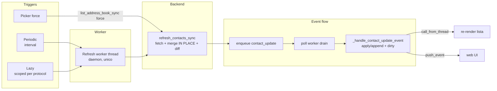

# DESIGN — Rubrica dinamica (refresh post-avvio, multi-trigger)

**Progetto:** `/home/rob/signal-tui-client` — client TUI Python/Textual multi-backend (Signal, WhatsApp, Telegram)
**Branch:** `fix/dynamic-address-book`
**Tipo:** specifica implementativa per lo sviluppatore. Nessun codice completo: firme, pseudocodice, diagrammi, riferimenti riga-per-riga al codice reale.
**Revisione:** v3.1 — recepisce il verdetto del red team (17 obiezioni, §14), le riserve del gate `APPROVATO CON RISERVE` (R1-R8, §14.1) e i 2 bug del tester (emendamento §14.2).

---

## 1. Obiettivo e scope

### 1.1 Problema

Se l'utente aggiunge/rinomina un contatto nella rubrica del telefono **dopo** aver lanciato la TUI, il client non lo risolve: in WhatsApp appare il numero invece del nome; il pattern di caching è identico nei tre backend e non ha refresh dinamico.

### 1.2 Root cause verificata

| # | File:riga | Fatto verificato |
|---|---|---|
| 1 | `protocols/whatsapp.py:989-1111` | `list_address_book_sync()` costruisce `self._address_book` e lo riusa finché `now - _address_book_ts < get_address_book_ttl_s()` (default 300s, `protocols/config.py:311-313`) |
| 2 | `protocols/whatsapp.py:873-909` | `_load_contacts()` chiama `list_address_book_sync(force=False)` **solo** alla connessione e applica i nomi a `self.contacts` via `_apply_address_book_names` (`whatsapp.py:228-244`) |
| 3 | `tui/polling.py:10-101` | `_poll_worker` non ha alcun refresh di contatti/rubrica |
| 4 | `tui/backend_connect.py:266-348` | i contatti si caricano solo all'avvio (`_poll_wa_contacts` si ferma appena `n>0`) |
| 5 | `tui/pickers.py:99`, `web/api.py:1623` | picker Ctrl+S ed endpoint `/api/contacts/book` chiamano con `force=False` |
| 6 | `tui/events.py:23-41` → `protocols/whatsapp.py:247-266` | il nome dei messaggi in ingresso è risolto SOLO dallo snapshot in-memory `_cached_address_book_name` ("zero rete") |
| 7 | `protocols/whatsapp.py:567-571`, `2323-2324` | `handle_webhook` chiama `_schedule_contact_lid_resolve` per OGNI messaggio, ma esce subito se il JID non è `@lid` |
| 8 | `protocols/whatsapp.py:2364-2415` | `_apply_contact_lid_resolution` mette `_address_book = None` ma **NON** rifà la fetch |

### 1.3 Obiettivo

Pipeline **unica** di refresh (re-fetch per protocollo → merge **in place** → ri-applica nomi → notifica `contact_update` → re-render), innescata da **tre trigger** che insieme coprono tutti i casi: periodico, lazy (su messaggio non risolto, **scoped per protocollo**) e force sul picker.

### 1.4 Principi vincolanti (confermati con la review)

- **Mai swap distruttivi** di `self.contacts` nel refresh: si fa **merge in place** per preservare l'identità-oggetto condivisa con la lista TUI (`tui/backend_connect.py:166-174`) → niente gap su `last_message_ts` né wipe su errore transitorio.
- **Fetch-fallita ≠ fetch-vuota**: un errore di trasporto NON committa (niente `or []` silenzioso); una lista vuota ma "API viva" committa.
- **Nessuna riscrittura retroattiva dello storico** (caso #7).
- **Nessun blocco del thread UI**; ordine lock `_register_lock → _contacts_lock → _lid_lock` rispettato.

### 1.5 IN scope / OUT of scope

**IN**: contratto `refresh_contacts_sync()`, fan-out `BackendManager.refresh_contacts_sync()` (shutdown non-bloccante), trigger #1/#2/#3, applicazione nome+ts+append alla lista TUI via `contact_update`, test dei bloccanti.

**OUT**: riscrittura storico; modifica schema SQLite; de-dup cross-backend nella lista principale; risoluzione eager `@lid`; **riscrittura dell'identità Signal uuid↔number** (pre-esistente, §14 obiezione 15); frontend web che passa `force` (§14 obiezione 8).

---

## 2. Architettura della pipeline



### 2.1 Perché un hook per-backend (e non solo `list_address_book_sync`)

`list_address_book_sync(force=True)` **non basta**:
- **WhatsApp**: aggiorna `_address_book` ma non tocca i `display_name` di `self.contacts` (applicati solo in `_load_contacts`). Serve re-fetch `/chats` + `/contacts/all`.
- **Telegram**: usa `_contacts_by_id.setdefault` (`telegram.py:1077`) → non sovrascrive i rinominati, e non tocca `self.contacts`.
- **Signal**: non rifà la fetch (`signal.py:498-530` riproietta solo `self.contacts`); e `_load_contacts_rpc` su lista vuota cade nel subprocess 120s (`signal.py:415-420`, `rpc.py:64`).

→ Hook per-backend `refresh_contacts_sync()`, con `list_address_book_sync` invariato (picker lo usa con `force=True`).

---

## 3. Contratto backend: `refresh_contacts_sync()`

### 3.1 `AddressBookRefreshResult` (nuovo, `protocols/base.py`)

```python
@dataclass
class AddressBookRefreshResult:
    protocol: str
    new_contacts: list[ChatContact] = field(default_factory=list)     # scoperti ora
    renamed_contacts: list[ChatContact] = field(default_factory=list) # display_name cambiato
    errors: str | None = None                                         # fetch fallita (mai raise)
```

### 3.2 Firma e contratto (`protocols/base.py`, dopo `list_address_book_sync` ~riga 348)

```python
def refresh_contacts_sync(self, force: bool = True) -> AddressBookRefreshResult:
    """Re-fetch dei contatti e ri-applicazione dei nomi rubrica IN PLACE.

    Bloccante (SOLO worker thread).  Contratto:
    - NON solleva mai: su errore remoto ritorna ``errors`` valorizzato e NON
      committa alcuna mutazione (fetch-fallita ≠ fetch-vuota).
    - MERGE IN PLACE: aggiorna ``display_name``/``last_message_ts``/extras sugli
      OGGETTI esistenti di ``self.contacts``; appende solo i NUOVI; NON sostituisce
      mai gli OGGETTI dei contatti già noti (preserva identità-oggetto condivisa
      con la TUI e i ghost).  Nota: il riferimento ``self.contacts`` PUÒ essere
      riassegnato al rebuild della lista, ma l'invariante reale è l'identità
      oggetto dei contatti "kept", non l'identità del contenitore.
    - Aggiorna i lookup (``_contacts_by_jid``/``_contacts_by_id``/``_contacts_by_key``)
      per MERGE (mai replace distruttivo: access_hash/read_outbox_max_id conservati).
    - NON riscrive lo storico renderizzato.
    - Emette un ``contact_update`` per ogni contatto nuovo/rinominato.
    - Aggiorna/invalida ``_address_book`` (il prossimo picker/web book vede i dati).

    Default (base): no-op → risultato vuoto.  I ``_MinimalBackend`` dei test
    ereditano il default (zero impatto sui test esistenti).
    """
    return AddressBookRefreshResult(self.protocol)
```

### 3.3 Payload `contact_update` (contratto unico cross-backend)

Riutilizza il contratto esistente (`whatsapp.py:2408-2415`):

```python
ChatEvent(
    type="contact_update",
    protocol=self.protocol,
    contact_id=contact.id,
    payload={"display_name": contact.display_name,
             "phone": contact.extras.get("phone"),
             "contact": contact},
)
```

Emissione per protocollo (coda già thread-safe): WhatsApp `self._enqueue_event` (`whatsapp.py:553`); Signal `self._event_queue.put` (`signal.py:273`); Telegram `self._events.put` (`telegram.py:839`). Helper condiviso `ChatBackend._contact_update_event(contact)` in `base.py` per non triplicare la costruzione.

---

## 4. Implementazioni per backend (merge in place, error-safe)

### 4.1 WhatsApp — `protocols/whatsapp.py`

**a) Fetch con distinzione errore/vuoto.** `WhatsAppRESTClient.list_contacts()` (`whatsapp_rest.py:277-295`) ritorna `None` su errore di trasporto, `[]` su "API viva, zero contatti". Non usare `or []` nel refresh:

```python
def refresh_contacts_sync(self, force: bool = True) -> AddressBookRefreshResult:
    if not self._rest or not self._connected:
        return AddressBookRefreshResult(PROTOCOL_WHATSAPP, errors="not connected")
    before = {c.id: c.display_name for c in self.contacts}
    raw = self._rest.list_contacts()          # None = errore trasporto
    if raw is None:
        return AddressBookRefreshResult(PROTOCOL_WHATSAPP, errors="fetch /chats failed")
    fresh = self._build_contacts_from_raw(raw)  # refactor da _load_contacts:879-900
    with ChatBackend._register_lock, self._contacts_lock:
        new, dropped = self._merge_contacts_in_place(fresh)   # vedi (b)
    try:
        book = self.list_address_book_sync(force=force)
        _apply_address_book_names(self.contacts, _build_address_book_name_map(book))
    except Exception as exc:
        # nomi non applicati: non fatale, i contatti sono già merge-ati
        logger.warning("WhatsApp refresh: book apply failed", exc_info=True)
    renamed = [c for c in self.contacts if c.id in before and before[c.id] != c.display_name]
    for c in new + renamed:
        self._enqueue_event(self._contact_update_event(c))
    return AddressBookRefreshResult(PROTOCOL_WHATSAPP, new, renamed)
```

**b) `_merge_contacts_in_place(fresh)`** (nuovo helper, sotto `_register_lock → _contacts_lock`):

```
fresh_by_id = {c.id: c for c in fresh}
kept, new = [], []
for c in self.contacts:                       # OGGETTI esistenti (anche ghost)
    f = fresh_by_id.pop(c.id, None)
    if f is None:
        if c.extras.get("ghost"):             # preserva i ghost non ancora in /chats
            kept.append(c)
        # else: contatto non più in /chats → scartato (equivale al vecchio swap)
        continue
    # update IN PLACE: display_name, last_message_ts, extras phone/lid
    if f.display_name and f.display_name != c.id and f.display_name != c.display_name:
        c.display_name = f.display_name
    # last_message_ts: SOLO max(local, fresh).  NON copiare il ts da ``fresh``
    # incondizionatamente: ``last_message_ts`` è una property su
    # ``extras["last_message_ts"]`` (models.py:369-380); un ts locale più
    # avanzato (messaggio live, invio ottimistico, clock skew, lag WAHA /chats)
    # regredirebbe nell'ordinamento "ultimi messaggi in alto".  BUG v3 corretto.
    if f.last_message_ts > (c.last_message_ts or 0):
        c.last_message_ts = f.last_message_ts
    for k in ("phone", "lid"):            # NIENTE "last_message_ts" qui (v3.1)
        if k in f.extras:
            c.extras[k] = f.extras[k]
    kept.append(c)
for f in fresh_by_id.values():                # NUOVI: append (oggetti nuovi)
    new.append(f); kept.append(f)
self.contacts = kept
self._contacts_by_jid = {c.id: c for c in kept}
# R4: il rebuild perde gli alias @lid registrati da _register_lid_alias:982.
# Ripristinali ri-eseguendo l'alias per ogni contatto @c.us (idempotente, setdefault).
# Siamo già dentro `_register_lock → _contacts_lock`; `_phone_to_lid` prende
# `_lid_lock` → ordine `_register_lock → _contacts_lock → _lid_lock` rispettato.
for c in kept:
    if c.id.endswith("@c.us"):
        self._register_lid_alias(c)
return new, ...
```

Note:
- Gli oggetti "kept" sono gli **stessi** della lista TUI (`backend_connect.py:174`) → `last_message_ts`/`display_name` aggiornati in place → nessun gap identità/ts (obiezione 1).
- Errori di fetch → `raw is None` → **nessuna mutazione** (obiezione 2).
- I contatti di sola rubrica restano fuori da `self.contacts` (lista = chat attive); li copre il trigger #3.
- Alias `@lid` ripristinati dopo il rebuild (riserva R4); in caso di cache lid non ancora popolata, il resolver background li re-materializza (self-heal).

### 4.2 Telegram — `protocols/telegram.py`

**a) Merge NOT replace, preservazione ghost e access_hash.**

```python
def refresh_contacts_sync(self, force: bool = True) -> AddressBookRefreshResult:
    if self._loop is None or self._client is None or not self._connected:
        return AddressBookRefreshResult(PROTOCOL_TELEGRAM, errors="not connected")
    before = {c.id: c.display_name for c in self.contacts}
    try:
        # 1) dialoghi freschi + merge in place, SUL loop Telethon
        future = asyncio.run_coroutine_threadsafe(self._load_contacts_merge(), self._loop)
        new = future.result(timeout=20)
    except Exception as exc:
        return AddressBookRefreshResult(PROTOCOL_TELEGRAM, errors=str(exc))
    # 2) rubrica fresca + applicazione nomi (merge, non replace)
    try:
        book = self.list_address_book_sync(force=force)
        self._apply_book_to_contacts(book)     # vedi (b)
    except Exception as exc:
        logger.warning("Telegram refresh: book apply failed", exc_info=True)
    renamed = [c for c in self.contacts if c.id in before and before[c.id] != c.display_name]
    for c in new + renamed:
        self._events.put(self._contact_update_event(c))
    return AddressBookRefreshResult(PROTOCOL_TELEGRAM, new, renamed)
```

**b) `_apply_book_to_contacts(book)`** (merge in place, risolve obiezione 3 + riserve R5/R6):

```python
def _apply_book_to_contacts(self, book: list[ChatContact]) -> None:
    by_id: dict[int, ChatContact] = {}
    for c in book:
        eid = _to_int(c.id)                     # R5: _to_int (mai int() su "--1")
        if eid is not None:
            by_id[eid] = c
    # R6: mutazione di _contacts_by_id sotto _contacts_lock (stesso lock usato
    # da list_address_book_sync e da _load_contacts_merge per lo stesso dict).
    with self._contacts_lock:
        for c in self.contacts:                 # dialoghi esistenti
            eid = _to_int(c.id)
            b = by_id.get(eid) if eid is not None else None
            if b is None:
                continue
            # aggiorna il nome SOLO se il dialogo ha un placeholder e il libro ha un nome reale
            if b.display_name and b.display_name != c.display_name and _tg_is_placeholder(c):
                c.display_name = b.display_name
            # access_hash: riempi se mancante, mai sovrascrivere (idempotente)
            if not c.extras.get("access_hash") and b.extras.get("access_hash"):
                c.extras["access_hash"] = b.extras["access_hash"]
        # lookup: MERGE — inserisci i book-only se assenti, NON sostituire i dialoghi
        for b in book:
            eid = _to_int(b.id)
            if eid is None:
                continue
            existing = self._contacts_by_id.get(eid)
            if existing is None:
                self._contacts_by_id[eid] = b    # book-only: ha access_hash (telegram.py:978)
            else:
                # nome/access_hash in place sull'oggetto dialogo (identità stabile)
                if b.display_name and _tg_is_placeholder(existing) and b.display_name != existing.display_name:
                    existing.display_name = b.display_name
                if not existing.extras.get("access_hash") and b.extras.get("access_hash"):
                    existing.extras["access_hash"] = b.extras["access_hash"]
```

**c) `_load_contacts_merge()`** (nuovo, corre l'`async def _load_contacts` esistente `telegram.py:759-784` senza wipe):

```python
async def _load_contacts_merge(self) -> list[ChatContact]:
    """Variante di _load_contacts che NON swappa a [] su errore: su eccezione
    get_dialogs rilancia (il chiamante ritorna error senza commit)."""
    dialogs = await self._client.get_dialogs(limit=200)   # raise su errore
    # Build "fresh" MIRRORANDO _load_contacts:800-806: _entity_to_contact(d.entity)
    # NON popola last_message_ts né read_outbox_max_id (telegram.py:732).  v3.1:
    # arricchisci cc qui (da dialog.message.date e dialog.read_outbox_max_id) così
    # che il merge sotto (f.last_message_ts, f.extras["read_outbox_max_id"]) funzioni.
    fresh = []
    for d in dialogs:
        cc = self._entity_to_contact(d.entity)
        if d.message and d.message.date:
            cc.last_message_ts = int(d.message.date.timestamp() * 1000)
        read_max_id = getattr(d, "read_outbox_max_id", None)
        if read_max_id:
            cc.extras["read_outbox_max_id"] = int(read_max_id)
        fresh.append(cc)
    # merge in place su self.contacts + rebuild _contacts_by_id SENZA perdere i ghost
    fresh_by_id: dict[int, ChatContact] = {}
    for c in fresh:
        eid = _to_int(c.id)                     # R5
        if eid is not None:
            fresh_by_id[eid] = c
    kept = []
    for c in self.contacts:
        f = fresh_by_id.pop(_to_int(c.id), None)
        if f is not None:
            if f.display_name and f.display_name != c.display_name and _tg_is_placeholder(c):
                c.display_name = f.display_name
            if f.last_message_ts > (c.last_message_ts or 0):
                c.last_message_ts = f.last_message_ts
            rm = f.extras.get("read_outbox_max_id")
            if rm:
                c.extras["read_outbox_max_id"] = int(rm)
            kept.append(c)
        elif c.extras.get("ghost"):
            kept.append(c)                      # preserva ghost
    new = []
    with self._contacts_lock:                   # R6: swap del dict sotto lock
        for f in fresh:
            if _to_int(f.id) not in {_to_int(k.id) for k in kept}:
                new.append(f); kept.append(f)
        self.contacts = kept
        self._contacts_by_id = {_to_int(c.id): c for c in kept if _to_int(c.id) is not None}
    self._reconcile_read_state()
    return new
```

Nota: `_load_contacts` esistente (`telegram.py:764-770`) fa `self.contacts = []` su eccezione — va mantenuto per il **connect** (stato iniziale vuoto, backward-compatible), ma il **refresh** usa `_load_contacts_merge` (che rilancia → `errors`, nessuna mutazione). Evita il wipe (obiezione 2).

**d) Helper reali (obiezione 7 + riserve R5/R6):**

```python
def _to_int(s) -> int | None:                 # CANONICO: "42"→42, "-100"→-100, "--1"→None, "x"→None
    try: return int(s)
    except (ValueError, TypeError): return None

def _tg_is_placeholder(c: ChatContact) -> bool:   # guard CORRETTA (non invertita)
    return not c.display_name or c.display_name == c.id or c.display_name.isdigit()
```

- **R5**: niente `_is_int` custom (il vecchio `str(s).lstrip("-").isdigit()` dava `_is_int("--1") == True` ma `int("--1")` solleva). Usare sempre `_to_int`.
- **R6**: nuovo `self._contacts_lock = threading.Lock()` in `TelegramBackend.__init__` (`telegram.py:262`, accanto a `_contacts_by_id`). Guarda le mutazioni read-modify-write di `_contacts_by_id` in `_apply_book_to_contacts` e `_load_contacts_merge`, e il `setdefault` di `list_address_book_sync` (`telegram.py:1073-1079`, avvolto nello stesso lock). Lo swap (`self._contacts_by_id = ...`) resta un'assegnazione atomica ma avviene dentro la sezione critica.

### 4.3 Signal — `protocols/signal.py` (RPC-only, no subprocess)

```python
def refresh_contacts_sync(self, force: bool = True) -> AddressBookRefreshResult:
    if not self._use_daemon:
        return AddressBookRefreshResult(PROTOCOL_SIGNAL, errors="daemon not running")
    before = {c.id: c.display_name for c in self.contacts}
    raw = self._rpc._call("listContacts")          # rpc.py:338 — timeout HTTP 30s
    if "error" in raw:
        return AddressBookRefreshResult(PROTOCOL_SIGNAL, errors=str(raw["error"]))
    data = raw.get("result")
    if not isinstance(data, list):
        return AddressBookRefreshResult(PROTOCOL_SIGNAL, errors="unexpected RPC result")
    fresh = [self._to_chat_contact(self._parse_contact_dict(c)) for c in data]  # R2
    new, renamed = self._merge_contacts_in_place(fresh)   # vedi sotto
    self._address_book = None                         # invalida proiezione
    for c in new + renamed:
        self._event_queue.put(self._contact_update_event(c))
    return AddressBookRefreshResult(PROTOCOL_SIGNAL, new, renamed)
```

**R2 — helper `_parse_contact_dict` (estratto da `_parse_and_update_contacts:451-461`, nessun helper `_parse_contact` esiste nel codice):**

```python
def _parse_contact_dict(self, c: dict) -> Contact:
    """Da un dict ``listContacts`` a un ``Contact`` legacy (riuso esatto della
    logica di _parse_and_update_contacts:453-461)."""
    number = c.get("number") or c.get("uuid", "") or ""
    name = (c.get("name") or c.get("givenName")
            or (c.get("profile") or {}).get("givenName") or number)
    aci = c.get("uuid", "") or c.get("aci", "")
    return Contact(number=number, name=name, aci=aci)
```

`_parse_and_update_contacts` resta invariato ma delega a `_parse_contact_dict` (refactor trasparente, nessun cambio di comportamento).

**`_merge_contacts_in_place(fresh)`** (per Signal, con rimozione dei rimossi):

```
fresh_by_key = {c.cache_key: c for c in fresh}
new, renamed, keep_ids = [], [], set()
for c in self.contacts:                       # OGGETTI esistenti (identità stabile)
    f = fresh_by_key.pop(c.cache_key, None)
    if f is None:
        if c.extras.get("ghost"):             # R3: preserva i ghost (open-or-create)
            keep_ids.add(c.cache_key)
        continue                              # altrimenti rimosso dalla rubrica
    if f.display_name != c.display_name:
        renamed.append(c); c.display_name = f.display_name
    c.extras["aci"] = f.extras.get("aci", "")
    c.extras["number"] = f.extras.get("number", c.id)
    keep_ids.add(c.cache_key)
for f in fresh:
    if f.cache_key not in keep_ids:
        new.append(f)
# ripristina last_message_ts da SQLite (stessa logica di _set_contacts:471-477)
for c in new:
    c.last_message_ts = max((m.get("timestamp") or 0 for m in (self.cache.get(c.id) or [])), default=0)
self.contacts = [c for c in self.contacts if c.cache_key in keep_ids] + new
self._contacts_by_key = {c.cache_key: c for c in self.contacts}
return new, renamed
```

Nota (obiezione 4): niente `_load_contacts_subprocess` nel refresh → nessuno stallo da `SUBPROCESS_TIMEOUT=120` (`rpc.py:64`); `_rpc._call` è bounded a 30s (`rpc.py:357`).

Nota (riserva R3): i ghost Signal (open-or-create, `register_contact` `signal.py:484-494`) sono preservati dal guard `extras.get("ghost")`; il send resta comunque possibile col numero grezzo, ma il ghost non scompare dal refresh.

---

## 5. Aggregazione — `protocols/manager.py`

```python
def refresh_contacts_sync(
    self, protocols: set[str] | None = None, force: bool = True
) -> dict[str, AddressBookRefreshResult]:
    """Fan-out parallelo del refresh dinamico.  NON usa il context manager
    ``with ThreadPoolExecutor`` (il cui ``__exit__`` fa ``shutdown(wait=True)``
    e bloccherebbe anche dopo ``future.result(timeout)``, manager.py:109).
    """
    backends = [b for b in self._backends.values()
                if protocols is None or b.protocol in protocols]
    results: dict[str, AddressBookRefreshResult] = {}
    if not backends:
        return results
    pool = ThreadPoolExecutor(max_workers=3)
    try:
        futures = {pool.submit(b.refresh_contacts_sync, force=force): b for b in backends}
        for fut, b in futures.items():
            try:
                results[b.protocol] = fut.result(timeout=30)
            except Exception as exc:
                results[b.protocol] = AddressBookRefreshResult(b.protocol, errors=str(exc))
                logger.warning("Dynamic refresh failed for %s: %s", b.protocol, exc, exc_info=True)
    finally:
        pool.shutdown(wait=False, cancel_futures=True)   # non bloccante (obiezione 4)
    return results
```

Chiave: `shutdown(wait=False)` → un backend lento non blocca gli altri né il thread di refresh; il worker di refresh è daemon (§6.4) → niente join all'exit.

**Riserva R7 (non-daemon pool)**: i thread del `ThreadPoolExecutor` sono non-daemon e `concurrent.futures` registra un hook `atexit` che li joina all'uscita. Il tempo d'attesa è **bounded ~30s** (timeout RPC `_call`, `rpc.py:357`; il subprocess 120s è stato eliminato). È lo **stesso pattern già usato da `list_address_book_sync`** (`manager.py:109`): comportamento pre-esistente, accettato. Alternativa futura (non nel MVP): pool condiviso con `thread_factory` daemon.

---

## 6. I tre trigger

### 6.1 Trigger #1 — Periodico (catch-all)

- **Dove**: worker dedicato `_address_book_refresh_loop` (daemon), avviato in `on_mount`, fermato in `on_exit_app`.
- **Parametro**: `get_dynamic_refresh_interval_s()` → env `DYNAMIC_REFRESH_INTERVAL_S`, default **300**.
- **Semantica**: ogni `interval` → `manager.refresh_contacts_sync(force=True, protocols=None)`. Copre #3 (rinominato che non scrive) e tiene `_address_book` caldo per il web book (obiezione 8).

### 6.2 Trigger #2 — Lazy (su messaggio non risolto, scoped)

- **Dove**: `tui/events.py:_handle_message_event`, guard `getattr(self, "schedule_address_book_refresh", None)` (test double safe).
- **Condizione** (obiezione 16 — `contact` non è mai `None` dopo la risoluzione): usa un flag locale `was_placeholder` + `_looks_unresolved(contact)`.
- **Parametri**: cooldown `get_dynamic_refresh_cooldown_s()` → env `DYNAMIC_REFRESH_COOLDOWN_S`, default **60**; **scoped** `protocols={event.protocol}` (obiezione 6).

```python
# in _handle_message_event, dopo la risoluzione di `contact`:
if was_placeholder or _looks_unresolved(contact):
    schedule = getattr(self, "schedule_address_book_refresh", None)
    if schedule is not None:
        schedule(event.protocol)         # scoped: solo il protocollo del messaggio
```

Helper cross-backend (definito in `tui/events.py`):

```python
def _looks_unresolved(contact: ChatContact) -> bool:
    if contact.protocol == PROTOCOL_WHATSAPP:
        return _is_placeholder_display_name(
            contact.display_name, contact.id, contact.extras.get("phone"))
    return (not contact.display_name
            or contact.display_name == contact.id
            or contact.display_name.isdigit())
```

### 6.3 Trigger #3 — Force sul picker / web book

- **TUI** (`tui/pickers.py:99`): `manager.list_address_book_sync(protocols=scope, force=True)`. Copre #2 (scrivo io per primo).
- **Web** (`web/api.py:1623`): `/api/contacts/book` accetta `force: bool = False` (query param). Il frontend **non** lo passa per default (`app.js:3658`) per non martellare WAHA a ogni keystroke: il web book beneficia del refresh periodico (§6.1) entro TTL. Dichiarato MITIGATA in §14 (obiezione 8).

### 6.4 Scheduler e thread-safety (obiezioni 9, 13, 14)

**Stati inizializzati in `__init__`** (`tui/app.py`, NON in `on_mount` — i test patchano `on_mount`, `conftest.py:261-273`, e devono restare thread-free):

```python
self._address_book_refresh_stop = False
self._address_book_refresh_wake = threading.Event()
self._address_book_refresh_lock = threading.Lock()      # guarda last_lazy + pending protocols
self._address_book_last_periodic = 0.0                  # monotonic, cadenza periodica
self._address_book_last_lazy = 0.0                      # monotonic, cooldown lazy
self._address_book_pending_protocols: set[str] = set()  # scoping lazy
self._address_book_refresh_thread: threading.Thread | None = None
```

**Loop** (due timestamp SEPARATI — obiezione 13):

```python
def _address_book_refresh_loop(self):
    interval = get_dynamic_refresh_interval_s()
    cooldown = get_dynamic_refresh_cooldown_s()
    self._address_book_last_periodic = time.monotonic()
    while not self._address_book_refresh_stop:
        now = time.monotonic()
        remaining = max(0.0, interval - (now - self._address_book_last_periodic))
        self._address_book_refresh_wake.wait(timeout=remaining)
        self._address_book_refresh_wake.clear()
        if self._address_book_refresh_stop:
            return
        now = time.monotonic()
        if now - self._address_book_last_periodic >= interval:
            # PERIODICO: incondizionato
            self._address_book_last_periodic = now
            self._address_book_last_lazy = now
            self._run_refresh(protocols=None)
            continue
        # LAZY: soggetto a cooldown
        with self._address_book_refresh_lock:
            if now - self._address_book_last_lazy < cooldown:
                continue                               # throttle
            self._address_book_last_lazy = now
            protocols = set(self._address_book_pending_protocols)
            self._address_book_pending_protocols.clear()
        self._run_refresh(protocols=protocols or None)

def schedule_address_book_refresh(self, protocol: str) -> None:
    with self._address_book_refresh_lock:
        self._address_book_pending_protocols.add(protocol)
    self._address_book_refresh_wake.set()

def stop_address_book_refresh(self) -> None:
    self._address_book_refresh_stop = True
    self._address_book_refresh_wake.set()              # sblocca wait; nessun join (daemon)

def _run_refresh(self, protocols) -> None:
    try:
        results = self.manager.refresh_contacts_sync(protocols=protocols, force=True)
        for proto, r in results.items():
            if r.errors:
                logger.warning("Dynamic refresh failed for %s: %s", proto, r.errors)
    except Exception as exc:
        logger.debug("Dynamic refresh worker error", exc_info=True)
```

Proprietà:
- Il **worker è unico** → mai due `refresh_contacts_sync` concorrenti sullo stesso backend (obiezione 9). Il picker `list_address_book_sync(force=True)` legge solo `self.contacts`/`_address_book` (non muta `self.contacts`) → race benigna, last-writer-wins su `_address_book` (attributo atomico).
- `stop()` non fa join: il thread è daemon, esce al prossimo wake/flush (obiezione 14).
- Lazy scoped + cooldown 60s → nessun `GetContactsRequest`/`get_dialogs` Signal ogni 60s su tutti i backend (obiezione 6).

---

## 7. Identità oggetto TUI (riancoraggio + append)

**Problema (obiezione 1, verificato)**: `_on_backend_ready` condivide gli oggetti (`backend_connect.py:166-174`); `_handle_message_event` aggiorna `contact.last_message_ts` sull'oggetto backend (`events.py:204`) **senza riancorare** la copia TUI; la lista ordina gli oggetti TUI (`contacts.py:54-66`). Dopo un refresh (che ora è merge-in-place, ma anche in altri percorsi) gli oggetti divergono.

### 7.1 Riancoraggio in `_handle_message_event` (`tui/events.py:162-204`)

Come già fa `_handle_sent_mirror_event` (`events.py:116-123`):

```python
contact = event.payload.get("contact")
was_placeholder = False
if contact is None:
    identify = getattr(backend, "_identify_contact", None)
    if identify is not None:
        contact = identify(event.contact_id)
    if contact is None:
        was_placeholder = True
        contact = ChatContact(
            id=event.contact_id,
            display_name=_resolve_placeholder_name(backend, event.contact_id),
            protocol=event.protocol,
        )
# RIANCORAGGIO: preferisci l'oggetto già nella lista TUI (identità stabile)
tui_contact = next(
    (c for c in self.contacts if c.cache_key == contact.cache_key), None)
if tui_contact is not None:
    contact = tui_contact
else:
    self.contacts.append(contact)
    if hasattr(backend, "register_contact"):
        backend.register_contact(contact)
    elif hasattr(backend, "contacts"):
        backend.contacts.append(contact)
    self._contact_list_dirty = True
    self._dirty_contact_keys.add(contact.cache_key)
# ... a seguire: `contact.last_message_ts = ts` ora scrive sull'oggetto TUI
```

Conseguenza: `contact` è sempre l'oggetto canonico della lista TUI → `last_message_ts` e `display_name` si riflettono nel sort/render. `ingest(contact.id, ...)` usa `contact.id` (invariato: `cache_key` implica stesso id).

### 7.2 `_handle_contact_update_event` applica/APPENDE (`tui/events.py:70-95`)

Risolve obiezione 5 (nuovi contatti non propagati) e il gap `display_name` post-swap:

```python
def _handle_contact_update_event(self, event: ChatEvent) -> bool:
    cache_key = contact_cache_key(event.protocol, event.contact_id)
    contact = event.payload.get("contact")
    new_name = event.payload.get("display_name")
    phone = event.payload.get("phone")

    # R1: dedup Signal su cambio id uuid↔number (stessa persona, cache_key diverso).
    # Se "number" compare dopo (id passa da uuid a number) il merge Signal la
    # classifica "new" e la appende; senza dedup il vecchio uuid resterebbe in
    # lista → riga duplicata permanente.
    if contact is not None and event.protocol == PROTOCOL_SIGNAL:
        stable = _signal_stable_key(contact)
        if stable:
            for stale in list(self.contacts):
                if (stale.cache_key != cache_key
                        and stale.protocol == PROTOCOL_SIGNAL
                        and _signal_stable_key(stale) == stable):
                    self.contacts.remove(stale)
                    self._contact_widgets.pop(stale.cache_key, None)
                    self._dirty_contact_keys.add(stale.cache_key)
                    break

    target = next((c for c in self.contacts if c.cache_key == cache_key), None)
    if target is None and contact is not None:
        self.contacts.append(contact)                # NUOVO contatto → in lista (obiezione 5)
        target = contact
    elif target is not None:
        if new_name and target.display_name != new_name:
            target.display_name = new_name
        if phone and not target.extras.get("phone"):
            target.extras["phone"] = phone

    self._contact_list_dirty = True
    self._dirty_contact_keys.add(cache_key)
    if getattr(self, "_web_enabled", False):
        from web.bridge import push_event
        push_event({
            "type": "contact_update",
            "payload": {
                "protocol": event.protocol,
                "contact_id": event.contact_id,
                "display_name": new_name,
                "phone": phone,
            },
        })
    return True


def _signal_stable_key(c: ChatContact) -> str:
    """Identità stabile Signal per il dedup R1: aci (UUID) se presente, altrimenti
    il numero normalizzato (cifre).  Copre sia il cambio uuid→number sia il rename."""
    aci = c.extras.get("aci")
    if aci:
        return f"aci:{aci}"
    number = c.extras.get("number") or c.id
    return f"phone:{''.join(ch for ch in str(number) if ch.isdigit())}"
```

**Caso #7 (no riscrittura storica)**: si tocca solo `self.contacts[]` (display_name/append); mai `self._cache` né `MessageWidget` né i campi `sender` delle bolle. Il primo messaggio resta col numero (come già documentato per il resolver lid, `whatsapp.py:2309`).

---

## 8. Matrice casi → meccanismo

| # | Caso | Meccanismo |
|---|---|---|
| 1 | Contatto nuovo che scrive → nome risolto | Lazy scoped (#2) → `refresh_contacts_sync` (merge in place) → `contact_update` → append/apply in lista |
| 2 | Contatto nuovo, scrivo io per primo (Ctrl+S) | Force (#3) sul picker → `list_address_book_sync(force=True)` rifà `/contacts/all` |
| 3 | Contatto rinominato che non scrive | Periodico (#1) → `refresh_contacts_sync` ri-applica nome (WA/TG) / re-fetch (Signal) |
| 4 | Contatto noto mostrato col numero | Lazy (#2) su `_looks_unresolved` + periodico (#1) |
| 5 | `@lid` diretto e sender di gruppo/mention | Resolver lid esistente + refresh che ri-applica nome da `_address_book` fresca |
| 6 | Signal: scoprire nuovi / Telegram: aggiornare rinominati | `refresh_contacts_sync` Signal = `_call("listContacts")` RPC-only; TG = merge (no setdefault) + `_apply_book_to_contacts` |
| 7 | Nessuna riscrittura retroattiva dello storico | `_handle_contact_update_event` tocca solo `self.contacts[]`; mai `_cache`/bolle |
| 8 | Costo controllato | Worker unico daemon, cooldown 60s + scoping (lazy), interval 300s (periodico), force solo su azione utente, `shutdown(wait=False)` |

---

## 9. Piano di test

### 9.1 Unit — backend (estende `tests/test_address_book.py`)

- **WA `refresh_contacts_sync`**:
  - fetch `/chats` → `None` (errore) ⇒ `errors` valorizzato e `self.contacts` **invariato** (no wipe — obiezione 2).
  - fetch `[]` (vuoto, API viva) ⇒ commit vuoto (solo ghost preservati).
  - contatto nuovo ⇒ `new_contacts` + 1 `contact_update`; rinominato ⇒ `renamed_contacts`; **gli oggetti kept sono identici** (`is`) a quelli precedenti (obiezione 1).
  - **R4**: un contatto `@c.us` con alias `@lid` in `_contacts_by_jid` (via `_register_lid_alias`) ⇒ dopo il refresh l'alias è ancora presente (assert su `_contacts_by_jid[@lid]`).
  - **v3.1 (BUG 1)**: contatto kept con `last_message_ts=2000` in-memory e `fresh.last_message_ts=1000` ⇒ dopo il merge `last_message_ts` resta **2000** (nessuna regressione di ordinamento); contatto kept con `1000` e `fresh=2000` ⇒ sale a 2000; contatto NUOVO ⇒ mantiene il ts del fresh.
- **TG `refresh_contacts_sync`** (mock `_tg_backend_with_book`):
  - get_dialogs che solleva ⇒ `errors` + `self.contacts`/`_contacts_by_id` **invariati** (obiezione 2).
  - rinomina ⇒ `_contacts_by_id[id]` è lo **stesso oggetto** dialogo (non sostituito) con `display_name` aggiornato; `access_hash`/`read_outbox_max_id` conservati (obiezione 3).
  - ghost in `self.contacts` non presente nei dialoghi freschi ⇒ **preservato** dopo il merge (obiezione 3).
  - **R5**: `_to_int("--1") is None`, `_to_int("-100") == -100` (il merge non tenta `int("--1")`).
  - **R8**: un puro rename (stesso id, nome diverso) ⇒ `renamed_contacts` ha 1 entry, `new_contacts` vuoto, `len(self.contacts)` invariato (nessun duplicato).
  - **v3.1 (BUG 2)**: dialog con `read_outbox_max_id=42` (e `message.date` valorizzato) ⇒ dopo il refresh `self.contacts[id].extras["read_outbox_max_id"] == 42` e `last_message_ts` aggiornato dal dialog; dialog senza `read_outbox_max_id` ⇒ il campo resta quello locale (mai sovrascritto a None).
- **Signal `refresh_contacts_sync`**:
  - `_rpc._call` → `{"error": ...}` ⇒ `errors`, nessuna mutazione, **nessuna chiamata subprocess** (asserzione su `_load_contacts_subprocess` non chiamato — obiezione 4).
  - `_rpc._call` → `{"result": [...]}` ⇒ nuovo/rinominato; `last_message_ts` ripristinato da `self.cache`.
  - **R2**: `_parse_contact_dict` estrae `number`/`name`/`aci` identico a `_parse_and_update_contacts` (fixture dict con `uuid` e senza `number`).
  - **R3**: un ghost (extras `ghost=True`) non presente in `listContacts` ⇒ preservato in `self.contacts` dopo il merge.
- **Manager `refresh_contacts_sync`**: un backend lento (future che non completa) ⇒ gli altri ritornano nel timeout, `pool.shutdown(wait=False)` non blocca. **R8**: mockare `ThreadPoolExecutor.shutdown` (assert `wait=False, cancel_futures=True`) o usare un timeout corto via monkeypatch, per non introdurre un test lento/flaky di 30s.

### 9.2 Unit — TUI (`tests/test_dynamic_address_book.py`, nuovo)

- `_handle_message_event` riancora l'oggetto TUI per `cache_key` (due oggetti con stesso `cache_key` ⇒ `last_message_ts` scritto su quello in `self.contacts`).
- `_handle_contact_update_event` **appende** un contatto nuovo (cache_key assente) e aggiorna `display_name` su quello esistente; non tocca `self._cache`.
- **R1**: `_handle_contact_update_event` per un contatto Signal con stesso `aci`/numero ma `cache_key` diverso (uuid→number) ⇒ rimuove la voce stale e appende la nuova ⇒ **una sola riga** (nessun duplicato); `_signal_stable_key` corretto per `aci` presente/assente.
- `_looks_unresolved`: WA placeholder (`@c.us`/`@lid`/numero), Signal/TG id-numerico ⇒ True; nome reale ⇒ False.
- Trigger lazy: `schedule_address_book_refresh(event.protocol)` su `was_placeholder` o `_looks_unresolved`; **non** chiamato su contatto risolto; `contact is None` mai usato come condizione (obiezione 16).
- Scheduler: cooldown rispettato (due wake ravvicinati ⇒ 1 refresh); cadenza periodica indipendente dal lazy (timestamp separati — obiezione 13); `stop()` sblocca il loop senza join.

### 9.3 Regressione — test esistenti verdi

`tests/test_address_book.py`, `tests/test_contact_picker.py`, `tests/test_web_send_address_book.py`: nessuna firma rimossa. `list_address_book_sync` invariato. `refresh_contacts_sync` default = no-op → `_MinimalBackend` intatto. Stati del worker in `__init__` → i test che patchano `on_mount` (`conftest.py:261-273`) restano thread-free (obiezione 14).

### 9.4 Integrazione (pilot, marker `integration`)

- Picker con `force=True` (assert su mock che `list_address_book_sync` riceva `force=True`); contatto aggiunto al mock compare.
- Messaggio da id ignoto → refresh scoped → `contact_update` → riga della lista cambia nome e il contatto nuovo compare.

---

## 10. Config (pattern env → config.json → default)

| Getter | Env | Default |
|---|---|---|
| `get_dynamic_refresh_interval_s()` | `DYNAMIC_REFRESH_INTERVAL_S` | `300` |
| `get_dynamic_refresh_cooldown_s()` | `DYNAMIC_REFRESH_COOLDOWN_S` | `60` |

(`protocols/config.py`, sezione "Address book / picker configuration", accanto a `get_address_book_ttl_s` ~riga 311.)

---

## 11. Rischi e trade-off

| Rischio | Mitigazione |
|---|---|
| Lazy/periodico da soli non coprono tutto | Tre trigger + force picker (matrice §8) |
| Wipe su errore transitorio | fetch-fallita ≠ vuota; nessun commit su errore (§4) |
| Divergenza identità/ts post-swap | merge in place + riancoraggio TUI (§4, §7.1) |
| TG overwrite perde access_hash/ghost | merge NOT replace + preservazione ghost (§4.2) |
| Stallo worker 120s (subprocess Signal) | RPC-only + `shutdown(wait=False)` + daemon (§4.3, §5) |
| Hot-loop / costo | cooldown 60s + scoping + timestamp separati (§6.4) |
| Razza `self.contacts` TUI (poll vs sort) | pattern pre-esistente (`events.py:204`); riancoraggio sul thread poll; render deferito (§7) |
| TG mutazioni loop vs refresh thread | `run_coroutine_threadsafe` (§4.2) |
| Signal identità uuid↔number cambia cache_key | RISOLTA (R1): dedup per `aci`/numero normalizzato in `_handle_contact_update_event` (§7.2) |
| TG `_contacts_by_id` mutato senza lock | RISOLTA (R6): `_contacts_lock` su `_apply_book_to_contacts`/`_load_contacts_merge`/`list_address_book_sync` (§4.2d) |
| Pool non-daemon joina all'exit | MITIGATA (R7): bounded ~30s, pattern pre-esistente di `list_address_book_sync` (§5) |
| Alias `@lid` persi al rebuild WA | RISOLTA (R4): ripristino via `_register_lid_alias` (§4.1b) |
| Ghost Signal persi nel merge | RISOLTA (R3): guard `extras.get("ghost")` (§4.3) |
| Double refresh picker+worker | worker unico + race benigna (last-writer-wins) (§6.4) |

---

## 12. Impatto sui file

| File | Modifica |
|---|---|
| `protocols/base.py` | `AddressBookRefreshResult`, `refresh_contacts_sync` default, `_contact_update_event` helper |
| `protocols/manager.py` | `refresh_contacts_sync` con `shutdown(wait=False, cancel_futures=True)` |
| `protocols/whatsapp.py` | refactor `_load_contacts` → `_build_contacts_from_raw` + `_merge_contacts_in_place`; `refresh_contacts_sync` |
| `protocols/telegram.py` | `_contacts_lock`, `_load_contacts_merge`, `_apply_book_to_contacts`, `refresh_contacts_sync`, helper `_to_int`/`_tg_is_placeholder` |
| `protocols/signal.py` | `refresh_contacts_sync` (RPC-only) + `_merge_contacts_in_place` + `_parse_contact_dict` |
| `protocols/config.py` | 2 getter §10 |
| `tui/address_book_refresh.py` | **nuovo** `DynamicAddressBookMixin` |
| `tui/app.py` | import + mixin, stati in `__init__`, start `on_mount`, stop `on_exit_app` |
| `tui/events.py` | riancoraggio in `_handle_message_event`; `_handle_contact_update_event` (apply/append + dedup R1); `_looks_unresolved`; `_signal_stable_key`; trigger lazy scoped |
| `tui/pickers.py` | `_address_book_worker` → `force=True` |
| `web/api.py` | `/api/contacts/book` param `force` (default False) |
| `tests/test_address_book.py` | esteso (backend refresh, error/empty, merge/ghost) |
| `tests/test_dynamic_address_book.py` | **nuovo** (TUI + scheduler) |

---

## 13. Riferimenti chiave

`protocols/base.py:331-355`, `protocols/manager.py:89-125`, `protocols/whatsapp.py:873-909/989-1111/2323-2415`, `protocols/whatsapp_rest.py:277-295`, `protocols/telegram.py:759-784/929-943/1008-1081/1110-1118`, `protocols/signal.py:415-426/464-479/498-530`, `protocols/rpc.py:64/338-368`, `tui/events.py:23-41/70-95/116-123/162-204`, `tui/contacts.py:54-66`, `tui/polling.py:10-101`, `tui/pickers.py:46-109`, `tui/backend_connect.py:86-190`, `web/api.py:1612-1624`, `web/static/app.js:3658`, `protocols/config.py:311-313`, `tests/conftest.py:261-273`.

---

## 14. Recepimento review (17 obiezioni)

| # | Obiezione | Stato | Dove trattata |
|---|---|---|---|
| 1 | BLOCCANTE — gap identità anche su `last_message_ts` | **RISOLTA** — merge in place (§4) + riancoraggio TUI in `_handle_message_event` (§7.1, speculare a `_handle_sent_mirror_event:116-123`) | §4, §7.1 |
| 2 | BLOCCANTE — wipe su errore transitorio | **RISOLTA** — `raw is None` (WA) / `get_dialogs` raise (TG) ⇒ `errors` + nessun commit; fetch-vuota committa | §3.2, §4.1a, §4.2c |
| 3 | BLOCCANTE — TG overwrite/ghost/access_hash | **RISOLTA** — merge NOT replace; ghost preservati; `access_hash`/`read_outbox_max_id` conservati; insert rubrica solo se assente | §4.2b/c |
| 4 | BLOCCANTE — timeout manager falso / subprocess 120s | **RISOLTA** — Signal RPC-only (`_call`, timeout 30s); `shutdown(wait=False)`; worker daemon | §4.3, §5, §6.4 |
| 5 | ALTA — nuovi contatti non propagati alla TUI | **RISOLTA** — `_handle_contact_update_event` appende i nuovi | §7.2 |
| 6 | ALTA — lazy `force=True` non scoped | **RISOLTA** — `schedule_address_book_refresh(protocol)` + `protocols={protocol}` + cooldown | §6.2, §6.4 |
| 7 | ALTA — helper inesistenti / guard invertita | **RISOLTA** — `_to_int`/`_tg_is_placeholder` definiti; guard `_tg_is_placeholder(existing)` (non negata) | §4.2d |
| 8 | MEDIA — trigger #3 web morto (`app.js:3658`) | **MITIGATA** — il web book resta lazy; beneficia del refresh periodico che tiene `_address_book` caldo entro TTL; param `force` disponibile ma non passato dal frontend (evita martellare WAHA a ogni keystroke) | §6.3 |
| 9 | MEDIA — doppio refresh picker+worker senza lock | **MITIGATA** — worker unico (mai 2 `refresh_contacts_sync` concorrenti); picker legge solo (race benigna, last-writer-wins su attributo atomico) | §6.4 |
| 10 | MEDIA — TG mutazioni loop vs refresh thread | **RISOLTA** — `run_coroutine_threadsafe(_load_contacts_merge)` sul loop | §4.2c |
| 11 | MEDIA — Signal `_set_contacts`/`register_contact` non lockati | **MITIGATA** — refresh su unico worker thread; swap lista = assegnazione atomica; pattern pre-esistente. Opzionale: `_contacts_lock` Signal (non necessario per MVP) | §4.3 |
| 12 | MEDIA — razza su iterazione `self.contacts` TUI | **MITIGATA** — pattern pre-esistente (`events.py:204` muta dal poll thread); riancoraggio sul poll thread; render deferito a fine batch | §7.1 |
| 13 | MEDIA — costo periodico/cooldown condiviso | **RISOLTA** — timestamp separati `_last_periodic`/`_last_lazy`; periodico incondizionato, lazy throttled | §6.4 |
| 14 | MEDIA — lifecycle worker (stati in `__init__`, no join) | **RISOLTA** — stati in `__init__` (test patchano `on_mount`); `stop()` = flag+`set()`, daemon senza join | §6.4 |
| 15 | MEDIA — `before`/`new` senza lock + Signal uuid→number | **RISOLTA (R1)** — `before` catturato a inizio refresh su unico worker thread (no intra-race); identità Signal uuid↔number dedupata per `aci`/numero in `_handle_contact_update_event` | §4, §7.2 |
| 16 | BASSA — `contact is None` nel lazy è codice morto | **RISOLTA** — flag locale `was_placeholder` + `_looks_unresolved` | §6.2 |
| 17 | BASSA — `errors` senza UX | **MITIGATA** — log a `warning` (coerente con `address_book_errors` diagnostico di `DESIGN_FIX_WEB_SEND_ADDRESS_BOOK.md` §2.3); status opzionale | §5 |

### 14.1 Riserve del gate `APPROVATO CON RISERVE`

| # | Riserva | Stato | Dove trattata |
|---|---|---|---|
| R1 | ALTA — duplicati Signal su cambio id uuid↔number | **RISOLTA** — dedup per `aci`/numero normalizzato in `_handle_contact_update_event` (rimuove lo stale e appende il nuovo); test dedicato | §7.2, §9.2 |
| R2 | MEDIA — `_parse_contact` non esiste | **RISOLTA** — helper `_parse_contact_dict` estratto da `_parse_and_update_contacts:451-461`; nessun helper fittizio | §4.3 |
| R3 | MEDIA — ghost Signal non preservati | **RISOLTA** — guard `extras.get("ghost")` nel merge Signal; test dedicato | §4.3, §9.1 |
| R4 | MEDIA — alias `@lid` persi al rebuild WA | **RISOLTA** — ripristino via `_register_lid_alias` dopo il rebuild (dentro la sezione critica); self-heal dal resolver | §4.1b |
| R5 | BASSA — `_is_int("--1")==True` ma `int` solleva | **RISOLTA** — rimosso `_is_int`; solo `_to_int` (che solleva → None); test dedicato | §4.2d, §9.1 |
| R6 | BASSA — `_contacts_by_id` TG mutato senza lock | **RISOLTA** — nuovo `_contacts_lock` su `_apply_book_to_contacts`/`_load_contacts_merge`/`list_address_book_sync` | §4.2d |
| R7 | BASSA — pool non-daemon joina all'exit | **MITIGATA** — bounded ~30s (RPC), pattern pre-esistente di `list_address_book_sync`; pool daemon come alternativa futura | §5 |
| R8 | BASSA — test manager timeout lento/flaky + test mancanti | **RISOLTA** — mock `shutdown`/timeout corto; test puro-rename no-dup e ghost Signal aggiunti | §9 |

### 14.2 Emendamento v3.1 (post-test — 2 bug del tester)

| Bug | Severità | Causa (design) | Correzione |
|---|---|---|---|
| BUG 1 — WA `_merge_contacts_in_place` regredisce `last_message_ts` | ALTA | §4.1b copiava `last_message_ts` da `fresh.extras` incondizionatamente nel loop `("phone","lid","last_message_ts")`, vanificando la guardia `max` (property su `extras`, `models.py:369-380`) | Rimuovere `"last_message_ts"` dal loop extras: i kept usano SOLO `max(local, fresh)`; i nuovi mantengono il ts del fresh | §4.1b |
| BUG 2 — TG `_load_contacts_merge` non aggiorna `read_outbox_max_id` | MEDIA | §4.2c costruiva `fresh` con `_entity_to_contact(d.entity)`, che non popola né `last_message_ts` né `read_outbox_max_id` (`telegram.py:732`); `f.extras.get("read_outbox_max_id")` era sempre None | Costruire `fresh` mirrorando `_load_contacts:800-806`: `last_message_ts` da `dialog.message.date`, `read_outbox_max_id` da `dialog.read_outbox_max_id` | §4.2c |

Test di regressione aggiunti in §9.1 (no ts regressivo WA; `read_outbox_max_id`/ts aggiornati da dialog TG).

---

*Fine del design v3.1. Riserve R1-R8 recepite (§14.1); bug v3 corretti (§14.2). Punti residui dichiarati MITIGATI e non bloccanti: R7 (pool non-daemon ~30s all'exit), obiezione 8 (web book lazy), 11/12 (razze pre-esistenti accettate). Design pronto per l'applicazione dei fix allo sviluppatore.*
