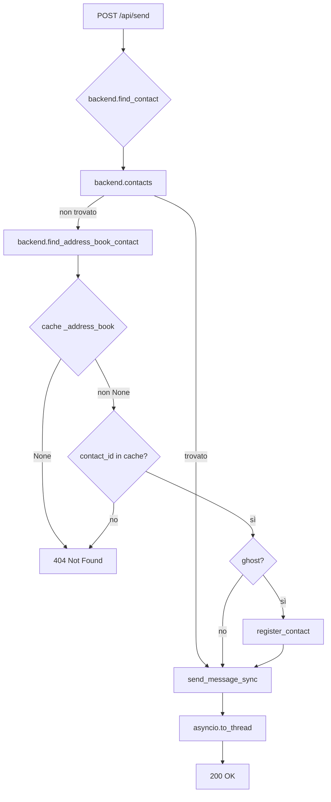

# Design: Web Send — Address Book Fix (v2.3)

**Stato:** revisione v2.3 (fix B1 post-review tester)  
**File:** `web/api.py`, `protocols/base.py`, `protocols/manager.py`, `protocols/{signal,whatsapp,telegram}.py`  
**Scopo:** permettere l'invio via web a contatti presenti **solo in rubrica** (non in `self.contacts`), senza regressione su chat attive, senza I/O di rete bloccante sull'event loop, senza race condition.

---

## Changelog

### v2.3 (fix B1 — retry alias `@lid`)

- **[B1] Alias `@lid` non ritentato:** `/api/send` invocava `register_contact` solo se il contatto non era già in `backend.contacts`. Dopo il primo invio il ghost è registrato, quindi il secondo invio non rieseguiva `_register_lid_alias` e, con cache LID vuota al primo invio, l'alias restava assente per sempre. Ora `/api/send` ritenta la registrazione per un **ghost già noto** (`extras["ghost"]`); l'alias via `_register_lid_alias` (`setdefault`, zero rete) viene così creato al secondo invio. Le chat attive (non-ghost) restano escluse. Aggiornati §3.3, §6.4, test §5.5.

### v2.2 (revisione red team — bloccante RB6)

- **[RB6] Contratto id incoerente:** `find_address_book_contact` **NON riscrive più `contact.id`** da `@c.us` a `@lid`. Ritorna il contatto con l'id del client (`@c.us`). Invio, registrazione e `push_event` restano su `contact_id` (id client). Per la continuità degli eventi `@lid`, WhatsApp registra un **alias** in `_contacts_by_jid[@lid]` che punta allo stesso oggetto del contatto `@c.us`, senza cambiare `contact.id`. Nessuna modifica frontend. Allineati §2.1, §3.1, §3.3, §3.4, §4, §6.4, §7.
- **[NB8] `_phone_to_lid` applica TTL:** `_phone_to_lid` ora applica lo stesso TTL di `_lid_lookup` (`whatsapp.py:923-925`) per evitare mapping scaduti. Test §5.2 aggiornato.
- **[NB9] `import threading` mancante:** aggiunto in `protocols/base.py` (righe 15-21) per `_register_lock`.
- **[NB10] Claim lock impreciso:** corretto "il lock copre l'intero template method" → il lock copre solo `base.register_contact`; gli override aggiornano gli indici fuori dal lock (gate `bool`).
- **[NB11] Ghost ri-marcato "attivo":** dopo `register_contact` il ghost entra in `self.contacts`; al successivo `list_address_book_sync` WA lo tratta come chat (`whatsapp.py:818-825`) e Telegram come dialogo (`telegram.py:989-1005`). Cosmetico/eredità TUI, dichiarato (§6.7).
- **[NB12] `list_contacts` Signal:** precisato §1.1: per Signal `self.contacts` = intera rubrica (`signal.py:431-433,485`), non solo chat attive. Vale per WhatsApp/Telegram.
- **[NB13] I/O disco `_lid_cache_load`:** confermato (§2.1, §6.6).

### v2.1 (revisione red team — residui RB2–RB5)

- **[RB2] `_register_lock` non inizializzato:** `ChatBackend` non ha `__init__`; i backend (`signal.py:271`, `whatsapp.py:179`, `telegram.py:248`) e i test double (`tests/test_address_book.py:49`, `tests/test_backends.py:37`, `tests/test_edit_contract.py:33`, `tests/test_reactions_model.py:173`, `tests/test_web_plugin.py:823`) non chiamano `super().__init__()`. **Soluzione scelta:** lock di classe `_register_lock = threading.Lock()` su `ChatBackend` (opzione (a)). Zero modifiche a `__init__`, zero impatto su test esistenti.
- **[RB3] `_phone_to_lid` non thread-safe:** `_lid_map` è mutato sotto `_lid_lock` (`whatsapp.py:954-959,973-993`). Helper v2.1: snapshot sotto lock (`list(self._lid_map.items())`). Snapshot anche di `_address_book` (`book = self._address_book`). **Risoluzione `@c.us`→`@lid` integrata in `find_address_book_contact` WhatsApp** (non helper separato).
- **[RB4] `/api/send` non registra il contatto:** §3.3 ora include esplicitamente `backend.register_contact(contact)` prima del send, con `extras["ghost"]=True` per book-only. L'invio usa `contact.id` (id risolto, es. `@lid`), non il `contact_id` del client. §3.3, §4, §6.5 allineati.
- **[RB5] Override bypassano dedup:** `register_contact` ora ritorna `bool` (appended/no-op). Override Signal/WhatsApp/Telegram aggiornano indici (`_contacts_by_key`/`_contacts_by_jid`/`_contacts_by_id`) **solo se `True`**. Lock di classe copre l'intero template method.
- **[NB1] `_lid_cache_load` fa I/O disco:** dichiarato (§2.1). "Zero rete" regge; non è "zero I/O". Precaricamento opzionale in `connect()`.
- **[NB2] TOCTOU `_address_book`:** snapshot locale prima dell'iterazione (§3.1).
- **[NB3] Confronto `str(c.id) == contact_id`:** difensivo, mantiene robustezza.
- **[NB4] Signal `find_address_book_contact` ridondante:** dichiarato (§3.1). Signal address book = `self.contacts` (`signal.py:471-486,503-535`).
- **[NB5] `backend = manager.get(protocol)` già presente:** non duplicato nello snippet (§3.3).
- **[NB6] Fallback `@c.us` senza LID:** limite noto dichiarato (§6.4), testato (§5.6).
- **[NB7] Test senza assert temporali:** §5 aggiornato con assert deterministici (nessuna chiamata di rete/`list_address_book_sync`/`to_thread`).

### v2 (revisione red team — bloccanti B1–B5)

- **[B1] I/O bloccante:** adottata semplificazione **cache-only** → zero fetch di rete in `/send`. Lookup solo su cache in-memory già popolata da `/api/contacts/book`. Nessun `asyncio.to_thread` necessario per la lookup.
- **[B2] Timeout irrealizzabile:** eliminato il fetch → problema svanisce. Nessuna `ThreadPoolExecutor`, nessun `future.result(timeout=...)`.
- **[B3] 503 non implementabile:** `list_address_book_sync` non solleva mai (`whatsapp.py:865-869`, `telegram.py:981-983`, contratto `base.py:326-343`). Rimosso il ramo 503: se il backend è down ritorna `[]` o cache stale, la lookup dà 404. `address_book_errors` (mutabile condiviso e racy, `manager.py:89,107-114`) **non è più usato come segnale**.
- **[B4] Idempotenza/thread-safety:** `register_contact` (`base.py:352-355`) è check-then-act non atomico. Introdotto **dedup per `cache_key`** con lock di classe. `ChatContact.__eq__` (`models.py:247-268`) include `extras`, quindi due copie rubrica divergono → dedup esplicita.
- **[B5] WhatsApp `@c.us` ghost vs `@lid`:** strategia identità documentata (§3.4). Ghost `@c.us` → resolve a `@lid` dalla cache LID reverse (phone → @lid) se disponibile, altrimenti mantiene `@c.us` (il send funziona: `_resolve_send_chat_id` accetta entrambi, `whatsapp.py:1262-1270`). Marker `ghost` allineato a TUI (`tui/contacts.py:703`).
- **[N1] Accesso a `_address_book` privato:** introdotto metodo pubblico `find_address_book_contact(contact_id)` su `base.py`, implementato dai 3 backend. Signal: address book = `self.contacts` (`signal.py:471-486,503-535`), metodo banale.
- **[N2] Contraddizione cache stale:** semantica fissata (§3.2). Cache stale (`_address_book is not None`) è utilizzabile; se `_address_book is None` (mai popolata) → 404.
- **[N3] Test:** sezione §5 aggiornata con timeout, assenza I/O, concorrenza, regressione chat attiva, WhatsApp `@c.us`/`@lid`.
- **[N4] Rate limiting:** fuori scope (dichiarato in §6).
- **[N5] `address_book_errors`:** non usato come segnale (solo diagnostico).
- **[N6] Snippet UI:** confermato corretto (`app.js:160-164`).

### v1 (respinta)

- Design iniziale con fetch sincrono in `/send`, timeout 3s, ramo 503. Bloccanti B1-B5.

---

## 1. Contesto e problema

### 1.1 Stato attuale

L'endpoint `POST /api/send` (`web/api.py:1110`) valida il `contact_id` contro `manager.list_contacts()` (`web/api.py:1255-1260`), che ritorna `self.contacts` di ogni backend. Per **WhatsApp/Telegram** `self.contacts` contiene solo le **chat attive** (dialoghi/conversazioni); per **Signal** `self.contacts` contiene l'**intera rubrica** (`signal.py:431-433,485`). Un contatto presente **solo in rubrica** (es. utente WhatsApp mai chattato) viene rifiutato con 404 su WhatsApp/Telegram.

La rubrica completa è accessibile via `GET /api/contacts/book` (`web/api.py:1413-1425`), che chiama `manager.list_address_book_sync(force=False)` (`web/api.py:1424`). Questo popola la cache `_address_book` in-memory di ogni backend (`whatsapp.py:863`, `telegram.py:1020`, `signal.py:533`).

### 1.2 Obiettivo

Permettere l'invio a contatti in rubrica (non solo chat attive) **senza**:
- I/O di rete bloccante sull'event loop (B1);
- timeout irrealizzabili (B2);
- rami 503 non implementabili (B3);
- race condition o duplicati (B4);
- ambiguità identità WhatsApp `@c.us`/`@lid` (B5).

### 1.3 Semplificazione adottata

**Cache-only lookup.** Nel web UI un contatto book-only è raggiungibile **solo tramite ricerca** (`app.js:2724-2743`), che chiama `/api/contacts/book` (`app.js:2739`) → popola la cache `_address_book`. Quindi la validazione in `/send` può essere **cache-only, zero rete**:

1. cerca in `backend.contacts` (chat attive);
2. cerca nella **cache rubrica in-memory** del backend (già popolata dalla ricerca);
3. se non trovato → 404.

**Limiti:**
- Se la cache non è mai stata popolata (`_address_book is None`), un invio via API diretta (senza ricerca preventiva) dà 404. **Accettabile:** il flusso UI normale passa sempre dalla ricerca.
- Cache stale (TTL scaduto, `get_address_book_ttl_s` default 300s, `config.py:287-289`) è utilizzabile (§3.2).

---

## 2. Algoritmo cache-only

### 2.1 Flusso `/api/send`

```
POST /api/send {protocol, contact_id, text, ...}
  │
  ├─ validazione payload (web/api.py:1161-1249)
  │
  ├─ backend = manager.get(protocol)  ← già presente (web/api.py:1252-1254)
  │   └─ se None → 404
  │
  ├─ contact = backend.find_contact(contact_id)  ← NUOVO METODO (§3.2)
  │   ├─ cerca in backend.contacts (chat attive per WA/TG, rubrica per Signal)
  │   ├─ se non trovato, cerca in backend.find_address_book_contact(contact_id)
  │   └─ se non trovato → 404
  │
  ├─ se contact trovato e non in self.contacts (ghost):
  │   ├─ contact.extras["ghost"] = True
  │   ├─ backend.register_contact(contact)  ← REGISTRA (§3.3, §3.5)
  │   └─ [WhatsApp only] se contact.id è @c.us e LID disponibile:
  │       └─ backend._contacts_by_jid[lid] = contact  ← ALIAS (§3.4)
  │
  └─ await asyncio.to_thread(manager.send_message_sync, protocol, contact_id, text, ...)
      ← usa contact_id del client (NON contact.id)
```

**Nessun I/O di rete** nella lookup. `find_contact` e `find_address_book_contact` sono **sync e non bloccanti** (solo lookup in-memory).

**Nota I/O disco:** `_lid_cache_load` (`whatsapp.py:880-898`) fa I/O su disco al primo accesso (lazy load da `CACHE_DIR/wa_lid_map.json`). Il claim "zero rete" regge; non è "zero I/O". Precaricamento opzionale in `connect()` se necessario.

### 2.2 Semantica cache stale

- `_address_book is not None` → cache utilizzabile (anche se TTL scaduto). La ricerca UI (`/api/contacts/book`) aggiorna la cache quando chiamata; se l'utente non ha mai cercato, la cache è `None` → 404.
- `_address_book is None` → 404 (nessun fallback, nessun fetch).

**Razionale:** il flusso UI normale passa sempre dalla ricerca prima dell'invio. Un client API diretto che salta la ricerca ottiene 404: comportamento coerente con "il contatto non è noto al sistema".

### 2.3 Nessun 503

`list_address_book_sync` non solleva mai (`base.py:326-343`, `whatsapp.py:865-869`, `telegram.py:981-983`). Il manager cattura errori in `address_book_errors` (`manager.py:89,107-114`), ma è mutabile condiviso e racy. **Non lo usiamo come segnale.** Se un backend è down, ritorna `[]` o cache stale → 404.

---

## 3. Contratti e API

### 3.1 Metodo pubblico `find_address_book_contact`

**Aggiungere a `protocols/base.py`** (dopo `list_address_book_sync`, ~riga 344):

```python
def find_address_book_contact(self, contact_id: str) -> ChatContact | None:
    """Cerca un contatto nella cache rubrica in-memory (zero rete, non zero I/O).

    Default: None (backend senza rubrica separata).
    Implementato da WhatsApp/Telegram. Signal: ridondante (address book = self.contacts).
    """
    return None
```

**Implementazioni:**

- **Signal** (`protocols/signal.py`, dopo `list_address_book_sync`, ~riga 535):
  ```python
  def find_address_book_contact(self, contact_id: str) -> ChatContact | None:
      # Signal: address book = self.contacts (signal.py:471-486,503-535)
      # Ridondante: find_contact cerca già in self.contacts.
      # Implementato per simmetria, ma non necessario.
      for c in self.contacts:
          if str(c.id) == contact_id:
              return c
      return None
  ```
  **Nota:** Signal non ha `_address_book` separato; `list_address_book_sync` ritorna `self.contacts` arricchito (`signal.py:519-535`). Quindi `find_address_book_contact` cerca direttamente in `self.contacts`.

- **WhatsApp** (`protocols/whatsapp.py`, dopo `list_address_book_sync`, ~riga 870):
  ```python
  def find_address_book_contact(self, contact_id: str) -> ChatContact | None:
      """Cerca un contatto nella cache rubrica.

      Ritorna il contatto con l'id del client (es. @c.us), NON riscrive l'id.
      La risoluzione @c.us → @lid avviene tramite alias in _contacts_by_jid (§3.4).
      """
      # Snapshot per evitare TOCTOU (resolver thread azzera _address_book, whatsapp.py:993)
      book = self._address_book
      if book is None:
          return None

      # Cerca il contatto nella cache rubrica
      for c in book:
          if str(c.id) == contact_id:
              return c  # Ritorna con id originale (es. @c.us)
      return None


  def _phone_to_lid(self, phone: str) -> str | None:
      """Reverse lookup: phone → @lid dalla cache LID (zero rete, non zero I/O).

      Thread-safe: snapshot di _lid_map sotto _lid_lock.
      Applica lo stesso TTL di _lid_lookup (whatsapp.py:923-925) per evitare
      mapping scaduti che _resolve_send_chat_id rifiuterebbe.
      """
      self._lid_cache_load()  # I/O disco al primo accesso
      with self._lid_lock:
          # Snapshot per evitare RuntimeError: dictionary changed size
          items = list(self._lid_map.items()) if self._lid_map else []

      now = int(time.time())
      ttl_seconds = get_wa_lid_cache_ttl_days() * 86400

      for lid_jid, entry in items:
          if isinstance(entry, dict):
              entry_phone = entry.get("phone")
              resolved_at = int(entry.get("resolved_at") or 0)
              # Applica TTL (come _lid_lookup, whatsapp.py:923-925)
              if entry_phone == phone and (now - resolved_at) <= ttl_seconds:
                  return lid_jid
      return None
  ```

- **Telegram** (`protocols/telegram.py`, dopo `list_address_book_sync`, ~riga 1031):
  ```python
  def find_address_book_contact(self, contact_id: str) -> ChatContact | None:
      # Snapshot per evitare TOCTOU
      book = self._address_book
      if book is None:
          return None
      for c in book:
          if str(c.id) == contact_id:
              return c
      return None
  ```

### 3.2 Metodo `find_contact` su backend

**Aggiungere a `protocols/base.py`** (dopo `find_address_book_contact`):

```python
def find_contact(self, contact_id: str) -> ChatContact | None:
    """Cerca un contatto: prima in self.contacts (chat attive), poi in rubrica.
    
    Zero rete, non zero I/O (WhatsApp _lid_cache_load fa I/O disco).
    """
    # 1. Chat attive
    for c in self.contacts:
        if str(c.id) == contact_id:
            return c
    # 2. Rubrica (cache in-memory)
    return self.find_address_book_contact(contact_id)
```

**Override in Signal/WhatsApp/Telegram:** non necessario (default basta).

### 3.3 Endpoint `/api/send` aggiornato

**Modificare `web/api.py:1255-1260`:**

```python
# Vecchio (web/api.py:1255-1260):
known_contact = any(
    str(contact.id) == contact_id and str(contact.protocol) == protocol
    for contact in manager.list_contacts()
)
if not known_contact:
    raise HTTPException(status_code=404, detail="Not Found")

# Nuovo:
backend = manager.get(protocol)  # già presente (web/api.py:1252-1254), non duplicare
if backend is None:
    raise HTTPException(status_code=404, detail="Not Found")

contact = backend.find_contact(contact_id)
if contact is None:
    raise HTTPException(status_code=404, detail="Not Found")

# Registra il contatto se ghost (non ancora in self.contacts).
is_known = any(str(c.id) == contact.id for c in backend.contacts)
if not is_known:
    contact.extras["ghost"] = True
    backend.register_contact(contact)
elif contact.extras.get("ghost"):
    # Ghost già noto: ritenta la registrazione, così WhatsApp riprova l'alias
    # @lid se la cache si è popolata dopo il primo invio (§6.4).  Idempotente.
    backend.register_contact(contact)

# Usa contact_id del client (NON contact.id) per send, push, allegati
# (passato a send_message_sync, web/api.py:1344-1350)
```

**Nessun `asyncio.to_thread`** per la lookup: `find_contact` è sync e non bloccante.

**Nota:** il `contact_id` passato a `send_message_sync` (`web/api.py:1344-1350`), `send_attachments_sync` (`web/api.py:1329-1332`), e `push_event` (`web/api.py:1371-1380`) **resta `contact_id` del client** (es. `@c.us`), NON viene sostituito con `contact.id`. Questo mantiene coerenza con il frontend (`state.active.id`, `app.js:2502-2505,373-375,437-439`).

### 3.4 Strategia identità WhatsApp `@c.us`/`@lid`

**Problema (B5/RB6):** il ghost book-only ha id `{phone}@c.us` (`whatsapp.py:785`); la chat reale può essere `@lid`. Se si riscrive `contact.id` da `@c.us` a `@lid`, si crea incoerenza con:
- `manager.send_attachments_sync(..., contact_id, ...)` (`web/api.py:1329-1332`) — resta l'id client;
- `push_event(... "contact_id": contact_id ...)` (`web/api.py:1371-1380`) — resta l'id client;
- il frontend: `state.active.id` è l'id della ricerca (`@c.us`), il match WS è su `update.payload.contact_id` (`app.js:2502-2505`), `renderContacts` fa `unshift(state.active)` per id (`app.js:373-375`), `loadContacts` riassegna `state.active` solo se trova l'id (`app.js:437-439`).

Risultato: due voci in sidebar (`@c.us` + `@lid`), push che ricarica `@c.us` mentre la riga reale è sotto `@lid` → a reload il messaggio non compare nella conversazione attiva.

**Strategia (Opzione A — adopted):**

1. **`find_address_book_contact` NON riscrive `contact.id`.** Ritorna il contatto con l'id del client (`@c.us`). Invio, registrazione e `push_event` restano su `contact_id` (id client).

2. **Alias `@lid` → contatto `@c.us`.** Dopo `register_contact`, se il contatto è `@c.us` e `_phone_to_lid(phone)` ritorna un `@lid`, registra un **alias** in `_contacts_by_jid[@lid]` che punta **allo stesso oggetto** del contatto `@c.us`. Così `_identify_contact(@lid)` trova il ghost senza creare placeholder duplicati.

3. **Marker `ghost`:** allineato a TUI (`tui/contacts.py:703`). Quando `find_contact` ritorna un contatto da `find_address_book_contact` (non da `self.contacts`), `/api/send` lo marca `extras["ghost"] = True` (§3.3).

4. **Dedup:** `register_contact` (§3.5) previene duplicati in `self.contacts`.

5. **Limite noto:** fallback `@c.us` senza LID in cache reverse → possibile identità transitoria separata al primo evento `@lid`. Accettabile: il resolver background (`whatsapp.py:962-995`) aggiorna la cache, e il secondo invio creerà l'alias. Testato (§5.5).

**Test:** §5.5.

### 3.5 `register_contact` idempotente con dedup

**Modificare `protocols/base.py:352-355`:**

```python
# Lock di classe (non istanza) per evitare __init__ e modifiche ai test double
_register_lock = threading.Lock()


def register_contact(self, contact: ChatContact) -> bool:
    """Rende il contatto noto al backend (lookup per eventi/invio).

    Idempotente: dedup per cache_key (non per __eq__, che include extras).
    Thread-safe: lock di classe (copre solo base.register_contact).

    Returns:
        True se il contatto è stato aggiunto (appended).
        False se già presente (no-op).
    """
    with ChatBackend._register_lock:
        for existing in self.contacts:
            if existing.cache_key == contact.cache_key:
                return False  # già presente
        self.contacts.append(contact)
        return True  # aggiunto
```

**Nota:** il lock copre solo `base.register_contact`; gli override Signal/WhatsApp/Telegram aggiornano gli indici (`_contacts_by_key`/`_contacts_by_jid`/`_contacts_by_id`) **fuori dal lock**, ma solo se `appended == True`. L'esito è corretto grazie al gate `bool`.

**Override in Signal** (`protocols/signal.py:491-499`):

```python
def register_contact(self, contact: ChatContact) -> bool:
    """Registra un contatto (open-or-create) anche nella lookup cache_key→contact.
    
    Oltre all'append in ``self.contacts`` (default di ``ChatBackend``),
    aggiorna ``_contacts_by_key`` (popolato in ``_set_contacts``) così il
    ghost è risolvibile per cache key come gli altri contatti.
    """
    appended = super().register_contact(contact)
    if appended:
        self._contacts_by_key[contact.cache_key] = contact
    return appended
```

**Override in WhatsApp** (`protocols/whatsapp.py:746-754`):

```python
def register_contact(self, contact: ChatContact) -> bool:
    """Registra un contatto (open-or-create) anche nella lookup JID→contact.
    
    Oltre all'append in ``self.contacts`` (default di ``ChatBackend``),
    aggiorna ``_contacts_by_jid`` così ``_identify_contact`` e il webhook
    riconoscono subito il ghost senza creare placeholder duplicati.
    """
    appended = super().register_contact(contact)
    if appended:
        self._contacts_by_jid[contact.id] = contact
    return appended
```

**Override in Telegram** (`protocols/telegram.py:881-893`):

```python
def register_contact(self, contact: ChatContact) -> bool:
    """Registra un contatto (open-or-create) anche nella lookup id→contact.
    
    Oltre all'append in ``self.contacts`` (default di ``ChatBackend``),
    estende ``_contacts_by_id`` così ``_identify_contact`` e il fallback di
    invio (``_resolve_input_entity``) riconoscono il ghost.  Un id non
    intero viene ignorato (guard ``ValueError``/``TypeError``).
    """
    appended = super().register_contact(contact)
    if appended:
        try:
            self._contacts_by_id[int(contact.id)] = contact
        except (ValueError, TypeError):
            pass
    return appended
```

**Nota:** `ChatContact.__eq__` (`models.py:247-268`) include `extras`, quindi due copie rubrica divergono. Dedup per `cache_key` (`models.py:270-273`) risolve il problema.

---

## 4. Diagramma architetturale



**Nessun I/O di rete** nel percorso A→D. `asyncio.to_thread` solo per `send_message_sync` (pattern esistente, `web/api.py:1344-1350`).

---

## 5. Test

### 5.1 Unit test: `find_contact` e `find_address_book_contact`

- **Signal:** `find_contact` cerca in `self.contacts` (address book = contacts).
- **WhatsApp:** `find_contact` cerca in `self.contacts`, poi in `self._address_book`.
- **Telegram:** idem.
- **Cache `None`:** `find_address_book_contact` ritorna `None` → 404.

### 5.2 Test: assenza I/O di rete nell'invio

- Mock `list_address_book_sync` per verificare che **non venga chiamato** durante `/send`.
- Mock `_lid_resolve_remote` per verificare che **non venga chiamato** durante `/send`.
- Assert: nessun `ThreadPoolExecutor`, nessun `future.result`, nessun `asyncio.to_thread` per la lookup.
- Assert: `_phone_to_lid` applica il TTL (mapping scaduto → `None`).
- **Nessun assert temporale** (flaky in CI): usa "nessuna chiamata di rete" come prova deterministica.

### 5.3 Test: concorrenza e dedup

- Due thread chiamano `register_contact` con lo stesso `cache_key` → solo un append.
- Assert: `len(backend.contacts)` invariato dopo doppia registrazione.
- Assert: `register_contact` ritorna `True` al primo chiamata, `False` alla seconda.

### 5.4 Test: regressione chat attiva

- Contatto in `self.contacts` → `find_contact` lo trova **senza** chiamare `find_address_book_contact`.
- Mock `find_address_book_contact` → assert **non chiamato**.
- Assert: `register_contact` **non chiamato** per chat attive.

### 5.5 Test: WhatsApp `@c.us`/`@lid`

- Ghost `@c.us` con phone `X` e LID in cache → `find_address_book_contact` ritorna contatto con id `@c.us` (NON `@lid`).
- Dopo `register_contact`, `_contacts_by_jid[@lid]` punta allo stesso oggetto `@c.us`.
- `_identify_contact(@lid)` ritorna il contatto `@c.us` (stesso oggetto).
- Ghost `@c.us` con phone `X` senza LID in cache → `find_address_book_contact` ritorna `@c.us`, nessun alias creato.
- Assert: nessun duplicato in `self.contacts` dopo `register_contact`.
- Assert: `_phone_to_lid` thread-safe (snapshot sotto `_lid_lock`) e applica TTL.
- Assert: `contact_id` del client (es. `@c.us`) usato per send, push, allegati (NON `contact.id`).

### 5.6 Test: cache stale utilizzabile

- `_address_book` popolata, TTL scaduto → `find_address_book_contact` ritorna contatto (cache stale OK).
- `_address_book is None` → 404.

### 5.7 Test: `register_contact` ritorna `bool`

- Prima chiamata → ritorna `True`, contatto aggiunto.
- Seconda chiamata (stesso `cache_key`) → ritorna `False`, contatto non duplicato.
- Override Signal/WhatsApp/Telegram: indici (`_contacts_by_key`/`_contacts_by_jid`/`_contacts_by_id`) aggiornati solo se `True`.

---

## 6. Decisioni di prodotto

### 6.1 Rate limiting

**Fuori scope.** Il design non introduce rate limiting su `/api/send`. Se necessario, aggiungere middleware separato (es. `slowapi`).

### 6.2 Cache stale

**Utilizzabile.** Se `_address_book is not None`, la cache è usata anche se TTL scaduto. La ricerca UI aggiorna la cache quando chiamata.

### 6.3 404 vs 503

**Solo 404.** Nessun ramo 503: `list_address_book_sync` non solleva mai, e `address_book_errors` non è affidabile.

### 6.4 WhatsApp `@c.us`/`@lid`

**Alias, non resolve.** `find_address_book_contact` ritorna il contatto con l'id del client (`@c.us`). Dopo `register_contact`, se `_phone_to_lid(phone)` ritorna un `@lid`, registra un alias in `_contacts_by_jid[@lid]` che punta allo stesso oggetto `@c.us`. Invio, push e allegati usano `contact_id` del client.

**Retry dell'alias (fix B1).** L'alias è tentato a ogni `register_contact`: il backend WhatsApp invoca `_register_lid_alias` anche quando il contatto è già noto (`setdefault`, quindi idempotente e senza sovrascrivere un mapping reale preesistente), con risoluzione cache-only (zero rete). `/api/send` ritenta la registrazione anche per un **ghost già noto** (`extras["ghost"]`), non solo al primo inserimento: se la cache LID era vuota al primo invio, il **secondo invio** (a cache popolata dal resolver background) crea l'alias. Per una **chat attiva** (non-ghost) `register_contact` continua a non essere chiamato.

**Limite residuo:** al primo evento `@lid` che precede il popolamento della cache e un successivo invio, può esistere un'identità transitoria separata; il resolver background aggiorna la cache e il secondo invio riconcilia l'alias.

### 6.5 Marker `ghost`

**Allineato a TUI.** `extras["ghost"] = True` per contatti book-only non ancora in `self.contacts`. Registrati via `register_contact` prima del send.

### 6.6 I/O disco vs rete

**Zero rete, non zero I/O.** `_lid_cache_load` (`whatsapp.py:880-898`) fa I/O su disco al primo accesso (lazy load). Precaricamento opzionale in `connect()` se necessario.

### 6.7 Ghost ri-marcato "attivo"

**Cosmetico/eredità TUI.** Dopo `register_contact` il ghost entra in `self.contacts`; al successivo `list_address_book_sync` WhatsApp lo tratta come chat (`whatsapp.py:818-825`) e Telegram come dialogo (`telegram.py:989-1005`). Il marker `ghost` resta in `extras`, ma `is_chat_active` diventa `True`. Comportamento coerente con TUI; nessuna azione richiesta.

---

## 7. Riepilogo modifiche

| File | Modifica | Righe |
|------|----------|-------|
| `protocols/base.py` | Aggiungere `import threading`, `find_address_book_contact`, `find_contact`, `_register_lock` (classe), `register_contact` → `bool` | 15-21, ~344, ~352, ~43 |
| `protocols/signal.py` | Implementare `find_address_book_contact`, override `register_contact` → `bool` | ~535, ~491 |
| `protocols/whatsapp.py` | Implementare `find_address_book_contact`, `_phone_to_lid` (con TTL), override `register_contact` → `bool` | ~870, ~926, ~746 |
| `protocols/telegram.py` | Implementare `find_address_book_contact`, override `register_contact` → `bool` | ~1031, ~881 |
| `web/api.py` | Aggiornare `/api/send` per usare `find_contact`, `register_contact`, alias WhatsApp | 1255-1260 |

**Nessuna modifica a `manager.py`** (la logica è spostata sui backend).  
**Nessuna modifica a `send_message_sync`/`send_attachments_sync`/`push_event`** (restano su `contact_id` del client).

---

## 8. Rischi e mitigazioni

| Rischio | Mitigazione |
|---------|-------------|
| Cache mai popolata → 404 per API diretta | Accettabile: flusso UI normale passa da ricerca |
| Cache stale → contatto rimosso | Utente può forzare refresh via UI (ricerca) |
| Race condition `register_contact` | Lock di classe (`_register_lock`) (§3.5) |
| WhatsApp `@c.us`/`@lid` ambiguo | Alias `_contacts_by_jid[@lid]` → contatto `@c.us` (§3.4) |
| Duplicati in `self.contacts` | Dedup per `cache_key` (§3.5) |
| TOCTOU `_address_book` (resolver thread azzera) | Snapshot locale prima dell'iterazione (§3.1) |
| `_phone_to_lid` non thread-safe | Snapshot `_lid_map` sotto `_lid_lock` (§3.1) |
| `_phone_to_lid` TTL scaduto | Applica stesso TTL di `_lid_lookup` (§3.1) |
| `_lid_cache_load` I/O disco | Dichiarato (§6.6); precaricamento opzionale |
| Override bypassano dedup | `register_contact` ritorna `bool`; indici aggiornati solo se `True` (§3.5) |
| Identità transitoria `@c.us`/`@lid` al primo evento | Limite noto (§6.4); resolver background aggiorna cache |
| Ghost ri-marcato "attivo" | Cosmetico/eredità TUI (§6.7); nessuna azione richiesta |

---

## 9. Riferimenti

- `web/api.py:1110` — endpoint `/api/send`
- `web/api.py:1252-1254` — `backend = manager.get(protocol)` (già presente)
- `web/api.py:1255-1260` — validazione `contact_id` (da modificare)
- `web/api.py:1329-1332` — `send_attachments_sync` (resta su `contact_id` client)
- `web/api.py:1344-1350` — `send_message_sync` (resta su `contact_id` client)
- `web/api.py:1371-1380` — `push_event` (resta su `contact_id` client)
- `web/api.py:1413-1425` — endpoint `/api/contacts/book`
- `protocols/base.py:15-21` — import (aggiungere `threading`)
- `protocols/base.py:43-50` — `ChatBackend` (aggiungere `_register_lock` di classe)
- `protocols/base.py:326-343` — contratto `list_address_book_sync`
- `protocols/base.py:352-355` — `register_contact` (da modificare: `bool`, dedup)
- `protocols/manager.py:79-115` — `list_address_book_sync` (non modificato)
- `protocols/signal.py:271` — `SignalBackend.__init__` (non modificato)
- `protocols/signal.py:431-433,485` — Signal `self.contacts` = intera rubrica
- `protocols/signal.py:471-486,503-535` — Signal address book = `self.contacts`
- `protocols/signal.py:491-499` — `register_contact` override (da modificare)
- `protocols/whatsapp.py:179` — `WhatsAppBackend.__init__` (non modificato)
- `protocols/whatsapp.py:746-754` — `register_contact` override (da modificare)
- `protocols/whatsapp.py:761-870` — WhatsApp `list_address_book_sync`
- `protocols/whatsapp.py:818-825` — merge rubrica/chat (ghost → attivo)
- `protocols/whatsapp.py:880-898` — `_lid_cache_load` (I/O disco)
- `protocols/whatsapp.py:923-925` — `_lid_lookup` TTL
- `protocols/whatsapp.py:954-959,973-993` — `_lid_map` mutato sotto `_lid_lock`
- `protocols/whatsapp.py:993` — resolver thread azzera `_address_book`
- `protocols/whatsapp.py:1262-1270` — `_resolve_send_chat_id` (accetta `@c.us` e `@lid`)
- `protocols/telegram.py:248` — `TelegramBackend.__init__` (non modificato)
- `protocols/telegram.py:881-893` — `register_contact` override (da modificare)
- `protocols/telegram.py:958-1031` — Telegram `list_address_book_sync`
- `protocols/telegram.py:989-1005` — merge rubrica/dialoghi (ghost → attivo)
- `models.py:247-273` — `ChatContact` e `cache_key`
- `tui/contacts.py:680-708` — marker `ghost` (TUI)
- `web/static/app.js:373-375` — `renderContacts` match per id
- `web/static/app.js:437-439` — `loadContacts` riassegna `state.active`
- `web/static/app.js:2502-2505` — match WS su `update.payload.contact_id`
- `web/static/app.js:2724-2743` — ricerca UI (popola cache)
- `protocols/config.py:287-289` — TTL address book (default 300s)
- `protocols/config.py:292-294` — TTL LID cache (default 30 giorni)
- `tests/test_address_book.py:49` — `_MinimalBackend.__init__` (non modificato)
- `tests/test_backends.py:37` — `_MinimalBackend.__init__` (non modificato)
- `tests/test_edit_contract.py:33` — `_MinimalBackend.__init__` (non modificato)
- `tests/test_reactions_model.py:173` — `_MinimalBackend.__init__` (non modificato)
- `tests/test_web_plugin.py:823` — `_SingleSendBackend.__init__` (non modificato)
