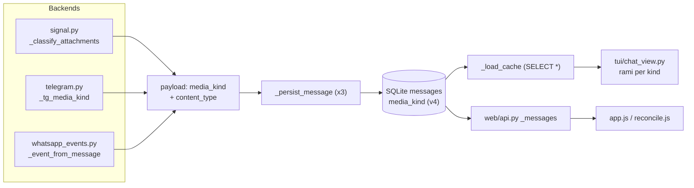

# DESIGN: Tassonomia media normalizzata (`media_kind`)

Stato: **proposto** — pronto per implementazione a fasi.
Scope: riconoscere e gestire i tipi di allegato in modo uniforme su Signal,
WhatsApp e Telegram, in ricezione (TUI + web) e in invio (web).

---

## 0. Stato attuale e gap

| Backend | Punto di classificazione | Gap |
|---|---|---|
| Signal | `_classify_attachments` (`backends/signal.py:849-873`) | Solo 3 classi (image / video+audio+altro come `attachment`); niente distinzione voice/audio, gif, document. `content_type` sempre presente ma sotto-usato. |
| Telegram | `_message_to_chat_event` (`backends/telegram.py:1292-1319`) | I rami `sticker`/`video`/`voice`/`audio` (1308-1319) sono **irraggiungibili**: Telethon rappresenta tutto come `MessageMediaDocument` e l'`elif msg.document` (1300) viene prima. `content_type` mai valorizzato. |
| WhatsApp | `_event_from_message` (`backends/whatsapp_events.py:409-491`) + `_msg_type` (42-52) | Solo image/attachment/sticker; niente voice (`ptt`), gif (`gifPlayback`), video vs document. `content_type` quasi mai persistito (`_persist_message` `backends/whatsapp.py:1806-1829` non lo passa). |
| Invio web | `web/uploads.py`, `web/api.py:983-1208` | Solo immagini (png/jpeg/gif/webp, ≤20MB, magic bytes). WA invia tutto via `send_image` (`backends/whatsapp.py:1355`). |

Vincoli acquisiti dal codice (da non rompere):

- **Dedup**: i testi sintetici `"<Label>: <att_id>"` (Signal, `signal.py:907+`) e
  `"Media: <identity>"` (WA, `whatsapp_events.py:563`) sono identità funzionali
  usate da `_add_message_to_cache` (`backend/db.py:316-334`) e da
  `_seen_message_ids` (`tui/chat_view.py:1413-1421`). **Il testo sintetico resta
  byte-identico**: `media_kind` è metadato additivo.
- `msg_type` ∈ {`text`,`image`,`sticker`,`attachment`} è consumato da TUI, web
  (`reconcile.js:63-73`), quote placeholder (`models.py:66-72`). Resta invariato
  come campo; `media_kind` lo **raffina**, non lo sostituisce.

---

## 1. Tassonomia

### 1.1 Valori

Nuovo campo logico **`media_kind`** (stringa, chiusa), `NULL` ⇔ messaggio senza media.

**Nucleo v1** (riconoscibile in modo affidabile su tutti e 3 i backend):

| `media_kind` | Signal | Telegram | WhatsApp | Reso come |
|---|---|---|---|---|
| `image` | `contentType` `image/*` (≠ gif) | `msg.photo` oppure document con mime `image/*` | `imageMessage` / mime `image/*` | immagine inline |
| `gif` | `contentType == image/gif` | `DocumentAttributeAnimated` (o mime `image/gif`) | `videoMessage.gifPlayback == true` / mime `image/gif` | immagine inline (1º frame) + badge GIF |
| `video` | `contentType` `video/*` | `DocumentAttributeVideo` (non round) | `videoMessage` / mime `video/*` | placeholder 🎬 + open |
| `voice` | attachment `voiceNote == true` | `DocumentAttributeVoice` (o `DocumentAttributeAudio` con `voice=True`) | `audioMessage.ptt == true` | placeholder 🎤 + open |
| `audio` | `contentType` `audio/*` (non voiceNote) | `DocumentAttributeAudio` (non voice) | `audioMessage` (`ptt` falsy) / mime `audio/*` | placeholder 🎵 + open |
| `document` | qualunque altro `contentType` | document senza attributi media | `documentMessage` / mime altro | placeholder 📎 + open |
| `sticker` | `_extract_sticker` (envelope `sticker`) | `DocumentAttributeSticker` | `stickerMessage` | immagine se scaricabile, altrimenti placeholder 🎨 |

**Estensioni v2** (fuori scope v1, tassonomia già riservata):

| `media_kind` | Signal | Telegram | WhatsApp |
|---|---|---|---|
| `video_note` | — | `DocumentAttributeVideo` con `round_message=True` | — |
| `contact` | — | `MessageMediaContact` | `contactMessage` |
| `location` | — | `MessageMediaGeo/GeoLive/Venue` | `locationMessage` |
| `link_preview` | `dataMessage.previews[]` | `MessageMediaWebPage` | URL + `canonicalUrl` WAHA |

### 1.2 Affidabilità del nucleo v1

- **Signal: totale.** signal-cli emette sempre `contentType` e, per le note
  vocali, il flag booleano `voiceNote` sull'attachment (verificare il nome
  esatto sul payload JSON-RPC della versione in uso: `att.get("voiceNote")`).
  Unico caso speciale: sticker **non scaricabile** (nessun `attachment_id`,
  `signal.py:875-882`) → resta placeholder testuale, comportamento invariato.
- **Telegram: totale**, purché si ispezionino gli attributi del documento
  (Telethon espone classi TL distinte per sticker/animated/video/voice/audio)
  invece delle property `msg.sticker/video/...` (tutte document).
  `msg.document.mime_type` fornisce anche il `content_type` persistibile.
- **WhatsApp: alta nelle forme nested e attachments; degradata nella forma
  flat `hasMedia`** (`whatsapp_events.py:471-491`): lì c'è solo
  `media.mimetype` → gif e voice indistinguibili da video/audio.
  Accettato: flat-form ⇒ `video`/`audio` (migliora alla prossima
  `fetch_history` se WAHA consegna la forma nested).

### 1.3 Mapping di compatibilità `media_kind → msg_type`

Regola fissa, applicata dai backend al momento della classificazione:

| `media_kind` | `msg_type` |
|---|---|
| `image`, `gif` | `image` |
| `sticker` | `sticker` |
| `video`, `voice`, `audio`, `document` | `attachment` |

Motivazione: `gif` come `image` rende inline ovunque senza toccare i consumer
esistenti (Pillow/kitty mostrano il primo frame); il badge/azione "GIF" deriva
da `media_kind`. Inversione (per righe legacy senza `media_kind`): vedi §4.1.

---

## 2. Dove calcolarlo

### 2.0 Helper condivisi — `models.py`

Aggiungere in `models.py` (nessuna dipendenza nuova, coerente con il modulo):

```python
# ─── Media kinds ─────────────────────────────────────────────
MEDIA_KIND_VALUES = frozenset(
    {"image", "gif", "video", "voice", "audio", "document", "sticker"}
)


def media_kind_from_mime(
    mime: str | None, *, is_gif=False, is_voice=False
) -> str | None:
    """Map a mime type (+ protocol hints) to a ``media_kind``. None se vuoto."""
    m = (mime or "").lower().split(";", 1)[0].strip()
    if not m:
        return None
    if m == "image/gif" or is_gif:
        return "gif"
    if m.startswith("image/"):
        return "image"
    if m.startswith("video/"):
        return "video"
    if m.startswith("audio/"):
        return "voice" if is_voice else "audio"
    return "document"


def msg_type_for_media_kind(kind: str) -> str:
    if kind in ("image", "gif"):
        return "image"
    if kind == "sticker":
        return "sticker"
    return "attachment"
```

I valori sono identici in Python, SQL e JS (contratto unico).

### 2.1 Signal — `backends/signal.py`

**`_classify_attachments` (849-873)**: la tupla ritornata passa da 4 a 5
elementi `(msg_type, info, att_id, content_type, media_kind)`:

```python
for att in attachments:
    content_type = att.get("contentType", "") or ""
    ct = content_type or None
    is_voice = bool(att.get("voiceNote"))
    kind = media_kind_from_mime(content_type, is_voice=is_voice) or "document"
    msg_type = msg_type_for_media_kind(kind)
    # info: caption > filename con prefisso per kind > placeholder tipizzato
```

Le etichette `info` restano costruite come oggi (caption prioritaria); il
fallback per kind usa i placeholder già canonici in
`MEDIA_QUOTE_PLACEHOLDERS` (`🎬 Video`, `🎵 Audio`, `📎 File`) così il testo
sintetico `"<Label>: <att_id>"` non cambia forma.

**`_extract_sticker` (875-882)**: invariato; il dict risultante porta
`media_kind="sticker"` (msg_type già `sticker`).

**`_build_msg_dicts` (884+)**: propaga `media_kind` in ogni dict; il suffisso
di unicità `": att_id"` e l'assegnazione del body al primo dict **restano
identici** (vincolo dedup, §7.1).

**`_persist_message` (1374-1400)**: aggiungere
`media_kind=data.get("media_kind")` alla chiamata a `_add_message_to_cache`.

### 2.2 Telegram — `backends/telegram.py`

Nuovo helper module-level (vicino a `_media_ref`, ~riga 228), duck-typing sul
**nome classe** degli attributi (funziona con oggetti TL reali e con i fake
nominati dei test, senza import obbligatori):

```python
def _tg_media_kind(msg) -> tuple[str | None, str | None, str | None]:
    """Return (media_kind, filename, mime) per un Message Telethon."""
    if msg.photo:
        return "image", None, "image/jpeg"
    doc = getattr(msg, "document", None)
    if doc is None:
        return None, None, None
    mime = (getattr(doc, "mime_type", "") or "").lower()
    filename = sticker = animated = video = voice = audio = None or False
    for attr in getattr(doc, "attributes", None) or []:
        name = type(attr).__name__
        if name == "DocumentAttributeFilename":
            filename = getattr(attr, "file_name", None) or filename
        elif name == "DocumentAttributeSticker":
            sticker = True
        elif name == "DocumentAttributeAnimated":
            animated = True
        elif name == "DocumentAttributeVideo":
            video = True
        elif name == "DocumentAttributeVoice":
            voice = True
        elif name == "DocumentAttributeAudio":
            if getattr(attr, "voice", False):
                voice = True
            else:
                audio = True
    if sticker:
        return "sticker", filename, mime
    if animated:
        return "gif", filename, mime
    if voice:
        return "voice", filename, mime
    if video:
        return "video", filename, mime
    if audio or mime.startswith("audio/"):
        return "audio", filename, mime
    kind = media_kind_from_mime(mime) or "document"
    return kind, filename, mime
```

**`_message_to_chat_event` (1292-1324)** — riscrivere la catena elif:

```python
kind, fname, mime = _tg_media_kind(msg)
if kind:
    msg_type = msg_type_for_media_kind(kind)
    attachment_info = text or _tg_label_for(kind, fname)  # caption prioritaria
    if kind != "image":
        text = "" if kind == "sticker" else text  # regole esistenti
    content_type = mime or None
```

- L'`elif msg.document` generico sparisce; i rami sticker/video/voice/audio
  diventano raggiungibili **via attributi**. Cambio deliberato di `msg_type`
  per gli sticker TG nuovi: `attachment` → `sticker` (§7.2).
- Il payload (1353-1368) guadagna `"media_kind": kind` e `"content_type":
  content_type` (oggi assenti).
- Il guard "messaggio vuoto" (1344-1351) resta valido: sticker/video/voice/
  audio restano `msg.document` truthy.
- Il fallback lazy `tgref:` (1321-1324) è invariato (copre già photo+document).

**`_persist_message` (1715-1739)**: aggiungere
`media_kind=data.get("media_kind")`.

### 2.3 WhatsApp — `backends/whatsapp_events.py` + `backends/whatsapp.py`

**`_event_from_message`** — le tre forme producono `media_items` estesi a
4-tuple `(att_id, att_info, att_type, media_kind, content_type)`:

1. **attachments array (418-438)**: `kind = media_kind_from_mime(mime)`;
   `content_type = mime or None`.
2. **nested `message.*Message` (441-468)**: per chiave:
   - `imageMessage` → `image`
   - `videoMessage` → `gif` se `media.get("gifPlayback")` else `video`
   - `audioMessage` → `voice` se `media.get("ptt")` else `audio`
   - `documentMessage` → `media_kind_from_mime(mime)` ma **mai** image/gif
     (un documento inviato "come file" resta `document`; WA stesso lo tratta
     così) → regola: `kind if kind not in {"image","gif"} else "document"`
   - `stickerMessage` → `sticker`
   `content_type = media.get("mimetype")`.
3. **flat hasMedia (470-491)**: `kind = media_kind_from_mime(mime)` con il
   degrado documentato in §1.2; `content_type = mime or None`.

Payload (561-586 e 599-622): aggiungere `"media_kind"` e `"content_type"`.

**`_msg_type` (42-52)**: invariato (resta il fallback grezzo).

**`whatsapp.py::_persist_message` (1806-1829)**: aggiungere
`content_type=data.get("content_type")` (oggi **non passato**: bug latente che
lascia `content_type` NULL) e `media_kind=data.get("media_kind")`.

**`whatsapp.py::enqueue_sent_message` (1370-1420)**: il mirror outgoing
classifica oggi solo image/attachment dal mime (1384-1390); aggiungere
`media_kind = media_kind_from_mime(mime_type)` e persistere
`content_type=mime_type` nel payload.

**`whatsapp.py::_upgrade_outgoing_attachment` (1831-1859)**: l'update in place
via `_update_message_media_identity` deve aggiornare anche `media_kind`
(§3.3).

### 2.4 Flusso end-to-end



---

## 3. Persistenza

### 3.1 Schema — `backend/db.py`

Decisione: **nuova colonna `media_kind TEXT` nullable** (non "garantire
`content_type`"): il mime è assente su gran parte dello storico WA/TG e non
codifica comunque voice/gif/sticker; una colonna dedicata è backfillabile,
indicizzabile in futuro e non richiede parsing a valle. `content_type` resta
complementare (quote thumbnail Signal, serving web).

- `_SCHEMA_VERSION`: `3 → 4` (`db.py:37`).
- In `_migrate_protocol_schema` (60-136), sezione sempre-eseguita:

```python
if "media_kind" not in columns:
    conn.execute("ALTER TABLE messages ADD COLUMN media_kind TEXT")
```

- Dopo il guard di versione, **backfill idempotente** (ogni statement ha
  `media_kind IS NULL` ⇒ rieseguibile senza danni):

```sql
-- sticker e gif: inequivocabili
UPDATE messages SET media_kind='sticker' WHERE media_kind IS NULL AND msg_type='sticker';
UPDATE messages SET media_kind='gif'     WHERE media_kind IS NULL AND content_type='image/gif';
UPDATE messages SET media_kind='image'   WHERE media_kind IS NULL AND msg_type='image';
-- raffinamento via content_type (Signal sempre; TG/WA dove presente)
UPDATE messages SET media_kind='video' WHERE media_kind IS NULL AND msg_type='attachment' AND content_type LIKE 'video/%';
UPDATE messages SET media_kind='audio' WHERE media_kind IS NULL AND msg_type='attachment' AND content_type LIKE 'audio/%';
UPDATE messages SET media_kind='image' WHERE media_kind IS NULL AND msg_type='attachment' AND content_type LIKE 'image/%';
-- fallback via label tecnica (WA/TG senza content_type)
UPDATE messages SET media_kind='video' WHERE media_kind IS NULL AND msg_type='attachment'
  AND (attachment_info LIKE '🎬%' OR attachment_info LIKE 'Video:%' OR attachment_info LIKE 'videoMessage%');
UPDATE messages SET media_kind='audio' WHERE media_kind IS NULL AND msg_type='attachment'
  AND (attachment_info LIKE '🎵%' OR attachment_info LIKE '🎤%' OR attachment_info LIKE 'Audio:%' OR attachment_info LIKE 'audioMessage%');
-- fallback via estensione in attachment_id (URL WA, path TG/sent-*)
UPDATE messages SET media_kind='video' WHERE media_kind IS NULL AND msg_type='attachment'
  AND (attachment_id LIKE '%.mp4' OR attachment_id LIKE '%.mov' OR attachment_id LIKE '%.mkv' OR attachment_id LIKE '%.webm' OR attachment_id LIKE '%.avi');
UPDATE messages SET media_kind='audio' WHERE media_kind IS NULL AND msg_type='attachment'
  AND (attachment_id LIKE '%.mp3' OR attachment_id LIKE '%.ogg' OR attachment_id LIKE '%.opus' OR attachment_id LIKE '%.aac' OR attachment_id LIKE '%.m4a' OR attachment_id LIKE '%.wav');
UPDATE messages SET media_kind='image' WHERE media_kind IS NULL AND msg_type='attachment'
  AND (attachment_id LIKE '%.jpg' OR attachment_id LIKE '%.jpeg' OR attachment_id LIKE '%.png' OR attachment_id LIKE '%.webp' OR attachment_id LIKE '%.heic');
-- default
UPDATE messages SET media_kind='document' WHERE media_kind IS NULL AND msg_type='attachment';
```

Limiti noti del backfill (accettati, da annotare nel commit):

1. **voice vs audio** storicamente indistinguibili ⇒ tutto `audio`.
2. Sticker Telegram già persistiti come `attachment` con filename `.webp`
   ⇒ `image` (di fatto un rendering migliore del placeholder 📎).
3. Righe con label/caption atipiche ⇒ `document` (fallback sicuro).

Script standalone opzionale `migrate_media_kind.py` (mirror di
`migrate_content_type.py`) per rieseguire il backfill su installazioni
esistenti; non richiesto se la migrazione in-band gira al primo avvio.

### 3.2 `quote_*`

**Decisione v1: nessuna colonna `quote_media_kind`.** Le quote media si
appoggiano già a `quote_content_type` (thumbnail se `image/*`,
`web/api.py:444`, `QuoteWidget`) e ai placeholder tipizzati in `quote_text`
(`MEDIA_QUOTE_PLACEHOLDERS` copre già image/sticker/attachment/audio/video,
`models.py:66-72`). I backend continueranno a scegliere il placeholder dal
kind del messaggio quotato (Telegram oggi legge `attachment_id`/
`content_type` dalla cache, `telegram.py:1340-1341`; con la Fase 1 può
leggere anche `media_kind` dalla riga cached e produrre placeholder più
precisi — miglioria opportunistica, non strutturale). `quote_media_kind`
resta una possibile estensione v2.

### 3.3 Funzioni DB da toccare

| Funzione | Modifica |
|---|---|
| `_add_message_to_cache` (`db.py:278-369`) | kwarg `media_kind: str \| None = None`; colonna nella INSERT. |
| `_update_message_media_identity` (`db.py:455`) | parametro opzionale `media_kind` aggiunto alla UPDATE (usato da `_upgrade_outgoing_attachment` WA e da analoghi upgrade Signal/TG se presenti). |
| `_load_cache` (218+) | nessuna: `SELECT *` ⇒ la colonna fluisce nei dict di cache automaticamente. |
| `_messages` (`web/api.py:309-318`) | aggiungere `media_kind` alla SELECT esplicita e al dict `attachment` (§4.6). |

`ChatMessage` (`models.py:195-249`): campo additivo in coda
`media_kind: str | None = None` (default ⇒ nessun impatto sui costruttori
posizionali esistenti).

---

## 4. Consumo TUI (e web read)

### 4.1 Fallback per righe legacy

La UI non deve mai richiedere `media_kind` non nullo. Helper in
`tui/chat_view.py`:

```python
def _effective_media_kind(msg) -> str | None:
    kind = msg.get("media_kind")
    if kind:
        return kind
    mt, ct = msg.get("msg_type"), msg.get("content_type")
    if mt == "sticker":
        return "sticker"
    if mt == "image":
        return media_kind_from_mime(ct) or "image"  # gif se ct=gif
    if mt == "attachment":
        return media_kind_from_mime(ct) or None  # None ⇒ placeholder 📎 storico
    return None
```

### 4.2 `_media_display_text` (`chat_view.py:38-44`)

```python
_KIND_ICON = {
    "video": "🎬",
    "voice": "🎤",
    "audio": "🎵",
    "document": "📎",
    "sticker": "🎨",
    "gif": "🎞️",
}


def _media_display_text(text, attachment_info, msg_type, media_kind=None):
    kind = media_kind  # risolto dal chiamante via _effective_media_kind
    if kind == "sticker":
        return f"🎨 {attachment_info or '[Sticker]'}"
    if kind in _KIND_ICON:
        return f"{_KIND_ICON[kind]} {attachment_info or _KIND_FALLBACK[kind]}"
    if msg_type == "attachment":
        return f"📎 {attachment_info or '[File]'}"
    return text
```

Le euristiche `_is_technical_media_label` / `_is_synthetic_media_text`
(47-101) restano: `attachment_info` continua a poter essere filename/mime e va
filtrato prima di essere mostrato.

### 4.3 `_build_message_widgets` (`chat_view.py:1283-1376`)

Nuovi rami (ordine rilevante), dopo il quote widget:

1. `msg_type == "image"` **o** `kind == "gif"` → `ImageWidget` come oggi
   (caption via `_image_caption`, invariata). Badge "GIF" sul placeholder:
   v1.1, opzionale.
2. `kind == "sticker"` **e** `attachment_id` → `ImageWidget` con classe CSS
   `msg-sticker` (altezza fissa piccola, niente bolla caption). Copre sticker
   TG/WA scaricabili (`tgref:`/URL WA risolti da `get_attachment_path`).
3. `kind == "sticker"` senza `attachment_id` (Signal) → placeholder testuale
   come oggi.
4. `kind in {"video","voice","audio","document"}` → `MessageWidget` con
   `_media_display_text` + **azione di apertura** (§4.5).
5. else → ramo testo attuale.

La stessa logica va replicata nel ramo live `_add_message` (che oggi duplica
la classificazione per il live path, cfr. `chat_view.py:251, 287`): estrarre
il kind una sola volta all'ingresso e passarlo ai due percorsi.

### 4.4 Worker di risoluzione

`_resolve_attachment_worker` (470-532) resta **image-only** (semaforo 4 +
Pillow). Per i kind non-image: nuovo worker leggero
`_resolve_media_path_worker(protocol, attachment_id, widget)` che chiama
`manager.get_attachment_path` (lazy download WA/TG già implementato in
`telegram.py:232-280` e `whatsapp.py:1485`) e abilita sul widget lo stato
"apribile" (icona ✅/percorso pronto), senza decode. Nessun cambio a
`_finish_native_thumbnail`.

### 4.5 Azione di apertura

- Immagini/gif: invariato (click/Enter → `ImageModalScreen` via
  `tui/download.py:102-152`).
- Video/voice/audio/document: Enter/click sulla bolla ⇒
  `_resolve_media_path_worker`; a path risolto, apertura con handler di
  sistema (`xdg-open` dove disponibile) altrimenti status bar con il percorso
  file. In download-mode il comportamento resta "servi il file"
  (`DownloadWidget`, `ui_components.py:1221`).
- Binding/messaggio: riusare il pattern di `ImageWidget.ImageClicked`
  (nuovo messaggio `MediaOpenRequested` su `MessageWidget` o widget
  placeholder dedicato — scegliere in Fase 2; la variante "estendere
  `MessageWidget` con `attachment_ref` opzionale" evita un widget nuovo).

### 4.6 Web read — `web/api.py` + static

- `_messages` (300-450): SELECT + dict `attachment` guadagnano
  `"media_kind": row["media_kind"]`; `attachment["type"]` continua a preferire
  `content_type` (334-338).
- `app.js`: nuovo renderer `fileAttachment(attachment, protocol)` (icona per
  kind + nome + click → `window.open` su `/api/media/<proto>/<id>`: il
  browser gestisce download/riproduzione). `imageAttachment` (518-562) solo
  per `image`/`gif`.
- `reconcile.js::messageMediaType` (63-73): preferire
  `message.attachment.media_kind` quando presente, poi mime, poi fallback —
  mantiene le signature di riconciliazione stabili.

---

## 5. Invio (web)

### 5.1 Validazione — `web/uploads.py`

Generalizzare da "solo immagini" a **classi tipizzate con magic bytes**:

```python
_MAX_BYTES_BY_KIND = {
    "image": 20 * 1024 * 1024,
    "video": 100 * 1024 * 1024,
    "audio": 50 * 1024 * 1024,
    "document": 50 * 1024 * 1024,
}
_EXTENSIONS_BY_MIME = {
    "image/png": {".png"},
    "image/jpeg": {".jpg", ".jpeg"},
    "image/gif": {".gif"},
    "image/webp": {".webp"},
    "video/mp4": {".mp4", ".m4v"},
    "video/quicktime": {".mov"},
    "video/webm": {".webm"},
    "audio/mpeg": {".mp3"},
    "audio/ogg": {".ogg", ".opus"},
    "audio/mp4": {".m4a"},
    "audio/wav": {".wav"},
    "application/pdf": {".pdf"},
    # zip-based (docx/xlsx/pptx): PK\x03\x04 → kind document, estensione whitelist
}
```

- `_image_type` (68-77) ⇒ `_sniff_media(header) -> tuple[mime, kind] | None`:
  aggiungere firme `ftyp` (brand `mp4*/isom/qt  /M4A ` distingue video/mp4,
  quicktime, audio/mp4), `OggS`, `ID3`/`\xff\xfb`, `RIFF....WAVE`, `%PDF-`,
  `PK\x03\x04`.
- `_store_upload_sync` (80-112): limite per-kind (`_MAX_BYTES_BY_KIND`), 413
  come oggi; estensione deve appartenere alla whitelist del mime sniffato;
  file senza firma riconosciuta ⇒ 400 (v1: niente testo/plain; v2).
- `StoredUpload` guadagna `media_kind: str`.

### 5.2 Endpoint — `web/api.py` (`/send`, 983-1208)

- Il check `content-length` (1002-1007) usa `max(_MAX_BYTES_BY_KIND.values())`
  + margine multipart.
- La chiamata `manager.send_attachment_sync(...)` (1165-1173) passa anche
  `media_kind=upload.media_kind` **senza** cambiare la firma base
  (`backends/base.py:97-110`): il parametro viaggia in `**kwargs` e i backend
  che non lo accettano lo ignorano; il routing interno avviene per mime (§5.4).
- Errori: 415/400 con detail "Unsupported media type" per mime non in
  whitelist; 501 invariato per backend senza supporto.

### 5.3 Frontend — `web/static/index.html` + `app.js`

- `accept` del file input: `image/*,video/*,audio/*,.pdf,.doc,.docx,.zip,…`.
- Preview di staging (1454-1506): se `!file.type.startsWith("image/")` mostrare
  icona per kind + nome (niente ``).
- Bolla ottimistica (1547-1549): già salva `attachment.type = file.type`;
  aggiungere `media_kind` lato JS con lo stesso helper di classificazione
  (estrarre `mediaKindFromMime` condiviso in `reconcile.js` e usarlo sia lì
  sia in `app.js`).

### 5.4 Routing per backend — `send_attachment_sync`

| Backend | File | Modifica |
|---|---|---|
| Signal | `backends/signal.py:632` | Verificare assenza di guardie image-only; signal-cli accetta qualunque file in `--attachment`. Voice note: non marcabile via JSON-RPC ⇒ inviata come audio file (v1). |
| Telegram | `backends/telegram.py:977` | `send_file` è già generico; aggiungere `voice_note=True` quando `media_kind_from_mime(mime)=="voice"` e mime `audio/ogg`; `force_document=True` per kind `document` se si vuole sopprimere la compressione. |
| WhatsApp | `backends/whatsapp.py:1340-1368` + `backends/whatsapp_rest.py` | Oggi chiama solo `send_image`. Aggiungere metodi REST `send_video` (`/api/sendVideo`) e `send_file` (`/api/sendFile`, per audio+document). Routing: image/gif→sendImage; video→sendVideo; altro→sendFile. **Voice (ptt) v2**: WAHA `sendVoice` richiede ogg/opus ⇒ fuori scope v1. Endpoint names da verificare sulla versione WAHA in uso; su 404 ⇒ fallback `sendFile`, su mancato supporto ⇒ RuntimeError come oggi. |

`enqueue_sent_message` (x3 backend): il mirror outgoing persiste
`media_kind`/`content_type` come in §2.3, così la bolla inviata è subito
classificata correttamente.

---

## 6. Piano di implementazione in fasi

### Fase 1 — Modello, classificazione, persistenza (valore alto, rischio medio-basso)

File: `models.py` (§2.0, §3.3), `backend/db.py` (§3.1, §3.3),
`backends/signal.py` (§2.1), `backends/telegram.py` (§2.2),
`backends/whatsapp_events.py` + `backends/whatsapp.py` (§2.3).

Test:
- **nuovi** `tests/test_media_kind.py`: helper `media_kind_from_mime`/
  `msg_type_for_media_kind`; classificazione Signal (voiceNote, gif);
  classificazione TG per attributo (sticker/video/voice/audio/gif/document,
  fake con classi nominate `DocumentAttribute*`); backfill SQL su DB temporaneo
  (idempotenza: doppia esecuzione = stesso risultato).
- **aggiornare** `tests/test_telegram.py`: le attese sui rami oggi
  irraggiungibili cambiano (sticker ⇒ `msg_type="sticker"`); aggiungere casi
  voice/gif.
- **aggiornare** `tests/test_whatsapp_backend.py`: payload con `media_kind`/
  `content_type`; casi `ptt:true`, `gifPlayback:true`, documentMessage con
  mime immagine ⇒ `document`.
- **aggiornare** `tests/test_db_schema_versioning.py`: statement v4 attesi.
- **regressione obbligatoria verde senza modifiche**: `test_signal_dedup_id_mismatch`,
  `test_signal_ingest_race`, `test_backends.py`, `test_send_persist_offthread`,
  `test_bug44_data_loss.py` (garanzia testi sintetici invariati).

### Fase 2 — TUI (rischio medio)

File: `tui/chat_view.py` (§4.1-4.5), `ui_components.py` (classe sticker su
`ImageWidget`; `attachment_ref` su `MessageWidget` o widget placeholder),
`tui/download.py` (`MediaOpenRequested`).

Test: `test_chat_view_images.py` (rami gif/sticker), `test_ui_components.py`
(nuovi rami), `test_image_caption.py` (caption gif = caption image),
`test_reply_media.py` (quote invariate), `test_tui_integration.py`.

### Fase 3 — Web read (rischio basso)

File: `web/api.py::_messages`, `web/static/app.js`, `web/static/reconcile.js`.

Test: `test_web_thumbs.py`, `test_web_phase2_fixes.py` (verdi), nuovo
`test_web_media_kind.py` (payload `_messages` espone `media_kind`; type
fallback invariato).

### Fase 4 — Invio (rischio più alto, dipende da Fasi 1-3)

File: `web/uploads.py`, `web/api.py`, `web/static/index.html` + `app.js`,
`backends/whatsapp_rest.py` + `backends/whatsapp.py`, `backends/telegram.py`,
`backends/signal.py` (verifica).

Test: `test_backend_send.py` (routing per mime), `test_web_plugin.py`
(upload non-image), nuovo `test_web_upload_media.py` (magic bytes per kind,
413 per-kind, estensione coerente, rifiuto firma ignota). **E2E manuale** per
protocollo (video/audio/document inviati dal web, verifica su device).

### Fase 5 — Estensioni v2 (parcheggio)

`video_note`, `contact`, `location`, `link_preview`; `quote_media_kind`;
invio voice WA (ptt, conversione opus); badge GIF; sticker send.

---

## 7. Rischi e mitigazioni

1. **Regressione dedup** (alto impatto, probabilità bassa): i testi sintetici
   `"Label: att_id"` (Signal) e `"Media: <identity>"` (WA) sono identità di
   dedup. **Mitigazione**: Fase 1 non tocca la costruzione di `text`; test di
   regressione dedicati verdi senza modifiche (§6 Fase 1).
2. **Cambio `msg_type` per sticker Telegram** (`attachment`→`sticker`):
   deliberato. Dedup sicuro (chiave su `text`, non `msg_type`). Consumers:
   `reconcile.js` usa `msg_type` per signature — `sticker` è già un valore
   atteso; TUI: ramo sticker esiste già. Righe storiche restano `attachment`
   ⇒ backfill le mappa a `image` (`.webp`) o `document`: accettato.
3. **Migrazione DB**: pattern additivo già collaudato
   (`_migrate_protocol_schema`); backfill interamente guardato da
   `media_kind IS NULL` ⇒ idempotente e rieseguibile; `user_version` 3→4 con
   test dedicato. DB in WAL: gli UPDATE girano sotto `_DB_LOCK` come gli altri.
4. **Retrocompatibilità cache/UI**: righe con `media_kind NULL` (parziale o
   pre-backfill) ⇒ `_effective_media_kind` (§4.1) deriva da
   `msg_type`/`content_type`; la UI non vede mai un kind obbligatorio mancante.
5. **Precisione backfill** (voice→audio, vecchi sticker TG→image): degrado
   cosmetico documentato, nessuna perdita funzionale (file apribili come prima).
6. **Sicurezza upload**: il mime dichiarato dal client non è mai trusted;
   validazione = magic bytes + estensione coerente + cap per-kind; file
   temporaneo con `0o600` e cleanup nel `finally` (pattern esistente, invariato).
7. **Dipendenza WAHA** per sendVideo/sendFile: endpoint da verificare sulla
   versione deployata; 404 ⇒ fallback `sendFile`; assenza ⇒ errore 502 come
   oggi (niente stati pendenti ottimistici falsi).
8. **GIF come `msg_type=image`**: Pillow/kitty renderizzano il primo frame
   (statico). Accettato in v1; badge + apertura animata esterna in v1.1/v2.
9. **Sticker Signal non scaricabili**: invariato (placeholder), nessuna
   regressione rispetto a oggi.

---

## Decisioni scartate

| Alternativa | Motivo dello scarto |
|---|---|
| "Garantire `content_type` ovunque" invece di `media_kind` | Il mime non codifica voice/gif/sticker/round; lo storico WA/TG ne è quasi privo; richiederebbe parsing a ogni consumer. |
| Estendere `msg_type` con nuovi valori | Rompe i consumer esistenti (TUI, `reconcile.js`, quote placeholder) che assumono 4 valori; doppia manutenzione. |
| Classificazione in UI (euristica) | Già tentata per le caption (`_is_technical_media_label`): fragile, duplicata per protocollo. La classificazione va dove l'informazione protocol-specific esiste: nel backend, una volta sola. |
| Colonna `quote_media_kind` in v1 | Non necessaria: quote già coperte da `quote_content_type` + placeholder tipizzati (§3.2). Rimandata a v2 per ridurre la superficie della migrazione. |
| Cambio firma di `send_attachment_sync` (+`media_kind`) | Non serve in v1: il routing per mime è sufficiente; la firma resta stabile e i backend ignorano kwargs extra. |
