# DESIGN — Prune cache SQLite condiviso (bug #51, parte "prune solo nel path WhatsApp")

**Stato:** design finale (mini-design), pronto per implementazione fast-cycle.
**Scope:** SOLO la parte prune del #51. Restano fuori (altri sotto-item del #51):
doppio `_init_db` per operazione, `_dedup_messages_by_id` ×3 a boot dentro
`_load_cache`, `_load_cache()` senza filtro protocollo in
`backends/signal.py:526` (verificato: **non interferisce** col prune — il prune
partiziona per `(protocol, contact_number)`, quindi un cache Signal "sporco" non
cambia cosa viene potato).

**Decisioni del committente (vincolanti) recepite:**
1. Cap per contatto **300** (default), configurabile via env / `.env`.
2. `CACHE_RETENTION_DAYS` **eliminata** (costante morta + docstring stale).
3. Politica prune/dedup/optimistic progettata qui, con vincolo: **nessuna
   perdita di messaggi per colpa del prune**.

---

## 1. Stato attuale (verificato nel codice)

| Fatto | Riferimento |
|---|---|
| `CACHE_RETENTION_DAYS = 3`, mai usata | `backend/db.py:21` |
| `_prune_cache()`: docstring stale ("older than CACHE_RETENTION_DAYS … 200 per contact"), DELETE temporale commentato, cap 200 hardcoded via `ROW_NUMBER() OVER (PARTITION BY protocol, contact_number ORDER BY timestamp DESC)` | `backend/db.py:464-489` |
| Unico chiamante: dopo `resync_history` WhatsApp | `backends/whatsapp.py:1159-1161` |
| `ORDER BY timestamp DESC` **senza tie-break** → prune non deterministico su timestamp uguali (WA ha ts al secondo; `_add_message_to_cache` ammette stesso ts con testo diverso, `db.py:276-294`) | `backend/db.py:477-486` |
| `_dedup_messages_by_id`: partiziona per `(protocol, contact, msg_id, text, attachment_id)`, solo righe con `msg_id` valorizzato; guardia su ts divergenti > `_ECHO_MATCH_WINDOW_MS` (10 min) | `backend/db.py:703-804`, `db.py:27` |
| `_update_message_id`: attacca l'id reale SOLO a righe id-less (`msg_id IS NULL OR msg_id = ''`) entro ±10 min | `backend/db.py:332-382` |
| `_load_cache(protocol)` esiste e filtra; Signal lo chiama senza filtro (altro sotto-bug #51) | `backend/db.py:178-235`, `backends/signal.py:524-526` |
| Optimistic send: ingest in-memory `persist=False`, poi il worker persiste in SQLite **prima** del send di rete con `status='pending'`, id-less | `tui/send.py:159`, `send.py:276-278` |
| Transizioni worker: `pending → sent/failed`; retry failed→pending (le righe failed portano i metadati quote/reply per il retry dopo restart) | `tui/send.py:352,397,440,643`; `backend/db.py:113-115`; `tests/test_failed_send_status.py` |
| Echo/upgrade: l'echo attacca l'id reale alla riga ottimistica (finestra 10 min) | `backends/signal.py:1304-1338`, `backends/whatsapp.py:1777-1791` |
| Fetch window attuali: WA resync `limit=50`, WA open-chat `limit=50`, TG connect `limit=20` | `backends/whatsapp.py:1104,1148`; `tui/chat_view.py:1040`; `tui/backend_connect.py:322` |
| Badge unread calcolati dalla cache **in-memory**, non da `_count_unread` (attualmente senza caller) | `tui/unread_reply.py:28-57` |
| Web reader legge SQLite con connessioni proprie, **senza** `_DB_LOCK` | `web/api.py:85,134,201,…` |
| `backends/__init__.py` importa manager/signal/telegram/whatsapp → che importano `backend`: **import top-level di `backends.config` da `backend/db.py` sarebbe circolare** | `backends/__init__.py:11-15`, `backends/signal.py:48-69` |
| Tutti i call-site di prune (esistente e nuovi) girano in **worker thread** (mai sull'event loop Textual) | `backends/signal.py:289` (`asyncio.to_thread`), `tui/backend_connect.py:292,311` |

## 2. Politica di prune SICURA

### 2.1 Righe MAI potate (guardie)

Il ranking `ROW_NUMBER()` è calcolato **solo sull'insieme potabile**: le righe
protette non consumano slot del cap. Cap effettivo per contatto =
`limit` righe potabili + tutte le righe protette (insieme piccolo e limitato).

**Guardia A — status `pending` / `failed` (sempre protette).**
- `pending`: riga ottimistica persistita dal worker prima del send
  (`send.py:276-278`); potarla mentre il worker la transiziona a `sent/failed`
  farebbe fallire `_update_message_status` (bolla persa nel DB, presente solo
  in memoria fino al restart).
- `failed`: necessaria al **retry dopo restart** — la riga porta
  `quote_timestamp/quote_author/reply_to_message_id` (commento schema
  `db.py:113-115`). Potarla = perdere la funzione di retry.
- Costo: accumulo limitato a eventi rari (crash / invii falliti), righe piccole.
- `status` NULL (legacy pre-migrazione): trattato come **potabile**
  (`COALESCE(status,'') NOT IN ('pending','failed')`) — una riga NULL è per
  definizione "settled", mai in volo.

**Guardia B — righe id-less giovani (`msg_id IS NULL OR msg_id = ''` con
`timestamp >= now - _ECHO_MATCH_WINDOW_MS`).**
- Una riga id-less può ancora ricevere l'id reale via `_update_message_id`
  entro la finestra echo (10 min, `db.py:27`). Scenario rischioso: flood di
  >300 messaggi in <10 min in una chat → una riga ottimistica `sent` id-less
  scivola oltre il cap → potata → l'echo arriva, il dedup **in-memory** la
  riconosce come duplicato (`ingest_message` → `_message_already_cached`) e
  **non la persiste**, mentre `_update_message_id` sul DB diventa no-op →
  **messaggio perso dal DB** (visibile in UI fino al restart, poi sparito).
  Probabilità bassissima ma conseguenza = perdita dati, vietata dal committente.
- Le righe id-less **vecchie** (oltre la finestra echo) restano potabili:
  non riceveranno mai più un id e non vanno accumulate all'infinito (legacy
  WhatsApp pre-`msg_id`, echo persi).
- Nota: la Guardia A copre già l'ottimistico `pending`; la B copre la finestra
  `sent`-ma-senza-echo. Entrambe necessarie, insieme sufficienti.

**Messaggi non letti (`read=0`, `is_mine=0`): NESSUNA protezione.**
- I badge unread sono derivati dai dati (cache in-memory ← DB al boot,
  `tui/unread_reply.py`): potare una riga unread riduce il badge in modo
  **coerente** (il badge conta ciò che esiste). Proteggere gli unread
  renderebbe il cap non limitato (vettore spam/flood). Trade-off accettato e
  documentato: oltre il cap, vecchi non-letti spariscono col resto.

**Messaggi "recenti per definizione":** già coperti dal cap (il ranking tiene
i `limit` più recenti). Nessuna guardia aggiuntiva.

### 2.2 Determinismo

`ORDER BY timestamp DESC, rowid DESC`: a parità di timestamp si tengono le righe
inserite più di recente (rowid alto = metadati più freschi, es. quote fields
aggiornati). Elimina la non-determinismo del piano di query sui tie.

### 2.3 Invariante anti re-inserimento (dedup cycle)

Il commento nel codice (`db.py:471-475`) spiega perché il DELETE temporale
"breaks the dedup cycle": righe eliminate **dentro** la finestra di re-fetch
vengono riscaricate e re-inserite come nuove con `read=False` → badge unread
gonfiati a ogni boot. Verifica per il cap numerico:

- Le righe potate sono **sempre più vecchie** delle `limit` più recenti.
- Le finestre di re-fetch sono: WA resync 50, WA open-chat 50, TG connect 20.
- **Invariante: `cap > max(fetch window)` ⇒ i potati non rientrano mai in una
  finestra di fetch ⇒ nessun re-inserimento come "new".** Con cap=300 il
  margine è 6×–15×. L'invariante è resa **strutturale** con il floor §3.
- Il dedup `_add_message_to_cache` (match esatto su
  protocol/contact/text/is_mine/ts/msg_id/attachment_id, `db.py:276-294`) fa il
  resto: ciò che è nel DB non viene duplicato dal fetch.
- Prune e dedup commutano: il prune cancella solo (mai crea), il dedup tiene la
  riga a status-rank più alto; l'ordine di esecuzione a boot è irrilevante.

### 2.4 Quando potare (call-site per backend)

```mermaid
flowchart TD
    subgraph Signal
        S1["_connect_sync (worker)"] --> S2["_prune_cache() best-effort"]
        S2 --> S3["_load_protocol_cache → self.cache"]
    end
    subgraph Telegram
        T1["_connect_sync (worker)"] --> T2["_prune_cache() best-effort"]
        T2 --> T3["_load_protocol_cache → self.cache"]
        T3 --> T4["fetch_recent_history(limit=20)"]
    end
    subgraph WhatsApp
        W1["connect_sync"] --> W2["_load_protocol_cache → self.cache"]
        W2 --> W3["resync_history: fetch per chat (limit=50)"]
        W3 --> W4["_prune_cache()  (call-site ESISTENTE, invariato)"]
    end
```



- **Signal** (`backends/signal.py`, in `_connect_sync`, prima di riga 295):
  prune **prima** del load → la cache in-memory parte già dal DB potato.
  Sicuro: Signal non ha alcun history re-fetch (§2.6) → zero rischio di
  re-inserimento; nessuna riga ottimistica esiste ancora al primo connect;
  su reconnect (Ctrl+L) le guardie §2.1 proteggono gli in-volo.
- **Telegram** (`backends/telegram.py`, in `_connect_sync`, prima di riga 345):
  prune prima del load. La fetch post-connect (20/contatto) è interamente
  dentro la finestra trattenuta → nessun re-inserimento.
- **WhatsApp**: call-site **invariato** (dopo `resync_history`,
  `whatsapp.py:1159-1161`): il resync deduppa contro il DB completo e ripara
  gap prima del taglio. Solo il limite diventa configurabile (risolto dentro
  `_prune_cache`).
- Entrambi i nuovi call-site: **best-effort** (`try/except Exception →
  logger.exception`, mai bloccare il connect per igiene) e in worker thread.
- Prune multipli nello stesso boot (3 backend): idempotenti e serializzati da
  `_DB_LOCK`; il secondo/terzo sono no-op. `connect_all` è sequenziale
  (`backends/manager.py:53-56`), i worker TUI possono essere concorrenti —
  irrilevante grazie al lock e alla singola statement atomica.
- **Non** si introduce un prune periodico in-sessione: la crescita oltre il cap
  durante la sessione è tollerata (la fonte di verità in sessione è la cache
  in-memory, §2.7) e il DB viene ripotato al connect successivo. Limitazione
  nota, coerente col comportamento attuale (WA pota 1×/boot).

### 2.5 VACUUM: NO in questo ciclo (decisione motivata)

- DB reale 1.27 MB: le pagine liberate vengono riusate dagli INSERT futuri
  (WAL); l'auto-checkpoint (~1000 pagine ≈ 4 MB) limita il file WAL.
- `VACUUM` in WAL richiede accesso esclusivo: il **web reader** apre
  connessioni proprie senza `_DB_LOCK` (`web/api.py`) → rischio `SQLITE_BUSY` /
  blocco. Anche in-process, un VACUUM sotto `_DB_LOCK` bloccherebbe ingest e
  UI per tutta la riscrittura del file.
- Esiste già un path manuale corretto: `purge_whatsapp_cache.py:116` fa
  `VACUUM` dopo la bulk-delete, da script offline.
- Alternativa valutata e scartata: `PRAGMA wal_checkpoint(TRUNCATE)` post-prune
  — inutile a queste dimensioni, diff extra. Revisitare solo se il DB cresce
  di ordini di grandezza (misurare prima).

### 2.6 Recuperabilità della storia oltre il cap (per protocollo)

| Protocollo | Storia oltre il cap recuperabile? | Evidenza |
|---|---|---|
| **Signal** | **NO** — signal-cli consegna ogni messaggio una sola volta (SSE/receive); `sendSyncRequest` richiede solo i *pending*; nessuna API di history. Il SQLite della TUI **è** l'archivio Signal. | `backends/signal.py:340,369` |
| **WhatsApp** | SÌ, on-demand e limitatamente allo store WAHA/Baileys: `GET /api/messages?chatId&limit=` può chiedere ben oltre 300 (oggi il codice chiede solo 20/50). | `backends/whatsapp_rest.py:445`, `whatsapp.py:1000-1102` |
| **Telegram** | SÌ, sempre — i server Telegram mantengono la storia completa; Telethon `get_messages(entity, limit=N)` (oggi 20) può paginare all'indietro. | `backends/telegram.py:574-611` |

Conseguenza: il default 300 è il trade-off accettato dal committente; per
Signal chi vuole l'archivio completo imposta `MESSAGE_RETENTION_PER_CONTACT=0`
(prune disabilitato) o un valore alto. **Da documentare in `.env.example`** (§3).

### 2.7 Allineamento cache in-memory

- **Fonte di verità in sessione = `self.cache` dei backend** (la UI fa merge da
  lì: `tui/chat_view.py:1050,1185`; i badge unread da lì: `unread_reply.py`).
  Il DB è seed di boot + persistenza.
- Il prune tocca **solo il DB**. Le cache in-memory NON vengono potate:
  - nessuna perdita di messaggi visibili a metà sessione (anche quelli appena
    potati dal DB restano in UI fino al prossimo connect);
  - nessuna race con echo/receipt in volo che puntano a entry in-memory;
  - footprint irrilevante per una sessione.
- Riallineamento naturale al connect successivo via `_load_protocol_cache`
  (che legge il DB già potato). Per WhatsApp il prune avviene dopo il seeding
  (riga 455) → anche il cache WA resta superset per la sessione: coerente con
  la politica. **Non** aggiungere trim in-memory: fuori scope, rischioso,
  inutile.

## 3. API / configurazione

### 3.1 Env var

**Nome: `MESSAGE_RETENTION_PER_CONTACT`** (suggerito dal committente; coerente
con lo stile noun-phrase delle altre env: `PICKER_MAX_RESULTS`,
`ADDRESS_BOOK_TTL_S`, `CLIENT_WEBHOOK_PORT`, `IMAGE_PROTOCOL`).

- Chiave `config.json`: `message_retention_per_contact` (convenzione
  `_get_int(key, env, default)` esistente).
- Risoluzione (pattern Telegram, `config.py:205-229`): **env → config.json →
  `.env`** → default **300**.
- `0` = prune **disabilitato** (no-op). Valori non numerici → 300.
- **Floor: 1–99 → clamp a 100** (con `logger.warning`), applicato in
  `_prune_cache` (il layer che possiede l'invariante §2.3: cap > fetch window
  massima = 50). Il floor rende l'invariante anti re-inserimento strutturale
  anche per configurazioni utente aggressive.

### 3.2 Getter (nuovo, `backends/config.py`)

Nuova sezione dopo `get_picker_preferred_backend` (riga 281):

```python
# ─── Message cache retention ─────────────────────────────────────────────


def get_message_retention_per_contact() -> int:
    """Return the per-contact cap for the SQLite message cache (default 300).

    Read from (in order): the ``MESSAGE_RETENTION_PER_CONTACT`` env var, the
    ``message_retention_per_contact`` key in ``config.json``, the project
    ``.env``.  ``0`` disables pruning; invalid values fall back to 300.
    Values 1-99 are clamped to 100 by ``backend._prune_cache`` (the cap must
    exceed every history re-fetch window: WA resync 50, chat open 50,
    Telegram connect 20).
    """
```

### 3.3 Firma e propagazione

```python
# backend/db.py
_MIN_PRUNE_LIMIT = 100  # > max fetch window (WA resync/open 50, TG 20)

def _prune_cache(limit: int | None = None, *, now_ms: int | None = None) -> int:
```

- `limit=None` → risoluzione lazy: `from backends.config import
  get_message_retention_per_contact` **dentro** la funzione. Motivo: import
  top-level sarebbe **circolare** (`backend/__init__` → `db.py` →
  `backends/__init__` → `manager` → `signal` → `from backend import …` con
  `backend` parzialmente inizializzato). Stile coerente col progetto
  (`whatsapp.py:1159`, `telegram.py:1356`, `send.py:460`).
- `limit <= 0` → log debug + `return 0` (disabilitato).
- `0 < limit < _MIN_PRUNE_LIMIT` → warning + clamp.
- `now_ms` iniettabile per i test (default `int(time.time() * 1000)` → serve
  `import time` in `db.py`).
- Ritorna il numero di righe eliminate (pattern `_dedup_messages*`) +
  `logger.info` se > 0.
- I call-site esistenti/nuovi chiamano `_prune_cache()` **senza argomenti**:
  la propagazione della config è interamente dentro `db.py`; nessuna firma dei
  backend cambia.

### 3.4 SQL finale

```sql
DELETE FROM messages WHERE id IN (
    SELECT id FROM (
        SELECT id, ROW_NUMBER() OVER (
            PARTITION BY protocol, contact_number
            ORDER BY timestamp DESC, rowid DESC
        ) AS rn
        FROM messages
        WHERE COALESCE(status, '') NOT IN ('pending', 'failed')
          AND ((msg_id IS NOT NULL AND msg_id != '') OR timestamp < ?)
    ) WHERE rn > ?
)
-- params: (now_ms - _ECHO_MATCH_WINDOW_MS, limit)
```

### 3.5 `.env.example`

Nuova sezione commentata (la var è commentata: default sensato senza `.env`):

```
# Message cache retention — max messages kept per contact in the local SQLite
# cache (all protocols).  Pruning runs at every backend connect (Signal and
# Telegram) and after the WhatsApp history resync.  Default: 300.
# Values 1-99 are clamped to 100 (the cap must exceed the history re-fetch
# windows); 0 disables pruning entirely.
# NOTE — Signal: pruned history is NOT recoverable (signal-cli has no history
# API); WhatsApp/Telegram history can be re-fetched from WAHA/Telegram.
# MESSAGE_RETENTION_PER_CONTACT=300
```

## 4. Rimozione `CACHE_RETENTION_DAYS`

| File:Riga | Modifica |
|---|---|
| `backend/db.py:21` | Eliminare la costante. |
| `backend/db.py:465` | Docstring sostituita dalla riscrittura di `_prune_cache` (§5). |
| `backend/__init__.py:18` | Rimuovere `CACHE_RETENTION_DAYS,` dall'import da `.db`. |
| `backend/__init__.py:83` | Rimuovere `"CACHE_RETENTION_DAYS",` da `__all__`. |
| `tests/test_backend_cache.py:19` | Rimuovere l'import; aggiornare i test (§6). |
| `docs/MIGRATION_SQLITE_PLAN.md:146-150,507`, `docs/DESIGN_UI_FREEZE_FIX.md:21`, `documentation/review/ARCHITECT_REVIEW.md:225,231,311`, `documentation/architecture/BACKEND_COMPONENTS.md:18` | Riferimenti storici diventeranno stale: **non** toccati in questo task (fuori dai file consentiti); cleanup documentale come follow-up insieme all'aggiornamento dello stato #51 in `docs/BUGS.md:188`. |

Nessuna policy temporale viene riattivata: il commento `db.py:471-475` resta il
rationale (il prune temporale rompe il ciclo di dedup), ora assorbito nella
docstring nuova.

## 5. Elenco preciso delle modifiche (file:riga)

1. **`backend/db.py`**
   - riga 9-12: aggiungere `import time`.
   - riga 21: eliminare `CACHE_RETENTION_DAYS = 3`.
   - dopo riga 27: aggiungere `_MIN_PRUNE_LIMIT = 100` con commento invariante.
   - righe 464-489: riscrittura completa di `_prune_cache` (firma §3.3, docstring
     nuova che documenta: nessun prune temporale + rationale dedup cycle; guardie
     A/B; floor; `0`=disabilitato; tie-break; ritorno count). SQL §3.4.
2. **`backend/__init__.py`** — righe 18, 83 (rimozione export).
3. **`backends/config.py`** — nuovo getter dopo riga 281 (§3.2).
4. **`backends/signal.py`**
   - righe 48-69: aggiungere `_prune_cache` all'import da `backend` (dopo
     `_process_typing`, riga 60 — ordine alfabetico rispettato).
   - riga 295: inserire prima di `loaded = self._load_protocol_cache()`:
     ```python
     # Bug #51: prune condiviso (non più solo-WhatsApp).  Best-effort e prima
     # del load, così la cache in-memory parte dal DB già potato.  Signal non
     # ha history re-fetch → nessun rischio di re-inserimento dei potati.
     try:
         _prune_cache()
     except Exception:
         logger.exception("Signal: cache prune failed (non-fatal)")
     ```
5. **`backends/telegram.py`**
   - riga 345: inserire prima di `self.cache = self._load_protocol_cache()`
     (lazy import, stile del file):
     ```python
     # Bug #51: prune condiviso, best-effort, prima del load.  La fetch
     # post-connect (20 msg/contatto) resta dentro la finestra trattenuta.
     try:
         from backend import _prune_cache

         _prune_cache()
     except Exception:
         logger.exception("Telegram: cache prune failed (non-fatal)")
     ```
6. **`backends/whatsapp.py:1156-1161`** — nessuna modifica funzionale (il
   call-site esistente risolve il limite internamente). Commento esistente
   resta valido.
7. **`.env.example`** — sezione §3.5 in coda.
8. **`tests/test_backend_cache.py`** — §6.

## 6. Piano test

Aggiornamenti in `tests/test_backend_cache.py`:
- **T-up-1**: rimuovere import `CACHE_RETENTION_DAYS` (riga 19).
- **T-up-2**: `test_prune_old_messages` (136-149) → riscritto senza la costante;
  spirito invariato: nessun prune temporale (messaggi vecchi conservati).
- **T-up-3**: `test_prune_max_200_messages` (151-161) → `test_prune_cap_explicit`:
  350 insert → `_prune_cache(limit=300)` → 300 tenuti, primo = `msg-50`;
  `_prune_cache(limit=250)` → 250, primo = `msg-100`; doppia chiamata →
  idempotente.
- `tests/test_migrate_protocol.py:189` (`_prune_cache()` no-args): nessuna
  modifica — env assente → default 300.

Nuovi casi (classe `TestCachePruneSafety`, fixture `tmp_db` esistente):

| # | Test | Caso richiesto |
|---|---|---|
| (a) | `test_prune_keeps_pending_and_failed`: 310 righe potabili (con `msg_id`, ts crescenti) + 1 `pending` id-less + 1 `failed` id-less **più vecchie di tutte** → `_prune_cache(limit=300)` → 302 righe; pending/failed sopravvivono | righe ottimistiche/failed mai potate |
| (a2) | `test_prune_keeps_young_idless`: riga id-less `status='sent'` a `ts=now` + 310 righe con id a ts futuri (`now+i`) → prune → la id-less giovane sopravvive (Guardia B) anche se rank > cap | echo in volo mai perso |
| (a3) | `test_prune_deletes_old_idless`: id-less `sent` a `now - 11 min` (oltre `_ECHO_MATCH_WINDOW_MS`) + 310 più recenti → potato | guardia B ha confine corretto |
| (b) | `test_prune_cap_per_contact_and_protocol`: contatto A 350, contatto B 120, stesso `contact_number` di A ma `protocol='whatsapp'` 350 → cap per `(protocol, contact)` indipendente (300 / 120 / 300) | cap per contatto |
| (b2) | `test_prune_tie_break_deterministic`: 310 righe **stesso timestamp** → tenute le 300 con rowid più alto (msg-10…msg-309); ripetuto → identico | determinismo |
| (c) | `test_prune_env_var` (`monkeypatch.setenv` a `"150"`, no-args → 150 tenuti); `test_prune_env_invalid` (`"abc"` → 300); `test_prune_env_zero_disabled` (`"0"` → 0 eliminati su 400 righe); `test_prune_env_clamp` (`"50"` → 100 tenuti + warning in `caplog`); `test_prune_config_json` (patch `backends.config._load_config` → `{"message_retention_per_contact": 180}`, env assente → 180) | rispetto env var e risoluzione |
| (d) | `test_prune_no_reinsert_cycle`: 350 righe incoming con `msg_id`, `_mark_as_read`, prune(300); simulo re-fetch delle 50 più recenti via `_add_message_to_cache` con parametri identici → ogni chiamata ritorna l'id esistente, totale resta 300 dopo re-prune, tutte ancora `read=1` | nessun re-inserimento "new" (invariante §2.3) |
| (e) | `test_prune_all_protocols`: 320 righe × (signal, whatsapp, telegram) → prune(300) → 300 per protocollo | i 3 protocolli sono potati (fix #51) |

Wiring dei call-site (nei file di test dei backend, pattern esistenti):
- **Signal**: monkeypatch `backends.signal._prune_cache` (import top-level) +
  stub di `_load_protocol_cache`/`_is_daemon_running` (pattern
  `tests/test_signal_ingest_race.py:93`) → `_connect_sync` → assert chiamato
  una volta, prima del load; e che un'eccezione del prune NON blocca il connect.
- **Telegram**: monkeypatch `backend._prune_cache` (import lazy) + stub client
  (pattern `Telegram/test_telegram_backend.py:654`) → `_connect_sync` → assert
  chiamato; eccezione → connect prosegue.
- **WhatsApp**: test esistenti di `resync_history` (`tests/test_wa_startup_resync.py`)
  continuano a passare (call-site invariato).

## 7. Ordine di implementazione

| # | Task | Dipendenze | Stima |
|---|---|---|---|
| 1 | `backends/config.py` getter + `.env.example` | — | 30 min |
| 2 | `backend/db.py`: rimozione costante, `_MIN_PRUNE_LIMIT`, riscrittura `_prune_cache` | — | 1 h |
| 3 | `backend/__init__.py` export cleanup | 2 | 10 min |
| 4 | Call-site `signal.py` + `telegram.py` | 2 | 30 min |
| 5 | Test: aggiornamenti + `TestCachePruneSafety` + wiring | 1-4 | 2 h |
| 6 | Full test run + smoke manuale (boot 3 backend, log prune, badge unread invariati) | 5 | 30 min |

**Totale ≈ 4.5–5 h → fast cycle.**

## 8. Rischi e alternative scartate

- **VACUUM automatico** — scartato (§2.5): lock esclusivo vs web reader senza
  `_DB_LOCK`; DB piccolo; esiste path manuale.
- **Proteggere gli unread** — scartato: rende il cap non limitato (spam); i
  badge derivano dai dati → coerenza garantita senza guardia.
- **Proteggere TUTTE le righe id-less** — scartato: legacy WhatsApp
  pre-`msg_id` crescerebbe senza bound; la Guardia B limita la protezione alla
  finestra echo (unico intervallo in cui l'id può ancora arrivare).
- **Trim della cache in-memory dopo il prune** — scartato (§2.7): rischio race
  con echo/receipt, beneficio nullo in sessione.
- **Prune periodico in-sessione** — rimandato: boot-only copre il caso reale;
  aggiungerlo richiederebbe politiche di quiet-period per non interferire con
  i send in volo (complessità non giustificata ora).
- **Passare `limit` dai chiamanti invece della risoluzione lazy** — scartato:
  tre call-site duplicherebbero la risoluzione config; la lazy import inside
  rompe la circolarità senza cambiare firme.
- **Rischio residuo noto**: env var impostata nel CI/tests potrebbe cambiare i
  default attesi dai test esistenti → i test che dipendono dal cap usano sempre
  `limit=` esplicito o `monkeypatch`.
