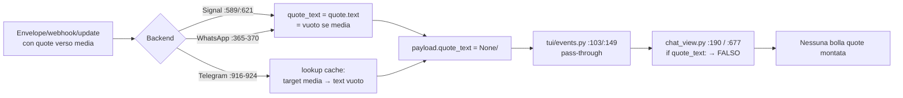

# Design operativo — Bug #37: quote di un'immagine (ingresso invisibile, creazione impossibile)

| Campo | Valore |
|---|---|
| Bug | [#37](BUGS.md) — "Quote immagine: invisibile in ingresso, non creabile da TUI" |
| Stato | APERTO |
| Tipo | Design (analisi + specifiche; nessun codice in questo documento) |
| Aree | `backends/{signal,whatsapp_events,telegram}.py`, `tui/{chat_view,unread_reply,send,download}.py`, `ui_components.py`, `tests/` |

Il bug ha due facce distinte che vengono risolte con due meccanismi coordinati:

1. **Ingresso**: un messaggio quotato che è un media produce `quote_text` vuoto/`None`
   nei tre backend; la UI monta la bolla quote solo con `if quote_text:` → la quote
   media ricevuta è invisibile.
2. **Uscita**: il flusso di reply parte solo da `MessageWidget` (messaggi di testo);
   le immagini sono `ImageWidget` il cui click apre la modal → dalla TUI è impossibile
   quotare un'immagine propria o del contatto.

---

## 1. Verifica dei riferimenti (riconferma sui sorgenti)

Tutti i riferimenti del ticket sono stati riletti. Esiti: **C** = confermato,
**Corretto** = riga precisa diversa dal ticket.

| Riferimento dichiarato | Esito | Note |
|---|---|---|
| `backends/signal.py:589` (`quote.get("text","")`) | C | Anche `:621` (sync sentMessage) e `:851` (`_persist_message`) confermate. |
| `backends/whatsapp_events.py:365-370` | C | `quote.get("text") or quote.get("body") or quote.get("conversation") or None`. |
| `backends/telegram.py:916-932` | C | Lookup `quote_text` solo nella cache locale (`:920-924`), payload `:926-939`. |
| `tui/chat_view.py:190` (live) e `:677` (cache) | C | Entrambi `if quote_text:` → bolla `Static(f"▎ {quote_text}")`. |
| `tui/chat_view.py::_add_message` 128+, `_render_image_in_chat` 305+, `_build_message_widgets` 661+ | C | `_render_image_in_chat` NON riceve `timestamp/sender/message_id`: i metadati servono alla B e vanno aggiunti alla firma. |
| `ui_components.py::MessageWidget` 306-563 | C | Pattern Alt+click → `EditRequested` (`on_click:486-502`, `action_request_edit:510`, `Binding("alt+e")` `:358-360`). |
| `ui_components.py::ImageWidget` 565-635 | C | Solo `ImageClicked(path, id)`; nessun metadato messaggio, nessun `set_selected`. |
| `tui/unread_reply.py` 87-110 / 113-126 / 128-201 | C | `_update_reply_bar` legge solo `_reply_to["text"]` (`:101-105`); `_cancel_reply` chiama `prev_widget.set_selected(False)` già protetto da try/except (`:117-124`). |
| `models.py:134-154` | Corretto | I campi quote sono di **`ChatMessage`** (campo `quote_text` `:154`, `reply_to_message_id` `:159`; docstring `:134-135`), non di `ChatEvent`: `ChatEvent` (`:162-181`) li trasporta dentro `payload`. Nessuna modifica allo schema dati necessaria. |
| `tui/css.py` `.msg-quote`/`.msg-quote-right` 170-183, `#reply-bar`/`#reply-text` 198-230 | C | Nessuna modifica CSS prevista. |
| `tui/events.py:103-109, 149` | C | Mirror cache (`:96-115`) e chiamata live a `_add_message` (`:149`) passano `quote_text` così com'è. |
| `tui/send.py` 75-110, 228-254 | Corretto | Propagazione esatta: cattura reply `:76-78`, guard Telegram `:83-95`, data ottimistica `:98-112`, estrazione quote nel worker `:232-235`, `send_kwargs` `:251-257`. |

Riferimenti aggiuntivi individuati durante l'esplorazione (rilevanti per il design):

- `tui/download.py::on_image_widget_image_clicked:102-133` — unico consumer di
  `ImageClicked`: lazy-resolve del path, branch download-mode, apertura
  `ImageModalScreen`.
- `backends/whatsapp_rest.py::send_message:323-343` — WAHA `/api/sendText` invia
  **solo** `reply_to` (= Baileys id); i parametri `quote_*` sono accettati ma
  **ignorati** sul filo. WhatsApp quindi quota esclusivamente via message id.
- `backend/rpc.py:377-382` e `:147-152` — Signal invia `quoteTimestamp` /
  `quoteAuthor` / `quoteMessage` (JSON-RPC e subprocess). Il `reply_to_message_id`
  esiste nelle firme di `signal.py::send_message_sync:403-422` ma viene **scartato**
  (non passato a `_send_message_sync`): per Signal la quote è identificata da
  timestamp+autore.
- `backends/telegram.py::_validated_reply_to_message_id:754-764` — il reply id
  Telegram deve essere un intero positivo (id server).
- `backend/db.py:84-91, 125-134` — `quote_text` è persistito in SQLite; le colonne
  quote sono già oggetto di migrazioni `ALTER TABLE` preesistenti.
- Etichette tecniche/caption: `tui/chat_view.py:44-85` (`_is_technical_media_label`,
  `_is_synthetic_media_text`, `_image_caption`) — logiche lato UI, non importabili
  dai backend (vedi §4.3).

---

## 2. Stato attuale e root cause

### 2.1 Ingresso (quote media ricevuta invisibile)



Quando il messaggio quotato è un media, il campo testo della quote è vuoto per
natura (il contenuto è l'allegato, non il body). Nessun layer produce un'etichetta
alternativa, quindi la bolla non viene proprio montata.

### 2.2 Uscita (impossibile quotare un'immagine dalla TUI)

- Click/Enter su `ImageWidget` → `ImageClicked(path, attachment_id)` →
  `tui/download.py` apre `ImageModalScreen`. Non esiste alcun percorso verso
  `self._reply_to`.
- `on_message_widget_message_clicked` (`unread_reply.py:128-201`) popola
  `_reply_to = {text, timestamp, sender, is_mine[, message_id, _widget]}` partendo
  da `MessageClicked`; la reply-bar mostra `_reply_to["text"]`.
- Le immagini hanno anche un problema di **metadati**: `ImageWidget` non conosce
  `timestamp/sender/is_mine/message_id` del messaggio che rappresenta (vengono
  persi in `_render_image_in_chat` e non passati in `_build_message_widgets`),
  quindi anche aggiungendo un evento non saprebbe identificarle come target reply.

---

## 3. Decisione A — Ingresso: fallback del `quote_text` per i media

### 3.1 Contratto dei segnaposto tipizzati

Unica fonte di verità, funzione pura in `models.py` (modulo già privo di dipendenze
Textual e importato da tutti i backend):

```
media_quote_placeholder(msg_type: str, detail: str | None = None) -> str
```

Mappatura canonica (priorità: `detail` reale dell'utente > segnaposto tipizzato):

| Contenuto quotato | Segnaposto |
|---|---|
| immagine | "🖼️ Immagine" |
| sticker | "🎨 Sticker" |
| documento/file generico | "📎 File" |
| audio / vocale | "🎵 Audio" |
| video | "🎬 Video" |

Regola di composizione del `quote_text` (identica nei tre backend):

1. se la quote porta un testo/caption utente reale → usato tale (comportamento
   attuale, invariato);
2. altrimenti se la quote identifica un media → `media_quote_placeholder(...)`,
   eventualmente arricchito da filename/caption tecnica se disponibile e
   informativa;
3. altrimenti → `None` (nessuna bolla, come oggi).

### 3.2 Riconoscimento per protocollo

- **Signal** (`backends/signal.py:589` per `dataMessage`, `:621` per sync
  `sentMessage`): la quote di signal-cli è `{id, author, text, attachments:
  [{contentType, filename}]}`. Un media quotato si riconosce perché `text` è vuoto
  e `attachments` non è vuoto: `contentType` determina il segnaposto
  (`image/*` → "🖼️ Immagine", `video/*` → "🎬 Video", `audio/*` → "🎵 Audio",
  altro → "📎 File"); `filename` viene anteposto se presente. Lo sticker quotato
  può comparire come attachment `image/webp` oppure senza attachment: in assenza
  di segnali certi degrada a "🖼️ Immagine" (da verificare empiricamente, §8).
  Entrambi i siti (`dataMessage` e `sentMessage`) vanno corretti: oggi condividono
  la stessa identica istruzione, quindi il fix è lo stesso helper applicato due volte.
- **WhatsApp** (`backends/whatsapp_events.py:365-370`): `quote`/`quotedMessage` di
  WAHA appare in forme multiple, coerenti con quelle già gestite per i media del
  messaggio stesso (`:246-322`): chiavi annidate `*Message` (`imageMessage`,
  `videoMessage`, `audioMessage`, `documentMessage`, `stickerMessage`), campo
  piatto `type`, oppure `mimetype`/`hasMedia`. La detection riusa lo stesso
  ordinamento di `_msg_type`/estrazione media: prima le chiavi annidate, poi
  `type`, poi `mimetype`. Testo/body presenti → priorità al testo (invariato).
- **Telegram** (`backends/telegram.py:916-924`): qui la quote non arriva dal
  server: `reply_to_msg_id` viene risolto contro la cache locale. Se il target in
  cache ha `msg_type != "text"` (foto/documento/sticker/video/audio, classificati
  in `:886-908`), il suo `text` è caption o stringa vuota → si compone il
  segnaposto da `msg_type` + `attachment_info` (caption reale ha priorità).
  Se il target NON è in cache si lascia `None` (limitazione documentata, §7):
  emettere un segnaposto generico senza sapere il tipo produrrebbe bolle sbagliate.

### 3.3 Dove mettere il fallback: nei backend, con helper condiviso

**Decisione: il fallback vive nei tre backend (punto di estrazione per protocollo),
la composizione della stringa nell'unico helper `models.media_quote_placeholder`.**

Motivazione (alternative valutate):

- *Punto unico in `tui/events.py` o `_add_message`*: scartato. A valle dei backend
  l'informazione "la quote punta a un media" è già perduta: il payload espone solo
  `quote_text` (stringa) e nessun tracciante del tipo del messaggio quotato. Per
  decidere in UI bisognerebbe comunque introdurre nei backend campi nuovi
  (`quote_msg_type`, `quote_attachment_info`), più un passaggio di persistenza
  dello schema (colonne nuove in `messages`) per far funzionare anche la cache.
  Costo superiore, stesso risultato.
- *Tre implementazioni indipendenti*: scartata la duplicazione della sola
  composizione della stringa (etichette coerenti tra protocolli, un solo posto da
  aggiornare). La **detection** resta invece per protocollo perché le strutture
  sono irriducibilmente diverse (attachment Signal vs chiavi Baileys vs cache
  Telethon).
- Beneficio collaterale decisivo: scrivendo il segnaposto direttamente in
  `payload["quote_text"]`, **tutto il resto della pipeline funziona senza
  modifiche** — mirror cache (`events.py:103`), persistenza SQLite
  (`db.py:185`), rendering live (`chat_view.py:190`) e da cache (`:677`,
  `_load_all_messages:751`). Requisito C soddisfatto per costruzione.

Contro registrato: il segnaposto entra nel DB come testo della quote (storico
mescola stringhe UI e contenuti utente). Accettato: `quote_text` è già un campo di
presentazione (oggi contiene la caption), il dedup usa il testo del *messaggio* e
non della quote, e l'alternativa strutturata è rimandata come follow-up (§7).

---

## 4. Decisione B — Uscita: reply dall'`ImageWidget`

### 4.1 Interazione scelta: Alt+click / Alt+R per rispondere, click/Enter invariati

Tra le opzioni:

1. **Alt+click / Alt+Enter (e Alt+R da focus) → reply; click/Enter → modal** (SCELTA);
2. binding dedicato standalone;
3. click → reply, Enter → modal.

Motivazione: l'opzione 1 è **simmetrica al pattern esistente** Alt+click → edit su
`MessageWidget` (`ui_components.py:486-502, :510-521, :358-360`): modifica con
modificatore = azione secondaria, attivazione semplice = contenuto. Non regredisce
l'apertura in modal (vincolo esplicito del bug #37: "senza rompere l'apertura in
modal") né rompe i test esistenti su click/Enter → `ImageClicked`
(`tests/test_ui_components.py:280`). L'opzione 3 invertirebbe due convenzioni
consolidate contemporaneamente (click e Enter) con impatto su download-mode e su
ogni test di interazione immagini; l'opzione 2 da sola è poco scopribile e va bene
solo come percorso aggiuntivo (Alt+R), non sostitutivo.

### 4.2 Estensione di `ImageWidget` (`ui_components.py:565-635`)

Nuovo costruttore (parametri tutti opzionali a default neutro, retrocompatibile):

```
ImageWidget(attachment_path, attachment_id="", fallback_text=..., *,
            timestamp: int = 0, sender: str = "", is_mine: bool = False,
            message_id: str | None = None, msg_type: str = "image",
            caption: str | None = None, protocol: str = "")
```

Aggiunte:

- classe `ReplyRequested(Message)` con campi: `text` (caption reale o segnaposto
  composto via `models.media_quote_placeholder`), `timestamp`, `sender`,
  `is_mine`, `message_id`, `attachment_info`;
- `Binding("alt+r", "request_reply", show=False)` + `action_request_reply()`
  (specchio esatto di `action_request_edit`);
- `on_click` con branch `event.meta` → `ReplyRequested` (specchio di
  `MessageWidget.on_click:486-502`); ramo normale invariato → `ImageClicked`;
- `key_enter` invariato → `ImageClicked`;
- `set_selected(selected: bool)` con toggle bordo verde `#4ebf71` come
  `MessageWidget.set_selected:473-483` (oggi `_cancel_reply` ci prova già,
  protetto da try/except, ma non esiste evidenza visiva);

### 4.3 Siti di costruzione e dati disponibili

| Sito | Riga | Dati disponibili | Azione |
|---|---|---|---|
| `chat_view.py::_add_message` → `_render_image_in_chat` | `:196-207` / `:305-352` | `timestamp`, `sender`, `is_mine`, `message_id`, `attachment_info`, `protocol` già parametri di `_add_message` | estendere firma di `_render_image_in_chat` (passatutto) e passarli a `ImageWidget` in entrambi i rami (`:327`, `:337`) |
| `chat_view.py::_build_message_widgets` | `:681-694` | dict cache completo: `ts`, `sender`, `is_mine`, `message_id = msg.get("id")` (`:673-674`), `attachment_info` | passarli a `ImageWidget` (requisito C) |

Nota sulla composizione del testo di reply: il widget usa `caption`/
`attachment_info`/segnaposto, **non** il `text` di cache che per i media è spesso
sintetico (`"Media: <id>"` in `whatsapp_events.py:378`, `"{label}: {att_id}"` in
`signal.py:556`) — evitiamo che etichette tecniche finiscano nella reply-bar e
nella quote in uscita.

### 4.4 Handler e reply-bar (`tui/unread_reply.py`)

Nuovo handler speculare a `on_message_widget_message_clicked:128-201`:

```
on_image_widget_reply_requested(event: ImageWidget.ReplyRequested)
```

Comportamento: branch download-mode → `_start_download(text, attachment_id=event.attachment_id, ...)`; click-sul-medio-target → `_cancel_reply()`; mutua esclusione con `_cancel_edit()`; popola `self._reply_to = {text: event.text, timestamp, sender, is_mine, message_id?, attachment_info?, _widget}`; selezione del widget via `set_selected(True)`; `_update_reply_bar()`; focus sull'input.

`_update_reply_bar:87-110` richiede **zero modifiche funzionali**: legge
`_reply_to["text"]` che ora contiene caption o segnaposto → la barra mostra
naturalmente "↩️ Replying to: 🖼️ Immagine" (truncamento >60 char già gestito a
`:101-104`). `_cancel_reply:113-126` funziona così com'è grazie a `set_selected`.

### 4.5 Propagazione in uscita (`tui/send.py`) e rischio segnaposto-sul-filo

La catena `on_message_text_area_submitted` (`:76-78`) e `_send_message_worker`
(`:232-235, :251-257`) propaga `reply_data` senza distinzione testo/media:
`quote_text = quote_message = _reply_to["text"]` (caption o segnaposto),
`quote_timestamp`, `quote_author = contact_id`, `reply_to_message_id`. Esito per
protocollo:

| Protocollo | Identificativo target | Cosa viaggia sul filo | Rischio segnaposto |
|---|---|---|---|
| Signal | `quote_timestamp` + `quote_author` (RPC `quoteTimestamp/quoteAuthor/quoteMessage`, `rpc.py:377-382`) | il destinatario risolve la quote dal timestamp/autore; `quoteMessage` è solo preview | **Presente ma contenuto**: il segnaposto ("🖼️ Immagine") o la caption viaggiano come testo di preview della quote. Accettato: i client ricostruiscono il contenuto reale dal messaggio quotato; la caption, quando esiste, è testo utente autentico. Da verificare empiricamente che signal-cli accetti la triple senza `quoteMessage` (follow-up: ometterla per i media). |
| WhatsApp | `reply_to` = Baileys id (`whatsapp_rest.py:341-342`); i `quote_*` sono ignorati | solo l'id | **Nullo** per il filo; resta il rischio lato TUI che il segnaposto appaja come testo della nostra bolla ottimistica — voluto (UX coerente con gli altri client). |
| Telegram | `reply_to` = id numerico (`telegram.py:754-764`) | solo l'id | **Nullo** (Telethon non invia testo di quote). Guardia esistente `send.py:83-95` invariata e applicabile anche ai media. |

**Guardia nuova necessaria (WhatsApp)**: la quote richiede il Baileys id. Se
`reply_data` esiste, `protocol == PROTOCOL_WHATSAPP` e `message_id` è
assente/vuoto → bloccare l'invio con messaggio di stato analogo al guard Telegram
(`:83-95`) invece di spedire una reply che WAHA applicherebbe al target sbagliato
o scarterebbe. I media da cache hanno sempre `id` (`_build_message_widgets:674`),
quindi il caso limite riguarda widget costruiti senza id (attachment senza id,
`chat_view.py:327`): per questi si disabilita la reply (evento non emesso se
`message_id` è assente **e** il protocollo lo richiede — decisione più semplice:
emettere comunque e far filtrare la guardia, coerente col comportamento Telegram).

### 4.6 Flusso risultante

```mermaid
sequenceDiagram
    participant U as Utente
    participant IW as ImageWidget
    participant UR as UnreadReplyMixin
    participant SB as SendMixin (submit)
    participant BE as Backend

    U->>IW: Alt+click / Alt+R
    IW->>UR: ReplyRequested(text, ts, sender, is_mine, message_id)
    UR->>UR: _reply_to = {...} ; set_selected(True)
    UR-->>U: reply-bar "↩️ Replying to: 🖼️ Immagine"
    U->>SB: Enter sul messaggio di risposta
    SB->>SB: quote_text/quote_timestamp/quote_author/message_id da _reply_to
    SB->>BE: send_message_sync(..., quote_*, reply_to_message_id)
    Note over BE: Signal: ts+author (+preview)<br/>WhatsApp: reply_to=id<br/>Telegram: reply_to=id
```

---

## 5. Decisione C — Cache e storico

- **Live**: coperto dalla §3.3 (il segnaposto è dentro `quote_text` prima del
  mirror `events.py:103`).
- **Persistito**: `quote_text` finisce in SQLite (`backend/db.py:185`), quindi le
  quote media ricevute dopo il fix ricompaiono anche riaprendo la chat o
  riavviando (`_build_message_widgets:677-679` e `_load_all_messages:751-782`
  leggono lo stesso campo).
- **Widget da cache (requisito C)**: `_build_message_widgets` passa
  `ts/sender/is_mine/message_id/attachment_info` al nuovo `ImageWidget` → la
  reply funziona identicamente per lo storico. Verifica dedicata in §6.
- **Storico pre-fix**: le righe con `quote_text` NULL restano senza bolla.
  Backfill scartato (§7): non si può ricostruire il tipo del messaggio quotato con
  certezza dai soli dati persistiti.
- **Merge/dedup**: nessun impatto — `_find_existing` (`chat_view.py:600-632`) e
  `_message_already_cached` (`signal.py:812-837`) confrontano testo/timestamp/id
  del *messaggio*, mai della quote.

---

## 6. Decisione D — Piano test

Convenzioni: fixture condivise in `tests/conftest.py`; app headless via
`app_for_test` / `app_for_test_with_mocks` (`conftest.py:203-223`); pattern per
eventi widget già presente in `tests/test_ui_components.py:214-256` (post_message
catturato) e `tests/test_failed_send_status.py:75-112` (handler invocato su
SimpleNamespace).

Nuove fixture (`tests/conftest.py`):

1. `sample_envelope_quoting_image` — envelope Signal `dataMessage` con
   `quote: {id, author, attachments: [{contentType: "image/jpeg"}]}` e senza
   `text` (gemella di `sample_envelope_image:97-117`).
2. `wa_event_quoting_sticker` — raw WAHA con `quotedMessage.stickerMessage`.
3. `cached_media_target` — entry cache Telegram foto senza caption
   (`msg_type="image"`, `text=""`, `attachment_info="Photo"`).

Test per area:

| # | File | Test | Copre |
|---|---|---|---|
| 1 | `tests/test_backends.py` | `test_signal_quote_image_placeholder` (e varianti video/audio/document/sticker-webp) | A — Signal `dataMessage` (`:589`) |
| 2 | `tests/test_backends.py` | `test_signal_sent_message_quote_media` | A — sync `sentMessage` (`:621`) |
| 3 | `tests/test_backends.py` | `test_signal_quote_caption_preferred` (quote.text presente → invariato) | A — priorità testo |
| 4 | `tests/test_whatsapp_backend.py` | `test_wa_quote_nested_media_placeholders` (imageMessage/videoMessage/audioMessage/documentMessage) | A — WhatsApp annidato |
| 5 | `tests/test_whatsapp_backend.py` | `test_wa_quote_flat_type_and_mimetype`, `test_wa_quote_body_wins_over_placeholder` | A — WhatsApp piatto + priorità |
| 6 | `tests/test_telegram.py` | `test_tg_quote_media_from_cache_placeholder`, `test_tg_quote_caption_from_cache`, `test_tg_quote_no_cache_hit_is_none` | A — Telegram (`:916-924`) |
| 7 | `tests/test_ui_components.py` | `test_image_widget_alt_click_emits_reply_requested` (+ campi), `test_image_widget_alt_r_action` | B — evento/binding |
| 8 | `tests/test_ui_components.py` | `test_image_widget_click_still_emits_image_clicked`, `test_image_widget_enter_still_emits_image_clicked` | B — regressione modal |
| 9 | `tests/test_ui_components.py` | `test_image_widget_set_selected_border_toggle` | B — evidenza visiva |
| 10 | `tests/test_tui_integration.py` (o nuovo `tests/test_reply_media.py`) | `test_handler_populates_reply_to_from_image` (incluso `message_id`), `test_reply_bar_shows_media_placeholder`, `test_second_click_cancels_media_reply`, `test_media_reply_cancels_active_edit`, `test_download_mode_image_serves_file_instead_of_reply` | B — handler + reply-bar + mutua esclusione |
| 11 | `tests/test_refresh_chat.py` | `test_cache_built_image_widget_carries_reply_metadata`, `test_cache_media_quote_renders_bubble` | C — `_build_message_widgets` |
| 12 | `tests/test_send_persist_offthread.py` | `test_send_media_reply_propagates_quote_params` (assert su `send_kwargs`), `test_whatsapp_media_reply_without_id_is_blocked`, `test_telegram_media_reply_guard_unchanged` | B — propagazione + guardie |
| 13 | `tests/test_backends.py` | regressione dedup: messaggio media con quote segnaposto non duplicato | C — interazione con dedup |

Suite completa: `make test` (obiettivo: nessuna regressione sulle ~370 esistenti,
in particolare `tests/test_download_mode.py:147-174` per l'handler `ImageClicked`
e `tests/test_edit_flow.py` per la mutua esclusione reply/edit).

---

## 7. Alternative scartate e rischi

| Alternativa | Perché scartata |
|---|---|
| Normalizzazione unica in `tui/events.py` / `_add_message` | L'informazione sul tipo del messaggio quotato è persa a valle dei backend; servirebbero nuovi campi payload + migrazione schema per coprire la cache. Costo > beneficio (§3.3). |
| Campi strutturati (`quote_msg_type`/`quote_attachment_info`) in payload e DB | Design "più puro" ma richiede ALTER TABLE, doppio rendering (live+cache), propagazione in `events.py` e `_build_message_widgets`; rimandato come follow-up se emergerà bisogno (es. styling per tipo). |
| Click → reply, Enter → modal (opzione 3) | Rompe due convenzioni consolidate e i test esistenti; sorprende l'utente in download-mode. |
| Menu contestuale / binding solo-tastiera | Scopribilità scarsa; resta solo Alt+R come percorso aggiuntivo al Alt+click. |
| Backfill storico delle quote media vecchie | Irricostruibile con certezza dai dati persistiti; valore basso. |
| Backfill del placeholder senza filename lato backend via `_is_technical_media_label` | Quella logica vive nella UI (`chat_view.py:44-85`): importarla nei backend inverte il layering. Nei backend si preferiscono solo i campi nativi della quote (filename/caption); follow-up possibile spostando l'helper in `models.py`. |

Rischi residui e mitigazioni:

1. **Segnaposto come `quoteMessage` su Signal** (preview sul filo): mitigato dalla
   priorità caption-reale; verifica empirica pianificata (§4.5); eventuale
   evoluzione: omettere `quoteMessage` per i media se signal-cli lo consente.
2. **Forme quote non catalogate** (sticker Signal senza attachment, varianti WAHA
   future): degrado a "📎 File"/assenza di bolla, mai crash; logging debug del
   payload quote (pattern già usato in `_ack_value`, `whatsapp_events.py:150`).
3. **Reply su widget senza id** (attachment senza `attachment_id`): gestita dalle
   guardie protocollo (blocco con messaggio di stato), nessun invio ambiguo.
4. **Placeholders nel DB leggibili come testo**: cosmetico; il dedup non usa la
   quote; documentato in §3.3.

---

## 8. Piano di implementazione (ordine suggerito) e verifiche empiriche

Ordine: (1) `models.media_quote_placeholder` + test; (2) fallback nei 3 backend +
test ingresso; (3) metadati `ImageWidget` nei siti di costruzione + test cache;
(4) evento `ReplyRequested` + binding + `set_selected` + test widget; (5) handler
reply + reply-bar + test integrazione; (6) guardia WhatsApp + test send; (7) run
regressione completa.

Verifiche empiriche post-implementazione (account reali, da registrare in
BUGS.md alla chiusura):

- Signal: forma esatta di `dataMessage.quote` quando si quota uno sticker e un
  video (campi `attachments[].contentType`, presenza di `sticker`).
- WhatsApp: forma `quote`/`quotedMessage` della build WAHA in uso (annidata vs
  piatta) — la detection copre entrambe ma serve conferma.
- Signal: invio reply a immagine con e senza `quoteMessage` (accettazione
  signal-cli e resa sui client destinatari).
