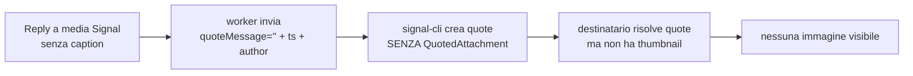

# Design operativo — Bug #37 piano B: quote media Signal con immagine visibile (`quoteAttachments`)

| Campo | Valore |
|---|---|
| Bug | [#37](BUGS.md) — "Quote immagine: invisibile in ingresso, non creabile da TUI" |
| Stato | APERTO (fix V2 implementato e committato, ma verifica empirica TC-E1 **falsificata** sul solo protocollo Signal) |
| Tipo | Design (analisi + specifiche; nessun codice in questo documento) |
| Aree | `backend/rpc.py`, `backends/signal.py`, `models.py`, `backend/db.py`, `ui_components.py`, `tui/unread_reply.py`, `tui/send.py`, `tui/chat_view.py`, `tests/` |
| Predecessore | `docs/DESIGN_QUOTE_MEDIA_37_V2.md` (contratto display-vs-filo; resta valido) |

---

## 0. Perché il piano B — registro fattuale

Il fix V2 (branch `fix/quote-media-37-v2`) applica il contratto display-vs-filo: per una
quote media senza caption invia `quoteMessage == ""` (mai il segnaposto, mai omesso).

Verifica empirica su filo reale (account di test "Roberto BMW", test live
`tests/test_live_quote_media.py`, 24/08/2026):

| Protocollo | Esito destinatario |
|---|---|
| **Signal** | ❌ **la quote non mostra l'immagine quotata** (il testo/parametri sono corretti, ma l'immagine è assente) |
| WhatsApp | ✅ quote nativa corretta (`reply_to` = Baileys id) |
| Telegram | ✅ quote nativa corretta (`reply_to` = id numerico) |

**Fatto F5** — su Signal l'ipotesi V2 "`quoteMessage=""` basta" è falsificata: signal-cli
accetta il messaggio senza errori, ma il destinatario non ha alcun riferimento
all'allegato quotato e non può renderizzarlo. Il design V2 §8 aveva già previsto questo
caso con il **piano B**: `quoteAttachments` di signal-cli.

---

## 1. Fatti tecnici verificati (signal-cli 0.14.7, jar in `bin/`)

1. Il metodo JSON-RPC `send` di signal-cli accetta, oltre a `quoteTimestamp`/
   `quoteAuthor`/`quoteMessage`, il parametro **`quoteAttachments`**: lista di stringhe
   nel formato `contentType[:filename[:previewFile]]`.
   - Esempio CLI: `--quote-attachment` con `'image/png:test.png:/tmp/preview.jpg'`.
   - `previewFile` è un file locale che signal-cli carica come **thumbnail** della quote:
     è ciò che rende VISIBILE l'immagine quotata sul client destinatario. Senza
     `previewFile` la quote è priva di thumbnail.
   - Le classi `org.asamk.signal.json.JsonQuote`/`JsonQuotedAttachment` (record) espongono
     i campi `attachments` (lista) con `contentType` + `fileName`; `SendCommand` espone
     l'opzione `--quote-attachment` con sintassi `contentType[:filename[:previewFile]]`.

2. `backend/rpc.py:336-385` `SignalRPCClient.send_message` NON espone `quoteAttachments`
   (solo `quote_timestamp`/`quote_author`/`quote_message`/`edit_timestamp`).

3. `backend/rpc.py:161-172` `get_attachment_path(attachment_id)` risolve il file locale
   come `SIGNAL_CLI_ATTACHMENTS_DIR / attachment_id` (restituisce `Path` solo se il file
   esiste; `None` altrimenti). Per i media **ricevuti**, il daemon signal-cli ha già
   scaricato l'allegato in questa directory → il `previewFile` è normalmente disponibile.

4. `backends/signal.py:400-440` `_send_message_sync`: in modalità daemon chiama
   `self._rpc.send_message(...)` con `quote_timestamp/quote_author/quote_message`; in
   subprocess chiama `_send_subprocess(...)` con gli stessi parametri (via
   `--quote-timestamp/--quote-author/--quote-message`). Nessuno dei due passa
   `quoteAttachments`.

5. `backends/signal.py:539-562` `_classify_attachments`: il `content_type =
   att.get("contentType")` viene usato SOLO per derivare `msg_type` e `attachment_info`
   (`caption or f"Image: {fname}" or "🖼️ Image"` ecc.), poi **perso**. `attachment_id` =
   `att.get("id") or att.get("attachmentId")`. `content_type` (mime) NON è persistito da
   nessuna parte.

6. Modello/DB: `models.py:196-198` `ChatMessage` ha `msg_type`, `attachment_info`,
   `attachment_id` ma **non** `content_type`. `backend/db.py:117-136` la tabella
   `messages` ha `attachment_info`/`attachment_id` ma non `content_type`; il meccanismo
   di migrazione è `_migrate_protocol_schema` (`db.py:41-101`, gated da
   `PRAGMA user_version`, `_SCHEMA_VERSION = 3`).

7. Path di reply: `ui_components.py:589-618` `ImageWidget.ReplyRequested` porta `text`,
   `caption`, `timestamp`, `sender`, `is_mine`, `message_id`, `attachment_id` (non
   `content_type`); `tui/unread_reply.py:254-260` popola `_reply_to` con `text`,
   `timestamp`, `sender`, `is_mine`, `quote_wire_body` (=`caption`), `message_id`
   (non `attachment_id`, non `content_type`); `tui/send.py:240-277` costruisce
   `send_kwargs` (quote_timestamp/quote_author/quote_message/reply_to_message_id).
   `tui/send.py:519-531` `_retry_failed_message` ricostruisce `reply_data` dalla riga DB
   (`quote_text`/`quote_timestamp`/`reply_to_message_id`) e imposta `quote_wire_body=""`
   per i media (R2-bis), ma non ricostruisce `content_type`/`attachment_id`.

---

## 2. Root cause specifica (perché l'immagine non è visibile)



La quote Signal è identificata da `quoteTimestamp`+`quoteAuthor`, ma il **contenuto**
(thumbnail) arriva solo tramite `quoteAttachments`. Per una quote di media serve quindi:
`quoteTimestamp`+`quoteAuthor` (identificazione) **+** `quoteAttachments` (thumbnail con
`previewFile` = file locale) **+** `quoteMessage` (caption o `""`). Il fix V2 fornisce solo
i primi due + `quoteMessage`.

---

## 3. Decisione A — Persistere il `content_type` dei media (ingresso)

**Decisione: nuova colonna `content_type TEXT` nella tabella `messages`, thread end-to-end
come per `attachment_id`.**

Il `content_type` (mime, es. `image/png`, `image/jpeg`, `video/mp4`) è l'ingrediente
obbligatorio della stringa `quoteAttachments`. Oggi è perso in `_classify_attachments`.
Va catturato alla sorgente e reso disponibile al momento della reply, anche da cache/storico.

Siti:
- `backends/signal.py:539-562` `_classify_attachments`: restituire anche `content_type`
  (il tuple diventa `(msg_type, info, att_id, content_type)` o un piccolo dict).
- `backends/signal.py:573-621` `_build_msg_dicts`: includere `content_type` nei dict
  messaggio (con `attachment_info`/`attachment_id` a `:605-606`).
- `models.py:196-198` `ChatMessage`: nuovo campo `content_type: str | None = None`.
- `backend/db.py`: colonna `content_type TEXT` nella `CREATE TABLE` (`:117-136`) + migrazione
  idempotente in `_migrate_protocol_schema` (`if "content_type" not in columns: ALTER TABLE
  messages ADD COLUMN content_type TEXT`), lettura in `_load_cache` (`:185-188`) e scrittura
  in `_save_message`/INSERT (`:207-247`).
- `tui/chat_view.py _build_message_widgets`: passare `content_type` a `ImageWidget` (come
  già per `attachment_info`/`attachment_id`).

**Fallback per righe legacy** (pre-migrazione, `content_type IS NULL`): vedi §4 — se il
`content_type` manca si degrada senza `quoteAttachments` (comportamento V2 attuale), senza
crash. In alternativa, derivare un mime ragionevole da `msg_type` (es. `image` → `image/png`)
o da `mimetypes.guess_type(previewFile)`. **Scelta: derivare da `msg_type` solo come
fallback minimo, preferendo il valore persistito.** (vedi tabella §4).

---

## 4. Decisione B — Costruire `quote_attachments` alla reply (uscita)

Al momento della reply a un media **Signal**, il worker compone:

```
quote_attachments = [ f"{content_type}::{preview_path}" ]  # filename omesso (cosmetico)
```

dove:
- `content_type` = `reply_data["content_type"]` (mime persistito). Fallback ordinato:
  1. `content_type` persistito (valore reale);
  2. se manca, derivazione da `msg_type` (tabella: `image`→`image/png`, `video`→`video/mp4`,
     `audio`→`audio/mpeg`, `sticker`→`image/webp`, `attachment`→`application/octet-stream`);
  3. se nemmeno `msg_type` è disponibile → **non inviare `quote_attachments`** (degradare al
     comportamento V2: nessun crash, immagine non visibile come oggi).
- `preview_path` = `get_attachment_path(reply_data["attachment_id"])` (`backend/rpc.py:161`).
  Se `None` (file non presente, es. media mai scaricato o allegato potato):
  - **fallback accettato**: inviare `quote_attachments = [content_type]` (senza `previewFile`)
    → la quote resta corretta e tipizzata ma **senza thumbnail** (immagine non visibile);
  - documentato come limite: il `previewFile` richiede il file locale, che per i media
    ricevuti è la norma (il daemon li scarica). Non si introduce download lazy sincrono nel
    worker di invio (rischio di bloccare la UI/il send; alternativa rimandata in §7).

**Regola di gating**: `quote_attachments` è costruito e passato SOLO quando
`protocol == PROTOCOL_SIGNAL` e `reply_data` è una reply media (chiave `quote_wire_body`
presente, cioè `reply_data` proviene da `ImageWidget.ReplyRequested` o dal retry media).
Le reply a testo NON impostano mai la chiave → comportamento invariato.

---

## 5. Decisione C — Propagazione end-to-end

Firme e siti (file:riga attuali):

| Sito | Azione |
|---|---|
| `ui_components.py:589-618` `ReplyRequested` | nuovo campo `content_type: str | None` (accanto ad `attachment_id`) |
| `ui_components.py` (costruzione evento, `on_click`/`action_request_reply`) | passare `content_type=self._content_type` |
| `ui_components.py` `ImageWidget.__init__` | nuovo attributo `content_type` (default `None`) |
| `tui/chat_view.py _render_image_in_chat` / `_build_message_widgets` | passare `content_type` a `ImageWidget` |
| `tui/unread_reply.py:254-260` | `_reply_to` + `attachment_id=event.attachment_id`, `content_type=event.content_type` |
| `tui/send.py:240-277` `_send_message_worker` | costruire `quote_attachments` (§4) e aggiungerlo a `send_kwargs` solo per Signal media |
| `backends/signal.py:442-459` `send_message_sync` | nuovo param `quote_attachments: list[str] | None = None` → `_send_message_sync` |
| `backends/signal.py:400-440` `_send_message_sync` | passare `quote_attachments` a `_rpc.send_message` (daemon) e `_send_subprocess` (subprocess) |
| `backend/rpc.py:336-385` `send_message` | nuovo param `quote_attachments: list[str] | None = None` → `params["quoteAttachments"] = quote_attachments` |
| `backend/rpc.py:140-152` `_send_subprocess` | nuovo argomento `quote_attachments` → `--quote-attachment` per ciascun elemento |

Nessuna modifica a `backends/whatsapp.py`, `backends/telegram.py`: la chiave è costruita
solo per Signal (§4) e i backend WA/TG non ricevono il parametro (le loro firme
`send_message_sync` già ignorano i `quote_*`).

---

## 6. Decisione D — Retry e cache

`tui/send.py:519-531` `_retry_failed_message` ricostruisce `reply_data` dalla riga DB.
Estendere la ricostruzione: quando `is_media_quote_placeholder(message["quote_text"])`
(media), aggiungere a `reply_data` anche:
- `content_type = message.get("content_type")`
- `attachment_id = message.get("attachment_id")`

così il retry dopo reload/riavvio ricostruisce `quote_attachments` esattamente come il
send live (§4). Il buco V2 (quote_wire_body) resta coperto; questo chiude l'analogo buco
per la thumbnail. I campi `content_type`/`attachment_id` sono già in DB → nessuna perdita
di informazione tra live e retry.

---

## 7. Interazione con `quoteMessage` (coerenza col contratto V2)

Le regole R1/R2/R3 della V2 restano invariate:

- **R1** (reply a testo): nessuna chiave `quote_wire_body` → `quote_message = text` (invariato).
- **R2** (reply media): `quote_message = quote_wire_body or ""` (caption reale o `""`, mai il
  segnaposto, mai omesso).
- **R3**: il segnaposto di display non esce mai sul filo.

Con il piano B, la thumbnail viaggia in `quoteAttachments` e il testo della quote resta
`quoteMessage` (caption o `""`). Sono canali ortogonali: `quoteMessage` trasporta il testo,
`quoteAttachments` l'immagine. Nessun conflitto con F2/F3.

---

## 8. Piano test

### 8.1 Unit/integration (nuovi/aggiornati, nessuna regressione)

| # | File | Test | Copre |
|---|---|---|---|
| 1 | `tests/test_backends.py` | `test_signal_media_persists_content_type` (envelope media con `contentType` → `ChatMessage.content_type` valorizzato) | A — cattura |
| 2 | `tests/test_backends.py` | `test_signal_media_content_type_null_when_absent` | A — default |
| 3 | `tests/test_ui_components.py` | `ReplyRequested` espone `content_type`; `ImageWidget` porta `content_type` | C — evento |
| 4 | `tests/test_reply_media.py` | handler popola `_reply_to["content_type"]`/`_reply_to["attachment_id"]` | C — handler |
| 5 | `tests/test_send_persist_offthread.py` | **media Signal senza caption → `send_kwargs["quote_attachments"] == [f"{ct}::{path}"]`** (con `get_attachment_path` mockato) | B/C — filo |
| 6 | `tests/test_send_persist_offthread.py` | media Signal con caption → `quote_attachments` presente + `quote_message == caption` | B/C — filo |
| 7 | `tests/test_send_persist_offthread.py` | reply a testo → `quote_attachments` ASSENTE (chiave non passata) | B — gating |
| 8 | `tests/test_send_persist_offthread.py` | previewFile mancante (`get_attachment_path`→`None`) → `quote_attachments == [content_type]` (senza preview) | B — fallback |
| 9 | `tests/test_send_persist_offthread.py` | retry media dopo reload → `reply_data` ricostruito con `content_type`/`attachment_id` | D — retry |
| 10 | `tests/test_backends.py` / `backend/rpc.py` | `send_message(..., quote_attachments=[...])` serializza `params["quoteAttachments"]` | C — RPC |
| 11 | `tests/test_refresh_chat.py` | `_build_message_widgets` passa `content_type` a `ImageWidget` (cache/storico) | A/C — cache |

### 8.2 Aggiornamento test live (`tests/test_live_quote_media.py`)

- `test_e1_signal_quote_media_no_caption_wire_empty`: oltre a `quoteMessage==""`, asserire
  che `quote_attachments` contenga una stringa `contentType[:filename[:previewFile]]` con
  `contentType` atteso e un `previewFile` che punta a un file esistente.
- `test_e2_signal_quote_media_with_caption_wire_is_caption`: idem + `quoteMessage == caption`.
- `test_e7_signal_retry_after_failure_wire_empty`: idem sul retry.

### 8.3 Verifica empirica obbligatoria (gate F4, invariata)

Rieseguire E1/E2/E7 con `LIVE_TESTS=1` e verificare **sul device di Roberto BMW** che la
quote Signal mostri l'**immagine** quotata (non più solo il testo corretto). Solo a gate
superato: #37 → RISOLTO in `BUGS.md`.

---

## 9. Rischi e alternative scartate

| Alternativa | Perché scartata |
|---|---|
| Download lazy del media nel worker di invio per ottenere sempre il `previewFile` | Rischia di bloccare il thread di invio (o la UI) e introduce un secondo percorso di rete nel send; per i media ricevuti il file è già su disco. Rimandata come follow-up. |
| Recuperare il `contentType` on-the-fly dal file locale (`mimetypes`/magic) | Fragile (estensione vs mime reale) e non disponibile quando il file non c'è; persistere il `contentType` alla sorgente è più corretto. |
| Riutilizzare `attachment_info` per estrarre il mime | `attachment_info` è ambiguo (caption/filename/mime mescolati, priorità caption) e display-oriented: estrarre il mime da lì è inaffidabile. |
| Nome file nella stringa `quoteAttachments` | Cosmetico; omesso per evitare di dover estrarre `filename` da `attachment_info` (ambiguo). |
| Applicare il piano B anche a WA/TG | Non necessario: WA quota via `reply_to`=Baileys id, TG via `reply_to`=id numerico; entrambi già rendono l'immagine nativamente. |

Rischi residui:
1. **Media non scaricato / allegato potato** (`previewFile` assente): la quote resta tipizzata
   ma senza thumbnail. Mitigato dal fatto che i media ricevuti sono normalmente su disco;
   documentato in §4.
2. **Righe legacy senza `content_type`**: fallback da `msg_type` (§4); se anche questo manca,
   nessun `quoteAttachments` (nessun crash).
3. **Migrazione DB**: `ALTER TABLE ... ADD COLUMN content_type TEXT` è idempotente e gated
   dalla presenza della colonna (`PRAGMA table_info`), coerente con le migrazioni esistenti.

---

## 10. Siti di modifica riepilogativi

| File | Righe | Azione |
|---|---|---|
| `backend/db.py` | `:117-136`, `:41-101`, `:185-188`, `:207-247` | colonna `content_type` + migrazione + read/write |
| `models.py` | `:196-198` | campo `content_type: str | None = None` |
| `backends/signal.py` | `:539-562`, `:573-621` | catturare `content_type` in `_classify_attachments`/`_build_msg_dicts` |
| `backends/signal.py` | `:400-440`, `:442-459` | `quote_attachments` in `_send_message_sync`/`send_message_sync` |
| `backend/rpc.py` | `:336-385` | `send_message(..., quote_attachments)` → `quoteAttachments` |
| `backend/rpc.py` | `:140-152` | `_send_subprocess` → `--quote-attachment` |
| `ui_components.py` | `:589-618` | `ReplyRequested.content_type` + `ImageWidget.content_type` |
| `tui/chat_view.py` | `_render_image_in_chat`/`_build_message_widgets` | propagare `content_type` |
| `tui/unread_reply.py` | `:254-260` | `_reply_to["content_type"]`/`_reply_to["attachment_id"]` |
| `tui/send.py` | `:240-277` | costruire e passare `quote_attachments` (Signal media) |
| `tui/send.py` | `:519-531` | ricostruire `content_type`/`attachment_id` nel retry |

---

## 11. Piano di implementazione ordinato

1. `backend/db.py` + `models.py` (colonna `content_type`, campo modello, migrazione).
2. `backends/signal.py` cattura `content_type` in `_classify_attachments`/`_build_msg_dicts`.
3. `backend/rpc.py` (`send_message` + `_send_subprocess`) con `quote_attachments`.
4. `backends/signal.py` `send_message_sync`/`_send_message_sync` con `quote_attachments`.
5. `ui_components.py`/`tui/chat_view.py`/`tui/unread_reply.py` (propagazione `content_type`).
6. `tui/send.py` (costruzione `quote_attachments` + retry).
7. Test unit/integration (§8.1) + aggiornamento test live (§8.2).
8. Regressione completa + lint/format; poi verifica empirica live (gate F4).
