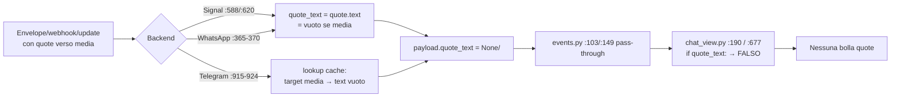

# Design operativo V2 — Bug #37: quote di un'immagine (ingresso invisibile, creazione impossibile)

| Campo | Valore |
|---|---|
| Bug | [#37](BUGS.md) — "Quote immagine: invisibile in ingresso, non creabile da TUI" |
| Stato | APERTO (deve restare APERTO finché non passa la verifica empirica, §10) |
| Tipo | Design v2 (analisi + specifiche; nessun codice in questo documento) |
| Sostituisce | `DESIGN_QUOTE_MEDIA_37.md` (V1), rimosso col revert #51; recuperabile con `git show 1721d71:docs/DESIGN_QUOTE_MEDIA_37.md` |
| Aree | `models.py`, `backends/{signal,whatsapp_events,telegram}.py`, `ui_components.py`, `tui/{chat_view,unread_reply,send,download}.py`, `tests/` |

---

## 0. Perché una V2 — registro fattuale dei tentativi falliti

Il 23/08/2026 il bug è stato affrontato tre volte e tutto è stato revertato
(PR #51, commit `12ef291`, su richiesta utente). I fatti osservati su filo reale
(non opinioni) sono i vincoli di questo design:

| # | Commit | Cosa faceva | Esito osservato |
|---|---|---|---|
| 1 | `1721d71` (PR #46) | Ingresso: segnaposto tipizzato in `quote_text` (`media_quote_placeholder` in `models.py`); uscita: `ImageWidget.ReplyRequested` (Alt+click/Alt+R); il segnaposto "🖼️ Immagine" viaggiava come `quoteMessage` Signal | **F2**: il destinatario mostra **"Original message not found"**: il testo fittizio non corrisponde al body reale (vuoto) del messaggio quotato. Parti ingresso/UI **non** implicate nel fallimento. |
| 2 | `8168427` (PR #48) | Omette `quote_message` per quote media Signal senza caption (flag `quote_is_placeholder`) | **F3**: **senza `quoteMessage` signal-cli non crea la quote** (revert `7083051`). |
| 3 | `d6799e1` | Separa testo di display da testo di filo: `ReplyRequested.caption` (caption reale o `None`) distinto da `text`; `_reply_to["quote_wire_text"]`; worker invia caption o `""` | Revertato col revert totale **prima di verifica empirica completa**. Direzione corretta, ma con un buco: `_retry_failed_message` ricostruisce `reply_data` dalla cache (`send.py:499-506`) **senza** il testo di filo → un retry di una reply media dopo riavvio avrebbe rimandato il segnaposto sul filo (F2 di nuovo). |

Fatti acquisiti e vincolanti per qualunque soluzione:

- **F1** — La quote Signal è risolta lato destinatario da `quoteTimestamp`+`quoteAuthor`,
  ma `quoteMessage` deve essere **presente** (F3) e **fedele al body del messaggio
  quotato** (F2): per un media senza caption il body reale è `""`, con caption è la caption.
- **F2/F3 insieme**: la tensione non si risolve né col segnaposto né con l'omissione.
  Si risolve distinguendo **testo di display** (bolla/reply-bar locale) da
  **body sul filo** (ciò che riceve signal-cli). È il contratto centrale di questo design (§4).
- **F4** — Processo: i fix precedenti sono stati mergiati (e il bug marcato RISOLTO in PR #47)
  **senza verifica empirica sul filo**; i test unitari non possono osservare la resa
  a destinazione. In V2 la verifica empirica (§10) è **gate obbligatorio pre-merge**
  e BUGS.md resta APERTO finché non passa.

Cosa viene riusato da V1 (valido, mai implicato nei fallimenti): helper
`models.media_quote_placeholder`, detection per protocollo, pattern Alt+click/Alt+R
simmetrico a Alt+click→edit, propagazione metadati nei due siti di costruzione,
guardia WhatsApp. Cosa cambia: il contratto del testo di filo (§4/§7), la copertura
del path di retry, il gate empirico.

---

## 1. Verifica dei riferimenti (stato attuale, post-revert)

Riletti tutti i sorgenti. Esiti: **C** = confermato alla riga indicata.

| Riferimento | Esito | Note |
|---|---|---|
| `backends/signal.py:588-589` (`dataMessage`) e `:620-621` (`sentMessage`) | C | `quote_text = quote.get("text","") if quote else None` in entrambi i siti; nessuna gestione `quote.attachments`. `quoteTimestamp`/`quoteAuthor` in ingresso **non** vengono estratti (restano `None` in cache/DB, §9 follow-up opzionale). |
| `backends/whatsapp_events.py:365-370` | C | `quote.get("text") or quote.get("body") or quote.get("conversation") or None`; forme media del messaggio gestite a `:246-322` (nested `*Message` `:275-281`, flat `hasMedia` `:302-322`). |
| `backends/telegram.py:915-924` | C | Lookup cache per `reply_to_msg_id`; `quote_text = m.get("text","")` (vuoto per media senza caption). Classificazione tipi del messaggio a `:886-908`. |
| `backends/whatsapp_rest.py:323-343` | C | `send_message` invia **solo** `reply_to` (Baileys id, `:341-342`); i `quote_*` sono accettati in firma e ignorati sul filo. |
| `backends/telegram.py:676-700 / 705-729 / 753-764` | C | `send_message`/`send_message_sync` usano solo `reply_to` (id numerico) via `_validated_reply_to_message_id`; nessun testo di quote sul filo. |
| `backend/rpc.py:137-155` e `:336-385` | C | Subprocess `--quote-timestamp/--quote-author/--quote-message` (`:147-152`); JSON-RPC `quoteTimestamp/quoteAuthor/quoteMessage` (`:377-382`). Parametri inviati solo se `not None` → `quoteMessage=""` viene **inviata** (comportamento voluto, §7). |
| `backends/signal.py:339-356 / 358-401 / 403-422` | C | `send_message`→`_send_message_sync` propaga solo `quote_timestamp/quote_author/quote_message`; `reply_to_message_id` accettato e **scartato** (Signal quota via ts+autore). |
| `models.py:113-159` | C | `ChatMessage.quote_text` (`:154`), `reply_to_message_id` (`:159`). Nessuna migrazione schema: colonne `quote_text/quote_timestamp/quote_author/reply_to_message_id` già in `backend/db.py:84-91, 125-134`. |
| `tui/chat_view.py:190-193` (live) e `:677-679` (cache) | C | Bolla quote montata solo `if quote_text:` → `Static(f"▎ {quote_text}")`. |
| `tui/chat_view.py:_add_message` 128-263; `_render_image_in_chat` 305-352; `_build_message_widgets` 660-723 | C | `_render_image_in_chat` riceve solo `attachment_id/attachment_info/is_mine/chat_log/protocol`: i metadati reply (timestamp/sender/message_id) vanno aggiunti alla firma. `_image_caption` (`:88-117`), `_is_technical_media_label` (`:54-69`), `_is_synthetic_media_text` (`:72-85`) già disponibili per la caption reale. |
| `ui_components.py::MessageWidget` 306-563 | C | Pattern Alt+click→`EditRequested`: `on_click` `:485-508` (`event.meta`), `action_request_edit` `:510-521`, `Binding("alt+e")` `:358-360`, `set_selected` `:473-483`. |
| `ui_components.py::ImageWidget` 565-635 | C | Solo `ImageClicked(path, attachment_id)` (`:574-582`); click `:608-613`, `key_enter` `:630-635`, nessun metadato messaggio, nessun `set_selected`. Consumer unico di `ImageClicked`: `tui/download.py:102-133`. |
| `tui/unread_reply.py:87-111 / 113-126 / 128-201` | C | `_update_reply_bar` legge solo `_reply_to["text"]` (`:100-105`); `_cancel_reply` già protetto da try/except su `set_selected` (`:117-124`). |
| `tui/send.py:76-78 / 83-95 / 98-112 / 228-235 / 251-257 / 459-517` | C | Cattura reply `:76-78`; guard Telegram `:83-95`; dati ottimisti `:98-112` e cache UI `:133-149`; estrazione quote nel worker `:232-235`; `send_kwargs` `:251-257`; retry `:459-517` (reply_data ricostruito da cache a `:499-506`). |
| `tui/events.py:96-115 / 145-157` | C | Mirror cache UI e `_add_message` live passano `quote_text` così com'è: scrivendo il segnaposto nel backend, tutta la pipeline resta invariata. |
| `tui/download.py:47-89 / 102-133` | C | `_start_download(text, attachment_id, timestamp, protocol)`; handler `ImageClicked` con lazy-resolve e download-mode. |
| `tui/css.py` `.msg-quote`/`.msg-quote-right` | C | Nessuna modifica CSS prevista. |

---

## 2. Root cause (tre facce)

### 2.1 Ingresso — quote media ricevuta invisibile



Quando il quotato è un media, il testo della quote è vuoto per natura (il contenuto
è l'allegato); nessun layer produce un'etichetta alternativa.

### 2.2 Uscita — impossibile quotare un'immagine dalla TUI

Il flusso reply parte solo da `MessageWidget` (testo). Click/Enter su `ImageWidget`
→ `ImageClicked` → `tui/download.py` apre `ImageModalScreen`; nessun percorso verso
`self._reply_to`. Inoltre `ImageWidget` non conosce `timestamp/sender/is_mine/message_id`
del messaggio (persi nei siti di costruzione).

### 2.3 Uscita — fedeltà del filo Signal (scoperta col tentativo #46)

Con le facce 2.1/2.2 risolte ingenuamente, la TUI manda sul filo Signal il
testo **di display** ("🖼️ Immagine") come `quoteMessage`. Fatti: F2 (testo non
corrispondente al body → "Original message not found" a destinazione) e F3
(`quoteMessage` omesso → signal-cli non crea la quote). Quindi serve un terzo
corretto: **il body di filo deve essere quello reale del messaggio quotato**
(caption o `""`), diverso — in generale — dal testo mostrato localmente.

---

## 3. Decisione A — Ingresso: segnaposto tipizzato in `quote_text` (ripresa da V1, invariata)

### 3.1 Contratto

Unica fonte di verità in `models.py` (modulo puro, già importato da tutti i backend):

```
MEDIA_QUOTE_PLACEHOLDERS: dict[str, str]   # "image"→"🖼️ Immagine", "sticker"→"🎨 Sticker",
                                           # "attachment"→"📎 File", "audio"→"🎵 Audio", "video"→"🎬 Video"
media_quote_placeholder(msg_type: str, detail: str | None = None) -> str
```

Regola di composizione identica nei tre backend (priorità: testo reale > segnaposto > `None`):

1. se la quote porta un testo/caption utente → usato tale (invariato);
2. altrimenti se la quote identifica un media → segnaposto tipizzato, opzionalmente
   arricchito da filename;
3. altrimenti → `None` (nessuna bolla, come oggi).

Aggiunta rispetto a V1, necessaria per §7.2 (retry): accanto al helper, sempre in
`models.py`, un predicato puro:

```
is_media_quote_placeholder(text) -> bool   # True se text è esattamente uno dei
                                           # 5 segnaposto canonici (valori della mappa)
```

Il predicato riconosce **solo** le 5 stringhe canoniche (la forma composta
`"filename — segnaposto"` di §3.2-Signal esiste solo in ingresso/display e mai come
target di reply, §4.3).

### 3.2 Riconoscimento per protocollo

- **Signal** (`backends/signal.py:588-589` e `:620-621`): helper di modulo
  `_signal_quote_text(quote)`: `quote.text` se presente; altrimenti se
  `quote.attachments` non vuoto, il primo attachment decide il tipo via
  `contentType` (`image/*`→image, `video/*`→video, `audio/*`→audio, altro→attachment),
  `filename` anteposto se presente; altrimenti `None`. Sticker quotato senza
  attachment degrada a "🖼️ Immagine" (verifica empirica §10). **Entrambi i siti**
  (`dataMessage` e sync `sentMessage`) usano lo stesso helper: così anche l'echo
  delle nostre reply media (faccia 2.3) rientra col segnaposto e la nostra bolla
  uscente mostra la quote dopo riavvio.
- **WhatsApp** (`backends/whatsapp_events.py:365-370`): le forme della quote
  specchiano quelle dell'attachment del messaggio (`:246-322`): chiavi annidate
  `imageMessage/videoMessage/audioMessage/documentMessage/stickerMessage` (sulla
  quote o sotto `quote.message`), poi `type` piatto, poi `mimetype`. Testo/body/
  `conversation`/`caption` presenti → priorità al testo (invariato).
- **Telegram** (`backends/telegram.py:915-924`): il target è risolto in cache locale;
  se `msg_type != "text"` si compone il segnaposto da caption (`text`) o da
  `msg_type`+`attachment_info` (mappa label→tipo come V1: "Photo"→image,
  "🎬 Video"→video, "🎤 Voice"/"🎵 Audio"→audio, "📎 Document"→attachment).
  Target non in cache → `None` (limitazione documentata, non si inventa il tipo).

### 3.3 Sede del fallback

Nei **backend** (punto di estrazione), con la sola composizione stringa centralizzata
in `models.py`. Motivo (confermato da V1): a valle dei backend l'informazione "la quote
punta a un media" è persa; mettere il fallback in `tui/events.py`/`_add_message`
richiederebbe nuovi campi payload + migrazione schema per la cache. Scrivendo il
segnaposto in `payload["quote_text"]`, mirror (`events.py:103`), persistenza,
rendering live (`:190`) e da cache (`:677`) funzionano senza modifiche.

Contro registrato (come V1): il segnaposto entra nel DB come `quote_text`. Accettato:
è un campo di presentazione; il dedup non usa la quote; §7.2 gestisce il caso in cui
quel testo di display riaffiori sul path di invio.

---

## 4. Decisione B — Uscita: reply dall'`ImageWidget` (ripresa da V1 + campo caption)

### 4.1 Interazione

**Alt+click / Alt+R → reply; click / Enter → modal** (invariato rispetto a V1):
simmetrico al pattern Alt+click→edit di `MessageWidget` (`ui_components.py:485-508`);
non regredisce l'apertura in modal né i test esistenti su click/Enter → `ImageClicked`.

### 4.2 Estensione `ImageWidget` (`ui_components.py:565-635`)

Costruttore esteso con parametri opzionali (retrocompatibile; differenza da V1:
sparisce il flag `is_placeholder` del tentativo #48, resta la `caption` del tentativo #3):

```
ImageWidget(attachment_path, attachment_id="", fallback_text=..., *,
            timestamp=0, sender="", is_mine=False, message_id=None,
            msg_type="image", caption=None, attachment_info=None, protocol="")
```

Nuovo evento (campi definitivi del contratto, §5):

```
ImageWidget.ReplyRequested(text,           # display: caption reale o segnaposto tipizzato
                           caption,        # caption reale dell'utente o None — il body di filo (§7)
                           timestamp, sender, is_mine,
                           message_id, attachment_id)
```

- `text = caption or media_quote_placeholder(msg_type)` (display per reply-bar/bolla);
- `caption` è la **caption reale** estratta da `_image_caption(...)` nei siti di
  costruzione, o `None`: è l'unica fonte del body di filo (§7);
- `Binding("alt+r", "request_reply")` + `action_request_reply()` (specchio di
  `action_request_edit` `:510-521`); `on_click` con branch `event.meta` →
  `ReplyRequested`, ramo normale invariato → `ImageClicked`; `key_enter` invariato;
- `set_selected(selected)` con bordo verde `#4ebf71` come `MessageWidget.set_selected:473-483`
  (e `on_focus`/`on_blur :622-628` a non sovrascrivere il bordo se selezionato).

Nota (da V1): il testo di reply usa `caption`/segnaposto, **non** il `text` di cache
sintetico (`"Media: <id>"`, `"{label}: {att_id}"`).

### 4.3 Siti di costruzione (metadati da propagare)

| Sito | Riga | Dati disponibili | Azione |
|---|---|---|---|
| `_add_message` → `_render_image_in_chat` | `chat_view.py:201-207` / `305-352` | `timestamp`, `sender`, `is_mine`, `message_id`, `caption` (da `_image_caption` `:197`), `protocol` | estendere la firma di `_render_image_in_chat` (passatutto) e passarli a `ImageWidget` in entrambi i rami (`:327-335`, `:337-344`) |
| `_build_message_widgets` | `chat_view.py:688-694` | dict cache completo: `ts`, `sender`, `is_mine`, `message_id = msg.get("id")` (`:674`), `caption` (`:682`), `attachment_info` | passarli a `ImageWidget` |

### 4.4 Handler e reply-bar (`tui/unread_reply.py`)

Nuovo `on_image_widget_reply_requested(event)`, speculare a
`on_message_widget_message_clicked:128-201`:

- download-mode → `_start_download(text=event.text, attachment_id=event.attachment_id, timestamp=event.timestamp)` (firma `download.py:47-53`);
- ri-click sullo stesso target (match per `timestamp`) → `_cancel_reply()`;
- mutua esclusione con `_cancel_edit()`;
- popola `self._reply_to` con la chiave nuova di contratto:

```
_reply_to = {
    "text": event.text,                       # display (reply-bar / bolla / DB)
    "timestamp": event.timestamp,
    "sender": event.sender,
    "is_mine": event.is_mine,
    "quote_wire_body": event.caption,         # body di FILO: caption o None (§7) — chiave presente SOLO per reply media
    ["message_id": event.message_id,]         # se presente
}
```

- highlight via scansione children su `isinstance(child, ImageWidget) and child._timestamp == event.timestamp`;
- `_update_reply_bar()` + focus sull'input. La reply-bar (`:100-105`) e
  `_cancel_reply` (`:113-126`) restano **invariati** (lavorano già su `_reply_to["text"]`
  e su `_widget.set_selected`).

Differenza di pulizia rispetto a V1: `attachment_info` non viene più copiato in
`_reply_to` (mai letto a valle); resta sul widget per il segnaposto.

### 4.5 Flusso risultante

```mermaid
sequenceDiagram
    participant U as Utente
    participant IW as ImageWidget
    participant UR as UnreadReplyMixin
    participant SB as SendMixin
    participant BE as Backend

    U->>IW: Alt+click / Alt+R
    IW->>UR: ReplyRequested(text=display, caption, ts, sender, is_mine, message_id)
    UR->>UR: _reply_to = {text, quote_wire_body=caption, ts, ...}; set_selected(True)
    UR-->>U: reply-bar "↩️ Replying to: 🖼️ Immagine"
    U->>SB: Enter sulla risposta
    SB->>SB: quote_display = _reply_to.text per bolla/DB<br/>quoteMessage = quote_wire_body ?? "" (§7)
    SB->>BE: send_message_sync(..., quote_timestamp, quote_author, quote_message, reply_to_message_id)
    Note over BE: Signal: ts+author+body fedele<br/>WhatsApp: solo reply_to=id<br/>Telegram: solo reply_to=id
```

---

## 5. Contratto dati: display vs filo (cuore della V2)

Due grandezze distinte, esplicitate su tutto il percorso:

| Grandezza | Dove vive | Valore | Consumatori |
|---|---|---|---|
| `quote_text` / `_reply_to["text"]` (display) | modello/cache/DB/UI | caption reale **o** segnaposto tipizzato | reply-bar, bolla ▎, DB `quote_text`, echo/ingest |
| `quote_wire_body` (filo) | solo `_reply_to` (chiave opzionale) | `ReplyRequested.caption`: caption reale o `None` | `_send_message_worker` → `quote_message` (Signal) |

Regole:

- **R1**: `_reply_to` da un `MessageWidget` (reply a testo) **non** contiene la chiave
  `quote_wire_body` → il worker usa `text` come `quote_message` (comportamento attuale, invariato).
- **R2**: `_reply_to` da un `ImageWidget.ReplyRequested` **contiene sempre** la chiave
  `quote_wire_body` → il worker usa `quote_wire_body or ""` come `quote_message`
  (mai il display, mai `None`-omesso: F3).
- **R3**: il display non raggiunge MAI il parametro `quote_*` dei backend quando il
  target è un media; il segnaposto non esce dalla macchina.
- **R4**: per WhatsApp/Telegram il valore è irrilevante sul filo (righe sotto) ma la
  regola resta uniforme: semplicità di ragionamento e di test.

| Protocollo | Identificativo target sul filo | Cosa viaggia | Impatto del segnaposto |
|---|---|---|---|
| Signal | `quoteTimestamp`+`quoteAuthor` (`rpc.py:377-382`); `quoteMessage` obbligatorio (F3) e fedele (F2) | body reale: caption o `""` | Risolto da R2 |
| WhatsApp | `reply_to` = Baileys id (`whatsapp_rest.py:341-342`) | solo l'id | Nullo (quote_* ignorati) |
| Telegram | `reply_to` = id numerico (`telegram.py:694/723`) | solo l'id | Nullo |

---

## 6. Decisione C — Guardie di invio e retry

### 6.1 Guardia WhatsApp (da V1)

`send.py` dopo la guardia Telegram `:83-95`: se `reply_data and protocol ==
PROTOCOL_WHATSAPP and not reply_to_message_id` → rifiuta con messaggio di stato
("Cannot reply: the original WhatsApp message ID is unavailable") **prima** della
bolla ottimistica. Motivo: WAHA applicherebbe la reply al target sbagliato o la
scarterebbe. Limitazione nota: la nostra immagine appena inviata ha
`_message_id=None` finché non si ricarica la chat (l'upgrade id,
`send.py:444-457`, tocca solo `MessageWidget`) → Alt+click su immagine propria
appena inviata rifiuta la reply su WhatsApp; risolta dalla ricarica (ids da cache).

Guardia Telegram `:83-95`: invariata, già applicabile ai media (stesso `message_id`).

### 6.2 Retry dopo riavvio (il buco del tentativo #3)

`_retry_failed_message` (`send.py:499-506`) ricostruisce `reply_data` dalla riga
persistita: per una reply media fallita e ritentata dopo reload, `text` torna ad
essere il **segnaposto** e la chiave `quote_wire_body` non esiste più → senza
corretto, F2 ritornerebbe.

Corretto (R2-bis): in `_retry_failed_message`, quando si ricostruisce `reply_data`
da cache, se `is_media_quote_placeholder(message["quote_text"])` (§3.1) allora
impostare `reply_data["quote_wire_body"] = ""`. Il worker non cambia regola
(`"quote_wire_body" in reply_data` → `or ""`, altrimenti `text`). Caso limite
accettato e documentato: un utente che quota un **testo** identico a un segnaposto
canonico (es. scrive davvero "🖼️ Immagine") vedrebbe `quoteMessage=""` al retry —
probabilità trascurabile, degrado a quote con preview vuota ma target corretto
(ts+autore), nessun "Original message not found" garantito a priori (§9, rischio R2).

Perché non una colonna `quote_wire_body` in DB: richiederebbe `ALTER TABLE`,
modifica di insert/read/mirror per un path (retry falliti post-reload su media)
raro; il predicato su stringa copre il caso senza migrazione. Alternativa registrata in §8.

---

## 7. Decisione D — Fedeltà del filo Signal (risoluzione della tensione quoteMessage)

### 7.1 Strategia

**`quoteMessage` = body reale del messaggio quotato = caption se presente, `""` se il media è senza caption.** Mai il segnaposto (F2), mai omesso (F3).

Mappatura esatta nei siti:

- `tui/send.py:232-235` (worker): dopo l'estrazione attuale —

```
quote_message = reply_data.get("text") if reply_data else None
# + regola unica R1/R2:
#   if reply_data is not None and "quote_wire_body" in reply_data:
#       quote_message = reply_data["quote_wire_body"] or ""
```

  La bolla ottimistica, la cache UI e l'ingest (`:98-112`, `:133-149`) continuano a
  usare il **display** (`reply_data["text"]`): UX locale invariata ("🖼️ Immagine"
  in bolla e reply-bar). Nessun filtro per protocollo nel worker: la chiave
  `quote_wire_body` esiste solo per reply media (R1/R2) e per WA/TG il valore è
  comunque ignorato a valle (`whatsapp_rest.py:341`, `telegram.py:696/725`).

- `backend/rpc.py`: `quote_message=""` è diverso da `None` (`:151-152`, `:381-382`
  inviano solo `if not None`) → `""` viene serializzato (`quoteMessage: ""` /
  `--quote-message ""`): è esattamente il body reale di un media senza caption.
  **Nessuna modifica a rpc.py/base/manager/backends**: la firma `quote_message:
  str | None` già trasporta la stringa vuota.

### 7.2 Perché è sicuro per il destinatario

Il client destinatario risolve la quote da `quoteTimestamp`+`quoteAuthor` verso il
proprio archivio e vi associa il `quoteMessage`: col body fedele (caption o `""`)
l'associazione riesce e la quote si rende come riferimento al media; col segnaposto
F2 ha mostrato che fallisce ("Original message not found"), senza `quoteMessage`
F3 ha mostrato che signal-cli non la crea. La strategia è l'unica compatibile con
entrambi i fatti. **Resta da confermare empiricamente** (§10, TC-E1) che
`quoteMessage=""` produca la quote attesa a destinazione: è l'ipotesi che tutto il
design collauda, con piano B in §8.

### 7.3 Echo della nostra reply media

Il sync `sentMessage` riporta `quote.text=""` (ciò che abbiamo inviato) ma con
`quote.attachments` → `_signal_quote_text` (§3.2) compone il segnaposto: la nostra
bolla uscente continua a mostrare "▎ 🖼️ Immagine" dopo echo/riavvio. Display e filo
restano separati in modo coerente in entrambe le direzioni.

---

## 8. Alternative scartate

| Alternativa | Perché scartata |
|---|---|
| Segnaposto come `quoteMessage` (tentativo #46) | F2: "Original message not found" a destinazione. |
| Omettere `quoteMessage` per media senza caption (tentativo #48) | F3: signal-cli non crea la quote (revert `7083051`). |
| Flag booleano `quote_is_placeholder` (forma del #48) | Il flag esprime "ometti", non "cosa inviare"; col body fedele serve il **valore** (caption o `""`): il campo `caption`/`quote_wire_body` è strettamente più informativo. |
| Colonna DB `quote_wire_body` | Migrazione schema + insert/read/mirror per coprire il solo retry post-reload; il predicato `is_media_quote_placeholder` (§6.2) basta. Rimandata se emergeranno altri consumer del dato strutturato. |
| Campi quote strutturati (`quote_msg_type`/`quote_attachment_info`) in payload e DB | Come V1: costo (ALTER TABLE + doppio rendering) senza beneficio funzionale per #37; follow-up se servirà styling per tipo. |
| Normalizzazione unica in `tui/events.py`/`_add_message` | Tipo del quotato perso a valle dei backend (§3.3). |
| Click→reply / Enter→modal | Rompe due convenzioni consolidate e i test `ImageClicked`. |
| Menu contestuale / solo tastiera | Scopribilità scarsa; Alt+R resta il percorso da focus. |
| **Piano B** se TC-E1 fallisse (`quoteMessage=""` non accettata): arricchire la quote Signal con il riferimento all'attachment (`quoteAttachments` del JSON-RPC `send`, se la versione di signal-cli in uso lo espone) invece del body | Dipende dalla versione di signal-cli; da esplorare solo a fallimento constatato, per non introdurre complessità non necessaria. Registrato qui per non perdere il percorso. |
| Backfill storico delle quote media pre-fix | Tipo del quotato irricostruibile dai dati persistiti; valore basso. |

---

## 9. Rischi residui e mitigazioni

1. **R1 — `quoteMessage=""` non crea la quote** (ipotesi centrale da falsificare):
   gate empirico TC-E1 pre-merge; piano B in §8. Log temporaneo dei params JSON-RPC
   durante la verifica per osservare il payload esatto.
2. **R2 — Collisione segnaposto/testo reale al retry** (§6.2): accettata; nessun
   danno irreversibile (target risolto da ts+autore).
3. **R3 — Caption uguale a etichetta tecnica**: `_image_caption` classifica
   "photo.jpg" come tecnica → `caption=None` → filo `""` mentre il body reale era
   "photo.jpg" → possibile "Original message not found". Caso limite già accettato
   per il display (`chat_view.py:101-103`); mitigazione futura: passare ai siti di
   costruzione anche il `text` grezzo e comporre `caption` con regola
   protocollo-specifica più stretta. Registrato, non bloccante.
4. **R4 — Forme quote non catalogate** (sticker Signal senza attachment, varianti
   WAHA): degrado a segnaposto generico/assenza bolla, mai crash; logging debug del
   payload quote.
5. **R5 — Reply su immagine propria appena inviata (WhatsApp)**: bloccata dalla
   guardia finché non si ricarica (§6.1).
6. **R6 — Gruppi Signal**: `quote_author = contact_id` (`send.py:233`) assume chat
   1:1; in gruppo l'autore della quote sarebbe il sender originale. Limitazione
   preesistente, non toccata da questo design (WhatsApp gruppi usa `reply_to`=id, ok).
7. **R7 — Dedup/merge**: nessun impatto (confrontano testo/timestamp/id del
   *messaggio*, mai della quote); la reply-bar e il truncamento >60 char già gestiti.

---

## 10. Piano test

### 10.1 Unit/integration (blueprint: i +57 test del tentativo #46, ancora validi)

Fixture condivise in `tests/conftest.py`: envelope Signal con quote verso immagine
(senza `text`, con `attachments[0].contentType`), raw WAHA con
`quotedMessage.*Message`, entry cache Telegram foto senza caption.

| # | File | Test | Copre |
|---|---|---|---|
| 1 | `tests/test_backends.py` | `test_signal_quote_image_placeholder` + varianti video/audio/document; `test_signal_sent_message_quote_media`; `test_signal_quote_caption_preferred` | A — Signal `:588`/`:620` |
| 2 | `tests/test_whatsapp_backend.py` | nested `*Message`, flat `type`/`mimetype`, body/caption vincono | A — WhatsApp `:365` |
| 3 | `tests/test_telegram.py` | placeholder da cache, caption da cache, miss cache → `None` | A — Telegram `:915-924` |
| 4 | `tests/test_models.py` (o ovunque stiano i test models) | `media_quote_placeholder` mappatura/priorità; `is_media_quote_placeholder` true/false | A — contratto models |
| 5 | `tests/test_ui_components.py` | Alt+click/Alt+R → `ReplyRequested` con **campi `text` e `caption` distinti**; click/Enter ancora `ImageClicked`; `set_selected` border toggle | B — widget |
| 6 | `tests/test_reply_media.py` | handler: `_reply_to` contiene `quote_wire_body` (=caption o `None`); reply-bar mostra display; secondo click cancella; mutua esclusione con edit; download-mode serve il file | B — handler |
| 7 | `tests/test_refresh_chat.py` | `ImageWidget` da cache porta metadati; bolla quote media da cache | D — storico |
| 8 | `tests/test_send_persist_offthread.py` | **media senza caption → `send_kwargs["quote_message"] == ""`** (mai segnaposto media); media con caption → `== caption`; reply a testo → invariato (chiave assente); bolla ottimistica/DB mantengono il **display**; guardia WhatsApp senza id | C — filo |
| 9 | `tests/test_send_persist_offthread.py` (o `test_retry*`) | retry dopo reload di reply media con `quote_text` segnaposto → `reply_data["quote_wire_body"] == ""`; retry di reply a testo → invariato | C — retry (buco #3) |
| 10 | `tests/test_backends.py` | regressione dedup con quote segnaposto | D — dedup |

`make test` completo senza regressioni (attenzione a `tests/test_download_mode.py`
per `ImageClicked` e a `tests/test_edit_flow.py` per la mutua esclusione reply/edit).

### 10.2 Verifica empirica obbligatoria (gate pre-merge — F4)

Setup: signal-cli daemon in esecuzione, un contatto reale di test per protocollo,
logging temporaneo (debug) dei params `send` JSON-RPC.

| TC | Procedura | Criterio di accettazione |
|---|---|---|
| E1 | TUI: Alt+click su immagine Signal **senza** caption → invia risposta | Destinatario (client ufficiale) vede la **quote con l'immagine**, NON "Original message not found"; params loggati: `quoteMessage == ""`, `quoteTimestamp/quoteAuthor` corretti |
| E2 | Come E1 su immagine **con** caption | Quote ricevuta con immagine; `quoteMessage == caption` |
| E3 | Reply a **testo** Signal (regressione) | Invariato: quote testuale corretta |
| E4 | Ingresso: dal client ufficiale quotare immagine/sticker/video/audio/documento (con e senza caption) | Bolla ▎ corretta nella TUI, anche dopo ricarica chat e riavvio app (cache) |
| E5 | WhatsApp: TUI risponde a foto | Destinatario vede quote nativa; retry/guardia ok; reply a propria foto appena inviata → rifiutata fino a reload (R5) |
| E6 | Telegram: TUI risponde a foto | Destinatario vede quote nativa |
| E7 | Retry: reply media Signal messa in `failed` (backend giù), riavvio app, retry | Destinatario vede quote media; params: `quoteMessage == ""` (buco #3 chiuso) |

Solo a gate superato: BUGS.md #37 → RISOLTO con nota della verifica (mai prima — lezione PR #47).

---

## 11. Siti di modifica riepilogativi

| File | Righe | Azione |
|---|---|---|
| `models.py` | dopo `:55` | `MEDIA_QUOTE_PLACEHOLDERS`, `media_quote_placeholder`, `is_media_quote_placeholder` (puro) |
| `backends/signal.py` | `:588-589`, `:620-621` + nuovo helper di modulo | `_signal_quote_text(quote)` con fallback attachments |
| `backends/whatsapp_events.py` | `:365-370` + nuovi helper di modulo | `_wa_quote_text`/`_wa_quote_media_type` (forme annidate/flat/mimetype) |
| `backends/telegram.py` | `:922-923` + helper | `_tg_quote_text_from_cached(target)` |
| `ui_components.py` | `:565-635` | `ImageWidget`: metadati, `ReplyRequested(text, caption, ...)`, `Binding alt+r`, `on_click` meta-branch, `set_selected`, focus/blur consapevoli |
| `tui/chat_view.py` | `:201-207`, `:305-352` (firma), `:327-344`, `:688-694` | passare `timestamp/sender/is_mine/message_id/caption/attachment_info/protocol` a `ImageWidget` |
| `tui/unread_reply.py` | dopo `:201` | `on_image_widget_reply_requested` con `quote_wire_body` in `_reply_to` |
| `tui/send.py` | dopo `:95`; `:232-235`; `:499-506` | guardia WhatsApp; regola R1/R2 su `quote_message`; normalizzazione retry via `is_media_quote_placeholder` |
| `tests/` | — | §10.1 |

Nessuna modifica a: `backend/rpc.py` (già invia `""` quando non `None`), `backend/db.py`
(schema sufficiente), `tui/css.py`, `tui/download.py` (handler `ImageClicked` invariato),
`tui/events.py` (pass-through).

Layering invariato: `models` puro ← backend; `ui_components` importa solo `models`;
`tui/*` orchestra. `_image_caption` resta in `chat_view.py` (UI) e alimenta il
costruttore di `ImageWidget`: nessuna dipendenza backend→UI.

---

## 12. Piano di implementazione ordinato

1. `models.py`: helper + predicato + test (§10.1 #4).
2. Ingresso: i 3 backend + test (§10.1 #1-3). Verifica manuale E4 anche qui.
3. `ImageWidget`: metadati + evento + binding + `set_selected` + test (§10.1 #5).
4. Siti di costruzione in `chat_view.py` + test cache (§10.1 #7).
5. Handler `unread_reply.py` + test integrazione (§10.1 #6).
6. `send.py`: regola R1/R2, guardia WhatsApp, retry + test (§10.1 #8-9).
7. Regressione completa `make test` + lint.
8. **Gate**: verifica empirica §10.2 completa (E1-E7) con params loggati; solo dopo,
   aggiornare BUGS.md (#37 → RISOLTO) e mergiare.

---

## 13. Differenze principali rispetto a V1/tentativi (sintesi per il reviewer)

1. Il segnaposto è **solo display**: il filo Signal porta il body reale (caption o `""`)
   tramite la chiave esplicita `quote_wire_body` (R1/R2) — risolve F2 senza violare F3.
2. Coperto il **path di retry** (buco del tentativo `d6799e1`) via normalizzazione in
   `_retry_failed_message` con `is_media_quote_placeholder`.
3. Niente flag booleani (`quote_is_placeholder`): un solo valore di verità (`caption`).
4. Verifica empirica promossa a **gate di merge** (F4): niente merge né "RISOLTO" su
   sola base di test unitari.
5. Invariati rispetto a V1: helper/d detection ingresso, pattern Alt+click/Alt+R,
   propagazione metadati, guardia WhatsApp, zero migrazioni schema, zero modifiche a
   `rpc.py`/`db.py`/CSS.
