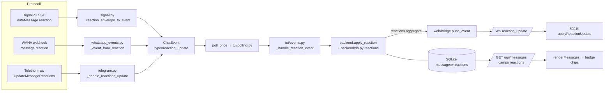

# DESIGN — Reazioni (emoji reactions) nella web UI

> **Stato:** IMPLEMENTATA (MVP display-only) — task §9 completati. Sezione "Reperti live post-implementazione" (§12) registra i bug trovati in testing reale e le relative fix. Basato su ricognizione del codice, del DB reale, del jar signal-cli 0.14.7, della libreria Telethon 1.44 installata e della documentazione WAHA.
> Data: 29/08/2026; aggiornato 30/08/2026.

## 1. Obiettivo
Visualizzare nella web UI le **reazioni emoji** ai messaggi (es. 👍 su un proprio messaggio), per i tre backend (Signal, WhatsApp, Telegram), con aggiornamento live via WebSocket. **Fuori scope per l'MVP:** invio di reazioni (nessun optimistic send), rendering nella TUI, custom emoji Telegram, reazioni alle storie.

## 2. Stato attuale (verificato)

### Codice
- **Nessun handling di reazioni** nell'app: `grep -rni "reaction"` su `backends/`, `backend/`, `web/`, `tui/`, `tests/` → nessun match nel codice applicativo.
- Il flusso di ingest è: backend (`poll_once`) → `tui/polling.py:25-31` → `tui/events.py:_handle_event` (dispatch per `type` a riga 22-39) → `ingest_message` → `backend/db.py:_add_message_to_cache` (238-329). Eventi WS verso la web UI: `web/bridge.py:push_event` (39-53) → `web/ws.py:_broadcast` (37-56).
- Pattern di riferimento da specchiare: **`message_edit`** end-to-end — parse in `backends/signal.py:_edit_envelope_to_event` (1016-1085), mutazione unica `apply_edit` (contratto in `backends/base.py:183-203`), push WS in `tui/events.py:241-257`, apply client in `web/static/app.js:applyRemoteEdit` (1042-1063).

### DB reale (`~/.local/share/signal-tui-client/messages.db`)
Righe `text=''`/`NULL` con `attachment_id IS NULL` — le "mezze bolle" osservate:

| Protocollo | Righe vuote | Totale | Note |
|---|---|---|---|
| Signal | **6** | 699 | mix `is_mine=0/1`, `msg_type='text'`, quote NULL → compatibili con `dataMessage.reaction` / `syncMessage.sentMessage.reaction` |
| WhatsApp | **40** | 1957 | tutte `msg_type='text'` con `msg_id` serializzato (`true_…`/`false_…`) → compatibili con reaction consegnate come messaggi WEBJS |
| Telegram | **8** | 370 | **3** `msg_type='text'` (origine incerta, [DA CONFERMARE #5]) + **5** `msg_type='image'` senza file (media con download mancato/lazy — **non** reazioni, fuori bonifica) |

### Formati on-wire (verificati)
- **Signal** (jar `bin/signal-cli-0.14.7/lib/signal-cli-0.14.7.jar`, record `org.asamk.signal.json.JsonReaction`): `dataMessage.reaction` = `{emoji, targetAuthor, targetAuthorNumber, targetAuthorUuid, targetSentTimestamp, isRemove}`. `JsonSyncDataMessage` incapsula un `JsonDataMessage` completo → la stessa `reaction` arriva anche in `syncMessage.sentMessage` (nostre reazioni da altro device). Oggi `backends/signal.py:_extract_message_data` (915-1004) ignora `reaction`: con `message` assente produce `text=''` → la riga vuota.
- **WhatsApp** (doc WAHA `how-to/events#message.reaction`): evento `message.reaction` con `payload.reaction.text` (emoji; **stringa vuota = rimozione**), `payload.reaction.messageId` (id del messaggio target), `payload.fromMe`, `payload.participant` (gruppi: chi ha reagito). Oggi l'evento **non è sottoscritto**: `desired_events` in `backends/whatsapp.py:540-546` = `["message", "message.any", "message.ack", "message.ack.group", "presence.update"]`; docker-compose `WAHA_WEBHOOK_EVENTS` idem. Le 40 righe vuote erano un **mix** di reaction consegnate come `message`/`message.any` ([DA CONFERMARE #1], in parte confermato §12) e di **media race** (webhook `hasMedia=true` con `media=null`, §12.2).
- **Telegram** (Telethon 1.44 `.venv`, `telethon/tl/types/__init__.py:46669`): `UpdateMessageReactions(peer, msg_id, reactions: MessageReactions)`; `MessageReactions.results: [ReactionCount(reaction, count, chosen_order)]`, `recent_reactions: [MessagePeerReaction(peer_id, date, reaction, big, my)]`; `reaction` è `ReactionEmoji(emoticon)` o `ReactionCustomEmoji(document_id)`. Le reazioni **non** creano messaggi: nessuna "mezza bolla" da reaction; il punto di intercettazione è `_on_raw` (`backends/telegram.py:389-406`).

## 3. Modello dati (schema SQL) e ciclo di vita

### 3.1 Decisione: tabella dedicata `reactions`
Alternative valutate in §10. La tabella è **separata** da `messages` (niente colonna JSON): le reazioni hanno identità propria (target + autore), arrivano come delta/snapshot indipendenti dalla riga messaggio, e devono sopravvivere anche a target fuori dalla finestra di 200 messaggi.

```sql
CREATE TABLE IF NOT EXISTS reactions (
    id INTEGER PRIMARY KEY AUTOINCREMENT,
    protocol TEXT NOT NULL,
    contact_number TEXT NOT NULL,
    target_msg_id TEXT,              -- msg_id del messaggio target (WA: id serializzato; TG: id server; Signal: ts reale come stringa)
    target_timestamp INTEGER,        -- timestamp (ms) del messaggio target (Signal: targetSentTimestamp; opzionale altrove)
    emoji TEXT NOT NULL,             -- grapheme grezzo, nessuna normalizzazione (👍🏽 ≠ 👍 restano badge distinti: accettato)
    author_key TEXT NOT NULL DEFAULT '',  -- identità stabile autore: numero/JID/peer id; 'me' se nostra; '__agg__:<emoji>' per snapshot TG
    author TEXT NOT NULL DEFAULT '',      -- display name best-effort (per title/aria)
    is_mine INTEGER NOT NULL DEFAULT 0,
    count INTEGER NOT NULL DEFAULT 1,     -- >1 solo per righe snapshot Telegram
    timestamp INTEGER NOT NULL            -- ts (ms) dell'ultimo evento che ha toccato la riga
);
CREATE UNIQUE INDEX IF NOT EXISTS idx_reactions_identity
    ON reactions(protocol, contact_number,
                 IFNULL(target_msg_id, ''), IFNULL(target_timestamp, 0), author_key);
CREATE INDEX IF NOT EXISTS idx_reactions_contact
    ON reactions(protocol, contact_number);
```

Creazione in `backend/db.py:_init_db` (133-175) accanto a `messages`; **nessun bump di `_SCHEMA_VERSION`**: `CREATE TABLE/INDEX IF NOT EXISTS` è idempotente, coerente col pattern delle colonne additive garantite fuori dal gate `user_version` (`edited`, `content_type`, db.py:67-95).

### 3.2 Risoluzione del target
La reazione punta al messaggio, non alla riga DB. Regole per protocollo (in `apply_reaction`):

- **Signal**: `targetSentTimestamp` (ms). Per i messaggi **nostri** la riga DB ha `timestamp` ottimistico e `msg_id` = ts reale (invariante documentata in `backends/signal.py:1298-1314`): match `(msg_id = str(target) OR (msg_id IS NULL AND timestamp = target))` — stessa forma di `web/api.py:_message_row_for_edit` (126-163). Si persistono **entrambi** `target_msg_id=str(targetSentTimestamp)` e `target_timestamp=targetSentTimestamp`.
- **WhatsApp**: `reaction.messageId` = id serializzato → match esatto su `msg_id`; fallback per forma canonica (`canonical_msg_id`, `backends/whatsapp_events.py:218-263`) con `msg_id LIKE '%_' || hex` se il payload arrivasse non serializzato ([DA CONFERMARE #2]).
- **Telegram**: `msg_id` = id server → match esatto su `msg_id` (la colonna persiste l'id come stringa).

Se il target non è in DB (fuori finestra 200 o mai scaricato): la riga reaction **viene comunque persistita** (riapparirà se il messaggio entra in cache via `fetch_history`); nessun evento WS se il target non è risolvibile a riga.

### 3.3 Ciclo di vita add / change / remove
Due modalità normalizzate (vedi §4.2):

| Modalità | Protocolli | Semantica |
|---|---|---|
| **delta** | Signal, WhatsApp | un autore = una sola reaction per messaggio. `add/change`: `DELETE` riga `(target, author_key)` + `INSERT` nuova emoji. `remove` (Signal `isRemove=true`, WA `reaction.text=''`): `DELETE` riga `(target, author_key)` (l'emoji non è nota sul remove WA: si cancella per autore, non per emoji). |
| **snapshot** | Telegram | `UpdateMessageReactions` porta lo **stato completo** del messaggio: `DELETE FROM reactions WHERE target AND author_key LIKE '__agg__%'` + insert di una riga per emoji (`author_key='__agg__:<emoji>'`, `count=ReactionCount.count`, `is_mine` da `chosen_order`/`recent_reactions.my`). Gestisce nativamente le multi-reaction per utente di Telegram. |

Idempotenza garantita dal vincolo UNIQUE + ritrattamento libero (WAHA ritenta i webhook; signal-cli ri-consegna; TG ri-emette snapshot).

Helper DB nuovi in `backend/db.py` (stile `_update_message_*`, tutti sotto `_DB_LOCK`):
- `_apply_reaction_delta(protocol, contact, target_msg_id, target_ts, emoji, author_key, author, is_mine, is_remove, ts) -> bool`
- `_replace_reactions_snapshot(protocol, contact, target_msg_id, target_ts, entries, ts) -> bool`
- `_reactions_for_contact(protocol, contact) -> list[dict]` (per l'API, aggregazione in Python)
- `_resolve_reaction_target_row(protocol, contact, target_msg_id, target_ts) -> dict | None` (match §3.2; ritorna `id`, `msg_id`, `timestamp`)
- `_prune_orphan_reactions()` — invocata da `_prune_cache` (464-489): cancella reazioni il cui target non esiste più in `messages`.

### 3.4 Bonifica legacy (mezze bolle già in DB)
Script `migrate_reactions_cleanup.py` (pattern CLI di `migrate_content_type.py`, con `--dry-run` e report per protocollo):

```sql
DELETE FROM messages
WHERE msg_type = 'text' AND (text = '' OR text IS NULL)
  AND attachment_id IS NULL AND attachment_info IS NULL
  AND quote_text IS NULL AND edited = 0;
```

Le 5 righe Telegram `msg_type='image'` senza `attachment_id` sono **escluse** (media con download mancato, non reazioni). La bonifica è sicura solo **dopo** il filtro alla fonte (task 1): senza filtro, WAHA `fetch_history` e le ri-consegne Signal ri-inserirebbero le righe. Nessun tentativo di **recupero** delle reazioni storiche (non ricostruibile dagli empty row: l'emoji non è persistita da nessuna parte).

## 4. Stima complessiva (aggiornata)
~**8 task** (la bozza diceva ~5; il parse WA/TG e la bonifica li esplicitano). Dettaglio e dipendenze in §9.

| Area | Stima |
|---|---|
| Filtro ingest righe vuote (bloccante, P0) | piccolo |
| DB schema + helper + prune | medio |
| Parse per protocollo + `apply_reaction` | la parte grossa (Signal medio, WA medio, TG medio) |
| API + WS | piccolo (pattern `receipt`/`message_edit` pronti) |
| UI web + live | medio-piccolo |
| Bonifica legacy + test E2E | piccolo |

## 5. Parse per protocollo e modello normalizzato

### 5.1 Nuovo tipo di evento
`ChatEvent.type = "reaction_update"` (snake_case, come `message_edit`). Documentato nel docstring di `models.py:ChatEvent` (252-266). Payload:

```python
{
    "target_message_id": str | None,  # §3.2
    "target_timestamp": int | None,  # ms
    "mode": "delta" | "snapshot",
    # mode == "delta":
    "emoji": str,  # "" solo se is_remove
    "is_remove": bool,
    "author": str,  # display best-effort
    "author_key": str,  # identità stabile (numero/JID/peer id / "me")
    "is_mine": bool,
    # mode == "snapshot":
    "snapshot": [{"emoji": str, "count": int, "is_mine": bool, "authors": list[str]}]
    | None,
    "timestamp": int,  # ts evento (ms)
    "contact": ChatContact | None,
}
```

Dispatch: nuovo ramo in `tui/events.py:_handle_event` (22-39) → `_handle_reaction_event`, che chiama `backend.apply_reaction(contact_id, payload)` — **punto unico di mutazione** (specchio del contratto `apply_edit`, `backends/base.py:183-203`; default `None`). `apply_reaction` risolve il target (§3.2), applica delta/snapshot (§3.3) e ritorna `{message_id, timestamp, reactions: [...aggregato...]}` per il push WS, `None` se target ignoto/no-op.

### 5.2 Signal — `backends/signal.py`
Formato (verificato §2): `dataMessage.reaction` / `syncMessage.sentMessage.reaction`.

Intercettazione in `envelope_to_event` (1100-1165), **prima** di `_extract_message_data`, specchiando la struttura di `_edit_envelope_to_event` (1016-1085) — nuovo `_reaction_envelope_to_event(envelope)`:

```text
reaction = dataMessage.reaction          → is_mine=False, author=source
         | syncMessage.sentMessage.reaction → is_mine=True,  author="You"/"me"
emoji = reaction["emoji"]; is_remove = bool(reaction.get("isRemove"))
target = int(reaction["targetSentTimestamp"])
contact = _identify_contact_for_envelope(envelope)   # già gestisce entrambe le forme (766-799)
```

Guardia anti-regressione (come `_has_edit_content`, 1087-1098): un envelope che trasporta `reaction` **non deve mai** cadere nel ramo messaggio → niente più righe vuote (task 1). Per i gruppi Signal l'autore è `source`; il `targetAuthor` serve solo a validare che il target sia nostro/altrui (best-effort, non vincolante per il match).

### 5.3 WhatsApp — `backends/whatsapp_events.py` + `backends/whatsapp.py`
Formato (doc WAHA §2; [DA CONFERMARE #2] per la build 2026.8.1):

```json
{"event": "message.reaction", "payload": {
  "id": "false_...@c.us_...", "from": "...@c.us", "fromMe": false,
  "participant": "...@lid", "timestamp": 1710481111.853,
  "reaction": {"text": "🙏", "messageId": "true_...@c.us_..."}}}
```

1. **Sottoscrizione**: aggiungere `"message.reaction"` a `desired_events` in `_configure_webhook` (`backends/whatsapp.py:540-546`) e a `WAHA_WEBHOOK_EVENTS` in `docker-compose.yml:48`. `_configure_webhook` ri-applica il PUT solo se l'insieme eventi non è già ⊇ desiderato → l'aggiornamento è automatico al primo avvio.
2. **Normalizzazione**: nuovo `_event_from_reaction(raw)` in `whatsapp_events.py` + ramo in `_event_from_raw` (767-813) per `evt == "message.reaction"`. Mapping: `chat_jid` da `from`/`chatId` (come `_event_from_ack`, 630-690: per `fromMe` il contatto è `to`); `author_key = participant or ("me" if fromMe else from)`; risoluzione nome con `_resolve_sender_name` (299-319); `is_remove = (reaction.text == "")`; `target_message_id = reaction.messageId`; `mode="delta"`.
3. **Filtro alla fonte delle consegne come `message`** (causa delle 40 righe vuote, [DA CONFERMARE #1]): in `_event_from_message` (322-598), short-circuit in testa — payload reaction-shaped ⇒ `return []`:
   - `str(raw.get("type") or "").lower() == "reaction"`, oppure
   - `((raw.get("_data") or {}).get("message") or {}).get("reactionMessage") is not None`, oppure
   - `raw.get("reaction") is not None` e nessun `body`/`text`.
   La reaction in forma `message` non porta il target in forma normalizzabile affidabile → si scarta; il canale canonico è `message.reaction`.
4. **Gruppi**: `participant` distingue chi ha reagito (più autori → più righe delta, aggregazione per emoji in API).

### 5.4 Telegram — `backends/telegram.py`
Intercettazione in `_on_raw` (389-406): nuovo ramo

```python
from telethon.tl.types import UpdateMessageReactions, ReactionEmoji
...
elif isinstance(update, UpdateMessageReactions):
    await self._handle_reactions_update(update)
```

`_handle_reactions_update` (specchio di `_handle_read_receipt`, 1178-1221):
- `peer → contact_id` con le **stesse convenzioni** dei receipt (PeerUser → `user_id`; PeerChat → `-chat_id`; PeerChannel → `-1000000000000 - channel_id`).
- `snapshot`: per ogni `ReactionCount` in `update.reactions.results`: solo `ReactionEmoji` (estrae `emoticon`); `ReactionCustomEmoji` → skip con log debug (non renderizzabile come testo, §10). `count`, `is_mine = chosen_order is not None`. Autori da `recent_reactions` (`MessagePeerReaction.peer_id`, flag `my`/`big`) best-effort; `can_see_list=False` → autori vuoti.
- enqueue `ChatEvent("reaction_update", mode="snapshot", target_message_id=str(update.msg_id), ...)`.
- **Filtro alla fonte** separato (le 3 righe text vuote TG, [DA CONFERMARE #5]): in `_message_to_chat_event` (1074-1176) se `text == ""` e nessun attributo media (`photo/document/sticker/video/voice/audio`) e nessun `reply_to` → `return None` (messaggi di servizio/unsupported: mai bolle vuote).

### 5.5 Flusso end-to-end



## 6. Contratto API e WebSocket

### 6.1 `GET /api/messages` — campo `reactions`
In `web/api.py:_messages` (195-333): dopo il loop esistente, una sola query `_reactions_for_contact` + aggregazione per `(target, emoji)` in Python; ogni messaggio ottiene:

```json
"reactions": [
  {"emoji": "👍", "count": 2, "is_mine": true, "authors": ["Giovanni", "You"]}
]
```

- **Aggregazione per emoji** (`2×👍`): `count = SUM(count)` delle righe con stesso target+emoji; `is_mine` = OR; `authors` ordinati, dedupati, solo non vuoti (può essere `[]` per TG con `can_see_list=False`).
- **Ordine**: `count` DESC, poi `MIN(timestamp)` ASC (stabile, niente flicker tra reload).
- **Match riga↔reazioni** (§3.2): `target_msg_id IN (row.msg_id, str(row.timestamp)) OR target_timestamp == row.timestamp`. Copre Signal (ts reale = `msg_id` per i nostri; `timestamp` per incoming/legacy), WA/TG (`msg_id`).
- Nessuna reazione → campo **omesso** (non `[]`): payload invariato per i messaggi senza reaction, retro-compatibile col client.

### 6.2 WS — nuovo tipo `reaction_update`
Push da `tui/events.py:_handle_reaction_event` (stesso punto di `message_edit`, 241-257) e nessun altro:

```json
{"type": "reaction_update",
 "payload": {"protocol": "signal", "contact_id": "+39…",
             "message_id": "1788006653512",   // id API: msg_id o fallback riga
             "timestamp": 1788006653512,      // ts riga messaggio (fallback match)
             "reactions": [{"emoji": "👍", "count": 1, "is_mine": false, "authors": ["Anna"]}]}}
```

- Lo stato è **sempre l'aggregato completo** del messaggio target (snapshot semantico): il client **sostituisce** il set di badge — niente aritmetica add/remove lato JS, riconciliazione banale anche dopo eventi persi (al reconnect `loadMessages()` riallinea comunque, `app.js:1442-1447`).
- `reactions: []` = tutte le reazioni rimosse → il client toglie il contenitore badge.
- Dispatch in `app.js` switch WS (1448-1474): `case "reaction_update": applyReactionUpdate(update.payload)`.
- Nessun invio WS dal client (nessun optimistic send, §1).

## 7. UI web (`web/static/app.js` + `style.css`)

### 7.1 Rendering badge
- Nuovo `appendReactionChips(bubble, item)` invocato in `renderMessages` (706-858) **dopo** `bubble.append(time)` (riga 822): i badge stanno **dentro la bolla, in fondo** (ultima riga). Alternativa "overlap sotto il bordo" scartata (§10).
- Struttura:
  ```html
  <div class="message-reactions" role="group" aria-label="Reazioni: 👍 2, ❤️ 1">
    <span class="reaction-chip mine" title="Giovanni, tu">👍 <span class="reaction-count">2</span></span>
    <span class="reaction-chip" title="Anna">❤️</span>
  </div>
  ```
- `count` mostrato solo se > 1; classe `mine` se `is_mine`; `title` = autori (o la sola emoji se ignoti).
- Riferimento in `state.messageNodes` (844-853): aggiungere `reactionsEl` (il contenitore) + `reactions` (copia dati) all'entry, per l'update live chirurgico.
- I messaggi optimistic (`optimistic_id`) non hanno mai badge (le reaction puntano a messaggi confermati).

### 7.2 Aggiornamento live
`applyReactionUpdate(payload)` (specchio di `applyRemoteEdit`, 1042-1063):
1. Guard: `protocol`/`contact_id` devono essere la chat attiva; altrimenti no-op (il prossimo `loadMessages` riallinea).
2. Lookup entry: `messageNodes.get(String(payload.message_id))` → fallback match per `timestamp` esatto → fallback scan `state.messages` (come receipt, 903-924).
3. Re-render **solo del contenitore**: svuota `reactionsEl` e ricostruisce i chip; se `payload.reactions` vuoto → rimuove il contenitore; se mancava → lo crea e lo appende alla bolla (riferimento `timeEl.parent`).
4. Aggiorna `state.messages[i].reactions` (coerenza per re-render completi).

### 7.3 CSS (additivo, `style.css`)
```css
.message-reactions { display: flex; flex-wrap: wrap; gap: 4px; margin-top: 5px; }
.reaction-chip { display: inline-flex; align-items: center; gap: 3px;
  padding: 1px 7px; border-radius: 11px; font-size: .78rem; line-height: 1.5;
  background: #ffffff14; border: 1px solid #ffffff1f; }
.reaction-chip.mine { background: #4c9aff2e; border-color: #4c9aff66; }
.reaction-count { font-size: .66rem; color: #c3ceda; }
.reaction-chip:empty { display: none; }
```
Palette coerente con i token esistenti (`--incoming`, `--outgoing`, `.message-time` style.css:231-241). Nessuna media query dedicata: i chip fanno wrap naturalmente; su mobile la dimensione resta ≥ tap-adjacent senza essere tap target (badge non cliccabili in MVP).

### 7.4 a11y
- Contenitore `role="group"` con `aria-label` descrittivo aggiornato ad ogni apply ("Reazioni: 👍 2, ❤️ 1").
- Chip non interattivi (`span`, mai `button`): niente falso affordance; `title` per i nomi su hover/focus-visible ereditato.
- Gli emoji restano testo nel DOM → screen reader li leggono come emoji; il conteggio è testo separato.

## 8. Piano test

### 8.1 Python (pytest, pattern esistenti)
| File (nuovo) | Cosa copre | Pattern di riferimento |
|---|---|---|
| `tests/test_reactions_db.py` | creazione tabella idempotente; delta add/change/remove (un autore → una riga); snapshot replace multi-emoji; `_resolve_reaction_target_row` per i 3 protocolli (incl. Signal `msg_id`-vs-`timestamp`); aggregazione; `_prune_orphan_reactions` | `test_db_edit.py`, `test_db_schema_versioning.py` |
| `tests/test_reactions_signal.py` | envelope `dataMessage.reaction` → evento delta; `syncMessage.sentMessage.reaction` → `is_mine`; `isRemove`; reaction-envelope **non** produce evento `message` né riga vuota (filtro); `apply_reaction` persiste | `test_edit_signal.py`, `test_signal_ingest_race.py` |
| `tests/test_reactions_whatsapp.py` | payload `message.reaction` (doc WAHA) → evento delta; gruppo con `participant`; `fromMe`; `text=""` → remove; filtro `_event_from_message` su 3 forme reaction-shaped; `desired_events` include `message.reaction`; fetch_history non re-inserisce righe vuote | `test_edit_whatsapp.py`, `test_whatsapp_backend.py` |
| `tests/test_reactions_telegram.py` | mock `UpdateMessageReactions` → snapshot; `ReactionCustomEmoji` scartato; `chosen_order` → `is_mine`; peer→contact_id (3 convenzioni); filtro empty-text in `_message_to_chat_event` | `test_telegram_edit.py`, `test_telegram.py` |
| `tests/test_web_reactions_api.py` | `/api/messages` espone `reactions` aggregato/ordinato; match per `msg_id` e per `timestamp`; campo omesso senza reaction | `test_web_plugin.py`, `test_web_phase2_fixes.py` |

### 8.2 JS slice (node -e, pattern `tests/test_web_status_edit.py`)
`tests/test_web_reactions_ui.py`:
- `renderMessages` monta i chip sotto la bolla (conteggio solo se >1, classe `mine`, `title` autori, `aria-label` sul contenitore).
- `applyReactionUpdate`: add badge a messaggio esistente; change (replace set); remove ultimo chip → contenitore rimosso; guard chat non attiva; fallback per `timestamp`.
- `reactions: []` e messaggio senza contenitore → no-op pulito.

### 8.3 E2E (manuale, un giro per protocollo)
1. **Reaction su nostro messaggio** (da telefono): badge compare live sotto la bolla out, `is_mine=false`.
2. **Reaction su messaggio altrui** e **nostra reaction da altro device** (chip `mine`).
3. **Change**: 👍 → ❤️ stesso autore → un solo chip aggiornato (niente doppio).
4. **Remove**: badge sparisce; se era l'ultimo, contenitore rimosso.
5. **Aggregazione**: due autori stessa emoji (gruppo WA) → `2×👍`.
6. **Reload**: i badge persistono (SQLite).
7. **Legacy**: dopo `migrate_reactions_cleanup.py --dry-run` poi run reale, le mezze bolle spariscono e **non** ritornano (filtro attivo) né dopo `fetch_history`/restart.
8. **TG**: reaction in 1:1 e change/remove; custom emoji → ignorata senza errori.

## 9. Ordine di implementazione

| # | Task | Stima | Dipende da |
|---|---|---|---|
| 1 | **Filtro ingest righe vuote alla fonte (P0)**: guardia reaction-envelope in `signal.py:envelope_to_event`; short-circuit reaction-shaped in `whatsapp_events.py:_event_from_message`; filtro empty-text in `telegram.py:_message_to_chat_event`. Test: nessun evento/riga da payload reaction | piccolo | — |
| 2 | **Schema `reactions` + helper DB** (`backend/db.py`: CREATE TABLE/INDEX in `_init_db`; delta/snapshot/reazioni-per-contatto/resolve-target; `_prune_orphan_reactions` in `_prune_cache`) + `test_reactions_db.py` | medio | — |
| 3 | **Modello normalizzato**: docstring `models.py:ChatEvent`; `ChatBackend.apply_reaction` default in `backends/base.py`; dispatch `_handle_reaction_event` in `tui/events.py` (senza push WS ancora: no-op sicuro) | piccolo | 2 |
| 4 | **Parse Signal** (`_reaction_envelope_to_event` + `SignalBackend.apply_reaction`) + test | medio | 1, 3 |
| 5 | **Parse WhatsApp** (`_event_from_reaction` + ramo `_event_from_raw`; `desired_events` + docker-compose; `WhatsAppBackend.apply_reaction`) + test | medio | 1, 3 |
| 6 | **Parse Telegram** (`UpdateMessageReactions` in `_on_raw` + `_handle_reactions_update` + `TelegramBackend.apply_reaction`) + test | medio | 1, 3 |
| 7 | **WS `reaction_update`**: push in `_handle_reaction_event` con aggregato completo | piccolo | 4-6 (almeno uno) |
| 8 | **API** campo `reactions` in `/api/messages` + test API | piccolo | 2 |
| 9 | **UI web**: `appendReactionChips` + `applyReactionUpdate` + CSS + `reactionsEl` in `messageNodes` + JS slice test | medio | 7, 8 |
| 10 | **Bonifica legacy** `migrate_reactions_cleanup.py` (+ run sul DB reale) e **test E2E** §8.3; aggiornamento README/sezione feature | piccolo | 1, 9 |

Sequenza critica: **1 prima di 10** (mai bonificare senza filtro attivo); 7-9 possono partire con un solo backend parse pronto (contratto stabile). Stato target dopo task 10 → **"Implementata"**.

## 10. Alternative scartate

| Alternativa | Motivo dello scarto |
|---|---|
| Colonna `reactions` JSON su `messages` | update granulari riscrivono l'intero blob; niente vincolo di unicità per autore; join/aggregazione in SQL impossibili; concorrenza col pruning 200. La tabella dedicata è additiva e non tocca lo schema `messages`. |
| Bump `_SCHEMA_VERSION = 4` | Non serve: `CREATE TABLE/INDEX IF NOT EXISTS` è idempotente ad ogni `_init_db`, come le colonne additive fuori gate (db.py:67-95). Evita churn su DB che già portano `user_version=3` da percorsi eterogenei. |
| Badge **fuori** dalla bolla (overlap stile WhatsApp) | Conflitti di z-index/hit-area coi bottoni `↩`/`✎` (app.js:824-843) e clip dello scroll; per MVP i chip dentro la bolla sono layout-safe. Rivalutabile in polish. |
| Delta WS (add/remove singolo) invece di aggregato | Doppia logica di riconciliazione client e rischio drift dopo eventi persi; l'aggregato completo per messaggio è piccolo (≤ ~10 righe) e auto-riallineante. |
| Invio reazioni (signal-cli `sendReaction`, WAHA reaction API, Telethon `SendReaction`) + optimistic UI | Fuori MVP (§1): richiede contratto di invio, gestione fallimenti e reconciliation optimistic; le primitive esistono (man signal-cli 1, `sendReaction`) e il design le lascia aperte (`is_mine`/`author_key='me'` già previsti). |
| Recupero emoji dalle righe vuote legacy | Impossibile: l'emoji non è mai stata persistita. Si bonifica e basta (§3.4). |
| Custom emoji Telegram (`ReactionCustomEmoji`) | Servirebbe fetch document/sticker per il rendering; per MVP si scartano con log (le standard coprono la quasi totalità d'uso). |
| Normalizzazione emoji (skin tone/ZWJ folding) | Rischio di fondere reaction intenzionalmente diverse; la chiave grezza preserva il wire (documentato come comportamento accettato). |

## 11. Note / rischi / [DA CONFERMARE]

### [DA CONFERMARE] — verifiche a runtime obbligatorie durante i task
1. **WA reaction come `message`/`message.any` (WEBJS)** — ✅ **PARZIALMENTE CONFERMATO** (§12): le righe vuote WA erano un mix di reaction consegnate come messaggi E di **media race** (`hasMedia=true, media=null`). Il filtro del task 1 copre le tre forme reaction-shaped; il filtro "mai bolle vuote" (§12.3) copre la race.
2. **WAHA 2026.8.1 `message.reaction`** — ✅ **CONFERMATO CON REPERTO** (§12.1): le reaction proprie arrivano con `fromMe=true` ma `participant` = **nostro LID** → l'autore deve essere forzato a `"me"` (fix `2c3cbf6`). `reaction.messageId` = id serializzato completo; fallback `canonical_msg_id` già previsto.
3. **Signal sync di reaction nostre**: ⏳ **DA CONFERMARE** — la reaction inviata via daemon **non genera echo SSE verso se stesso** (§12.4); serve un secondo device per osservare `syncMessage.sentMessage.reaction`.
4. **Telegram `UpdateMessageReactions` nelle 1:1**: ⏳ **DA CONFERMARE** — l'utente segnala che le reaction Telegram non arrivano (§12.5, follow-up aperto).
5. **Origine delle 3 righe text vuote Telegram**: ⏳ ipotesi service/unsupported message; il filtro empty-text le blocca a prescindere.
6. **Emoji multi-codepoint**: nessuna normalizzazione; 👍🏽 e 👍 producono badge distinti (accettato, §10).

### Rischi
- **Match Signal su messaggi nostri**: la doppia identità ts-ottimistico/`msg_id`-reale è il punto più delicato; coperto da test dedicato (§8.1) e dalla forma di match già collaudata in `_message_row_for_edit`.
- **WAHA retry webhook**: `_seen_message_keys` non deduplica `message.reaction` (chiavi per `message`); l'idempotenza è affidata al vincolo UNIQUE + semantica delete/insert (§3.3).
- **Pannello contatti**: le reaction **non** toccano `last_message_ts` né i badge unread (una reaction non è un messaggio nuovo): `_handle_reaction_event` non deve marcare `_contact_list_dirty` — diverso da `_handle_message_event`.
- **Pruning**: reazioni orfane dopo il cap 200/contatto — `_prune_orphan_reactions` (task 2) le allinea alla stessa retention.

## 12. Reperti live post-implementazione (30/08/2026)

### 12.1 Reaction proprie WhatsApp attribuite al contatto sbagliato
WAHA 2026.8.1 consegna le reaction proprie con `fromMe=true` ma `participant` = **il nostro LID** (e `_data.message` vuoto). Il parser usava `participant` come autore → la reaction finiva attribuita a un contatto con quel LID. Fix: per `fromMe=true` l'autore è sempre `"me"` (`author_key="me"`, `author="You"`). Commit `2c3cbf6`.

### 12.2 Media race WAHA (hasMedia=true, media=null)
Il webhook `message`/`message.ack` può precedere il download del media: `hasMedia=true` ma `media=null`. Il parser creava una riga `text=''` → bolla vuota (foto invisibile). Tre livelli di fix:
- **Niente bolle vuote** (`9ec70c1`): `_event_from_message` salta i messaggi senza testo e senza media; stesso predicato esteso al path sintetico `message.ack`.
- **Self-heal in place** (`6050de5`): se la riga esiste senza attachment, l'echo/fetch successivo aggiorna `attachment_id`+`msg_type` (helper `_update_message_media_identity`, con guardia SQL anti-sovrascrittura). Prima l'upgrade accettava solo file locali `sent-*` e rifiutava l'URL WAHA.
- **Media resolver** (`downloadMedia=true`): per i casi in race il backend programma un retry con backoff (2s/5s/15s, max 3) su `GET /api/{session}/chats/{chatId}/messages/{messageId}?downloadMedia=true`, ri-ingesta il messaggio col media e `ingest_message` ritorna `"changed"` → push WS → la web UI si aggiorna live.
- **Caption mimetype** (`5447d67`): `attachment_info` = solo mimetype (es. `image/jpeg`) non deve diventare la caption; fallback download per-id quando `media.url` non risponde.
- **Operativo**: `WHATSAPP_FILES_LIFETIME=0` nel docker-compose (default 180s: i media WAHA sparivano dopo 3 minuti).

### 12.3 Regola "mai bolle vuote" (tutti i protocolli)
Un messaggio senza testo e senza media non deve mai essere persistito: Signal (guardia reaction/empty), WhatsApp (skip in `_event_from_message` + path ack), Telegram (filtro empty-text in `_message_to_chat_event`). La bonifica §3.4 è sicura SOLO con filtro e heal attivi (le righe race rientrano con il media al fetch successivo).

### 12.4 Echo SSE Signal delle proprie reaction
La reaction inviata via daemon (JSON-RPC `sendReaction`) viene consegnata al destinatario ma **non ritorna via SSE verso lo stesso daemon** (nessun `syncMessage.sentMessage.reaction` in self-echo; verificato anche per il send normale). Per testare il path Signal serve una reaction da un **secondo device** (sync). In mancanza, la riga può essere iniettata via `_apply_reaction_delta` per la demo (is_mine=True).

### 12.5 Follow-up aperto: reaction Telegram non arrivate
L'utente segnala che le reaction Telegram non compaiono. Da investigare: ricezione di `UpdateMessageReactions` nelle chat 1:1 da `_on_raw`, popolamento di `recent_reactions`, e convenzioni `peer→contact_id`. (Registrato come follow-up dopo la validazione di questo fix.)
