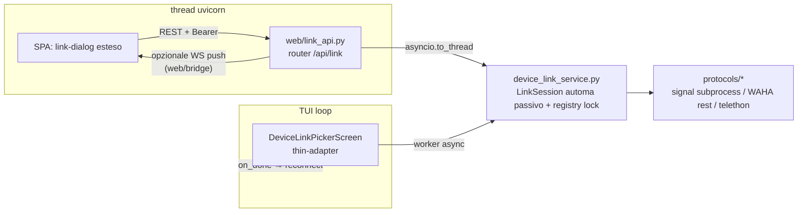

# DESIGN — Plug-in web: device linking (pairing QR) dal browser

**Stato:** Approvato con riserve — riserve integrate (2026-09-02, seconda
revisione architetto-2). Documento di design per portare il linking di
device/account (Signal / WhatsApp / Telegram) nella Web UI, riusando il flusso
TUI. **Nessuna implementazione in questo documento**: solo design. Dove testo
e codice divergeranno in fase di implementazione, farà fede il codice.

**Vincoli:** Python 3.10+ · plug-in (TUI e backend a modifiche minime) ·
TUI sempre attiva (niente headless) · web in-process · frontend HTML5 vanilla,
zero dipendenze JS/CDN · QR come PNG generato **server-side** con le
dipendenze già in `requirements.txt` (`qrcode` + `pillow>=10.3`,
`requirements.txt:2-3`) · la direttiva è riuso massimo, **zero duplicazione**.

---

## 1. Contesto

Oggi il linking vive interamente nella TUI: `DeviceLinkPickerScreen`
(`device_link_screen.py`, 936 righe, `Ctrl+L` via `tui/pickers.py:117-133`)
orchestra per protocollo: **Signal** = subprocess `signal-cli link` con
estrazione URL `sgnl://link` da stdout, **WhatsApp** = WAHA REST
(`protocols/whatsapp_rest.py`: `get_session_status` `whatsapp_rest.py:179`,
`get_pairing_qr` `:233`, `get_fresh_pairing_qr(reset=...)` `:221`), **Telegram** =
`protocols/telegram.py:get_pairing_qr` (`telegram.py:2194`, URL
`tg://login?token=`…), 2FA (`complete_2fa` `telegram.py:2301`, `_needs_2fa`,
`_connected`). Comune: poll ogni 2 s, timeout 5 min, refresh QR ~60 s,
cleanup subprocess su `dismiss` (`device_link_screen.py:795-808`).

La Web UI ha già un modal `#link-dialog` "Collega backend"
(`web/static/index.html:91-130`) con span stato per protocollo
(`#link-status-{signal,whatsapp,telegram}`) aggiornati da
`updateBackendStatuses()` (`web/static/app.js:235-245`) e la nota esplicita
"si collegano dalla TUI (Ctrl+L)" (`index.html:128`). **Il modal va esteso,
non creato da zero.**

## 2. Obiettivi

1. Collegare un nuovo account dai 3 protocolli interamente dal browser
   (schema: protocollo → QR → stato → 2FA Telegram → esito).
2. Rendere la logica di linking un **servizio unico** condiviso TUI/web: la
   TUI diventa un thin-adapter, il web un frontend verso lo stesso servizio.
   Nessuna orchestrazione duplicata.
3. Modifiche additive: percorso TUI senza `--web` **behaviorally identico**
   (test verdi + Ctrl+L manuale).

## 3. Non-obiettivi

- **Niente headless**: la TUI resta il proprietario dell'app; il web è client
  secondario in-process (come MVP/fase 2).
- **Modifiche al wire dei backend** o alle API WAHA/Telethon/signal-cli.
- **Unlink / scollega account** dal browser: solo "collega nuovo account".
- **Gestione multi-sessione utente** (resta il Bearer singolo).
- **Sostituire `link_account.py` / `link_whatsapp.py` / `link_telegram.py`**
  CLI script (restano validi).

## 4. Servizio condiviso `device_link_service.py` (repo root)

### 4.1 Automa passivo sync (riserva B2 risolta)

`device_link_service.py` è un **automa passivo** sync (nessun import Textual,
nessun loop interno) che **possiede**: stato (`idle|qr|2fa|done|timeout|
error`), deadline (5 min), `qr_issued_at`, lock per protocollo, subprocess
Signal. Espone i metodi `start(protocol, device_name=None)`, `tick(protocol)`
(avanza lo stato; è la logica che oggi vive in `_check_*_done`), `state`,
`qr` (payload corrente), `submit_2fa(password)`, `cancel`. **I timer/loop
restano nei consumatori**: async worker nello screen TUI, polling 2 s nella
SPA — esattamente come oggi (riserva B1/B2).

Dallo screen si estraggono (oggi inline):

- **Signal**: avvio subprocess, regex `sgnl://link`, poll exit-code
  (`_get_signal_link_url` `:651-693`, `_check_signal_done` `:449-457`);
- **WhatsApp**: stato/restart/QR corrente/fresco (`_get_whatsapp_qr` `:695-755`,
  `_get_whatsapp_qr_fresh` `:555-574`, `_check_whatsapp_done` `:459-496`);
- **Telegram**: QR/2FA con sospensione refresh in 2FA
  (`_get_telegram_qr_link` `:757-768`, `_check_telegram_done` `:498-553`,
  `_complete_2fa_worker` `:904-931`).

Restano nello screen (TUI-specifiche, non duplicabili): CSS/composizione
widget, fasi picker/phone/qr, handler input/bottoni, ASCII render
(`qr_utils.py`), tracker `_touched_protocols` →
`_reconnect_touched_backends` (`tui/backend_connect.py:170-184`).

**Timeout di proprietà del servizio (riserva I1):** il servizio transita da
solo a `timeout` e rilascia il lock. Lo screen TUI reagisce allo stato
(dismiss/visivo). Oggi il timeout aggiorna solo l'etichetta statica senza
dismiss (`device_link_screen.py:441-447`) — il servizio corregge questo bug.

### 4.2 Resolver per protocollo (riserva B3)

Lo **stato iniziale** di un protocollo è deciso da un resolver iniettato così:
Signal → `signal_backend.user_number` vuoto (non `base.py:275-282`, che
risponderebbe `needs_pairing=False` e sbaglierebbe); WhatsApp →
`needs_pairing` e stato sessione WAHA; Telegram → `needs_pairing`. Il
resolver per il web è una closure su `request.app.state.manager.get(proto)`
(`protocols/manager.py:39`); per la TUI è una closure su attributi
`self.app`-style valutata alla chiamata (vedi §4.4).

### 4.3 on_session_done (riserva B1 — percorso "link completato → ricarica")

Il servizio emette una transizione `done` con un **`on_done` hook**. Solo la
TUI vi si iscrive (è l'unica proprietaria dei worker di reconnect) e instrada
`_reconnect_touched_backends({protocol})`. Il **web NON riconnette mai**
e osserva solo lo stato via `/api/link/status` (per aggiornare lo span
"Collegato"/`registered|needs_pairing`). Senza questo lo span "Collegato"
non diventerebbe mai vero (WhatsAppBackend non ha fatto `connect_sync` →
`manager.list_contacts` vuoto). Il meccanismo è attivato nel **Chunk B**
(non nell'hardening E).

### 4.4 Livello minimo, test TUI preservati (riserva I5)

I metodi protetti dello screen (`_get_signal_link_url`, `_check_signal_done`,
`_get_whatsapp_qr(_fresh)`, `_check_whatsapp_done`, `_get_telegram_qr_link`,
`_check_telegram_done`, `_complete_2fa_worker`, `_fetch_real_qr`,
`_get_qr_data_async`, `dismiss`) **restano con stessa firma/semantica** come
thin-delegator sulla sessione. I mock di `tests/test_device_link_screen.py`
(444 righe) **non si rompono**; eventuale divergenza si risolve in Chunk A
aggiornando il mock, non la logica. Punti di rottura attesi in Chunk A:

- **`tests/test_device_link_screen.py:437-443`** assegna `screen._linking_proc`
  e si aspetta `dismiss() → proc.terminate()`: lo screen espone un
  shim/property `_linking_proc` che proietta il subprocess della sessione (o
  il test viene aggiornato a mockare la sessione);
- **`tests/test_device_link_screen.py:320-340,372-425`** patchano
  `screen.app` (PropertyMock): il resolver deve essere una **closure su
  `self.app` valutata al momento della chiamata** (non catturata al
  costruttore).

**Payload QR neutro** `LinkQr{kind: url|png|info|error, data: str|bytes}`:
il servizio non renderizza; TUI rende in ASCII (`qr_utils.py`), web rende
PNG. `qr_utils.py` produce solo ASCII (riserva M1): il layer web ha il
proprio URL→PNG con `qrcode`+`PIL` — nessuna dipendenza nuova.

### 4.5 Lock per protocollo (concorrenza TUI+web)

Registry modulo-livello `dict[str, LinkSession]` + `threading.Lock` con
`acquire(protocol) -> session | None` (None = occupato) e `release(protocol)`
(automatico su `done/timeout/cancel/dismiss`). TUI e web condividono il
registry: il secondo tentativo riceve **409 "link già in corso (TUI o altro
browser)"**. Per Signal la finestra TUI verifica il lock prima di aprire il
subprocess; per WA/TG i backend sono oggetti condivisi e un doppio QR wait
thread TG è esattamente il rischio osservato in TUI (`tui/app.py:256-258`
guard `_tg_connecting`).

### 4.6 Lifecycle e cleanup

- `cancel()`: Signal → `proc.terminate()` (nel servizio, chiamato dal
  `dismiss` TUI e dal `POST /cancel` web); WA/TG → nessun teardown esplicito
  (TG: il wait thread è `daemon`, `telegram.py:2292-2297`, scade da solo).
- Web: handler FastAPI `shutdown` del router cancela le sessioni attive.
- `stop_web_server`/`on_exit` (`tui/app.py:537-545`) già fermano il web prima
  del disconnect backend.

## 5. Architettura

- Il **servizio è sync e thread-safe** (automa passivo); da web via
  `asyncio.to_thread` su ogni chiamata backend-blocking (riserva I6),
  pattern D1 della fase 2 (`DESIGN_WEB_PHASE2.md` §5.3).
- **PNG**: Signal/Telegram danno URL → renderizzato nel layer web con
  `qrcode`+`PIL` (`requirements.txt:2-3`); WAHA restituisce PNG bytes nativi
  (`whatsapp_rest.py:221-241`) passati così come sono.
- `web/uploads.py`, `video_thumbs.py`: non toccati; nuovo router separato
  `web/link_api.py` montato in `web/server.py` (come `create_api_router`
  è a `web/server.py:106-114`).

## 6. Componenti e punti di aggancio (file/righe reali)

| Componente | Dove | Ruolo |
|---|---|---|
| Link flow TUI | `device_link_screen.py` (936 righe) | fonte dell'estrazione; diventa thin-adapter |
| Servizio condiviso | `device_link_service.py` (nuovo) | unico proprietario della macchina a stati; automa passivo |
| Lock registry | `device_link_service.py` | lock per protocollo (≤3 sessioni — bounded di fatto) |
| Resolver iniziale | closure per protocollo in `device_link_service.py` | Signal→`user_number` vuoto; WA→`needs_pairing`/sessione; TG→`needs_pairing` (riserva B3) |
| WAHA REST | `protocols/whatsapp_rest.py:179-241` | `get_session_status` / QR current/fresh |
| TG pairing | `protocols/telegram.py:2194,2301` | `get_pairing_qr` / `complete_2fa` |
| Signal subprocess | `protocols/rpc.py:95` `find_signal_cli` | avvio subprocess dal servizio |
| Manager | `protocols/manager.py:39` | web: resolver `manager.get(proto)` |
| Web server | `web/server.py:99-115` | mount router link via `include_router` (`web/server.py:114`), shutdown cleanup |
| Auth Bearer | `web/auth.py:25-44` | `/api/` protetto automaticamente |
| QR render | `qr_utils.py` (solo ASCII) — TUI | TUI invariato; web ha URL→PNG proprio (riserva M1) |
| Modal | `web/static/index.html:91-130`, `app.js:235-245` | estensione, non nuovo dialog |
| Test TUI | `tests/test_device_link_screen.py` (444) | preservati per firme delegate; shim `_linking_proc`; closure su `self.app` |
| Test web | `tests/test_web_plugin.py` `FakeManager`/`make_app` | riusati per endpoint link |
| on_done hook | `tui/backend_connect.py:170-184` | `on_done(protocol)` → `_reconnect_touched_backends`; solo TUI |

## 7. Contratto API (riserve B3/M4/I4/I6)

Router `web/link_api.py::create_link_router()` prefisso `/api/link`:

| Endpoint | Body / Params | Risposte |
|---|---|---|
| `GET /api/link/status` | — | `{protocols: {<proto>: {registered, needs_pairing, session: idle|qr|2fa|done|timeout|error}}}`; Signal risolve `needs_pairing` da `user_number` vuoto (riserva B3) |
| `POST /api/link/{proto}/start` | `{device_name?}` | 200 `{state, qr:{kind,message?}}` · **400 device_name non valido** (cap/charset) · 404 proto non registrato · 409 busy |
| `GET /api/link/{proto}/qr` | — | semantica definita (I4): se `kind=url|png` e QR corrente → **200 `image/png` cached** fino a `qr_issued_at+~60s`; alla prima richiesta o alla scadenza il servizio fetches fresh (WA: restart-state solo su stato morto, senza ricadere in logout) e aggiorna `qr_issued_at`; `kind=info|error` → 200 JSON; nessuna sessione → 404 |
| `GET /api/link/{proto}/state` | — | `{session, needs_2fa, qr_issued_at, timeout_in}` driver del polling SPA (2 s, come la TUI) |
| `POST /api/link/{proto}/2fa` | `{password}` | 200 `{ok, state, needs_2fa}` (riserva M4) · 404 sessione assente |
| `POST /api/link/{proto}/cancel` | — | 200 `{session:"idle"}`; rilascia lock |

**CSRF (riserva I6):** helper condiviso `require_origin(request)` estratto
dalla logica inline di `POST /api/send` (`web/api.py:1164-1171`) e applicato a
tutti i POST di questo router (start/2fa/cancel): se `Origin` presente e host
≠ host effettivo → 403. Bearer obbligatorio (middleware `web/auth.py:25-44` —
tutto `/api/`); ogni chiamata backend-blocking va in `asyncio.to_thread`. Log
mai con payload QR/token/password.

**WS opzionale (Chunk B+ hardening):** su transizioni di stato il router può
emettere `push_event({"type":"link","payload":{proto, session, needs_2fa}})`
(`web/bridge.py:39`, envelope coherente con quelli esistenti). Il polling REST
resta primario: WS è un'accelerazione.

## 8. Frontend: estensione di `#link-dialog`

Flusso nel dialog esistente (zero dipendenze esterne, `<dialog>` esistente,
stesse classi CSS `web/static/style.css:503-520`):

1. **Riga protocollo** con bottone "Collega" **abilitato solo se
   `needs_pairing==true`** (gate riserva I3 — non solo `registered`), per non
   strappare sessioni WA/TG vive (es. `get_fresh_pairing_qr(reset=True)` fa
   logout WA).
2. **Start**: Signal mostra un input opzionale "Nome device" (default
   "Signal-TUI-Client", specchio di `_DEFAULT_SIGNAL_DEVICE_NAME`,
   `device_link_screen.py:47`, validato 400 lato server); WA/TG partono al
   click (come la TUI, che raccoglie il numero solo per Signal ma non lo usa
   nel link).
3. **QR**: fetch blob con `apiFetch` → `URL.createObjectURL` (pattern già
   usato in `app.js` e che risolve l'auth Bearer sulle immagini, alternativa a
   `` senza header) → `` nel dialog.
4. **Poll `state` ogni 2 s**: refresh QR se `qr_issued_at` > 60 s, mostra
   2FA input (solo Telegram, con **refresh sospeso mentre `_needs_2fa` è
   attivo**, riserva I2), esito linked/timeout/errore, poi `cancel` e
   aggiorna span (`updateBackendStatuses` alimentato da `/api/link/status`
   quando il token è presente, fallback euristico odierno altrimenti).
5. **Cancel/close** del `<dialog>` durante una sessione attiva ⇒
   `POST /api/link/{proto}/cancel` (on `beforeunload`/`close` idempotente).

## 9. Tabella per protocollo

| | Signal | WhatsApp | Telegram |
|---|---|---|---|
| Sorgente QR | subprocess `signal-cli link -n <device>` + regex `sgnl://link` | WAHA `get_pairing_qr` → `get_fresh_pairing_qr(reset)` se stato morto {"failed","stopped",""} | `protocols/telegram.py:get_pairing_qr` → `tg://login?token=` |
| QR kind | `url` | `png` bytes (o `str`) | `url` |
| Done-check | exit-code subprocess == 0 | `get_session_status()=="working"` | `_connected` (con wait thread daemon) |
| Refresh | n/a (una sola emissione) | ~60 s se stato scan/pending | ~60 s (sospeso in 2FA, riserva I2) |
| 2FA | no | no | `complete_2fa(password)` |
| Cleanup | `proc.terminate()` | nessuno | nessuno (thread daemon scade) |
| Endpoint API riusata | (subprocess, non REST) | `protocols/whatsapp_rest.py:179-241` | `protocols/telegram.py:2194-2329` |
| needs_pairing | `user_number` vuoto (riserva B3) | `needs_pairing` | `needs_pairing` |

## 10. Sicurezza

- Bearer obbligatorio; `require_origin(request)` su tutti i POST
  (riserva I6). QR blob fetch via `apiFetch` (no token in query-string).
- `device_name`/password validati server-side (cap lunghezza, niente log del
  payload QR né della password 2FA).
- PNG generato dal server: nessun injection di contenuto client-side; SPA usa
  `textContent` (regole fase 2 §12).

## 11. Rischi

| # | Rischio | Mitigazione |
|---|---|---|
| R1 | Concorrenza TUI+web sullo stesso protocollo | Registry lock (409), §4.5 |
| R2 | Leak subprocess Signal | `cancel()` su dismiss/cancel endpoint + shutdown handler; TUI eredita il `terminate()` del servizio |
| R3 | Refresh 60 s disallineato TUI/web | Il cadence e `qr_issued_at` vivono nel servizio |
| R4 | Accesso ad attributi privati (`wa._rest`, `tb._needs_2fa`) | Incapsulati nel servizio; il web non li tocca più; promozione a getter pubblici backend come follow-up opzionale |
| R5 | Regressione test TUI con mock | Delegation a firma costante + punti di rottura §4.4 |
| R6 | Testabilità senza device | Resolver injectable → unit test con fake WAHA/TG/subprocess; web con `FakeManager` pattern |
| R7 | Thread accumulation | `asyncio.to_thread` usa l'executor default non limitato; bounded di fatto dal lock per protocollo (≤3 sessioni, riserva M2) |
| R8 | Timeout doppio (5 min) su sessioni orfane | `timeout` di proprietà del servizio (I1) + `cancel` esplicito + shutdown handler |

## 12. Piano chunk (pilota: **WhatsApp**)

| Chunk | Deliverable | File toccati | Accettazione |
|---|---|---|---|
| **A — Estrazione servizio + TUI adapter** | `device_link_service.py` (automa passivo) per i 3 protocolli; screen = thin adapter; shim `_linking_proc`; closure su `self.app` | `device_link_service.py` (nuovo), `device_link_screen.py`, `tests/test_device_link_screen.py` (solo se firme divergono) | tutti i test TUI verdi; Ctrl+L behaviorally identico (riserva I5) |
| **B — Pilota WhatsApp nel browser** | router `web/link_api.py`; SPA: modal WA end-to-end; **meccanismo `on_done`→TUI** (riserva B1/Pilota-15); helper `require_origin`; lock unit test | `web/link_api.py` (nuovo), `web/server.py`, `web/static/index.html`, `app.js`, `style.css`, test stile `tests/test_web_plugin.py` | dal browser: start → QR PNG → scan OK → stato "Collegato"; **i contatti WA compaiono davvero dopo `on_done`/`_reconnect_touched_backends`** (riserva B1); 409 unit-testabile sul lock + TestClient |
| **C — Signal** | subprocess + PNG da URL + device-name opzionale (400 su invalid) | `device_link_service.py`, SPA | no leak dopo cancel; QR scansionabile dal PNG; timeout 5 min rispettato |
| **D — Telegram** | 2FA flow con refresh sospeso | `device_link_service.py`, SPA | 2FA corretta/errata gestite; refresh ~60 s; nessun refresh in 2FA |
| **E — Hardening** | promozione getter pubblici opzionale, WS push opzionale, doc | `protocols/*` (facoltativo), `web/link_api.py` | nessun attributo privato attraversato dal layer web |

**Motivazione pilota WhatsApp:** è l'unico senza subprocess né 2FA (R2 e la
logica più corposa di TG escluse), WAHA è pura REST facilmente mockabile
(QR `bytes`/`str`, stati `scan_qr/failed/working`), e già include refresh +
restart = il core della macchina a stati. Gli altri due sono additive dopo
che il contratto SPA↔servizio è congelato dal pilota.

## 13. Test per chunk

- **A**: unit test del servizio con fake WAHA `rest`, fake TG backend, fake
  `subprocess.Popen`; `tests/test_device_link_screen.py` verde; regression TUI
  manuale `Ctrl+L`.
- **B**: `FakeManager.get(proto)` che ritorna un fake con `_rest`; TestClient:
  404/409/200 start, 400 device_name invalid, 404 qr senza sessione, 401
  senza Bearer, 403 su Origin estraneo (`require_origin`), `2fa` ritorna
  `{ok,state,needs_2fa}`, cancel rilascia il lock; `on_done` verificato con
  un TUI-fake che registra `_reconnect_touched_backends`; SPA test manuale
  (blob object URL).
- **C**: fake Popen con exit gestito; verifica `terminate()` su cancel;
  PNG servito `image/png`.
- **D**: fake TG con `_needs_2fa`/`complete_2fa` true/false; refresh sospeso
  in 2FA; 2FA sbagliata lascia sessione, giusta conclude.
- **E**: nessun attributo privato sotto `web/` (grep), processi verdi.

## 14. Criteri di accettazione

1. **TUI behaviorally identica senza `--web`** (test verdi + Ctrl+L manuale,
   riserva I5/M3) e con `--web` (coesistenza con 409).
2. **Zero duplicazione:** un solo proprietario dell'automa di linking (grep:
   il layer `web/` non contiene logica di protocollo).
3. Da browser si completa il linking di un account reale per i 3 protocolli;
   dopo il link, i contatti del protocollo compaiono grazie a
   `on_done`→TUI (riserva B1).
4. Lock per protocollo: seconda sessione concorrente (TUI o altro browser) ⇒
   409 verificato in unit test; cleanup garantito su cancel/timeout/shutdown,
   nessun subprocess residuo; `on_done` solo TUI.
5. `tests/test_device_link_screen.py` resta verde; nuovi test servizio/link
   API compresi lock, `require_origin` e 400 device_name.
6. QR servito solo come PNG server-side; nessuna dipendenza JS/CDN nuova; il
   modal `#link-dialog` esistente esteso, non duplicato; bottone "Collega"
   disabilitato quando `needs_pairing==false` (riserva I3).
