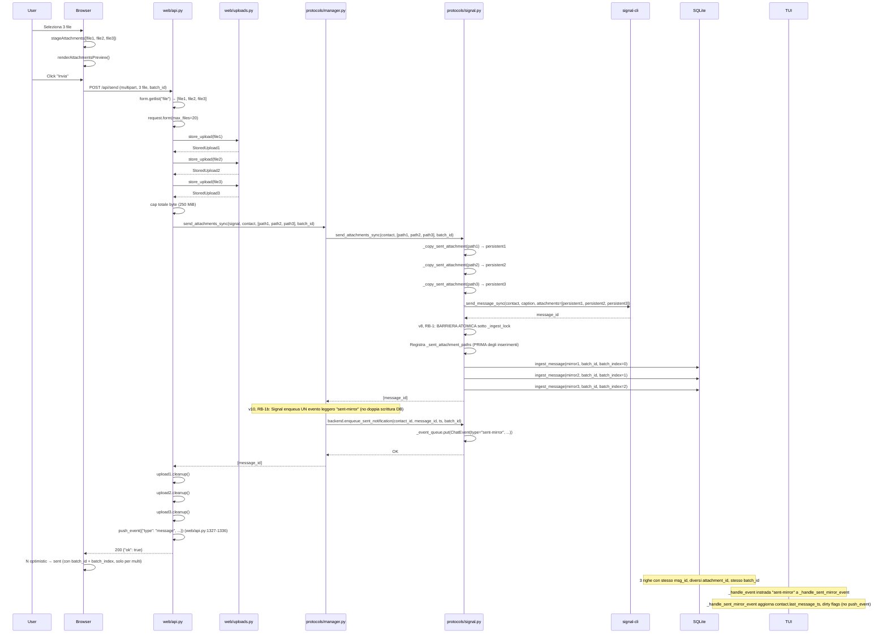
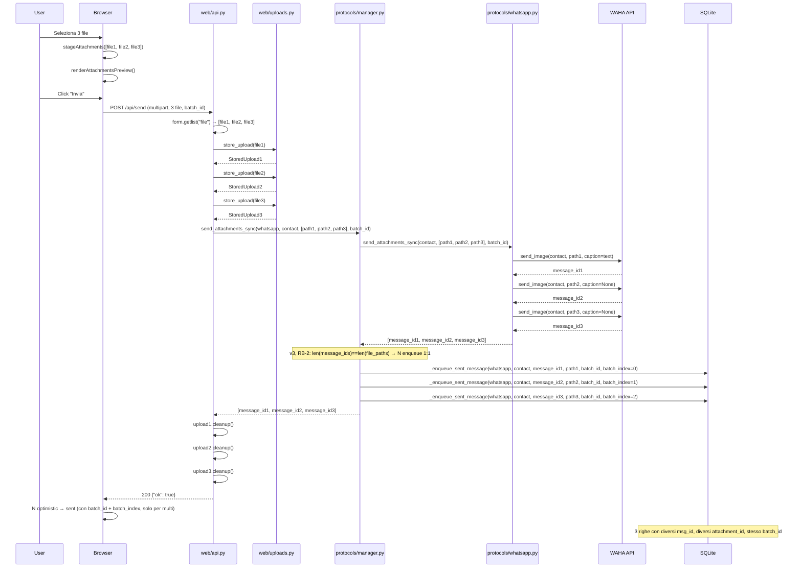
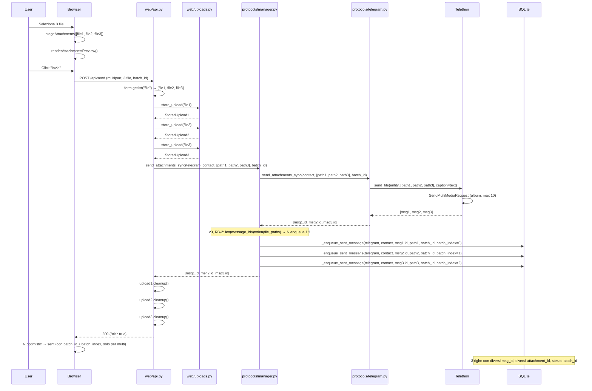

# Design: Multi-Attachment Send nella Web UI

**Stato:** Draft per review (architetto-1 → architetto-2)  
**Data:** 2026-09-21  
**Revisione:** v11 (2026-09-21) — fix contatto reale + import time + rollback orphan + cleanup payload dopo red team review v10  
**Branch:** master  
**Obiettivo:** Permettere all'utente di inviare **N allegati in un'unica azione di composing** dalla web UI, con semantica adattata ai vincoli di ciascun protocollo (Signal/WhatsApp/Telegram).

---

## Changelog revisione v11

**Bloccante v10 risolto (RB-1b-A):**
- **Contatto reale non aggiornato**: la v10 handler creava un placeholder `ChatContact` perché Signal non implementa `_identify_contact` (solo `_identify_contact_for_envelope`). Il placeholder veniva aggiornato ma il contatto reale in `self.contacts` no → UI non riordinava. La v11:
  1. **Aggiunge `_identify_contact(contact_id)` a `SignalBackend`** (protocols/signal.py) che risolve da `self._contacts_by_key` (come Telegram/WhatsApp)
  2. **Handler risolve contatto reale prima del placeholder**: `next((c for c in self.contacts if c.cache_key == contact_cache_key(event.protocol, event.contact_id)), None)` → aggiorna quello. Placeholder solo se contatto non esiste
  3. **Opzionale**: payload include `"contact": backend._contacts_by_key.get(...)` per evitare lookup

**Fix minori v10 corretti:**
1. **`time` non importato in `manager.py`**: aggiunto `import time` a livello modulo (usato per fallback `int(time.time() * 1000)`)
2. **Nota `attachment_id` stale rimossa**: `enqueue_sent_notification` non include `attachment_id` (handler non ne ha bisogno) → nota v10 non-bloccante 3 rimossa
3. **`batch_count` rimosso**: inutilizzato dal handler → rimosso da payload e firma
4. **Default `ChatBackend.enqueue_sent_notification`**: specificato come no-op (non `NotImplementedError`) con firma `(contact_id, message_id, timestamp, batch_id) -> None`. Manager lo chiama solo per Signal in `try/except`
5. **`inserted_mirror_ids.append` prima di `ingest_message`**: se `ingest_message` fallisce dopo aver scritto DB, la riga non entra nel rollback → orfano. Append **prima** di `ingest_message` garantisce che ogni riga inserita sia tracciata per rollback

**Test aggiornati:**
- Contatto reale: verifica che l'oggetto in `self.contacts` (non placeholder) ha `last_message_ts` aggiornato
- Nessun placeholder duplicato: se contatto esiste già, non viene creato un nuovo `ChatContact`
- Rollback orphan: se `ingest_message` fallisce dopo DB write, la riga viene comunque rimossa dal rollback

---

## Changelog revisione v10

**Bloccante v9 risolto (5 difetti RB-1b):**
1. **Routing assente**: aggiunto `if event.type == "sent-mirror": return self._handle_sent_mirror_event(event)` in `_handle_event` (tui/events.py:22-41). Handler dedicato `_handle_sent_mirror_event` con firma `-> bool` allineata a `_handle_event`.
2. **Import inesistente**: corretto `from protocols.events import ChatEvent` → `from models import ChatEvent` (ChatEvent è in models.py:358). Import a livello modulo in manager.py.
3. **`ts` non esiste nel manager**: derivato `ts` nel manager da `message_ids[0]` (Signal: `int(message_ids[0])` se numerico, fallback `int(time.time() * 1000)`).
4. **Handler con API inesistente**: sostituito `self._get_contact(...)` con API reale: `event.payload.get("contact")` con fallback `backend._identify_contact(event.contact_id)` e placeholder `ChatContact` (come in `_handle_message_event`, tui/events.py:50-63). Corretto `max(contact.last_message_ts, ts)` → `(contact.last_message_ts or 0)` (come tui/events.py:80).
5. **Rollback**: `try/except` spostato **dentro** `with self._ingest_lock` (non fuori). DELETE usa `msg_id = ?` (non `id = ?`, che è rowid autoincrement).

**Non bloccanti v9 recepiti:**
1. **Un solo evento per Signal**: `message_ids` ha 1 elemento → 1 evento "sent-mirror" (non N). Contatto/dirty/push aggiornati una volta.
2. **`push_event` duplicato rimosso**: handler "sent-mirror" non emette `push_event` (già fatto da `web/api.py:1327-1336`).
3. **Incapsulamento**: manager chiama `backend.enqueue_sent_notification(...)` (nuovo metodo) invece di toccare `backend._event_queue` direttamente.
4. **Firma handler**: `_handle_sent_mirror_event(self, event: ChatEvent) -> bool` allineata a `_handle_event`.

---

## Changelog revisione v9

**Bloccante v8 risolto:**
- **RB-1b (side-effect contatto/dirty flag)**: La v8 saltava il re-enqueue per Signal assumendo che `ingest_message` aggiornasse `contact.last_message_ts` e dirty flags. **Falso**: `ingest_message` scrive solo cache/DB, non tocca `ChatContact` né flag. I flag sono aggiornati solo in `tui/events.py:69-70, 85-86` quando `_handle_message_event` processa l'evento. La v9 introduce un **evento leggero "sent-mirror"** enqueuato dopo la barriera per Signal: aggiorna solo contatto/dirty/push senza chiamare `ingest_message` (evita doppia scrittura DB). Test verifica che dopo invio multi da web `contact.last_message_ts` è aggiornato e lista TUI si riordina.

**Fix minori v8 corretti:**
1. **Rollback incoerente e fuori dal lock**: la nota v8 diceva `DELETE WHERE msg_id = message_id AND attachment_id IN (...)` ma il codice eliminava solo `protocol + contact_number + attachment_id IN (...)` senza `msg_id` → poteva cancellare righe legittime con stesso `attachment_id` ma `msg_id` diverso. Inoltre il rollback era fuori da `_ingest_lock` → thread SSE poteva interleavarsi. La v9 corregge: rollback **sotto `_ingest_lock`** con `msg_id`/`id` esatti + `attachment_id IN (...)`.
2. **Copia persistente fuori dal lock**: la v8 eseguiva `_copy_sent_attachment` senza `_sent_attachment_paths_lock` → due invii concorrenti con stesso filename potevano scegliere stessa destinazione (check `exists()` non atomico) → overwrite/collisione. La v9 reintroduce il lock attorno alla copia (o nomi univoci garantiti).

**Dettagli soluzione v9:**
1. **Evento leggero "sent-mirror"** (§4.2): dopo la barriera, per Signal enqueua un evento `ChatEvent(type="sent-mirror", ...)` che `_handle_message_event` gestisce **senza** chiamare `ingest_message` (solo aggiornamento contatto/dirty/push). Evita doppia scrittura DB.
2. **Rollback atomico** (§4.5 Diff 1): rollback eseguito **sotto `_ingest_lock`** con `msg_id`/`id` esatti + `attachment_id IN (...)` → nessuna riga estranea cancellata, nessun interleaving.
3. **Copia persistente lock** (§4.5 Diff 1): `_copy_sent_attachment` eseguito **sotto `_sent_attachment_paths_lock`** → nessuna collisione filename tra invii concorrenti.

**Test aggiornati:**
- Side-effect dopo invio multi da web: verifica `contact.last_message_ts` aggiornato, `_contact_list_dirty = True`, lista TUI riordinata
- Rollback atomico: verifica che rollback non cancelli righe con stesso `attachment_id` ma `msg_id` diverso
- Concorrenza copia: verifica che due invii concorrenti con stesso filename non causino overwrite

---

## Changelog revisione v8

**Bloccanti v7 risolti:**
- **RB-1 (barriera atomica)**: La barriera v7 non era atomica — il loop di N `ingest_message` prendeva/rilasciava `_ingest_lock` per ognuno, permettendo al thread SSE di processare eco tra un inserimento e l'altro. La v8 esegue l'**intera barriera** sotto lo stesso `_ingest_lock` (RLock, re-entrante), registrando `_sent_attachment_paths` **prima** degli inserimenti. Così durante gli inserimenti le righe sono già `sent` e la dedup è coerente. Interleaving reso **impossibile** (non più "accettato").
- **RB-1b (rimozione re-enqueue manager per Signal)**: Il manager v7 faceva ancora N `_enqueue_sent_message` dopo la barriera → doppio percorso di scrittura. La v8 salta il loop di enqueue per Signal (il backend ha già materializzato le righe mirror nella barriera). Per WhatsApp/Telegram mantiene il loop (non usano barriera). Effetti collaterali (`contact.last_message_ts`, dirty flags, unread, `push_event`) già coperti: `ingest_message` nella barriera aggiorna `last_message_ts` e dirty flags; `web/api.py:1327-1336` fa già `push_event` generico post-invio.

**Dettagli soluzione v8:**
1. **Barriera atomica** (Diff 1): `with self._ingest_lock:` avvolge registrazione `_sent_attachment_paths` + loop N `ingest_message`. Registrazione percorsi **prima** degli inserimenti → durante inserimenti righe già `sent` → dedup coerente.
2. **Rimozione re-enqueue** (§4.2): `if protocol == "signal": return message_ids` (salta loop enqueue). WhatsApp/Telegram: loop 1:N invariato. **Nota v9**: la v8 assumeva erroneamente che `ingest_message` aggiornasse `contact.last_message_ts` e dirty flags. La v9 corregge introducendo evento leggero "sent-mirror".
3. **Effetti collaterali**: la v8 assumeva erroneamente che `ingest_message` aggiornasse `contact.last_message_ts` e dirty flags. **Falso**: `ingest_message` scrive solo cache/DB. La v9 introduce evento leggero "sent-mirror" per aggiornare contatto/dirty/push.
4. **Rollback barriera** (§10.12): la v8 eseguiva rollback fuori dal lock e senza `msg_id`. La v9 corregge: rollback sotto `_ingest_lock` con `msg_id`/`id` esatti.

**Non bloccanti v7 recepiti:**
1. Documentato `ts` derivato da `message_id` (assunzione `message_id` numerico, fallback `time.time() * 1000`)
2. Effetti collaterali bypassati: specificato chi copre `last_message_ts`, dirty flags, unread, `push_event`
3. Race echo-before-mirror: dopo serializzazione, riga eco senza `batch_id` **non può più esistere** (dichiarato e testato)
4. Rollback barriera: dettagliato cosa fare se `ingest_message` fallisce a metà
5. `_load_cache ORDER BY timestamp, id`: verificato che nessun altro consumatore dipenda dall'ordine precedente (solo `_message_already_cached` usa ordinamento, già allineato)

---

## Changelog revisione v7

**Bloccante v6 risolto (soluzione strutturale):**
- **RB-1 (definitivo)**: Adottata **Opzione 2 — Barriera mirror-before-echo + ordinamento deterministico**. L'opzione B (filename) della v6 era strutturalmente incapace: (a) confronto filename in blocco dead code (`same_slot` XOR True); (b) `data` non esiste in `_message_already_cached`; (c) suffisso collisione su campo sbagliato; (d) `valid_direction` XOR simmetrico; (e) omonimi indistinguibili; (f) falsi negativi caption/filename. La v7 elimina la dipendenza dall'ordine con barriera sincrona + tie-breaker deterministico.

**Dettagli soluzione strutturale (v7, Opzione 2):**
1. **Barriera mirror-before-echo**: `SignalBackend.send_attachments_sync` materializza le N righe mirror in cache+DB **sincronamente** (in ordine di `file_paths`) prima di ritornare al manager. Quando il thread SSE processa l'eco, le N righe mirror sono già presenti e in ordine deterministico.
2. **Ordinamento deterministico**: `_load_cache` (`db.py:406-413`) ordina per `(timestamp, id)` invece di solo `timestamp`. `_message_already_cached` itera sulle righe in ordine `(timestamp, id)`. Tie-breaker `id` (rowid autoincrement) garantisce ordine stabile dopo restart.
3. **`valid_direction` one-way**: upgrade **solo** mirror(sent)→remoto(non-sent), cioè `cached_is_sent and not incoming_is_sent`. Mai il verso opposto. Race echo-before-mirror gestito: se eco arriva prima del mirror, crea nuova riga con attachment_id remoto; quando mirror arriva, non sovrascrive (bloccato da `valid_direction`).

**Non bloccanti v6 recepiti:**
1. Rimosso helper `_extract_filename_from_attachment_info` (degenere, non serve con Opzione 2)
2. N/A (helper rimosso)
3. Nota residua v5 riga ~1352 aggiornata
4. Commenti Diff3/4 allineati con `valid_direction` one-way

---

## Changelog revisione v6

**Residuo bloccante v5 risolto:**
- **RB-1 (residuo)**: Associazione eco↔mirror basata su **chiave stabile per-allegato** (filename), non su ordine di arrivo. Il `filename` dall'eco (`signal.py:903` `att.get("filename")`) viene confrontato con `attachment_info` del mirror per associare eco k-esima ↔ mirror k-esima. Gestione collisioni con suffisso ` (1)` di `_copy_sent_attachment` (`signal.py:688-697`). Nessun dependency dall'ordine di arrivo tra thread (worker invio vs thread SSE). Test di interleaving: eco processata (a) prima di tutti i mirror, (b) tra mirror1 e mirror2 → nessuna riga persa, nessuna sovrascrittura.

**Non bloccanti v5 recepiti:**
1. Rimossa menzione orfana di `_batch_mapping` da Step 2 file-change list
2. Corretta nota `_load_cache`: dict costruito non include `batch_id`/`batch_index` (anche se `SELECT *` li legge)
3. Annotato `batch_id` assente con N>1 via API diretta (curl/client non-web) → passata dedicata non matcha
4. Confermato `_messages` senza `_init_db()` degrada a lista vuota (`except sqlite3.Error: return []`)
5. Reso esplicito che upgrade è **solo mirror→remoto** (no downgrade remoto→locale)

---

## Changelog revisione v5

**Residui bloccanti v4 risolti:**
- **RB-1**: Identità ridefinita come "slot di attachment" (non uguaglianza): matcha se `cached == incoming` OPPURE uno dei due è None OPPURE esattamente uno dei due è il mirror locale (`_is_sent_attachment(x) != _is_sent_attachment(y)`). Con N righe stesso `msg_id`, criterio di associazione eco k-esima ↔ mirror k-esimo basato su ordine di arrivo (prima eco → primo mirror, seconda eco → secondo mirror). Test esistenti preservati: `test_web_outgoing_mirror.py:364-408`, `test_web_phase2_fixes.py:124-145`, `test_web_phase2_fixes.py:387-407`.
- **RB-2**: Rimosso `_batch_mapping`. Con RB-1 corretto, l'echo aggiorna le righe mirror (che già portano `batch_id`/`batch_index` dal DB). Nessun mapping necessario.
- **RB-3**: Migrazione DB `batch_id`/`batch_index` spostata PRIMA di `db.py:189` (insieme a migrazioni incondizionate stile `edited`/`content_type`), non dopo. Test con DB preesistente a `user_version >= _LEGACY_MIGRATION_VERSION`.
- **RB-4**: Passata dedicata batch eseguita PRIMA del loop generico in `reconcileOptimisticMessages`, oppure optimistic con `batch_id != null` esclusi da `candidates` e reinseriti solo nella passata dedicata.

**Non bloccanti v4 recepiti:**
1. Rimosso `hasattr` residuo in `base.py` §4.7 (`send_attachment_sync` sempre presente)
2. Dichiarato che `_load_cache` non carica `batch_id`/`batch_index` (nessun consumatore attuale)
3. Manager passa sempre `batch_id`/`batch_index` (anche None), backend non estesi sollevano `TypeError` assorbito da `except Exception`
4. Annotato che query `existing` di `_add_message_to_cache` non include `batch_id`/`batch_index`
5. Annotato che `_messages` non chiama `_init_db()` prima della SELECT (pattern preesistente)

---

## Changelog revisione v4

**Residui bloccanti v3 risolti:**
- **RB-1**: Fix Signal completo con diff espliciti:
  - `_message_already_cached` (signal.py:1394-1401): match stretto `(msg_id, attachment_id)` per `is_mine`, `continue` se attachment diverso
  - Branch upgrade (signal.py:1566-1568): match stretto già in v3
  - Entrambi i call-site di `_upgrade_outgoing_attachment` (righe 1598 E 1623): protetti con condizione "slot compatibile e `incoming_id` non già presente in un'altra riga dello stesso `msg_id`"
  - Test separati per mirror e echo reale
- **RB-3**: Adottata opzione A (persistenza DB completa):
  - Colonne `batch_id TEXT` e `batch_index INTEGER` con migrazione idempotente in `_init_db`
  - Propagazione completa: API → manager → backend → `_enqueue_sent_message` → `_add_message_to_cache` → `_messages`
  - Mapping per echo reale: `(protocol, contact_number, msg_id/timestamp) → (batch_id, batch_index)`
  - Assegnazione `batch_index=i` nel loop 1:N di Signal
  - Alternativa B (solo sessione live via WS) documentata come scartata

**Non bloccanti v3 recepiti:**
1. Dichiarato RB-2 incompatibile con `_dedup_messages` (db.py:1027-1049)
2. FakeManager aggiornato con `send_attachments_sync`
3. mediaCache: seeding dimensionale con `${filename}[${i}]` (riferimenti riga corretti)
4. Ordine validazione: `isinstance(text, str)` prima di `text.strip()`
5. Normalizzazione `max_files`: wrap specifico per HTTPException di Starlette
6. Confermato `_update_message_status` aggiorna tutte le N righe (db.py:1070)
7. `batch_index` assegnato anche nel loop 1:N di Signal

---

## Changelog revisione v3

**Residui bloccanti v2 risolti:**
- **RB-1**: Fix Signal completo: match stretto `(msg_id, attachment_id)` in upgrade branch, skip `_upgrade_outgoing_attachment` per allegati diversi già presenti, echo reale: 1° → upgrade, 2°..N° → nuove righe
- **RB-2**: Manager enqueua N volte con stesso `message_id` per Signal (un messaggio con N allegati), loop esplicito in §4.2
- **RB-3**: Scelta **B** — match dedicato fuori dalla signature, `batch_id` solo per multi-allegato (N > 1), single-attachment invariato
- **RB-4**: `send_attachments_sync` in `base.py` implementa il loop sui `send_attachment_sync` singoli (no `hasattr`), fallback kwargs condizionale

---

## 1. Analisi del problema e requisiti

### 1.1 Stato attuale (verificato sul codice)

**Frontend** (`web/static/app.js`, `web/static/index.html`):
- `index.html:75`: `<input id="file-input" type="file" hidden accept="...">` **SENZA attributo `multiple`** → selezione singola
- `app.js:66`: `state.stagedAttachment: null` → stato **singolo**
- `app.js:2044-2061` `clearStagedAttachment()`: resetta lo stato singolo
- `app.js:2063-2131` `stageAttachment(file)`: valida un file, chiama `clearStagedAttachment()` a riga 2115 → **scarta qualunque allegato già in staging**
- `app.js:2178-2186` `submitMessage()`: optimistic con un solo `attachment`
- `app.js:2207-2214`: `FormData` con `body.set("file", attachment.file, attachment.filename)` → **un solo campo `file`**
- `app.js:2529-2539`: handler `fileInput` prende `files?.[0]` (solo primo file)
- `app.js:2522-2528`: paste handler prende solo la **prima** immagine dalla clipboard
- **Nessun drag&drop** attualmente implementato (verificato: nessun listener `dragover`/`drop` in `app.js`)

**Backend API** (`web/api.py:1105-1337`):
- `POST /api/send` multipart: `upload_file = form.get("file")` **UNICO** (riga 1133)
- `if upload_file is None or not hasattr(upload_file, "read"): 400` (riga 1134)
- `store_upload(upload_file)` singolo (riga 1278)
- `manager.send_attachment_sync(...)` singolo (riga 1288-1298)
- `finally: upload.cleanup()` singolo (riga 1324-1325)

**Layer upload** (`web/uploads.py`):
- `store_upload()` singolo (riga 166-170)
- `_store_upload_sync()` valida magic bytes + estensione coerente (riga 124-163)
- Limiti per kind: image 20MiB, video 100MiB, audio 50MiB, document 50MiB (riga 16-21)
- **Nessun limite sul numero di allegati** né su byte totali (perché non c'è multi-allegato)

**Layer manager/backend** (`protocols/manager.py:172-219`):
- `send_attachment_sync(...)` prende UN `file_path: Path` (riga 176)
- `_enqueue_sent_message(...)` singolo (riga 206-219)

**Backend specifici:**
- **Signal** (`protocols/signal.py:643-681`): `attachments=[str(persistent_path)]` **lista** (riga 671) → signal-cli **supporta già N allegati** in un messaggio. `protocols/rpc.py:401-402` `params["attachments"]` lista. `protocols/rpc.py:158-159` subprocess `--attachment` ripetuto per ogni file.
- **WhatsApp** (`protocols/whatsapp.py:1368-1432`): UN solo `sendImage`/`sendVideo`/`sendFile` per chiamata → WAHA non ha batch → **N allegati = N messaggi separati**
- **Telegram** (`protocols/telegram.py:1124-1163`): UN solo `client.send_file` per chiamata, MA Telethon **supporta album nativamente** (`send_file(entity, [files...])` → `SendMultiMediaRequest`, chunk automatico a 10 media per album, vedi `.venv/.../telethon/client/uploads.py:197-201, 436-451, 486-575`). **Limitazione:** documenti in un album appaiono come messaggi separati (non nell'album), audio/voice non supportati in album (vedi `.venv/.../telethon/client/uploads.py:501-503`).

**Modello dati** (`protocols/db.py:308-332`):
- Tabella `messages` con **UNA** `attachment_id`/`attachment_info`/`content_type`/`media_kind` per riga
- Signal ingest (`protocols/signal.py:939-1011` `_build_msg_dicts`) già produce **N dicts per N allegati** in ricezione → **N righe DB per messaggio multi-allegato**

**Reconciliation** (`web/static/reconcile.js`):
- `messageSignature()` (riga 99-109) include `messageMediaType(message)` → signature basata su categoria (image/video/audio/attachment), **NON su attachment_id**
- `messageIdentity()` (riga 3-6) usa `message.id` o fallback `direction\0text\0timestamp\0index`
- `reconcileOptimisticMessages()` (riga 159-255) matcha optimistic ↔ real per signature

### 1.2 Requisiti funzionali

**Casi d'uso:**
1. **Multi-select da file picker**: utente clicca 📎, seleziona N file (immagini, video, documenti) → preview multipli → invio unico
2. **Drag&drop multiplo** (opzionale, fase 2): utente trascina N file sulla chat → preview → invio
3. **Paste multiplo** (opzionale, fase 2): utente copia N immagini → incolla → preview → invio

**Vincoli protocollo:**
- **Signal**: N allegati in **un solo messaggio** (signal-cli `attachments` lista). Limite pratico ~10-20 file (non documentato, dipende da versione signal-cli)
- **WhatsApp**: N allegati = **N messaggi separati** (WAHA non ha batch). Nessun album nativo
- **Telegram**: N allegati in **un album** (max 10 media per album, chunk automatico Telethon). **Limitazione:** documenti appaiono come messaggi separati, audio/voice non supportati in album. Caption solo sul primo media dell'album

**Cosa significa "un messaggio con N allegati":**
- **Signal**: un messaggio Signal con N attachment (eco dal server: N righe DB, stesso `timestamp`)
- **WhatsApp**: N messaggi WhatsApp separati (stesso `text` ripetuto? solo sul primo? vedi §5)
- **Telegram**: un album Telegram (N media, caption sul primo) — eccetto documenti che appaiono separati

### 1.3 Requisiti non funzionali

- **Retrocompatibilità**: client vecchio (single-attachment) deve continuare a funzionare
- **Atomicità**: se un allegato fallisce la validazione o l'invio, **tutti** falliscono (niente invio parziale) — **DECISIONE DI PRODOTTO: semantica atomica** (vedi §9.2)
- **Cleanup**: nessun file orfano in `web-uploads/` o temp dir di sistema in caso di fallimento
- **Performance**: validazione sequenziale (non parallela) per messaggi d'errore stabili (vedi §9.6)
- **UX**: preview multipli con rimozione singola, ordine preservato

---

## 2. Contratto API `/api/send`

### 2.1 Decisione: campo ripetuto `file` (non `files`, non JSON+upload separato)

**Alternative scartate:**
- **A — Campo `files` (array JSON)**: richiede JSON + base64 per i file → gonfia del 33%, obbliga il parser JSON a materializzare l'intera stringa in memoria, non streamma. **Scartata** (stessa motivazione di `DESIGN_WEB_PHASE2.md:215-222`)
- **B — Upload separato + send JSON**: due round-trip ("upload poi send") → file orfani da riconciliare in caso di crash tra i due step. **Scartata** (stessa motivazione di `DESIGN_WEB_PHASE2.md:220-222`)
- **C — Campo `file` ripetuto (multipart)**: nativo HTML `FormData.append("file", blob1); FormData.append("file", blob2)` → il server riceve `form.getlist("file")` lista. **Scelta**.

**Motivazione C:**
- Multipart già usato per single-attachment → niente breaking change
- `FormData` è il contenitore nativo dal browser (paste, file picker, drag&drop)
- Streamma su disco (`SpooledTemporaryFile` di Starlette, spool su disco oltre 1 MiB) → memoria bounded
- Testo + quote + N file nella **stessa richiesta atomica** → niente stato intermedio da riconciliare

**Nota API Starlette (v2):** `FormData.getlist(key)` è l'API corretta (non `get_all()` che non esiste). `FormData.get(key)` con più valori omonimi restituisce l'**ULTIMO** (non il primo), perché `ImmutableMultiDict.__init__` costruisce `self._dict = {k: v for k, v in _items}` (vedi `.venv/.../starlette/datastructures.py:281`).

### 2.2 Contratto dettagliato

**Request:**
```http
POST /api/send
Content-Type: multipart/form-data; boundary=----WebKitFormBoundary...

------WebKitFormBoundary...
Content-Disposition: form-data; name="protocol"

signal
------WebKitFormBoundary...
Content-Disposition: form-data; name="contact_id"

+39123456789
------WebKitFormBoundary...
Content-Disposition: form-data; name="text"

Caption del primo allegato
------WebKitFormBoundary...
Content-Disposition: form-data; name="file"; filename="photo1.jpg"
Content-Type: image/jpeg

<binary data>
------WebKitFormBoundary...
Content-Disposition: form-data; name="file"; filename="photo2.png"
Content-Type: image/png

<binary data>
------WebKitFormBoundary...
Content-Disposition: form-data; name="file"; filename="document.pdf"
Content-Type: application/pdf

<binary data>
------WebKitFormBoundary...--
```

**Validazione server-side (v4, riordinato):**
1. **Estrai payload** (v3, non-bloccante 4): `form = await request.form(max_files=_MAX_ATTACHMENTS + 10, max_fields=20)` (riga 1131) → fallisce presto se troppi file/campi
2. **Normalizzazione errore `max_files`** (v4, non-bloccante 5): wrap del `request.form()` in try/except, se Starlette solleva `HTTPException(400)` con messaggio "Too many files" → solleva `HTTPException(400, "Troppi allegati")`. Wrap specifico per non inghiottire altre `HTTPException`.
3. **Estrai campi**: `protocol = form.get("protocol")`, `contact_id = form.get("contact_id")`, `text = form.get("text")` (riga 1146-1148)
4. **Valida payload** (v4, non-bloccante 4): `if not isinstance(text, str): 400` prima di `text.strip()`/`len(text)` (evita `TypeError`/`AttributeError` se campo `text` assente)
5. **Valida payload** (riga 1149-1154): protocol, contact_id, text length
6. **Estrai lista file** (v2): `upload_files = form.getlist("file")`
7. **Valida lista** (v3):
   - `if not upload_files and not text.strip(): 400 "Invalid request"` (almeno un file **o** testo — multipart text-only consentito)
   - `if len(upload_files) > _MAX_ATTACHMENTS: 400 "Too many attachments"` (nuovo)
   - `for upload_file in upload_files: if not hasattr(upload_file, "read"): 400 "Invalid request"`
8. **Cap totale byte** (v3, non-bloccante 1): durante la validazione per-file (punto 9), somma i byte letti → se supera `_MAX_TOTAL_BYTES` (250 MiB) → 413
9. **Valida ogni file** (vedi §3):
   - `store_upload(upload_file)` per ciascuno → lista `StoredUpload` (validazione **sequenziale**, non parallela, per messaggi d'errore stabili)
   - Se uno fallisce `UploadValidationError` → cleanup di **tutti** i precedenti → 400/413
10. **Invia** (v4, RB-3):
    - `batch_id = form.get("batch_id")` (solo se presente, v4)
    - `manager.send_attachments_sync(protocol, contact_id, [upload.path for upload in uploads], batch_id=batch_id, ...)` (nuovo, vedi §4)
11. **Cleanup** nel `finally`:
    - `for upload in uploads: upload.cleanup()` (iterativo sui successi tracciati)

**Retrocompatibilità:**
- Client vecchio manda UN solo `file` → `form.getlist("file")` ritorna lista con 1 elemento → funziona
- Client nuovo manda N `file` → server vecchio (non aggiornato) → `form.get("file")` prende solo l'ultimo → **gli altri sono ignorati** (comportamento indesiderato ma non crash)
- **Mitigazione**: versioning API? No, il client vecchio continuerà a funzionare. Il client nuovo richiede server aggiornato (documentato nel changelog)

**Risposte:**
- `200 {"ok": true}` (invariato)
- `400 "Invalid request"` (validazione, singolo o multi)
- `400 "Too many attachments"` (nuovo, supera `_MAX_ATTACHMENTS`)
- `400 "Troppi allegati"` (v3, normalizzato da Starlette `max_files`)
- `413 "Upload too large"` (singolo file o totale)
- `415 "Unsupported media type"` (singolo file)
- `404 "Not Found"` (protocollo/contatto ignoto)
- `501 "Attachment send not supported"` (backend non supporta allegati)
- `502 "Message send failed"` (backend send fallita)

### 2.3 Limiti

| Parametro | Valore | Motivazione |
|---|---|---|
| `_MAX_ATTACHMENTS` | **10** (decisione aperta, vedi §9.1) | Signal ~10-20, Telegram album chunk 10, WhatsApp N messaggi separati (10 è ragionevole) |
| `_MAX_TOTAL_BYTES` | **250 MiB** (v3, non-bloccante 1) | Valore realistico: 10 file da 25 MiB media. Non vacuo (scatta con 3 video da 100 MiB) |
| Byte per file | Invariati: image 20MiB, video 100MiB, audio 50MiB, document 50MiB | Stessi limiti attuali per singolo file |
| Content-Length | `> _MAX_TOTAL_BYTES + 1 MiB` → 413 | Check anticipato senza leggere il body |
| `max_files` (Starlette) | `_MAX_ATTACHMENTS + 10` = 20 | Fallire presto sul numero di file (v2) |

**Nota (v3, non-bloccante 7):** con `Transfer-Encoding: chunked` o `Content-Length` assente, il cap totale byte viene verificato solo dopo aver letto tutto il body (non prima). Rischio accettato e dichiarato (localhost, non esposto su Internet).

---

## 3. Layer upload

### 3.1 Decisione: `store_upload` singolo + loop sequenziale nel caller (non batch, non parallelo)

**Alternative scartate:**
- **A — `store_uploads(upload_files: list) -> list[StoredUpload]`**: funzione batch che valida e store tutti in un colpo. Vantaggio: atomicità naturale. Svantaggio: se il 5° file fallisce, bisogna fare cleanup dei primi 4 → logica complessa dentro la funzione. **Scartata** (complessità interna)
- **B — `store_upload` singolo + `asyncio.gather` parallelo**: performance migliore. Svantaggio: `asyncio.gather` senza `return_exceptions=True` non assegna il risultato se solleva → i `StoredUpload` già creati diventano irraggiungibili e il `finally` non li pulisce. Inoltre i task fratelli continuano a girare (non vengono cancellati automaticamente). **Scartata** (orfani garantiti, vedi §3.2)
- **C — `store_upload` singolo + loop sequenziale nel caller**: il caller (`api.py:send`) itera su `upload_files`, chiama `store_upload` per ciascuno, tiene lista `uploads: list[StoredUpload]`. Se uno fallisce, cleanup di tutti i precedenti. **Scelta**.

**Motivazione C:**
- `store_upload` rimane semplice (singolo file, stessa logica attuale)
- Cleanup centralizzato nel caller (dove c'è già il `finally`)
- Validazione **sequenziale** → messaggi d'errore stabili (il primo file invalido produce l'errore, non l'ultimo)
- Nessun problema di orphan (se il 3° file fallisce, i primi 2 sono nella lista `uploads` e vengono puliti nel `finally`)

### 3.2 Implementazione nel caller (`web/api.py:send`)

```python
# Pseudocodice (non implementazione reale)
uploads: list[StoredUpload] = []
try:
    # Validazione sequenziale (non parallela) per messaggi d'errore stabili
    for upload_file in upload_files:
        uploads.append(await store_upload(upload_file))

    # Cap totale byte (v3, non-bloccante 1: 250 MiB, non 1000 MiB vacuo)
    total_bytes = sum(upload.path.stat().st_size for upload in uploads)
    if total_bytes > _MAX_TOTAL_BYTES:
        raise HTTPException(status_code=413, detail="Upload too large")

    # Invia (v4, RB-3: batch_id propagato)
    batch_id = form.get("batch_id")  # solo se presente
    await asyncio.to_thread(
        manager.send_attachments_sync,
        protocol,
        contact_id,
        [u.path for u in uploads],
        batch_id=batch_id,  # v4, RB-3
        caption=text or None,
        mime_types=[u.mime_type for u in uploads],
        media_kinds=[u.media_kind for u in uploads],
        filenames=[u.filename for u in uploads],
        **kwargs,
    )
except UploadValidationError as exc:
    detail = "Upload too large" if exc.status_code == 413 else "Unsupported media type"
    raise HTTPException(status_code=exc.status_code, detail=detail) from None
finally:
    # Cleanup iterativo sui successi tracciati (v2)
    for upload in uploads:
        upload.cleanup()
```

**Cleanup atomico (v2):**
- Lista `uploads` tracciata nel caller (non output di `asyncio.gather`)
- Se `store_upload` fallisce per il 3° file → eccezione propagata → `uploads` contiene solo i primi 2
- `finally` fa cleanup dei primi 2 → nessun file orfano
- Se `send_attachments_sync` fallisce → `finally` fa cleanup di tutti → nessun file orfano
- **Test richiesto:** con 2°/3° file invalido, `web-uploads/` deve restare vuota in ogni ramo (HTTPException, send fallita, 501)

**Ordine preservato:**
- Loop sequenziale → `uploads[0]` corrisponde a `upload_files[0]`
- L'ordine è importante per Signal (lista allegati) e Telegram (album)

### 3.3 Validazione per ciascun file

Invariata rispetto all'attuale `store_upload`:
1. Magic bytes sniffing (`_sniff_media`, riga 87-116)
2. Estensione coerente con MIME (`_EXTENSIONS_BY_MIME`, riga 25-39)
3. Limite dimensione per kind (`_max_bytes_for_kind`, riga 119-121)
4. Sanitizzazione filename (`sanitize_filename`, riga 152)

**Nessuna nuova validazione** (stessa logica per singolo file).

### 3.4 Spool Starlette e cleanup temp dir sistema (v2, 3.6)

**Problema:** Starlette usa `SpooledTemporaryFile` con `spool_max_size=1MB` (vedi `.venv/.../starlette/formparsers.py:147, 230`). Dopo 1MB, spool su disco nella temp dir di sistema (non in `web-uploads/`). Il janitor di `web-uploads/` (riga 71-84) non li pulisce.

**Mitigazioni (v2):**
1. **`request.form(max_files=N)`**: fallisce presto sul numero di file (Starlette solleva `HTTPException(400)` se supera il limite)
2. **Cap totale byte**: durante la validazione per-file, somma i byte letti → se supera `_MAX_TOTAL_BYTES` → 413 (prima di chiamare `send_attachments_sync`)
3. **Content-Length check**: `> _MAX_TOTAL_BYTES + 1 MiB` → 413 (check anticipato senza leggere il body)
4. **Reverse-proxy**: documentare `client_max_body_size` per nginx/Apache (se esposto su LAN)
5. **Cleanup temp dir sistema**: Starlette chiude i `SpooledTemporaryFile` nel `finally` di `request.form()` (vedi `.venv/.../starlette/formparsers.py:175` `_files_to_close_on_error`) → nessun orphan se la richiesta completa. Se il processo crasha durante il parsing, i temp file rimangono nella temp dir di sistema (cleanup automatico del OS su `/tmp` dopo reboot).

**Rischio residuo:** con `Transfer-Encoding: chunked` o `Content-Length` assente, il cap totale byte viene verificato solo dopo aver letto tutto il body (non prima). Se l'utente manda 10 file da 100 MiB ciascuno = 1 GiB, il body viene letto tutto prima del 413.

**Mitigazione aggiuntiva (opzionale, fase 2):** wrapper ASGI con contatore byte stream (limitare a `_MAX_TOTAL_BYTES` durante lo stream, non dopo). Per ora, il prodotto accetta il rischio su localhost (web UI non esposto su Internet).

---

## 4. Layer manager/backend

### 4.1 Decisione: nuovo metodo `send_attachments_sync` (lista) accanto a `send_attachment_sync` (singolo)

**Alternative scartate:**
- **A — Estendere `send_attachment_sync` a `file_paths: list[Path]`**: breaking change per tutti i backend (Signal, WhatsApp, Telegram) e per il manager. TUI e altri caller usano `send_attachment_sync` singolo → bisogna aggiornarli tutti. **Scartata** (breaking change)
- **B — Nuovo metodo `send_attachments_sync` (lista)**: accanto a `send_attachment_sync` (singolo). Il manager instrada: se lista vuota → errore; se lista con 1 elemento → delega a `send_attachment_sync` (retrocompatibilità); se lista con N elementi → nuovo path multi-allegato. **Scelta**.

**Motivazione B:**
- Retrocompatibilità: TUI e altri caller continuano a usare `send_attachment_sync` singolo
- Web API usa `send_attachments_sync` lista (nuovo)
- Backend specifici implementano `send_attachments_sync` in modo ottimizzato per il protocollo

### 4.2 Contratto `manager.send_attachments_sync` (v10, RB-1b)

```python
# protocols/manager.py (v11, RB-1b-A + minori)
import time  # v11, minore 1: aggiunto per fallback timestamp
from models import ChatEvent  # v10, fix 2: import corretto da models (non protocols.events)

def send_attachments_sync(
    self,
    protocol: str,
    contact_id: str,
    file_paths: list[Path],
    *,
    batch_id: str | None = None,  # v4, RB-3
    caption: str | None = None,
    mime_types: list[str],
    media_kinds: list[str | None],
    filenames: list[str | None],
    quote_timestamp: int | None = None,
    quote_author: str | None = None,
    quote_message: str | None = None,
    reply_to_message_id: str | None = None,
    quote_attachments: list[str] | None = None,
) -> list[str]:
    """Send N attachments through *protocol* from a worker thread.
    
    Returns a list of message_ids (one per message created).
    For Signal: lista con 1 elemento (un messaggio con N allegati).
    For WhatsApp: lista con N elementi (N messaggi separati).
    For Telegram: lista con 1 elemento (un album con N media) o N elementi (fallback).
    
    Semantica atomica (v2): se un allegato fallisce, solleva eccezione (nessun invio parziale).
    
    v10, RB-1b: per Signal, il backend ha già materializzato le righe mirror nella barriera
    → il manager enqueua UN evento leggero "sent-mirror" (no doppia scrittura DB) per aggiornare
    contatto/dirty. Per WhatsApp/Telegram, il manager fa il loop di enqueue.
    """
    backend = self._get_or_raise(protocol)
    
    message_ids = backend.send_attachments_sync(
        contact_id, file_paths,
        batch_id=batch_id,  # v4, RB-3
        caption=caption,
        mime_types=mime_types,
        media_kinds=media_kinds,
        filenames=filenames,
        quote_timestamp=quote_timestamp,
        quote_author=quote_author,
        quote_message=quote_message,
        reply_to_message_id=reply_to_message_id,
        quote_attachments=quote_attachments,
    )
    
    # v10, RB-1b: per Signal, enqueua UN evento leggero "sent-mirror" (no doppia scrittura DB)
    if protocol == "signal":
        # Il backend Signal ha già materializzato le N righe mirror nella barriera atomica
        # Ma ingest_message NON aggiorna contact.last_message_ts né dirty flags
        # (solo cache/DB). I flag sono aggiornati in tui/events.py:80-86
        # quando _handle_sent_mirror_event processa l'evento.
        # v10: enqueua UN evento leggero "sent-mirror" che aggiorna solo contatto/dirty
        # senza chiamare ingest_message (evita doppia scrittura DB).
        
        # v10, fix 3: deriva ts da message_ids[0] (Signal: message_id = timestamp server)
        try:
            ts = int(message_ids[0]) if message_ids else int(time.time() * 1000)
        except (TypeError, ValueError):
            ts = int(time.time() * 1000)
        
        # v10, non bloccante 1: un solo evento per Signal (message_ids ha 1 elemento)
        # v10, non bloccante 4: usa metodo backend.enqueue_sent_notification (incapsulamento)
        # v11, minore 3: batch_count rimosso (inutilizzato dal handler)
        try:
            backend.enqueue_sent_notification(
                contact_id=contact_id,
                message_id=message_ids[0],
                timestamp=ts,
                batch_id=batch_id,
            )
        except Exception:
            logger.exception(
                "Failed to enqueue sent-mirror notification: protocol=%s contact=%s message_id=%s",
                protocol, contact_id, message_ids[0]
            )
        return message_ids
    
    # WhatsApp/Telegram: N messaggi → N enqueue 1:1
    for i, message_id in enumerate(message_ids):
        try:
            self._enqueue_sent_message(
                backend, contact_id, message_id,
                batch_id=batch_id,  # v4, RB-3
                batch_index=i,  # v4, RB-3
                caption or "" if i == 0 else "",
                quote_timestamp=quote_timestamp if i == 0 else None,
                quote_author=quote_author if i == 0 else None,
                quote_message=quote_message if i == 0 else None,
                reply_to_message_id=reply_to_message_id if i == 0 else None,
                attachment_path=file_paths[i],
                mime_type=mime_types[i],
                media_kind=media_kinds[i],
                filename=filenames[i],
            )
        except Exception:
            logger.exception(
                "Failed to enqueue sent message: protocol=%s contact=%s message_id=%s",
                protocol, contact_id, message_id
            )
    
    return message_ids
```

**Nota (v10, RB-1b):** per Signal, il manager enqueua **UN** evento leggero "sent-mirror" (non N) tramite `backend.enqueue_sent_notification(...)` (nuovo metodo, incapsulamento). L'evento "sent-mirror" è gestito da `_handle_sent_mirror_event` (nuovo handler, tui/events.py) che aggiorna solo:
- `contact.last_message_ts = max(contact.last_message_ts or 0, ts)` (promozione contatto in lista)
- `_contact_list_dirty = True` / `_dirty_contact_keys.add(contact.cache_key)` (flag riordinamento)

**NON** chiama `ingest_message` → evita doppia scrittura DB (la barriera ha già materializzato le righe mirror).

**Nota (v10, non bloccante 2):** `push_event` **non** è emesso dal handler "sent-mirror" → `web/api.py:1327-1336` fa già la push generica post-invio → evita doppio refresh WS.

**Nota (v10, non bloccante 4):** il manager chiama `backend.enqueue_sent_notification(...)` (nuovo metodo) invece di toccare `backend._event_queue` direttamente → incapsulamento preservato. Il backend Signal implementa `enqueue_sent_notification` come:
```python
# protocols/signal.py (v11, minore 3: batch_count rimosso)
def enqueue_sent_notification(
    self,
    contact_id: str,
    message_id: str,
    timestamp: int,
    batch_id: str | None = None,
) -> None:
    # v11, RB-1b-A: opzionale, includi contatto reale nel payload
    contact = self._contacts_by_key.get(f"{self.protocol}:{contact_id}")
    self._event_queue.put(
        ChatEvent(
            type="sent-mirror",
            protocol=self.protocol,
            contact_id=contact_id,
            payload={
                "id": str(message_id),
                "timestamp": timestamp,
                "batch_id": batch_id,
                "contact": contact,  # v11, RB-1b-A: contatto reale (o None)
            },
        )
    )
```

**Nota (v8, RB-1b):** `ingest_message` nella barriera scrive cache/DB ma **non** aggiorna `contact.last_message_ts` né dirty flags. Questi sono aggiornati solo quando `_handle_sent_mirror_event` processa l'evento "sent-mirror".

**Nota (v4, RB-3):** `batch_id` e `batch_index` propagati a `_enqueue_sent_message` (solo per WhatsApp/Telegram).
**Nota (v5, non-bloccante 3):** il manager passa sempre `batch_id` e `batch_index` (anche `None`). Backend non estesi (fake/terze parti) sollevano `TypeError` se non accettano questi parametri → assorbito da `except Exception` in `_enqueue_sent_message` → mirror silenziosamente assente. **Aggiornare i fake nei test** per accettare `batch_id` e `batch_index`.

**Nota (v3, 3.7):** `filename=...` (singolo), non `filenames=...` (lista). I backend accettano `filename` singolare (`signal.py:715`, `whatsapp.py:1447`, `telegram.py:1178`).

**Nota (v2, 3.5):** semantica atomica. Se `backend.send_attachments_sync` solleva eccezione, nessun messaggio è stato inviato → cleanup upload nel `finally` dell'API. Se un enqueue fallisce (solo WhatsApp/Telegram), i messaggi sono già stati inviati ma il mirror in DB è incompleto → logga l'errore ma non solleva (l'utente ha già ricevuto i messaggi, il mirror è solo per la web UI).

### 4.3 `_enqueue_sent_message` esteso (v4, RB-3)

```python
# protocols/manager.py
@staticmethod
def _enqueue_sent_message(
    backend: ChatBackend,
    contact_id: str,
    message_id: str,
    text: str,
    *,
    batch_id: str | None = None,  # v4, RB-3
    batch_index: int | None = None,  # v4, RB-3
    **kwargs,
) -> None:
    try:
        backend.enqueue_sent_message(
            contact_id, message_id, text,
            batch_id=batch_id,  # v4, RB-3
            batch_index=batch_index,  # v4, RB-3
            **kwargs
        )
    except OSError:
        # ... fallback esistente ...
```

### 4.4 Backend specifici

#### 4.4.1 Signal: un messaggio con N allegati

```python
# protocols/signal.py
def send_attachments_sync(
    self,
    contact_id: str,
    file_paths: list[Path],
    *,
    batch_id: str | None = None,  # v4, RB-3
    caption: str | None = None,
    mime_types: list[str],
    media_kinds: list[str | None],
    filenames: list[str | None],
    quote_timestamp: int | None = None,
    quote_author: str | None = None,
    quote_message: str | None = None,
    reply_to_message_id: str | None = None,
    quote_attachments: list[str] | None = None,
) -> list[str]:
    SIGNAL_CLI_ATTACHMENTS_DIR.mkdir(parents=True, exist_ok=True)
    persistent_paths = []
    try:
        with self._sent_attachment_paths_lock:
            for i, file_path in enumerate(file_paths):
                safe_filename = sanitize_filename(filenames[i] or "")
                persistent_path = self._copy_sent_attachment(file_path, safe_filename)
                persistent_paths.append(persistent_path)
        message_id = self._send_message_sync(
            contact_id,
            caption or "",
            quote_timestamp=quote_timestamp,
            quote_author=quote_author,
            quote_message=quote_message,
            reply_to_message_id=reply_to_message_id,
            quote_attachments=quote_attachments,
            attachments=[str(p) for p in persistent_paths],  # lista!
        )
    except Exception:
        for p in persistent_paths:
            p.unlink(missing_ok=True)
        raise
    with self._sent_attachment_paths_lock:
        for i, file_path in enumerate(file_paths):
            self._sent_attachment_paths[str(file_path.resolve())] = persistent_paths[i]
            while len(self._sent_attachment_paths) > _MAX_SENT_ATTACHMENT_PATHS:
                oldest = next(iter(self._sent_attachment_paths))
                self._sent_attachment_paths.pop(oldest)
    return [message_id]  # un solo messaggio
```

**Nota:** signal-cli già supporta `attachments` lista (`protocols/rpc.py:401-402`, `protocols/rpc.py:158-159`).

**Nota (v3, RB-1):** il mirror multi-allegato richiede fix completo in `ingest_message` (vedi §4.5).

#### 4.4.2 WhatsApp: N messaggi separati

```python
# protocols/whatsapp.py
def send_attachments_sync(
    self,
    contact_id: str,
    file_paths: list[Path],
    *,
    batch_id: str | None = None,  # v4, RB-3
    caption: str | None = None,
    mime_types: list[str],
    media_kinds: list[str | None],
    filenames: list[str | None],
    quote_timestamp: int | None = None,
    quote_author: str | None = None,
    quote_message: str | None = None,
    reply_to_message_id: str | None = None,
    quote_attachments: list[str] | None = None,
) -> list[str]:
    if not self._rest:
        raise RuntimeError("WhatsApp API is not configured")
    send_chat_id = self._resolve_send_chat_id(contact_id)
    message_ids = []
    try:
        for i, file_path in enumerate(file_paths):
            kind = media_kinds[i] or media_kind_from_mime(mime_types[i]) or "document"
            send_method = (
                self._rest.send_image
                if kind in {"image", "gif"}
                else self._rest.send_video
                if kind == "video"
                else self._rest.send_file
            )
            kwargs = {
                "caption": caption if i == 0 else None,  # caption solo sul primo
                "reply_to_message_id": reply_to_message_id if i == 0 else None,
                "mime_type": mime_types[i],
            }
            if filenames[i] is not None:
                kwargs["filename"] = filenames[i]
            result = send_method(send_chat_id, file_path, **kwargs)
            if result is None:
                status = self._rest.last_status
                detail = self._rest.last_error or "unreachable"
                raise RuntimeError(
                    f"WhatsApp API send failed (status={status}): {detail}"
                )
            message_id = self._extract_message_id(result)
            message_ids.append(message_id)
    except Exception:
        # Semantica atomica (v2, 3.5): se un messaggio fallisce, rollback non possibile
        # (WhatsApp non ha API di delete affidabile). Logga l'errore e solleva.
        # L'API catcherà l'eccezione e farà cleanup degli upload.
        logger.error(
            "WhatsApp multi-attach failed at index %d/%d: %d messages already sent",
            i,
            len(file_paths),
            len(message_ids),
        )
        raise
    return message_ids  # N messaggi
```

**Nota (v2, 3.5):** semantica atomica. Se il 2° messaggio fallisce, i precedenti sono già stati inviati (rollback non possibile). L'API catcherà l'eccezione e risponderà con 502. L'utente vedrà "Invio fallito" ma alcuni messaggi potrebbero essere stati inviati (comportamento indesiderato ma inevitabile con WhatsApp).

**Nota:** WAHA non ha batch → N chiamate HTTP = N messaggi separati. Caption e reply solo sul primo.

#### 4.4.3 Telegram: album (max 10 media, limitazioni documentate)

```python
# protocols/telegram.py
def send_attachments_sync(
    self,
    contact_id: str,
    file_paths: list[Path],
    *,
    batch_id: str | None = None,  # v4, RB-3
    caption: str | None = None,
    mime_types: list[str],
    media_kinds: list[str | None],
    filenames: list[str | None],
    quote_timestamp: int | None = None,
    quote_author: str | None = None,
    quote_message: str | None = None,
    reply_to_message_id: str | None = None,
    quote_attachments: list[str] | None = None,
) -> list[str]:
    if self._loop is None or self._client is None:
        raise RuntimeError("Telegram backend not connected")

    async def _send() -> list[str]:
        try:
            eid = int(contact_id)
        except (ValueError, TypeError):
            raise ValueError(f"Invalid Telegram contact id: {contact_id}")
        reply_to = self._validated_reply_to_message_id(reply_to_message_id)
        entity = await self._resolve_input_entity(eid)

        # Telethon supporta album nativamente: send_file(entity, [files...])
        # Max 10 media per album (chunk automatico)
        # Limitazione (v2, non-bloccante 3): documenti appaiono come messaggi separati,
        # audio/voice non supportati in album
        uploads = []
        for i, file_path in enumerate(file_paths):
            normalized_mime = mime_types[i].lower().split(";", 1)[0].strip()
            kind = media_kinds[i] or media_kind_from_mime(normalized_mime) or "document"
            upload = str(file_path)
            if filenames[i] is not None:
                upload = await self._client.upload_file(upload, file_name=filenames[i])
            uploads.append(upload)

        # Caption solo sul primo media dell'album
        msgs = await self._client.send_file(
            entity,
            uploads,
            caption=caption or None,
            reply_to=reply_to,
            force_document=False,  # album
        )
        # msgs è una lista (album) o un singolo messaggio
        if not isinstance(msgs, list):
            msgs = [msgs]
        return [str(msg.id) for msg in msgs]

    future = asyncio.run_coroutine_threadsafe(_send(), self._loop)
    return future.result(timeout=self.attachment_send_timeout * len(file_paths))
```

**Nota (v2, non-bloccante 3):** Telethon `send_file(entity, [files...])` → `SendMultiMediaRequest` → album. Max 10 media per album (chunk automatico, vedi `.venv/.../telethon/client/uploads.py:436-451`). **Limitazione:** documenti in un album appaiono come messaggi separati (non nell'album), audio/voice non supportati in album (vedi `.venv/.../telethon/client/uploads.py:501-503`). Caption solo sul primo media.

### 4.5 Fix deduplica Signal outgoing multi-allegato (v4, RB-1)

**Problema (v4, RB-1):** il branch upgrade di `ingest_message` (signal.py:1554-1611) usa `same_attachment` = `_outgoing_attachments_match(...)` che è **sempre True** tra due allegati "sent" (`_is_registered_sent_attachment`, signal.py:1333-1341). Quindi il 2° allegato trova come `best_optimistic` la riga del 1° e `_upgrade_outgoing_attachment` (signal.py:1428-1468) fa `message["attachment_id"] = incoming_id` (riga 1460) → **sovrascrive** la prima riga col 2° file: 1 riga sola con l'ultimo file.

Inoltre, `_message_already_cached` (signal.py:1394-1401) ha ancora `and same_attachment` → ritorna la riga del 1° allegato anche per il 2°.

**Fix completo (v5, RB-1) con diff espliciti:**


**Soluzione strutturale (v7, Opzione 2) con diff espliciti:**

#### Diff 1: Barriera atomica mirror-before-echo in `send_attachments_sync` (signal.py:643-681)

```python
# protocols/signal.py:send_attachments_sync (v9, RB-1 + fix minori)
def send_attachments_sync(
    self,
    contact_id: str,
    file_paths: list[Path],
    *,
    batch_id: str | None = None,
    caption: str | None = None,
    mime_types: list[str],
    media_kinds: list[str | None],
    filenames: list[str | None],
    quote_timestamp: int | None = None,
    quote_author: str | None = None,
    quote_message: str | None = None,
    reply_to_message_id: str | None = None,
    quote_attachments: list[str] | None = None,
) -> list[str]:
    SIGNAL_CLI_ATTACHMENTS_DIR.mkdir(parents=True, exist_ok=True)
    persistent_paths = []
    try:
        # v9, fix minore 2: copia file persistenti SOTTO _sent_attachment_paths_lock
        # Due invii concorrenti con stesso filename non possono scegliere stessa destinazione
        # (check exists() atomico sotto lock)
        with self._sent_attachment_paths_lock:
            for i, file_path in enumerate(file_paths):
                safe_filename = sanitize_filename(filenames[i] or "")
                persistent_path = self._copy_sent_attachment(file_path, safe_filename)
                persistent_paths.append(persistent_path)
        message_id = self._send_message_sync(
            contact_id,
            caption or "",
            quote_timestamp=quote_timestamp,
            quote_author=quote_author,
            quote_message=quote_message,
            reply_to_message_id=reply_to_message_id,
            quote_attachments=quote_attachments,
            attachments=[str(p) for p in persistent_paths],
        )
    except Exception:
        for p in persistent_paths:
            p.unlink(missing_ok=True)
        raise

    # v8, RB-1: BARRIERA ATOMICA — esegui registrazione percorsi + inserimenti
    # sotto lo stesso _ingest_lock (RLock, re-entrante con ingest_message).
    # Registra percorsi PRIMA degli inserimenti → durante inserimenti righe già `sent`
    # → dedup coerente. Interleaving con thread SSE reso IMPOSSIBILE.
    ts = int(message_id) if str(message_id).isdigit() else int(time.time() * 1000)
    # v8, non-bloccante 1: documenta assunzione message_id numerico (timestamp server Signal)
    # Se non numerico, fallback a time.time() * 1000 → id riga e ts possono divergere
    # (accettabile: id riga è stringa, ts è intero)

    inserted_mirror_ids = []  # per rollback se ingest fallisce a metà
    # v10, fix 5: try/except DENTRO with self._ingest_lock (non fuori)
    with self._ingest_lock:  # v8, RB-1: lock annidato (RLock, re-entrante)
        try:
            # Registra percorsi PRIMA degli inserimenti (sotto _ingest_lock)
            with self._sent_attachment_paths_lock:
                for i, file_path in enumerate(file_paths):
                    self._sent_attachment_paths[str(file_path.resolve())] = (
                        persistent_paths[i]
                    )
                    while len(self._sent_attachment_paths) > _MAX_SENT_ATTACHMENT_PATHS:
                        oldest = next(iter(self._sent_attachment_paths))
                        self._sent_attachment_paths.pop(oldest)

            # Inserisci N righe mirror (sotto _ingest_lock → thread SSE bloccato)
            for i, (file_path, persistent_path) in enumerate(
                zip(file_paths, persistent_paths)
            ):
                mirror_data = {
                    "id": str(message_id),
                    "text": caption or "" if i == 0 else "",
                    "is_mine": True,
                    "sender": "You",
                    "timestamp": ts,
                    "quote_text": quote_message,
                    "quote_timestamp": quote_timestamp,
                    "quote_author": quote_author,
                    "reply_to_message_id": reply_to_message_id,
                    "msg_type": msg_type_for_media_kind(
                        media_kinds[i]
                        or media_kind_from_mime(mime_types[i])
                        or "document"
                    ),
                    "attachment_info": (caption or filenames[i] or None)
                    if i == 0 and media_kinds[i] == "image"
                    else (filenames[i] or caption or None),
                    "attachment_id": persistent_path.name,
                    "content_type": mime_types[i],
                    "media_kind": media_kinds[i],
                    "batch_id": batch_id,
                    "batch_index": i,
                }
                # v11, minore 5: append PRIMA di ingest_message per evitare orfani
                # Se ingest fallisce dopo aver scritto DB, la riga è già tracciata
                inserted_mirror_ids.append(persistent_path.name)
                self.ingest_message(contact_id, mirror_data, ts, persist=True)
        except Exception as exc:
            # v10, fix 5: rollback SOTTO _ingest_lock (try/except dentro il with)
            # v10, fix 5: DELETE usa msg_id = ? (non id = ?, che è rowid autoincrement)
            # Rimuovi righe 1..k da cache+DB (nessuna riga estranea cancellata)
            logger.error(
                "Barrier ingest failed at index %d/%d: %s",
                len(inserted_mirror_ids),
                len(file_paths),
                exc,
            )
            try:
                # Rimuovi da cache (sotto _ingest_lock → ancora acquisito)
                self.cache[contact_id] = [
                    msg
                    for msg in self.cache.get(contact_id, [])
                    if not (
                        msg.get("id") == str(message_id)
                        and msg.get("attachment_id") in inserted_mirror_ids
                    )
                ]
                # Rimuovi da DB (sotto _ingest_lock → ancora acquisito)
                from protocols.db import _DB_LOCK, DB_FILE
                import sqlite3

                with _DB_LOCK:
                    conn = sqlite3.connect(DB_FILE)
                    try:
                        # v10, fix 5: usa msg_id = ? (non id = ?)
                        conn.execute(
                            "DELETE FROM messages WHERE protocol = ? AND contact_number = ? AND msg_id = ? AND attachment_id IN ({})".format(
                                ",".join("?" * len(inserted_mirror_ids))
                            ),
                            ["signal", contact_id, str(message_id)]
                            + inserted_mirror_ids,
                        )
                        conn.commit()
                    finally:
                        conn.close()
            except Exception as rollback_exc:
                logger.error(
                    "Rollback failed: %s (degrado accettato: righe mirror parziali)",
                    rollback_exc,
                )
            # Rimuovi file persistenti
            for p in persistent_paths:
                p.unlink(missing_ok=True)
            raise

    return [message_id]
```

**Nota (v8, RB-1):** la barriera è **atomica** — l'intera operazione (registrazione percorsi + N inserimenti) è eseguita sotto lo stesso `_ingest_lock` (RLock, re-entrante con `ingest_message`). Il thread SSE è bloccato durante la barriera → interleaving reso **impossibile** (non più "accettato"). Registrazione percorsi **prima** degli inserimenti → durante inserimenti righe già `sent` → dedup coerente.

**Nota (v9, fix minore 2):** `_copy_sent_attachment` eseguito **sotto `_sent_attachment_paths_lock`**. Due invii concorrenti con stesso filename non possono scegliere stessa destinazione (check `exists()` atomico sotto lock) → nessuna collisione/overwrite.

**Nota (v8, non-bloccante 1):** `ts` derivato da `message_id` (assunzione `message_id` numerico = timestamp server Signal). Se `message_id` non è numerico, fallback a `time.time() * 1000` → id riga (`str(message_id)`) e `ts` possono divergere (accettabile: id riga è stringa, ts è intero).

**Nota (v10, fix 5):** rollback **dentro** `with self._ingest_lock` (non fuori). `try/except` avvolge il corpo del `with` → lock ancora acquisito durante rollback. DELETE usa `msg_id = ?` (non `id = ?`, che è rowid autoincrement `db.py:309`). La cache Signal usa `msg["id"] = msg_id` → DELETE deve matchare su `msg_id`. Nessuna riga estranea cancellata (anche se condividono `attachment_id` ma hanno `msg_id` diverso). Nessun interleaving con thread SSE durante rollback.

#### Diff 2: Ordinamento deterministico in `_load_cache` (db.py:406-413)

```python
# protocols/db.py:_load_cache (v7, RB-1)
# PRIMA (db.py:406-413)
if protocol is None:
    rows = conn.execute("SELECT * FROM messages ORDER BY timestamp").fetchall()
else:
    rows = conn.execute(
        "SELECT * FROM messages WHERE protocol = ? ORDER BY timestamp",
        (protocol,),
    ).fetchall()

# DOPO (v7, RB-1)
# Tie-breaker deterministico: ordina per (timestamp, id) invece di solo timestamp
# id è rowid autoincrement → ordine stabile dopo restart
if protocol is None:
    rows = conn.execute("SELECT * FROM messages ORDER BY timestamp, id").fetchall()
else:
    rows = conn.execute(
        "SELECT * FROM messages WHERE protocol = ? ORDER BY timestamp, id",
        (protocol,),
    ).fetchall()
```

**Nota (v7, RB-1):** il tie-breaker `id` (rowid autoincrement) garantisce che dopo restart le N righe con stesso `timestamp` siano caricate in ordine deterministico (stesso ordine di inserimento nel DB).

#### Diff 3: `_message_already_cached` con same_slot + valid_direction one-way (signal.py:1394-1401)

```python
# PRIMA (signal.py:1394-1401)
if (
    is_mine
    and msg_id
    and msg.get("id")
    and msg.get("id") == msg_id
    and same_attachment  # ← PROBLEMA: sempre True tra allegati "sent"
):
    return msg

# DOPO (v7, RB-1)
if is_mine and msg_id and msg.get("id") and msg.get("id") == msg_id:
    # Identità = stesso slot di attachment (non uguaglianza)
    cached_is_sent = self._is_sent_attachment(cached_attachment_id)
    incoming_is_sent = self._is_sent_attachment(attachment_id)
    same_slot = (
        cached_attachment_id == attachment_id
        or not cached_attachment_id
        or not attachment_id
        or (cached_is_sent != incoming_is_sent)  # upgrade mirror→remoto
    )
    if not same_slot:
        continue
    
    # v7, RB-1: valid_direction one-way — upgrade solo mirror(sent)→remoto(non-sent)
    # Mai il verso opposto (no downgrade remoto→locale)
    valid_direction = cached_is_sent and not incoming_is_sent
    if cached_is_sent and incoming_is_sent:
        # Entrambi sent → stesso slot solo se stesso attachment_id
        if cached_attachment_id != attachment_id:
            continue  # allegati diversi → non matcha
    
    return msg
```

**Nota (v7, RB-1):** `valid_direction` è **one-way**: `cached_is_sent and not incoming_is_sent`. Mai `not cached_is_sent and incoming_is_sent` (no downgrade remoto→locale). Se entrambi sono sent, matcha solo se stesso `attachment_id`.

#### Diff 4: Branch upgrade con valid_direction one-way (signal.py:1566-1568)

```python
# PRIMA (signal.py:1566-1568)
id_matches_timestamp = (
    str(m.get("id")) == str(ts) and same_attachment  # ← PROBLEMA
)

# DOPO (v7, RB-1)
cached_is_sent = self._is_sent_attachment(cached_attachment_id)
incoming_is_sent = self._is_sent_attachment(incoming_attachment_id)
same_slot = (
    cached_attachment_id == incoming_attachment_id
    or not cached_attachment_id
    or not incoming_attachment_id
    or (cached_is_sent != incoming_is_sent)
)
# v7, RB-1: valid_direction one-way
valid_direction = cached_is_sent and not incoming_is_sent
id_matches_timestamp = str(m.get("id")) == str(ts) and same_slot and valid_direction
```

#### Diff 5: Protezione call-site 1 (signal.py:1598) con valid_direction one-way

```python
# PRIMA (signal.py:1598)
changed = self._upgrade_outgoing_attachment(contact_id, m, data, ts)

# DOPO (v7, RB-1)
# Proteggi _upgrade_outgoing_attachment:
# 1. non invocare se incoming_id è un allegato diverso già presente in un'altra riga con stesso msg_id
# 2. non invocare se il verso non è mirror(sent)→remoto(non-sent)
already_present = any(
    other_msg.get("id") == str(mid)
    and other_msg.get("attachment_id") == incoming_attachment_id
    and other_msg is not m
    for other_msg in self.cache.get(contact_id, [])
)
cached_is_sent = self._is_sent_attachment(cached_attachment_id)
incoming_is_sent = self._is_sent_attachment(incoming_attachment_id)
# v7, RB-1: valid_direction one-way — upgrade solo mirror(sent)→remoto(non-sent)
valid_direction = cached_is_sent and not incoming_is_sent
if not already_present and valid_direction:
    changed = self._upgrade_outgoing_attachment(contact_id, m, data, ts)
else:
    changed = False
```

#### Diff 6: Protezione call-site 2 (signal.py:1623) con valid_direction one-way

```python
# PRIMA (signal.py:1623)
if is_mine:
    changed = self._upgrade_outgoing_attachment(contact_id, existing, data, ts)

# DOPO (v7, RB-1)
if is_mine:
    # Proteggi _upgrade_outgoing_attachment:
    # 1. non invocare se incoming_id è un allegato diverso già presente in un'altra riga con stesso msg_id
    # 2. non invocare se il verso non è mirror(sent)→remoto(non-sent)
    already_present = any(
        other_msg.get("id") == str(data.get("id"))
        and other_msg.get("attachment_id") == data.get("attachment_id")
        and other_msg is not existing
        for other_msg in self.cache.get(contact_id, [])
    )
    cached_attachment_id = existing.get("attachment_id")
    incoming_attachment_id = data.get("attachment_id")
    cached_is_sent = self._is_sent_attachment(cached_attachment_id)
    incoming_is_sent = self._is_sent_attachment(incoming_attachment_id)
    # v7, RB-1: valid_direction one-way — upgrade solo mirror(sent)→remoto(non-sent)
    valid_direction = cached_is_sent and not incoming_is_sent
    if not already_present and valid_direction:
        changed = self._upgrade_outgoing_attachment(contact_id, existing, data, ts)
    else:
        changed = False
```

**Comportamento echo reale (v7, RB-1):**
- **Barriera**: le N righe mirror sono materializzate in cache+DB **prima** che `send_attachments_sync` ritorni → quando il thread SSE processa l'eco, le N righe mirror sono già presenti e in ordine deterministico
- **1° eco**: matcha la 1° riga mirror (stesso `msg_id`, `same_slot=True`, `valid_direction=True` perché mirror è sent ed eco è non-sent) → upgrade valido → riga mirror aggiornata con `attachment_id` remoto
- **2°..N° eco**: matcha la 2°..N° riga mirror (stesso `msg_id`, `same_slot=True`, `valid_direction=True`) → upgrade valido
- **Race echo-before-mirror** (nonostante barriera, es. dopo restart): se eco arriva prima del mirror, crea nuova riga con `attachment_id` remoto. Quando mirror arriva, `valid_direction=False` (mirror è sent, remoto è non-sent → verso opposto) → non sovrascrive → nessuna riga fantasma

**Garanzie (v7, RB-1):**
- **No sovrascrittura riga già upgradata**: `valid_direction` one-way blocca upgrade remoto→remoto
- **No downgrade remoto→locale**: `valid_direction = cached_is_sent and not incoming_is_sent` → mai il verso opposto
- **Associazione corretta**: barriera + ordinamento deterministico → eco k-esima matcha mirror k-esimo
- **Omonimi gestiti**: ordine deterministico (tie-breaker `id`) → due file con stesso nome → mirror1 e mirror2 in ordine deterministico → eco1 matcha mirror1, eco2 matcha mirror2

**Test obbligatori (v11, RB-1 + fix minori):**
- (a) **Interleaving IMPOSSIBILE** (v8, RB-1): barriera atomica sotto `_ingest_lock` → thread SSE bloccato durante barriera → eco non può essere processata tra un inserimento e l'altro. Test verifica che:
  - N righe mirror materializzate atomicamente (tutte o nessuna)
  - Ogni riga ha `batch_id` e `batch_index` corretti
  - Nessuna riga senza `batch_id` (impossibile con barriera atomica)
  - `_sent_attachment_paths` registrato prima degli inserimenti → righe già `sent` durante inserimenti
- (b) Eco dopo barriera: eco processata dopo che barriera ha completato → matcha riga mirror corretta (stesso `msg_id`, `same_slot=True`, `valid_direction=True`) → upgrade valido → riga mirror aggiornata con `attachment_id` remoto
- (c) Due allegati omonimi (stesso filename): ordine deterministico (tie-breaker `id`) → mirror1 e mirror2 in ordine → eco1 matcha mirror1, eco2 matcha mirror2 → associazione non ambigua
- (d) Immagini con caption: `attachment_info` del mirror = caption, eco riporta caption → match corretto
- (e) Filename con caratteri speciali: `sanitize_filename` sul mirror vs filename grezzo sull'eco → match su `attachment_id` (non filename) → nessun falso negativo
- (f) Restart con N righe stesso timestamp: `_load_cache` ordina per `(timestamp, id)` → ordine deterministico → eco matcha mirror corretto
- (g) Rollback barriera (v11, minore 5): se `ingest_message` fallisce a metà (righe 1..k inserite), rollback **dentro `with self._ingest_lock`** rimuove righe 1..k da cache+DB. Test verifica:
  - Cache: righe 1..k rimosse (con `msg_id` esatti + `attachment_id IN (...)`)
  - DB: righe 1..k rimosse (DELETE WHERE `msg_id = ? AND attachment_id IN (...)`, non `id = ?`)
  - **Nessuna riga estranea cancellata**: se esiste riga con stesso `attachment_id` ma `msg_id` diverso, NON viene cancellata
  - **Nessun orfano**: `inserted_mirror_ids.append` eseguito PRIMA di `ingest_message` → se ingest fallisce dopo DB write, riga comunque tracciata per rollback
  - File persistenti: rimossi
  - Se rollback fallisce: degrado accettato (righe mirror parziali) → test verifica stato inconsistente
- (h) **Side-effect dopo invio multi da web** (v11, RB-1b-A): dopo invio multi-allegato Signal da web UI, test verifica che:
  - **Contatto REALE aggiornato** (non placeholder): l'oggetto in `self.contacts` con `cache_key == contact_cache_key(protocol, contact_id)` ha `last_message_ts` aggiornato
  - **Nessun placeholder duplicato**: se contatto esiste già in `self.contacts`, non viene creato un nuovo `ChatContact` placeholder
  - `_contact_list_dirty = True` (flag riordinamento TUI impostato)
  - `_dirty_contact_keys` contiene `contact.cache_key`
  - Lista TUI si riordina (contatto promosso in cima)
  - Nessun doppione in lista contatti
  - **Nessun doppio refresh WS**: `push_event` non è emesso dal handler "sent-mirror" (già fatto da `web/api.py:1327-1336`)
  - Routing corretto: `_handle_event` instrada `event.type == "sent-mirror"` a `_handle_sent_mirror_event`
  - Signal `_identify_contact` funziona: risolve contatto da `_contacts_by_key`
- (i) **Concorrenza copia persistente** (v9, fix minore 2): due invii concorrenti con stesso filename → test verifica che:
  - `_copy_sent_attachment` eseguito sotto `_sent_attachment_paths_lock`
  - Nessun overwrite/collisione (check `exists()` atomico sotto lock)
  - Due file persistenti distinti creati (es. `photo.jpg` e `photo (1).jpg`)
- (j) Test esistenti preservati:
  - `test_web_outgoing_mirror.py:364-408` (upgrade mirror→remoto, changed == "changed", 1 riga)
  - `test_web_phase2_fixes.py:124-145` (echo non aggiunge riga, is False, count 1)
  - `test_web_phase2_fixes.py:387-407` (echo non fa downgrade, attachment_id resta mirror)
  - Incoming (BUGS #1/#25) invariato
  - Senza-attachment invariato

### 4.6 `enqueue_sent_message` dei backend esteso (v4, RB-3)

```python
# protocols/signal.py:702-716
def enqueue_sent_message(
    self,
    contact_id: str,
    message_id: str,
    text: str,
    *,
    batch_id: str | None = None,  # v4, RB-3
    batch_index: int | None = None,  # v4, RB-3
    quote_timestamp: int | None = None,
    quote_author: str | None = None,
    quote_message: str | None = None,
    reply_to_message_id: str | None = None,
    attachment_path: Path | None = None,
    mime_type: str | None = None,
    media_kind: str | None = None,
    filename: str | None = None,
) -> None:
    # ... logica esistente ...
    self._event_queue.put(
        ChatEvent(
            type="message",
            protocol=self.protocol,
            contact_id=contact_id,
            payload={
                "id": str(message_id),
                "text": event_text,
                "is_mine": True,
                "sender": "You",
                "timestamp": ts,
                # ... altri campi ...
                "batch_id": batch_id,  # v4, RB-3
                "batch_index": batch_index,  # v4, RB-3
            },
        )
    )
```

**Stesso pattern per WhatsApp** (`whatsapp.py:1434-1447`) e **Telegram** (`telegram.py:1165-1178`).

### 4.6.1 Routing e handler evento "sent-mirror" (v11, RB-1b-A)

```python
# tui/events.py (v11, RB-1b-A + minori)

# v10, fix 1: routing in _handle_event (aggiungi prima di "return False")
def _handle_event(self, event: ChatEvent) -> bool:
    """Dispatch a normalized ``ChatEvent`` from a backend poll worker."""
    if event.type == "typing":
        return self._handle_typing_event(event)
    if event.type == "receipt":
        return self._handle_receipt_event(event)
    if event.type == "message_edit":
        return self._handle_edit_event(event)
    if event.type == "reaction_update":
        return self._handle_reaction_event(event)
    if event.type == "message":
        return self._handle_message_event(event)
    # v10, fix 1: routing per evento "sent-mirror"
    if event.type == "sent-mirror":
        return self._handle_sent_mirror_event(event)
    return False


# v11, RB-1b-A: handler dedicato con risoluzione contatto reale
def _handle_sent_mirror_event(self, event: ChatEvent) -> bool:
    """v11, RB-1b-A: gestisci evento leggero "sent-mirror" (no doppia scrittura DB).

    Aggiorna solo contatto/dirty (promozione in lista TUI).
    NON chiama ingest_message (barriera ha già materializzato le righe mirror).
    NON emette push_event (web/api.py:1327-1336 fa già la push generica).
    """
    backend = self.manager.get(event.protocol)
    if backend is None:
        return False

    # v11, RB-1b-A: risolvi contatto REALE prima di tutto
    # 1. Prova dal payload (se backend lo ha incluso)
    contact = event.payload.get("contact")

    # 2. Se non nel payload, cerca in self.contacts per cache_key
    if contact is None:
        from models import contact_cache_key

        target_key = contact_cache_key(event.protocol, event.contact_id)
        contact = next((c for c in self.contacts if c.cache_key == target_key), None)

    # 3. Se ancora non trovato, prova backend._identify_contact (v11: Signal ora lo implementa)
    if contact is None:
        identify = getattr(backend, "_identify_contact", None)
        if identify is not None:
            contact = identify(event.contact_id)

    # 4. Fallback: crea placeholder solo se contatto non esiste davvero
    if contact is None:
        contact = ChatContact(
            id=event.contact_id,
            display_name=event.contact_id,
            protocol=event.protocol,
        )
        # Nuovo contatto scoperto live → aggiungi a liste e trigger re-render
        existing = {c.cache_key for c in self.contacts}
        if contact.cache_key not in existing:
            self.contacts.append(contact)
            if hasattr(backend, "contacts"):
                backend.contacts.append(contact)
            self._contact_list_dirty = True
            self._dirty_contact_keys.add(contact.cache_key)

    cache_key = contact.cache_key
    ts = event.payload.get("timestamp", 0)

    # v11, RB-1b-A: aggiorna il contatto REALE (non placeholder)
    # Usa (contact.last_message_ts or 0) come tui/events.py:80
    if isinstance(ts, int) and ts > (contact.last_message_ts or 0):
        contact.last_message_ts = ts
        if cache_key != (
            self.selected_contact.cache_key if self.selected_contact else None
        ):
            self._contact_list_dirty = True
            self._dirty_contact_keys.add(cache_key)

    # v10, non bloccante 2: NON emette push_event (web/api.py:1327-1336 fa già la push)
    # v10: NON chiama ingest_message (barriera ha già materializzato le righe mirror)
    return True
```

**Nota (v11, RB-1b-A):** il handler risolve il contatto **reale** in questo ordine:
1. Dal payload (se backend lo ha incluso tramite `_contacts_by_key`)
2. Da `self.contacts` cercando per `cache_key` (garantisce che aggiorniamo l'oggetto reale, non un placeholder)
3. Da `backend._identify_contact` (v11: Signal ora lo implementa)
4. Fallback: crea placeholder solo se contatto non esiste davvero

Questo garantisce che `contact.last_message_ts` sia aggiornato sull'oggetto reale in `self.contacts`, non su un placeholder. Il poll worker riordina correttamente la lista.

**Nota (v10, RB-1b):** l'evento "sent-mirror" è gestito da `_handle_sent_mirror_event` (nuovo handler) **senza** chiamare `ingest_message` (evita doppia scrittura DB) e **senza** emettere `push_event` (evita doppio refresh WS, `web/api.py:1327-1336` fa già la push generica). Aggiorna solo:
- `contact.last_message_ts`: promozione contatto in lista TUI
- `_contact_list_dirty` / `_dirty_contact_keys`: flag riordinamento TUI
- `(contact.last_message_ts or 0)` (come tui/events.py:80) → evita `TypeError` se `None`

**Test richiesto:** dopo invio multi-allegato Signal da web UI, verifica che `contact.last_message_ts` è aggiornato, `_contact_list_dirty = True`, lista TUI si riordina, nessun doppione, nessun doppio refresh WS.

### 4.6.2 `_identify_contact` per SignalBackend (v11, RB-1b-A)

```python
# protocols/signal.py (v11, RB-1b-A)
def _identify_contact(self, contact_id: str) -> ChatContact | None:
    """v11, RB-1b-A: resolve a Signal contact id to a known ChatContact.
    
    Come Telegram (_contacts_by_id) e WhatsApp (_contacts_by_jid), Signal
    ora espone _identify_contact per risolvere contatti dal handler eventi.
    Risolve da self._contacts_by_key (popolato durante list_contacts).
    """
    cache_key = f"{self.protocol}:{contact_id}"
    return self._contacts_by_key.get(cache_key)
```

**Nota (v11, RB-1b-A):** Signal ora implementa `_identify_contact` (come Telegram e WhatsApp), risolvendo da `self._contacts_by_key` (signal.py:479). Questo permette al handler `_handle_sent_mirror_event` di risolvere il contatto reale anche se non è nel payload. Beneficia anche il path `enqueue_sent_message` preesistente.

### 4.7 fallback: `send_attachment_sync` singolo → `send_attachments_sync` lista (v3, RB-4)

Per retrocompatibilità, il manager può implementare:

```python
# protocols/manager.py
def send_attachment_sync(self, protocol, contact_id, file_path, **kwargs):
    # Delega a send_attachments_sync con lista di 1 elemento
    mime_type = kwargs.pop("mime_type")
    media_kind = kwargs.pop("media_kind", None)
    filename = kwargs.pop("filename", None)
    return self.send_attachments_sync(
        protocol,
        contact_id,
        [file_path],
        mime_types=[mime_type],
        media_kinds=[media_kind],
        filenames=[filename],
        **kwargs,
    )[0]  # ritorna il primo (e unico) message_id
```

**Vantaggio:** i backend implementano solo `send_attachments_sync`, il manager fa il wrapping per `send_attachment_sync`.

**Svantaggio:** breaking change per i backend (devono implementare `send_attachments_sync`).

**Alternativa (v3, RB-4):** `send_attachments_sync` in `protocols/base.py` **implementa** il loop sui `send_attachment_sync` singoli (default). I backend specifici possono sovrascriverlo con implementazione ottimizzata.

**Decisione (v3, RB-4):** `send_attachments_sync` in `base.py` implementa il loop (no `hasattr`).

```python
# protocols/base.py (v3, RB-4)
def send_attachments_sync(
    self,
    contact_id: str,
    file_paths: list[Path],
    *,
    batch_id: str | None = None,  # v4, RB-3
    caption: str | None = None,
    mime_types: list[str],
    media_kinds: list[str | None],
    filenames: list[str | None],
    quote_timestamp: int | None = None,
    quote_author: str | None = None,
    quote_message: str | None = None,
    reply_to_message_id: str | None = None,
    quote_attachments: list[str] | None = None,
) -> list[str]:
    """Default implementation: loop sui send_attachment_sync singoli.

    Backend specifici (Signal, WhatsApp, Telegram) sovrascrivono con implementazione ottimizzata.
    """
    message_ids = []
    for i, file_path in enumerate(file_paths):
        # Fallback kwargs condizionale (v3, RB-4): passa solo kwargs accettati
        kwargs = {
            "caption": caption if i == 0 else None,
            "mime_type": mime_types[i],
            "media_kind": media_kinds[i],
            "filename": filenames[i],
        }
        # quote_attachments accettato solo da Signal (v5, non-bloccante 1)
        # send_attachment_sync è sempre presente (metodo astratto in base.py)
        if i == 0:
            import inspect

            sig = inspect.signature(self.send_attachment_sync)
            if "quote_attachments" in sig.parameters:
                kwargs["quote_attachments"] = quote_attachments
        if reply_to_message_id is not None and i == 0:
            kwargs["reply_to_message_id"] = reply_to_message_id
        if quote_timestamp is not None and i == 0:
            kwargs["quote_timestamp"] = quote_timestamp
        if quote_author is not None and i == 0:
            kwargs["quote_author"] = quote_author
        if quote_message is not None and i == 0:
            kwargs["quote_message"] = quote_message

        message_id = self.send_attachment_sync(contact_id, file_path, **kwargs)
        message_ids.append(message_id)
    return message_ids
```

**Nota (v3, RB-4):** fallback kwargs condizionale. `quote_attachments` accettato solo da Signal (verificato con `inspect.signature`). Gli altri kwargs (`reply_to_message_id`, `quote_timestamp`, `quote_author`, `quote_message`) passati solo al primo messaggio (caption).

**Nota (v4, non-bloccante 2):** `hasattr(self, "send_attachment_sync")` residuo nel pseudocodice `base.py` → rimuovere, `send_attachment_sync` è sempre presente (metodo astratto in `base.py`).

### 4.8 Gestione fallimento parziale

**Scenario:** WhatsApp invia 3 messaggi, il 2° fallisce.

**Decisione (v2, 3.5): semantica atomica.**

**Alternative scartate:**
- **A — Rollback**: cancella i messaggi già inviati (1° e 3°). **Scartata**: WhatsApp non ha API di delete affidabile, Signal/Telegram non permettono rollback di messaggi già consegnati.
- **B — Continue on error**: invia tutti, raccogli i message_ids dei successful, raise exception per i failed. **Scartata**: contraddice il requisito di atomicità (§1.3).
- **C — Stop early + errore globale**: se il 2° fallisce, non inviare il 3°. Solleva eccezione. L'API risponde con 502. **Scelta**.

**Implementazione C:**
```python
# protocols/whatsapp.py
message_ids = []
for i, file_path in enumerate(file_paths):
    try:
        # ... send ...
        message_ids.append(message_id)
    except Exception as exc:
        # Stop early: non inviare gli altri
        logger.error("WhatsApp multi-attach failed at index %d: %s", i, exc)
        raise  # propaga l'eccezione
```

**UI (v3, non-bloccante 3):**
- Optimistic mostra N allegati con stato `sending`
- Se l'API risponde con 502 → tutti gli N optimistic passano a `failed`
- **Problema (v3, non-bloccante 3):** i messaggi già inviati tornano come real e `reconcile` esclude gli optimistic `failed` (`reconcile.js:206-208, 250-253`) → duplicati in sessione
- **Mitigazione (v3, non-bloccante 3):** refresh messaggi forzato dopo 502 (chiama `/api/messages` per ricaricare la lista), dedup dei failed contro i real (se un optimistic `failed` ha un real corrispondente, rimuovi l'optimistic)

**Nota:** alcuni messaggi potrebbero essere stati inviati (es. WhatsApp 1° inviato, 2° fallito) → comportamento indesiderato ma inevitabile con WhatsApp. L'utente vede "Invio fallito" ma il primo messaggio è arrivato.

**Decisione di prodotto (v2, §9.2):** semantica atomica (raccomandata). Se il prodotto accetta il rischio di invio parziale, cambiare in "continue on error" (vedi §9.2).

---

## 5. Semantica caption/testo

### 5.1 Decisione: caption sul primo allegato (non su tutti)

**Alternative scartate:**
- **A — Caption su tutti gli allegati**: ogni messaggio WhatsApp ha lo stesso testo. Ridondante. **Scartata**.
- **B — Caption solo sul primo allegato**: Signal (un messaggio con N allegati) → caption sul messaggio. WhatsApp (N messaggi) → caption sul primo. Telegram (album) → caption sul primo media. **Scelta**.

**Motivazione B:**
- Signal: un messaggio → caption naturale
- WhatsApp: N messaggi → caption sul primo (gli altri sono "allegati puri")
- Telegram: album → caption sul primo media (vincolo Telethon, vedi `.venv/.../telethon/client/uploads.py:203-206`)

**Implementazione:**
- `manager.send_attachments_sync`: `caption` passata al backend
- Backend Signal: `caption` sul messaggio (invariato)
- Backend WhatsApp: `caption` solo sul primo `send_method` (gli altri `caption=None`)
- Backend Telegram: `caption` solo sul primo media dell'album (Telethon gestisce automaticamente)

---

## 6. Reconciliation/UI

### 6.1 Stato frontend: `stagedAttachments` (lista) invece di `stagedAttachment` (singolo)

```javascript
// web/static/app.js
const state = {
  // ...
  stagedAttachments: [],  // lista di { file, filename, previewUrl }
  // ...
};
```

**Cambiamenti (v2, non-bloccante 2):**
- `clearStagedAttachment()` → `clearStagedAttachments()` (resetta lista, revoca tutti gli URL)
- `stageAttachment(file)` → `stageAttachments(files)` (aggiunge alla lista)
- `removeStagedAttachment(index)` (rimozione singola, revoca solo l'URL rimosso)
- `submitMessage()` → invia lista `stagedAttachments`
- `updateComposer()` (riga 2020-2033): cambia `state.stagedAttachment` → `state.stagedAttachments.length > 0`
- `elements.attachmentPreview*` (riga 107-109, 2055-2059): sostituiti da `elements.attachmentsPreview` (container lista)
- `elements.removeAttachment` handler (riga 2539): sostituito da handler dinamici per ogni preview
- `clearStagedAttachment({revoke:false})` (riga 2191): sostituito da `clearStagedAttachments({revoke:false})` (revoca solo gli URL non più referenziati)

### 6.2 UI: preview multipli

**HTML** (`web/static/index.html`):
```html
<div id="attachments-preview" class="attachments-preview" hidden>
  <!-- Generato dinamicamente da JS -->
</div>
<input id="file-input" type="file" hidden accept="..." multiple>
```

**CSS** (`web/static/style.css`):
```css
.attachments-preview {
  display: flex;
  flex-wrap: wrap;
  gap: 8px;
  /* ... */
}
.attachment-preview-item {
  position: relative;
  width: 80px;
  height: 80px;
  /* ... */
}
.attachment-preview-item img {
  width: 100%;
  height: 100%;
  object-fit: cover;
  border-radius: 8px;
}
.attachment-preview-item button {
  position: absolute;
  top: 4px;
  right: 4px;
  /* ... */
}
```

**JS** (`web/static/app.js`, v4, non-bloccante 3):
```javascript
function renderAttachmentsPreview() {
  const container = elements.attachmentsPreview;
  container.replaceChildren();
  for (let i = 0; i < state.stagedAttachments.length; i++) {
    const attachment = state.stagedAttachments[i];
    const attachmentId = `${attachment.filename}[${i}]`;  // chiave per indice (v4, non-bloccante 3)
    const item = document.createElement("div");
    item.className = "attachment-preview-item";
    if (attachment.previewUrl) {
      const img = document.createElement("img");
      img.src = attachment.previewUrl;
      img.alt = attachment.filename;
      item.append(img);
    } else {
      const icon = document.createElement("div");
      icon.className = "attachment-preview-icon";
      icon.textContent = "📎";
      item.append(icon);
    }
    const name = document.createElement("span");
    name.className = "attachment-preview-name";
    name.textContent = attachment.filename;
    item.append(name);
    const remove = document.createElement("button");
    remove.type = "button";
    remove.textContent = "×";
    remove.addEventListener("click", () => removeStagedAttachment(i));
    item.append(remove);
    container.append(item);
  }
  container.hidden = state.stagedAttachments.length === 0;
}

function removeStagedAttachment(index) {
  const attachment = state.stagedAttachments[index];
  const attachmentId = `${attachment.filename}[${index}]`;  // chiave per indice (v4, non-bloccante 3)
  if (attachment?.previewUrl) {
    URL.revokeObjectURL(attachment.previewUrl);
    // Rimuovi dalla mediaCache solo se non referenziato da altri (v4, non-bloccante 3)
    const seeded = state.mediaCache.get(attachmentId);
    if (seeded?.url === attachment.previewUrl) {
      state.mediaCache.delete(attachmentId);
    }
  }
  state.stagedAttachments.splice(index, 1);
  renderAttachmentsPreview();
  updateComposer();
}
```

**Nota (v4, non-bloccante 3):** chiave `mediaCache` allineata: `${filename}[${index}]` in seeding e rimozione. La vecchia `stageAttachment` (riga 2123) seminava con `filename` → se resta su `filename` mentre remove/submit usano `[i]`, si creano entry duplicate. Specificare la chiave `${filename}[${i}]` anche nel seeding.

### 6.3 Optimistic UI con N allegati

**Problema:** l'optimistic attuale ha un solo `attachment` (oggetto). Con N allegati?

**Alternative scartate:**
- **A — Optimistic con lista `attachments`**: `optimistic.attachments = [{...}, {...}, ...]`. **Scartata**: `reconcile.js` e `buildMessageNode` si aspettano `attachment` singolo.
- **B — N optimistic messages (uno per allegato)**: ogni allegato ha il suo optimistic. **Scelta**.

**Motivazione B:**
- `reconcile.js` non cambia (ogni optimistic ha un `attachment` singolo)
- `buildMessageNode` non cambia (renderizza un allegato per messaggio)
- Signal: N righe DB (stesso `timestamp`) → match con N optimistic
- WhatsApp: N messaggi → match con N optimistic
- Telegram: album → N righe DB (stesso `timestamp`) → match con N optimistic

**Implementazione (v4, RB-3, non-bloccante 7):**
```javascript
// web/static/app.js
function submitMessage() {
  // ...
  const attachments = state.stagedAttachments;
  const batchId = attachments.length > 1 ? `${timestamp}-${++state.optimisticSequence}` : null;  // batch solo per multi (v4, RB-3)
  // ...
  if (attachments.length > 0) {
    // Crea N optimistic (uno per allegato)
    for (let i = 0; i < attachments.length; i++) {
      const attachment = attachments[i];
      const attachmentId = `${attachment.filename}[${i}]`;  // chiave per indice (v4, non-bloccante 7)
      const optimistic = {
        optimistic_id: batchId ? `${batchId}-att${i}` : `${timestamp}-${++state.optimisticSequence}`,
        batch_id: batchId,  // null per single (v4, RB-3)
        batch_index: batchId ? i : null,  // null per single (v4, RB-3)
        protocol: active.protocol,
        contactId: active.id,
        text: i === 0 ? text : "",  // caption solo sul primo
        direction: "out",
        timestamp,
        optimisticStatus: "sending",
        known_message_ids: state.messages.map(window.SignalTuiReconcile.messageIdentity),
        attachment: {
          type: attachment.file.type,
          name: attachment.filename,
          attachment_id: attachmentId,  // chiave per indice (v4, non-bloccante 7)
          media_kind: mediaKindFromMime(attachment.file.type),
        },
        localPreviewUrl: attachment.previewUrl,
      };
      state.optimistic.push(optimistic);
      // Cache media con chiave per indice (v4, non-bloccante 3)
      if (attachment.previewUrl) {
        cacheMedia(attachmentId, attachment.previewUrl, previewWidth, previewHeight);
      }
    }
    // ...
    const body = new FormData();
    body.set("protocol", active.protocol);
    body.set("contact_id", active.id);
    body.set("text", text);
    if (batchId) {
      body.set("batch_id", batchId);  // v4, RB-3
    }
    for (const [key, value] of Object.entries(quotePayload)) body.set(key, String(value));
    for (const attachment of attachments) {
      body.append("file", attachment.file, attachment.filename);  // append (non set)
    }
    await apiFetch("/api/send", { method: "POST", body });
    // ...
  }
}
```

**Nota (v4, RB-3):** `batch_id` e `batch_index` impostati **solo** se `attachments.length > 1`. Single-attachment non cambia signature (no regressione).

**Nota (v4, RB-3):** `batch_id` inviato nel FormData (solo se presente).

### 6.4 Reconciliation con persistenza DB completa (v4, RB-3)

**Problema (v4, RB-3):** `messageSignature` (`reconcile.js:99-109`) non contiene l'attachment_id. N optimistic omonimi hanno signature identiche → pairing arbitrario (`reconcile.js:237`), preview scambiate.

**Decisione (v4, RB-3): opzione A — persistenza DB completa.**

**Alternative scartate:**
- **B — Solo sessione live via WS**: `batch_id` propagato solo via eventi WebSocket, non persistito in DB. **Scartata**: perdita pairing dopo reload pagina (i real caricati da DB non hanno `batch_id`).

**Motivazione A:**
- Pairing persistente anche dopo reload
- Single-attachment invariato (no regressione)
- Multi-allegato: match dedicato basato su `batch_id` persistito in DB

**Implementazione (v4, RB-3):**

#### 1. Migrazione DB (protocols/db.py)

```python
# protocols/db.py:_init_db (v5, RB-3)
# PRIMA di db.py:189 (insieme a migrazioni incondizionate stile edited/content_type)
# NON dopo db.py:189 (early-return per DB moderni)
columns = {row[1] for row in conn.execute("PRAGMA table_info(messages)").fetchall()}
if "batch_id" not in columns:
    conn.execute("ALTER TABLE messages ADD COLUMN batch_id TEXT")
if "batch_index" not in columns:
    conn.execute("ALTER TABLE messages ADD COLUMN batch_index INTEGER")
```

**Nota (v5, RB-3):** migrazione posizionata PRIMA di `db.py:189` (`if _current_schema_version(conn) >= _LEGACY_MIGRATION_VERSION: return`), insieme alle migrazioni incondizionate (stile `edited`/`content_type`, `db.py:77-90`). Se posizionata dopo, su DB moderni le colonne non verrebbero mai aggiunte → `no such column` → tutti gli invii rotti. Test richiesto: DB preesistente a `user_version >= _LEGACY_MIGRATION_VERSION` verifica colonne dopo `_init_db`.


**Nota (v6, non-bloccante 2):** `_load_cache` (`protocols/db.py:389-413`) usa `SELECT *` e legge tutte le colonne dal DB, ma il dict costruito **non include** `batch_id` e `batch_index` (chiavi fisse nel dict). Dichiarare esplicitamente per evitare usi futuri incoerenti.

#### 2. `_add_message_to_cache` esteso (protocols/db.py:450-529)

```python
# protocols/db.py:_add_message_to_cache (v4, RB-3)
def _add_message_to_cache(
    contact_number: str,
    text: str,
    is_mine: bool,
    sender: str,
    timestamp: int,
    # ... parametri esistenti ...
    media_kind: str | None = None,
    batch_id: str | None = None,  # v4, RB-3
    batch_index: int | None = None,  # v4, RB-3
):
    # ... logica esistente ...
    conn.execute(
        """INSERT INTO messages
           (protocol, contact_number, text, is_mine, sender, timestamp,
             quote_text, msg_type, attachment_info, attachment_id, content_type,
             media_kind,
             quote_attachment_id, quote_attachment_path, quote_content_type,
               read, status, msg_id, quote_timestamp, quote_author, reply_to_message_id,
               batch_id, batch_index)  # v4, RB-3
             VALUES (?, ?, ?, ?, ?, ?, ?, ?, ?, ?, ?, ?, ?, ?, ?, ?, ?, ?, ?, ?, ?, ?, ?)""",
        (
            # ... parametri esistenti ...
            batch_id,  # v4, RB-3
            batch_index,  # v4, RB-3
        ),
    )
```


**Nota (v5, non-bloccante 4):** la query `existing` di `_add_message_to_cache` (`db.py:490-508`) **non include** `batch_id`/`batch_index`. Una ri-aggiunta con batch diverso ritorna la riga esistente senza aggiornarli. Comportamento accettato (il batch è immutabile per un dato messaggio).

#### 3. `_persist_message` di Signal esteso (protocols/signal.py:1491-1518)

```python
# protocols/signal.py:_persist_message (v4, RB-3)
def _persist_message(self, contact_id: str, data: dict, ts: int) -> int | None:
    return _add_message_to_cache(
        contact_id,
        data["text"],
        data["is_mine"],
        data["sender"],
        ts,
        # ... parametri esistenti ...
        batch_id=data.get("batch_id"),  # v4, RB-3
        batch_index=data.get("batch_index"),  # v4, RB-3
    )
```


**Nota (v5, non-bloccante 5):** `_messages` (`web/api.py:371-388`) **non chiama** `_init_db()` prima della SELECT. Con le colonne nuove (`batch_id`/`batch_index`), un DB non inizializzato fallirebbe con `no such column`. Ma c'è `except sqlite3.Error: return []` che assorbe l'errore → pattern preesistente, non critico. Verificare nei test che `_init_db` sia chiamato altrove prima di `_messages`.

#### 4. `_messages` esposto via API (web/api.py:376-386, 486-506)

```python
# web/api.py:_messages (v4, RB-3)
rows = connection.execute(
    "SELECT id, msg_id, text, is_mine, timestamp, contact_number, "
    "sender, attachment_id, attachment_info, content_type, media_kind, "
    "protocol, msg_type, "
    "quote_text, quote_timestamp, quote_author, quote_attachment_id, "
    "quote_content_type, quote_attachment_path, status, edited, read, "
    "reply_to_message_id, batch_id, batch_index "  # v4, RB-3
    "FROM messages WHERE protocol = ? AND contact_number = ? "
    "ORDER BY timestamp, id",
    (protocol, contact_id),
).fetchall()

# ... nel payload (riga 486-506)
messages.append(
    {
        # ... campi esistenti ...
        "batch_id": row["batch_id"],  # v4, RB-3
        "batch_index": row["batch_index"],  # v4, RB-3
    }
)
```

**Nota (v7, RB-1):** con barriera + ordinamento deterministico, l'echo reale **aggiorna le righe mirror** (che già portano `batch_id`/`batch_index` dal DB). Nessun mapping `_batch_mapping` necessario → **rimosso dal design**. L'echo k-esimo aggiorna la riga mirror k-esima (stesso `msg_id`, ordine deterministico con tie-breaker `id`).

#### 6. Match dedicato in `reconcileOptimisticMessages` (web/static/reconcile.js)

```javascript
// web/static/reconcile.js (v5, RB-4)
function reconcileOptimisticMessages(messages, optimistic, protocol, contactId) {
  const local = optimistic.filter((item) => item.protocol === protocol && item.contactId === contactId);
  const consumed = new Set(local
    .filter((item) => !item.optimistic_id && item.confirmed_message_id)
    .map((item) => item.confirmed_message_id));
  
  // v5, RB-4: escludi batch_id != null da candidates (passata dedicata prima)
  const candidates = local
    .filter((item) => item.optimistic_id && item.optimisticStatus !== "failed" && item.batch_id == null)
    .sort((a, b) => b.timestamp - a.timestamp);
  
  // Passata dedicata per multi-allegato (v5, RB-4)
  const multiCandidates = local
    .filter((item) => item.optimistic_id && item.optimisticStatus !== "failed" && item.batch_id != null)
    .sort((a, b) => b.timestamp - a.timestamp);
  
  const reconciled = new Map();
  
  // PRIMA: passata dedicata per multi-allegato
  for (const item of multiCandidates) {
    const realMatch = messages.find(msg =>
      msg.batch_id === item.batch_id
      && msg.batch_index === item.batch_index
      && !consumed.has(messageIdentity(msg))
    );
    if (realMatch) {
      const { optimistic_id: ignored, ...confirmed } = item;
      void ignored;
      confirmed.confirmed_message_id = messageIdentity(realMatch);
      reconciled.set(item.optimistic_id, confirmed);
      consumed.add(confirmed.confirmed_message_id);
    }
  }
  
  // POI: loop generico per single-attachment (logica esistente)
  // ... candidates già filtrato per batch_id == null ...
  
  const updated = optimistic.map((item) => reconciled.get(item.optimistic_id) || item);
  const visible = updated.filter((item) =>
    item.protocol === protocol
    && item.contactId === contactId
    && Boolean(item.optimistic_id));
  return { optimistic: updated, visible };
}
```

**Nota (v5, RB-4):** `messageSignature` **invariata** (no regressione single). Passata dedicata eseguita **PRIMA** del loop generico, oppure optimistic con `batch_id != null` esclusi da `candidates` e reinseriti solo nella passata dedicata. Questo evita che il loop generico consumi le righe reali prima della passata dedicata.

**Test richiesto (v4, RB-3):** `node -e` sul pattern di `tests/test_web_phase2_fixes.py:555-630` con 3 allegati omonimi per categoria → verifica che il pairing optimistic ↔ real sia corretto (non arbitrario). Test per single-attachment → verifica che signature invariata (no regressione).

---

## 7. Sicurezza

### 7.1 DoS via N file / byte totali

**Mitigazioni (v3, 3.6, non-bloccante 1):**
- `_MAX_ATTACHMENTS = 10` (limite sul numero di file)
- `request.form(max_files=_MAX_ATTACHMENTS + 10)` → fallisce presto sul numero di file
- Content-Length check: `> _MAX_TOTAL_BYTES + 1 MiB` → 413
- Cap totale byte: durante la validazione per-file, somma i byte letti → se supera `_MAX_TOTAL_BYTES` (250 MiB, v3) → 413
- Validazione per ciascun file: magic bytes + estensione coerente + limite dimensione per kind

**Rischio residuo (v3, 3.6, non-bloccante 7):** con `Transfer-Encoding: chunked` o `Content-Length` assente, il cap totale byte viene verificato solo dopo aver letto tutto il body (non prima). Se l'utente manda 10 file da 100 MiB ciascuno = 1 GiB, il body viene letto tutto prima del 413. Rischio accettato e dichiarato (localhost, non esposto su Internet).

### 7.2 Path/estensione

Invariato: `sanitize_filename` (riga 152) + validazione estensione coerente con MIME (riga 154-155).

### 7.3 MIME sniffing

Invariato: `_sniff_media` (riga 87-116) per ciascun file.

### 7.4 CSRF/origin

Invariato: check origin (riga 1107-1112) + bearer token (web auth).

### 7.5 Spool Starlette e cleanup temp dir sistema (v2, 3.6)

**Problema:** Starlette usa `SpooledTemporaryFile` con `spool_max_size=1MB`. Dopo 1MB, spool su disco nella temp dir di sistema (non in `web-uploads/`). Il janitor di `web-uploads/` non li pulisce.

**Mitigazioni (v2, 3.6):**
- Starlette chiude i `SpooledTemporaryFile` nel `finally` di `request.form()` → nessun orphan se la richiesta completa
- Se il processo crasha durante il parsing, i temp file rimangono nella temp dir di sistema → cleanup automatico del OS su `/tmp` dopo reboot
- Reverse-proxy: documentare `client_max_body_size` per nginx/Apache (se esposto su LAN)

---

## 8. Piano di implementazione a step

### Step 1: Backend API + upload layer (2-3 gg)

**File toccati:**
- `web/api.py:1105-1337` (`send`): cambia `form.get("file")` → `form.getlist("file")`, loop sequenziale `store_upload`, cleanup lista, `request.form(max_files=N)`, cap totale byte (250 MiB), normalizzazione errore `max_files`, riordino step (v3, non-bloccante 4), `batch_id` dal form (v4, RB-3)
- `web/uploads.py`: invariato (singolo file)

**Test (v3, non-bloccante 5):**
- `tests/test_web_plugin.py` (non `test_web_upload_media.py`): aggiungi test per `POST /api/send` con N file (FakeManager), test per `getlist` su Starlette lockata, test per cleanup su fallimento a metà, test per Content-Length assente/chunked, test per multipart text-only
- Test integration con TestClient: multi-attach Signal/WhatsApp/Telegram (fake backend)

**Criteri di accettazione:**
- API accetta N file (campo `file` ripetuto, `getlist`)
- Validazione per ciascun file (magic bytes, estensione, dimensione)
- Cleanup atomico (nessun file orfano in `web-uploads/` o temp dir)
- Retrocompatibilità (client vecchio con 1 file funziona)
- Multipart text-only preservato

### Step 2: Manager + backend specifici + DB (4-5 gg)

**File toccati:**
- `protocols/db.py`: migrazione `batch_id` e `batch_index` (v4, RB-3)
- `protocols/db.py:_add_message_to_cache`: estendi con `batch_id` e `batch_index` (v4, RB-3)
- `protocols/db.py:_messages`: includi `batch_id` e `batch_index` in SELECT e payload (v4, RB-3)
- `protocols/manager.py:172-219`: aggiungi `send_attachments_sync` (lista) con regola esplicita per Signal (v3, RB-2), `batch_id` e `batch_index` (v4, RB-3)
- `protocols/manager.py:_enqueue_sent_message`: estendi con `batch_id` e `batch_index` (v4, RB-3)
- `protocols/base.py:98-112`: `send_attachments_sync` implementa il loop sui `send_attachment_sync` singoli (v3, RB-4), `batch_id` (v4, RB-3)
- `protocols/signal.py:643-681`: implementa `send_attachments_sync` (lista → signal-cli `attachments`), `batch_id` (v4, RB-3)
- `protocols/signal.py:702-716`: `enqueue_sent_message` esteso con `batch_id` e `batch_index` (v4, RB-3)
- `protocols/signal.py:1363-1426`: fix dedup outgoing multi-allegato (match stretto, v4, RB-1)
- `protocols/signal.py:1491-1518`: `_persist_message` esteso con `batch_id` e `batch_index` (v4, RB-3)
- `protocols/signal.py:1554-1677`: fix `ingest_message` per multi-allegato (doppia protezione call-site, v4, RB-1), associazione eco↔mirror per filename (v6, RB-1)
- `protocols/whatsapp.py:1368-1432`: implementa `send_attachments_sync` (lista → N chiamate WAHA), `batch_id` (v4, RB-3)
- `protocols/whatsapp.py:1434-1447`: `enqueue_sent_message` esteso con `batch_id` e `batch_index` (v4, RB-3)
- `protocols/telegram.py:1124-1163`: implementa `send_attachments_sync` (lista → Telethon album), `batch_id` (v4, RB-3)
- `protocols/telegram.py:1165-1178`: `enqueue_sent_message` esteso con `batch_id` e `batch_index` (v4, RB-3)

**Test (v3, non-bloccante 5):**
- `tests/test_web_outgoing_mirror.py`: aggiungi test per `send_attachments_sync` (Signal, WhatsApp, Telegram) con N=3 (3 eventi con id/attachment corretti)
- Test con fake backend: verifica che Signal chiami `_send_message_sync` con `attachments=[...]`, WhatsApp chiami N volte `send_method`, Telegram chiami `send_file` con lista
- Test per partial failure WhatsApp con conteggio id (v3, non-bloccante 5)
- Test per migrazione DB `batch_id`/`batch_index` (v4, RB-3)
- Test per `_messages` espone `batch_id`/`batch_index` (v4, RB-3)

**Criteri di accettazione:**
- Signal: un messaggio con N allegati, 3 righe DB (non 1, v4, RB-1)
- WhatsApp: N messaggi separati
- Telegram: album con N media (max 10, limitazioni documentate)
- Gestione fallimento: semantica atomica (stop early + errore globale)
- DB: colonne `batch_id` e `batch_index` presenti
- `_messages`: espone `batch_id` e `batch_index`

### Step 3: Frontend UI (3-4 gg)

**File toccati (v2, non-bloccante 2):**
- `web/static/index.html:68-76`: cambia `#attachment-preview` → `#attachments-preview` (lista), `<input>` con `multiple`
- `web/static/style.css:413-452`: cambia `.attachment-preview` → `.attachments-preview` + `.attachment-preview-item`
- `web/static/app.js:66`: cambia `stagedAttachment` → `stagedAttachments` (lista)
- `web/static/app.js:78-123`: cambia `elements.attachmentPreview*` → `elements.attachmentsPreview`
- `web/static/app.js:2020-2033`: cambia `updateComposer` per `stagedAttachments.length > 0`
- `web/static/app.js:2044-2131`: cambia `clearStagedAttachment`/`stageAttachment` → `clearStagedAttachments`/`stageAttachments`/`removeStagedAttachment`, seeding `mediaCache` con `${filename}[${i}]` (v4, non-bloccante 3)
- `web/static/app.js:2133-2237`: cambia `submitMessage` → N optimistic con `batch_id` + `batch_index` (solo per multi, v4, RB-3), `FormData.append("file", ...)` per ciascun file, `batch_id` nel FormData (v4, RB-3)
- `web/static/app.js:2191`: cambia `clearStagedAttachment({revoke:false})` → `clearStagedAttachments({revoke:false})`
- `web/static/app.js:2529-2539`: handler `fileInput` prende `files` (lista), loop `stageAttachments`; handler `removeAttachment` sostituito da handler dinamici per ogni preview
- `web/static/reconcile.js:159-255`: aggiungi passata dedicata per multi-allegato con `batch_id` (v4, RB-3)

**Test (v3, non-bloccante 5):**
- Test E2E con Playwright (se disponibile) o test manuali
- Verifica preview multipli, rimozione singola, invio N allegati
- Test per reconcile N omonimi (3 allegati omonimi per categoria, v4, RB-3)

**Criteri di accettazione:**
- Multi-select da file picker
- Preview multipli con rimozione singola
- Invio N allegati (Signal/WhatsApp/Telegram)
- Optimistic UI con N messaggi (uno per allegato) con `batch_id` + `batch_index` (solo per multi)
- Reconciliation corretta (N optimistic ↔ N real, pairing deterministico per multi, invariato per single)

### Step 4: Drag&drop + paste multiplo (opzionale, fase 2, 2-3 gg)

**File toccati:**
- `web/static/app.js`: aggiungi listener `dragover`/`drop` su `#composer`
- `web/static/app.js:2522-2528`: paste handler prende tutte le immagini dalla clipboard (non solo la prima)

**Test:**
- Test E2E con Playwright (drag&drop, paste multiplo)

**Criteri di accettazione:**
- Drag&drop multiplo → preview → invio
- Paste multiplo → preview → invio

---

## 9. Decisioni aperte / domande per l'utente

### 9.1 Max numero di allegati (`_MAX_ATTACHMENTS`)

**Opzioni:**
- **A — 10**: Signal ~10-20, Telegram album chunk 10, WhatsApp N messaggi separati (10 è ragionevole)
- **B — 20**: Signal supporta fino a 20 (verificare), Telegram chunk 10 (automatico), WhatsApp 20 messaggi separati (lento)
- **C — 5**: conservativo, meno rischio di DoS, UX più semplice

**Raccomandazione:** **A (10)**. Bilancio tra funzionalità e sicurezza.

### 9.2 Semantica fallimento parziale (v2, 3.5)

**Opzioni:**
- **A — Atomica (raccomandata)**: se un allegato fallisce, errore globale, rollback upload. L'utente vede "Invio fallito". **Default raccomandato**.
- **B — Partial**: backend ritorna `list[tuple[int, str]]` o `list[str|None]` con `None` ai falliti, risposta `{"ok": true, "sent": [...], "failed": [...]}`, `optimisticStatus` per-batch, UI "x/N inviati" + retry.

**Raccomandazione:** **A (atomica)**. Coerente con §1.3, semplice, prevedibile. Se il prodotto accetta il rischio di invio parziale (alcuni messaggi inviati, altri no), cambiare in B.

**Nota:** con WhatsApp, anche con semantica atomica, alcuni messaggi potrebbero essere stati inviati (rollback non possibile). L'utente vede "Invio fallito" ma il primo messaggio è arrivato.

### 9.3 Caption su primo vs tutti (WhatsApp)

**Opzioni:**
- **A — Caption sul primo**: solo il primo messaggio WhatsApp ha il testo, gli altri sono "allegati puri"
- **B — Caption su tutti**: ogni messaggio WhatsApp ha lo stesso testo (ridondante)
- **C — Nessuna caption**: il testo è un messaggio separato (privo di allegati) prima degli allegati

**Raccomandazione:** **A (caption sul primo)**. Coerente con Signal (un messaggio) e Telegram (album).

### 9.4 Drag&drop + paste multiplo (fase 1 o fase 2?)

**Opzioni:**
- **A — Fase 1**: multi-select da file picker + drag&drop + paste multiplo (tutto insieme)
- **B — Fase 1 solo multi-select**: drag&drop + paste multiplo in fase 2 (separato)

**Raccomandazione:** **B (fase 1 solo multi-select)**. Drag&drop + paste multiplo sono feature aggiuntive, non critiche per il requisito base.

### 9.5 Reorder degli allegati (drag-to-reorder)

**Opzioni:**
- **A — Sì**: utente può riordinare gli allegati trascinandoli nella preview
- **B — No**: ordine fisso (quello di selezione)

**Raccomandazione:** **B (no)**. Feature nice-to-have, non critica. Aggiunge complessità UI (drag-to-reorder).

### 9.6 Parallelismo validazione vs determinismo errori (v2, non-bloccante 6)

**Opzioni:**
- **A — Sequenziale (raccomandata)**: validazione un file alla volta, il primo file invalido produce l'errore. Messaggi d'errore stabili.
- **B — Parallelo**: `asyncio.gather` con `return_exceptions=True`, classifica errori. Performance migliore, ma messaggi d'errore non deterministici (l'ordine dipende dal completamento dei task).

**Raccomandazione:** **A (sequenziale)**. Messaggi d'errore stabili, nessun problema di orphan.

### 9.7 Doppio filename nello stesso batch (v2, non-bloccante 7)

**Opzioni:**
- **A — Chiave per indice lato client (raccomandata)**: optimistic `attachment_id` = `${filename}[${index}]`. Evita collisioni nella `mediaCache`.
- **B — Suffisso ` (1)` lato server**: Signal `_copy_sent_attachment` già gestisce il doppio filename con suffisso ` (1)`, ` (2)`, ecc. (riga 688-697). Ma lato client l'optimistic `attachment_id` = `filename` → collisione.

**Raccomandazione:** **A (chiave per indice lato client)**. Risolve il problema alla radice (optimistic `attachment_id` univoco).

---

## 10. Rischi e mitigazioni

### 10.1 Rischio: signal-cli limite allegati non documentato

**Descrizione:** signal-cli potrebbe avere un limite massimo di allegati per messaggio non documentato (es. 10, 20, 50).

**Mitigazione:** test empirici con signal-cli (verificare limite reale). Se limite < 10, ridurre `_MAX_ATTACHMENTS`.

### 10.2 Rischio: WhatsApp N messaggi separati = UX degradata

**Descrizione:** WhatsApp invia N messaggi separati (non un album) → l'utente vede N bolle separate invece di un gruppo.

**Mitigazione:** documentare nel changelog che WhatsApp non supporta album. Futuro: investigare se WAHA supporta batch (probabilmente no).

### 10.3 Rischio: Telegram album max 10 media + limitazioni documenti

**Descrizione:** Telegram album max 10 media. Se utente seleziona 15 file → 2 album (10 + 5). Documenti in un album appaiono come messaggi separati (non nell'album).

**Mitigazione:** Telethon chunk automatico (vedi `.venv/.../telethon/client/uploads.py:436-451`) → 2 album separati. L'utente vede 2 album invece di 1. Documentare limitazione documenti.

### 10.4 Rischio: reconciliation errata con N optimistic (v4, RB-3)

**Descrizione:** N optimistic (stesso `timestamp`, stessa categoria) potrebbero matchare erratamente con N real (stesso `timestamp`, stessa categoria).

**Mitigazione (v4, RB-3):** match dedicato fuori dalla signature basato su `batch_id` + `batch_index` persistiti in DB. Single-attachment invariato (no regressione). Test di reconciliation con N allegati omonimi.

### 10.5 Rischio: DoS via N file enormi (v3, 3.6, non-bloccante 1)

**Descrizione:** utente malevolo manda 10 file da 100 MiB ciascuno = 1 GiB → disco pieno.

**Mitigazione (v3, 3.6, non-bloccante 1):** `_MAX_ATTACHMENTS = 10` + `request.form(max_files=N)` + Content-Length check + cap totale byte (250 MiB, non 1000 MiB vacuo) + cleanup nel `finally` + janitor all'avvio. Futuro: quota disco su `web-uploads/` + wrapper ASGI con contatore byte stream.

### 10.6 Rischio: Signal dedup collassa N echo in 1 riga DB (v7, RB-1)

**Descrizione:** `_outgoing_attachments_match` restituisce True se uno dei due `attachment_id` è un "sent attachment" → N echo con stesso `msg_id` ma diversi `attachment_id` → 1 sola riga DB col primo allegato.

**Mitigazione (v7, RB-1):** soluzione strutturale con barriera mirror-before-echo + ordinamento deterministico. La barriera materializza le N righe mirror in cache+DB **prima** che `send_attachments_sync` ritorni → ordine deterministico garantito. Tie-breaker `id` in `_load_cache` → ordine stabile dopo restart. `valid_direction` one-way → upgrade solo mirror(sent)→remoto(non-sent), no downgrade. Test esistenti preservati: `test_web_outgoing_mirror.py:364-408`, `test_web_phase2_fixes.py:124-145`, `test_web_phase2_fixes.py:387-407`. Test di interleaving, omonimi, caption, caratteri speciali, restart → nessuna riga persa, nessuna sovrascrittura, associazione corretta. Test di mirror/echo multi-allegato Signal con 3 allegati → 3 righe DB (non 1).

### 10.7 Rischio: spool Starlette non pulito (v3, 3.6)

**Descrizione:** Starlette usa `SpooledTemporaryFile` con `spool_max_size=1MB`. Dopo 1MB, spool su disco nella temp dir di sistema (non in `web-uploads/`). Il janitor di `web-uploads/` non li pulisce.

**Mitigazione (v3, 3.6):** Starlette chiude i `SpooledTemporaryFile` nel `finally` di `request.form()` → nessun orphan se la richiesta completa. Se il processo crasha durante il parsing, i temp file rimangono nella temp dir di sistema → cleanup automatico del OS su `/tmp` dopo reboot.

### 10.8 Rischio: WhatsApp partial failure → duplicati in sessione (v3, non-bloccante 3)

**Descrizione:** con semantica atomica, se WhatsApp invia 1° messaggio e fallisce il 2°, l'API risponde 502 → tutti gli N optimistic passano a `failed`. Ma i messaggi già inviati tornano come real e `reconcile` esclude gli optimistic `failed` → duplicati in sessione.

**Mitigazione (v3, non-bloccante 3):** refresh messaggi forzato dopo 502 (chiama `/api/messages` per ricaricare la lista), dedup dei failed contro i real (se un optimistic `failed` ha un real corrispondente, rimuovi l'optimistic).

### 10.9 Rischio: `_dedup_messages` incompatibile con multi-allegato (v4, non-bloccante 1)

**Descrizione:** `_dedup_messages` (db.py:1027-1049) raggruppa per `(protocol, contact_number, timestamp, text, is_mine)` senza `attachment_id` → N righe multi-allegato stesso timestamp/text → ne tiene solo 1.

**Mitigazione (v4, non-bloccante 1):** dichiarare nel design che `_dedup_messages` è **incompatibile** con multi-allegato. Oggi non è chiamata, ma nessun futuro caller/migrazione deve invocarla su multi-allegato. `_dedup_messages_by_id` (db.py:401, partition per `attachment_id` a db.py:1291-1292) resta sicura.

### 10.10 Rischio: `_update_message_status` aggiorna tutte le N righe (v4, non-bloccante 6)

**Descrizione:** `_update_message_status` (db.py:1070) aggiorna tutte le righe con stesso `(protocol, contact_number, timestamp)` → tutte le N righe multi-allegato vengono aggiornate.

**Mitigazione (v4, non-bloccante 6):** confermare che questo è il comportamento desiderato per un receipt multi-allegato (tutti gli allegati hanno lo stesso stato).

### 10.11 Rischio: migrazione DB `batch_id`/`batch_index` fallisce (v4, RB-3)

**Descrizione:** la migrazione `ALTER TABLE messages ADD COLUMN batch_id TEXT` potrebbe fallire se la colonna esiste già (DB corrotto, migrazione parziale).

**Mitigazione (v4, RB-3):** migrazione idempotente con check `if "batch_id" not in columns` (stile migrazioni esistenti, vedi `db.py:77-90`).


### 10.12 Rischio: barriera atomica mirror-before-echo (v11, RB-1 + fix minori)

**Descrizione:** la barriera atomica (v8) esegue registrazione percorsi + N inserimenti sotto lo stesso `_ingest_lock`. Se `ingest_message` fallisce a metà (righe 1..k inserite), le righe 1..k sono già in cache+DB ma la barriera non ha completato → stato inconsistente.

**Mitigazione (v11, minore 5):**
- **Rollback atomico**: eseguito **dentro `with self._ingest_lock`** (non fuori). `try/except` avvolge il corpo del `with` → lock ancora acquisito durante rollback. DELETE usa `msg_id = ?` (non `id = ?`, che è rowid autoincrement `db.py:309`). La cache Signal usa `msg["id"] = msg_id` → DELETE deve matchare su `msg_id`. Nessuna riga estranea cancellata (anche se condividono `attachment_id` ma hanno `msg_id` diverso). Nessun interleaving con thread SSE durante rollback.
- **Nessun orfano**: `inserted_mirror_ids.append` eseguito **PRIMA** di `ingest_message` → se ingest fallisce dopo DB write, riga comunque tracciata per rollback
- **Se rollback fallisce**: degrado accettato (righe mirror parziali) → logga errore, test verifica stato inconsistente
- **Interleaving IMPOSSIBILE** (v8, RB-1): barriera atomica sotto `_ingest_lock` → thread SSE bloccato durante barriera → eco non può essere processata tra un inserimento e l'altro → riga eco senza `batch_id` **non può più esistere**
- Test di rollback: verifica che cache, DB, file persistenti siano puliti dopo fallimento, e che nessuna riga estranea sia cancellata (DELETE usa `msg_id = ?`)
- Test di degrado: verifica stato inconsistente se rollback fallisce

**Rischio: copia persistente collisione (v9, fix minore 2)**

**Descrizione:** due invii concorrenti con stesso filename possono scegliere stessa destinazione (check `exists()` non atomico) → overwrite/collisione.

**Mitigazione (v9, fix minore 2):** `_copy_sent_attachment` eseguito **sotto `_sent_attachment_paths_lock`**. Check `exists()` atomico sotto lock → nessuna collisione. Test di concorrenza: due invii concorrenti con stesso filename → due file persistenti distinti creati (es. `photo.jpg` e `photo (1).jpg`).

**Rischio: evento "sent-mirror" non gestito (v10, RB-1b)**

**Descrizione:** se `_handle_event` non instrada `event.type == "sent-mirror"` a `_handle_sent_mirror_event`, i side-effect (contatto/dirty) non vengono applicati → contatto non promosso, lista TUI non riordinata.

**Mitigazione (v10, fix 1):** routing aggiunto in `_handle_event` (tui/events.py:22-41): `if event.type == "sent-mirror": return self._handle_sent_mirror_event(event)`. Handler dedicato `_handle_sent_mirror_event` con firma `-> bool` allineata a `_handle_event`. Test verifica routing corretto.

**Rischio: contatto placeholder invece di reale (v11, RB-1b-A)**

**Descrizione:** se il handler `_handle_sent_mirror_event` non risolve il contatto reale (da `self.contacts` o `backend._identify_contact`), crea un placeholder `ChatContact` e aggiorna quello → il contatto reale in `self.contacts` non viene aggiornato → lista TUI non riordinata correttamente.

**Mitigazione (v11, RB-1b-A):**
- Handler risolve contatto reale in ordine: (1) payload, (2) `self.contacts` per `cache_key`, (3) `backend._identify_contact`, (4) fallback placeholder
- Signal implementa `_identify_contact` (v11) risolvendo da `_contacts_by_key`
- Payload include `"contact": backend._contacts_by_key.get(...)` per evitare lookup
- Test verifica che l'oggetto in `self.contacts` (non placeholder) ha `last_message_ts` aggiornato
- Test verifica che nessun placeholder duplicato viene creato se contatto esiste già

---

## 11. Alternative scartate (sintesi)

| Alternativa | Motivazione scarto |
|---|---|
| Campo `files` (array JSON) | Gonfia del 33%, non streamma, stessa motivazione di `DESIGN_WEB_PHASE2.md:215-222` |
| Upload separato + send JSON | Due round-trip, file orfani da riconciliare, stessa motivazione di `DESIGN_WEB_PHASE2.md:220-222` |
| `form.get_all()` | Non esiste in Starlette, solleva `AttributeError` (v2, 3.1) |
| `store_uploads` batch | Complessità interna (cleanup se uno fallisce), **scartata** a favore di loop nel caller |
| `asyncio.gather` parallelo | Orfani garantiti se gather solleva (v2, 3.2), **scartato** a favore di loop sequenziale |
| Estendere `send_attachment_sync` a lista | Breaking change per TUI e altri caller, **scartata** a favore di nuovo metodo `send_attachments_sync` |
| Rollback su fallimento parziale | WhatsApp/Signal/Telegram non permettono rollback affidabile, **scartato** a favore di semantica atomica |
| Continue on error | Contraddice requisito di atomicità (§1.3), **scartato** a favore di semantica atomica (v2, 3.5) |
| Caption su tutti gli allegati (WhatsApp) | Ridondante, **scartata** a favore di caption sul primo |
| Drag&drop + paste multiplo in fase 1 | Feature aggiuntiva, non critica, **scartata** a favore di fase 2 |
| Reorder degli allegati (drag-to-reorder) | Nice-to-have, aggiunge complessità UI, **scartato** |
| Validazione parallela | Messaggi d'errore non deterministici, **scartata** a favore di sequenziale (v2, non-bloccante 6) |
| `attachment_id` optimistic = `filename` | Collisione se due file hanno lo stesso nome, **scartato** a favore di chiave per indice (v2, non-bloccante 7) |
| `_MAX_TOTAL_BYTES = 1000 MiB` | Vacuo (non scatta mai con ≤10 file da ≤100 MiB), **scartato** a favore di 250 MiB (v3, non-bloccante 1) |
| `batch_id` nella signature | Regressione single-attachment, complessità elevata, **scartato** a favore di match dedicato (v4, RB-3) |
| `send_attachments_sync` con `hasattr` fallback | `hasattr` sempre True se metodo in `base.py`, **scartato** a favore di implementazione default in `base.py` (v3, RB-4) |
| `batch_id` solo sessione live via WS | Perdita pairing dopo reload pagina, **scartato** a favore di persistenza DB (v4, RB-3) |

---

## 12. Diagrammi

### 12.1 Flusso multi-attach (Signal, v4, RB-2, RB-3)



### 12.2 Flusso multi-attach (WhatsApp)



### 12.3 Flusso multi-attach (Telegram)



---

## 13. Riferimenti

- `DESIGN_WEB_PHASE2.md`: design originale web UI (single-attachment)
- `BUGS.md`: #1 e #25 (ingest multi-allegato in ricezione, già risolto)
- `protocols/signal.py:939-1011`: `_build_msg_dicts` (N dicts per N allegati in ricezione)
- `protocols/signal.py:1363-1426`: `_message_already_cached` (fix v4, RB-1)
- `protocols/signal.py:1554-1677`: `ingest_message` upgrade branch + call-site 2 (fix v4, RB-1)
- `protocols/rpc.py:401-402`: `params["attachments"]` lista (signal-cli supporta N allegati)
- `protocols/db.py:77-90`: migrazioni idempotenti (stile)
- `protocols/db.py:450-529`: `_add_message_to_cache` (esteso v4, RB-3)
- `protocols/db.py:1027-1049`: `_dedup_messages` (incompatibile con multi-allegato, v4, non-bloccante 1)
- `protocols/db.py:1070`: `_update_message_status` (aggiorna tutte le N righe, v4, non-bloccante 6)
- `.venv/.../starlette/datastructures.py:284-285`: `FormData.getlist()` API
- `.venv/.../starlette/requests.py:271, 316`: `request.form(max_files=N)` API
- `.venv/.../starlette/formparsers.py:147, 230`: `SpooledTemporaryFile` con `spool_max_size=1MB`
- `.venv/.../telethon/client/uploads.py:197-201, 436-451, 486-575`: Telethon album nativo
- `.venv/.../telethon/client/uploads.py:501-503`: limitazione documenti in album
- `web/static/reconcile.js:3-6, 99-109, 159-255`: `messageIdentity`, `messageSignature`, `reconcileOptimisticMessages`

---

## 14. Conclusioni

Questo design permette all'utente di inviare N allegati in un'unica azione di composing dalla web UI, con semantica adattata ai vincoli di ciascun protocollo:
- **Signal**: un messaggio con N allegati (signal-cli `attachments` lista), N righe DB (fix dedup completo, v4, RB-1)
- **WhatsApp**: N messaggi separati (WAHA non ha batch)
- **Telegram**: un album con N media (Telethon `SendMultiMediaRequest`, max 10 per album, limitazioni documenti)

Il design è retrocompatibile (client vecchio con 1 file funziona), atomico (semantica atomica, nessun invio parziale), sicuro (limiti su numero e dimensione file, `request.form(max_files=N)`, cap totale byte 250 MiB), e corretto (fix dedup Signal outgoing completo con diff espliciti, barriera atomica con evento leggero "sent-mirror" per side-effect contatto/dirty, rollback atomico con msg_id esatti, copia persistente sotto lock, persistenza DB completa per `batch_id`/`batch_index`, match dedicato per reconciliation, `send_attachments_sync` in `base.py` con implementazione default).

**Decisioni di prodotto da confermare:**
1. Max N allegati: 10 (raccomandato)
2. Semantica fallimento: atomica (raccomandato)
3. Caption: sul primo (raccomandato)
4. Drag&drop + paste multiplo: fase 2 (raccomandato)
5. Reorder: no (raccomandato)
6. Parallelismo: sequenziale (raccomandato)
7. Doppio filename: chiave per indice (raccomandato)

**Prossimo step:** review architetto-2 su v9, poi implementazione (step 1-3, vedi §8).
