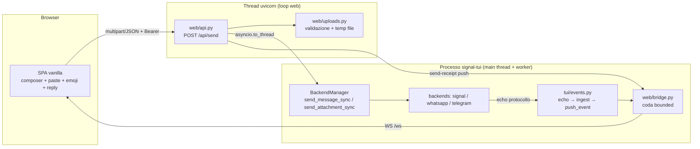

# DESIGN — Plug-in web FASE 2: invio messaggi, paste immagini, emoji picker, reply/quote, login UI

**Stato:** Proposta — da approvare (2026-08-27). Documento di design per la
**fase 2** del plug-in web; si appoggia all'MVP read-only già su `master`
(`docs/DESIGN_WEB_UI.md`, package `web/`). **Nessuna implementazione in questo
documento**: solo design. Dove testo e codice divergeranno in fase di
implementazione, farà fede il codice.

**Vincoli:** Python 3.10+ · plug-in (TUI e backends a modifiche minime) ·
il web è **writer di soli messaggi** (vedi §4, riformulazione del vincolo
"reader") · frontend HTML5 vanilla · dipendenze web opzionali
(`requirements-web.txt`), **mai** nel `requirements.txt` principale.

---

## 1. Contesto

L'MVP (fase 1) ha reso il web un **reader**: REST read-only
(`web/api.py:126-174`), push WS (`web/ws.py`), Bearer auth
(`web/auth.py:9-19`), SPA vanilla (`web/static/app.js`). La SPA oggi dichiara
esplicitamente la sola lettura (`web/static/app.js:275` — meta "· sola
lettura"; `web/static/index.html:49` — "Archivio in sola lettura") e **non ha
alcun composer**.

La fase 2 trasforma il web da reader a **corrispondente**: invio di testo,
quote/reply, immagini incollate dal clipboard, emoji picker laterale, login UI.
Tutto passa **sempre** dal `BackendManager` della TUI (stesso processo,
`web/server.py:65` — `app.state.manager`): il web non istanzia backend, non
tocca il DB, non consuma stream.

**Fatto architetturale chiave (verificato sul codice):** la TUI stessa non
invia via `manager.send_message` (async, `backends/manager.py:115-134`);
l'invio reale avviene via **`backend.send_message_sync(...)` da un worker
thread Textual** (`tui/send.py:377`, worker avviato a `tui/send.py:224-237`).
Il web deve specchiare questo pattern, non inventarne uno async.

## 2. Obiettivi (fase 2)

1. `POST /api/send`: invio **testo + quote** dal browser, instradato al
   `BackendManager` senza congelare né il loop Textual né il loop uvicorn.
2. **Paste di immagini** nel composer del browser → allegato inviato dal
   backend del protocollo (Signal/WhatsApp/Telegram).
3. **Emoji picker laterale** alla barra di inserimento (griglia accanto al
   composer, come nei client di messaggistica), insieme emoji coerente con la
   TUI (`emoji_data.py:8`), ricerca/filtro e navigazione da tastiera.
4. **Reply/quote UI**: tasto "rispondi" su una bolla → banner di citazione nel
   composer → invio con parametri quote.
5. **Login UI** presentabile al posto del token-dialog
   (`web/static/index.html:56-69`).

## 3. Non-obiettivi (esclusi dalla fase 2)

- **Scrittura diretta su DB/cache/stream da parte del web** — mai: persistenza
  e dedup restano del flusso echo esistente (§5.2).
- **Editing, mark-read, typing, reaction, eliminazione** via web.
- **Invio di allegati non-immagine** (video/audio/documenti): solo `image/*`
  (la clipboard del browser produce immagini; il resto è fase 3).
- **Drag & drop / file picker** come fonte: la fonte primaria è il **paste**;
  il pulsante "allega" con `<input type="file">` è un bonus minimo dello
  stesso chunk, non un requisito.
- **Multi-account web / sessioni utente**: resta il Bearer token singolo.
- **Sostituire la TUI**: il web resta un client secondario in-process.
- **Modifiche al wire dei backend** oltre l'aggiunta dell'invio allegati:
  nessun protocollo esistente viene rinegoziato.

## 4. Vincoli del committente — riformulazione del vincolo "web reader"

Il vincolo MVP ("il web è **reader**, mai scrittore",
`docs/DESIGN_WEB_UI.md:9-10`) è **superato e sostituito** da:

> **Il web è un writer di SOLI MESSAGGI.** Può creare messaggi in uscita
> (testo, quote, allegati immagine) **esclusivamente** instradando la richiesta
> al `BackendManager`/backend della TUI (stesso processo, stesse connessioni).
> Il web **non scrive mai** sul DB SQLite, **non ingesta mai** nelle cache dei
> backend o della TUI, **non consuma mai** lo stream, **non istanzia** backend.
> Persistenza, dedup e aggiornamento delle cache avvengono **solo** tramite il
> flusso echo già esistente (poll thread / webhook WAHA / eventi Telethon →
> `_handle_message_event`, `tui/events.py:41-172` → `push_event`,
> `tui/events.py:94-107`), che la SPA riceve via WS come oggi.

Gli altri vincoli dell'MVP restano invariati: plug-in a modifiche minime,
default OFF dietro `--web`, start in `on_mount` (`tui/app.py:283-288`), stop in
`on_exit` (`tui/app.py:596-599`) prima del disconnect backend.

## 5. Architettura

### 5.1 Vista d'insieme



### 5.2 Persistenza: il web NON fa optimistic ingest

La TUI, all'invio, crea una riga ottimistica (`tui/send.py:159`,
`persist=False`) e la persiste nel worker **prima** del send di rete
(`tui/send.py:276-292`). Il web **non può** replicare questo percorso (vietato
toccare DB/cache). Il modello di verità per la fase 2 è quindi:

1. Il browser invia → `POST /api/send` → backend spedisce → **200** con
   `{message_id, timestamp}` (valore di ritorno di `send_message_sync`, come
   per la TUI a `tui/send.py:377`).
2. La **SPA** mostra subito una bolla **locale** "in invio → inviato"
   (optimistic UI **solo client-side**, nessuno stato condiviso).
3. L'**echo di protocollo** del messaggio appena inviato (Signal
   `syncMessage.sentMessage` — gestito in `backends/signal.py:612-619`; ack
   WAHA `fromMe` — `backends/whatsapp.py:273-330`; `NewMessage` outgoing
   Telethon) viene ingestato dal flusso esistente (`tui/events.py:90`),
   persistito, e notificato via `push_event` (`tui/events.py:94-107`) → la SPA
   ricarica il thread (`web/static/app.js:328-337` già lo fa) e la bolla
   ottimistica viene sostituita dalla riga persistita.
4. **Send-receipt push** (nuovo, §7.3): al 200, l'endpoint accoda esso stesso
   un `push_event` via `web/bridge.py:39` così **tutti** i browser connessi
   (e non solo il mittente) si aggiornano subito. È solo un trigger di
   refresh, non una scrittura di stato.

### 5.3 Routing dell'invio: `asyncio.to_thread`, NON `run_coroutine_threadsafe`

**Decisione D1 (invio → manager).** L'endpoint chiama una **nuova facade
sincrona** del manager dentro `asyncio.to_thread(...)` con timeout:

```python
# web/api.py — handler (pseudocodice)
result = await asyncio.wait_for(
    asyncio.to_thread(
        manager.send_message_sync,  # nuova facade, §7.2
        proto,
        contact_id,
        text,
        **quote_kwargs,
    ),
    timeout=35,
)
```

**Perché non le alternative** (analizzate e **scartate**):

| Alternativa | Esito | Motivo (file/riga reali) |
|---|---|---|
| `run_coroutine_threadsafe(manager.send_message(...), loop_textual)` | **SCARTATA** | `manager.send_message` è async (`backends/manager.py:115`), ma: WhatsApp delega alla REST **bloccante** (`backends/whatsapp.py:1168-1176`) → congelerebbe il loop Textual per tutta la HTTP call; Telegram fa `future.result(timeout=30)` **bloccando il thread chiamante** (`backends/telegram.py:740-741`) → fino a 30 s di freeze della TUI. Nessun deadlock tecnico, ma freeze UI inaccettabile. |
| `await manager.send_message(...)` sul loop uvicorn | **SCARTATA** | Stessi corpi bloccanti, stessa gravità: il `future.result(timeout=30)` di Telegram e la REST di WAHA girerebbero **dentro** il loop uvicorn, bloccando WS broadcast (`web/ws.py:37-56`) e tutte le altre richieste per secondi. |
| Nuovo consumer/dedicato processo | **SCARTATA** | Viola il vincolo "un solo processo, un solo writer" (MVP §5.3, problemi 1-2). |

`asyncio.to_thread` è **deadlock-free per costruzione**: il worker thread del
pool AnyIO si blocca, i due event loop (Textual e uvicorn) no. È **lo stesso
pattern della TUI** (`tui/send.py:377` chiama `send_message_sync` da un thread)
ed è coerente con `backends/base.py:120-124` (`edit_message` = `to_thread`
del sync). I timeout interni dei backend (Telegram 30 s,
`backends/telegram.py:741`; timeout REST WAHA; errore RPC signal-cli,
`backend/rpc.py:340-341`) limitano la vita del thread; il `wait_for(35)` dà
margine senza accumulare thread (il pool to_thread è bounded, default 40).

### 5.4 Nuovo modulo `web/uploads.py`

Gestione degli upload in arrivo (unico punto): validazione dimensione/tipo,
salvataggio in **file temporaneo** sotto una directory dedicata
(`CACHE_DIR / "web-uploads"`), cleanup garantito. Il **path** (non i bytes) è
il contratto interno verso i backend (§8.2).

## 6. Componenti e punti di aggancio (file/righe reali)

| Componente | Dove | Ruolo nella fase 2 |
|---|---|---|
| `app.state.manager` | `web/server.py:65` | il router `/api/send` legge il manager da qui (come `web/api.py:137`) |
| `manager.send_message` (async) | `backends/manager.py:115-134` | **non usata** dal web (D1); resta per la TUI |
| **nuovo** `manager.send_message_sync` | `backends/manager.py` (dopo :134) | facade sync di instradamento per protocollo (§7.2) |
| **nuovo** `manager.send_attachment_sync` | `backends/manager.py` | instradamento allegati (§8.2) |
| `ChatBackend.send_message_sync` | `backends/signal.py:559-580`, `backends/telegram.py:746-770`, `backends/whatsapp.py:1220-1253` | esiste già nei 3 backend; da **dichiarare** nel contratto `backends/base.py` (oggi assente: base.py:55 definisce solo l'async) |
| **nuovo** `ChatBackend.send_attachment_sync` | `backends/base.py` (default `NotImplementedError`) + 3 backend | §8.2 |
| Signal RPC `send` | `backend/rpc.py:344-400` (daemon), `backend/rpc.py:137-158` (`_send_subprocess`) | aggiungere parametro `attachments` (lista path) → `params["attachments"]` / `--attachment` |
| WAHA REST | `backends/whatsapp_rest.py:323-343` (`sendText`) | **nuovo** metodo `send_image` → `POST /api/sendImage` (base64 nel body) |
| Telethon | `backends/telegram.py:746-770` (pattern `run_coroutine_threadsafe`) | **nuovo** `send_attachment_sync` → `client.send_file(entity, path, caption=…, reply_to=…)` |
| Reply-guard TUI | `tui/send.py:100-123` | le stesse regole (TG: id numerico > 0; WA: `reply_to_message_id` obbligatorio) replicate **server-side** → 400 |
| Echo → push | `tui/events.py:90-107` | invariato: è il canale di verità per i messaggi inviati dal web |
| Bridge push | `web/bridge.py:39-53` | riusato per la send-receipt push (§7.3) |
| Bearer middleware | `web/auth.py:22-36` | copre automaticamente `POST /api/send` (path sotto `/api/`) |
| Emoji data | `emoji_data.py:8` (`PREDEFINED_CATEGORIES`), alias `emoji_picker.py:36-49` | sorgente di `GET /api/emoji` (§9.3) |
| SPA | `web/static/app.js:56-66` (`apiFetch`), `:272-284` (`openThread`), `:210-249` (`renderMessages`) | composer, paste, reply, emoji panel, login (§9) |
| Test esistenti | `tests/test_web_plugin.py:23-49` (`FakeManager`/`make_app`), `:52-65` (fixture DB tmp) | estesi con `send_message_sync` fake e casi per chunk (§15) |

## 7. API fase 2

### 7.1 `POST /api/send` — un endpoint, due content-type

**Un solo endpoint** con negoziazione sul `Content-Type`:

| Content-Type | Uso | Body |
|---|---|---|
| `application/json` | testo + quote (nessun allegato) | `{"proto", "contact_id", "text", "quote_timestamp"?, "quote_author"?, "quote_message"?, "reply_to_message_id"?}` |
| `multipart/form-data` | testo/quote + **un** allegato immagine | campi identici + `file` (blob immagine dalla clipboard) |

**Motivazione della doppia forma:** il JSON mantiene il caso testuale banale da
testare/debuggare (curl, TestClient); il multipart è riservato agli allegati.
**Multipart e non JSON+base64** per l'immagine: il base64 gonfia del ~33%,
obbliga il parser JSON a materializzare l'intera stringa in memoria, e non
streamma; `UploadFile` di FastAPI usa `SpooledTemporaryFile` (spool su disco
oltre 1 MiB) → memoria bounded anche prima del nostro cap. Dal browser il
paste produce un `Blob` (`ClipboardEvent.clipboardData`): `FormData` è il
contenitore nativo e porta **nella stessa richiesta atomica** testo + quote +
file (niente doppio round-trip "upload poi send" con file orfani da
riconciliare).

**Risposte:** `200 {"status":"sent","proto","contact_id","message_id","timestamp"}`
· `400` validazione/reply-guard · `404` protocollo/contatto ignoto · `413`
allegato oltre il cap · `415` tipo non immagine · `502` backend send fallita ·
`504` timeout (35 s).

```python
# Pseudocodice handler (web/api.py)
@router.post("/send")
async def send(request: Request) -> ...:
    form_or_json = await _parse_send_request(request)      # json | multipart
    payload = _validate_send_payload(form_or_json)          # proto Literal, campi, reply-guard (tui/send.py:100-123)
    upload = None
    if "file" in form_or_json:
        upload = await store_upload(form_or_json["file"])   # web/uploads.py: cap, sniff, temp file
    try:
        fn = manager.send_attachment_sync if upload else manager.send_message_sync
        result = await asyncio.wait_for(
            asyncio.to_thread(fn, payload.proto, payload.contact_id,
                              payload.text, **payload.quote_kwargs,
                              **({"file_path": upload.path, "mime_type": upload.mime} if upload else {})),
            timeout=35,
        )
    finally:
        if upload: upload.cleanup()                         # delete temp file, sempre
    push_event({"type": "message", "payload": {"protocol": payload.proto,
                "contact_id": payload.contact_id, "timestamp": result.ts}})  # §7.3
    return {"status": "sent", "message_id": str(result.id), "timestamp": result.ts, ...}
```

**Validazioni server-side** (mai fidarsi del client):
- `proto ∈ {signal, whatsapp, telegram}` (Literal, come `web/api.py:153`);
- `contact_id` appartiene a `manager.list_contacts()` per quel protocollo →
  altrimenti 404 (anti-inoltro a destinatari arbitrari non in rubrica/chat);
- `text` non vuoto **oppure** file presente; cap testo (es. 64 KiB);
- **reply-guard** specchio di `tui/send.py:100-123`: `proto=telegram` ⇒
  `reply_to_message_id` intero > 0 obbligatorio se è una reply; `proto=whatsapp`
  ⇒ `reply_to_message_id` non vuoto obbligatorio se è una reply; Signal usa
  `quote_timestamp` (+ `quote_author = contact_id`, come la TUI a
  `tui/send.py:299`).

### 7.2 Nuova facade `BackendManager.send_message_sync`

```python
# backends/manager.py — pseudocodice (specchio di send_message, :115-134)
def send_message_sync(
    self,
    protocol,
    contact_id,
    text,
    *,
    quote_timestamp=None,
    quote_author=None,
    quote_message=None,
    reply_to_message_id=None,
) -> str:
    backend = self._get_or_raise(protocol)  # :162-166
    return backend.send_message_sync(
        contact_id,
        text,
        quote_timestamp=quote_timestamp,
        quote_author=quote_author,
        quote_message=quote_message,
        reply_to_message_id=reply_to_message_id,
    )
```

`send_message_sync` va **dichiarato in `backends/base.py`** (contratto; oggi è
un metodo di fatto presente nei 3 backend ma assente dall'ABC — base.py:55-68
espone solo l'async). Default nel contratto: delega a
`asyncio.to_thread(self.send_message, ...)`? **No** — default
`NotImplementedError`: i tre backend ce l'hanno già e un default nascosto
async-in-sync sarebbe una trappola. Modifica minima: ~10 righe nel manager +
~15 in base.py.

### 7.3 Send-receipt push

Al 200 di `/api/send`, l'endpoint chiama `push_event` (`web/bridge.py:39`) con
lo stesso envelope di `tui/events.py:97-106`. Effetto: la SPA mittente e ogni
altro browser fanno `loadContacts({quiet:true})` + `loadMessages()`
(`web/static/app.js:328-337`) senza attendere l'echo. **Non** è una scrittura
di stato: se l'echo non è ancora persistito, il refresh mostra semplicemente
lo stato precedente (la bolla ottimistica locale copre il gap, §5.2).

### 7.4 Estensione di `GET /api/messages` (necessaria per §4 reply UI)

`_messages` (`web/api.py:56-103`) oggi seleziona `id, msg_id, text, is_mine,
timestamp, attachment_id, attachment_info, content_type, protocol`
(`web/api.py:66-68`). La reply UI deve **mostrare** il contesto citato nelle
bolle: si aggiungono alla SELECT e al dict di risposta `quote_text`,
`quote_timestamp`, `quote_author` (colonne già persistite, vedi il `data` di
`tui/send.py:126-151`). L'`id` esposto (`web/api.py:96` — `msg_id or str(row
id)`) è già il `reply_to_message_id` corretto per WA/TG; per Signal la reply
usa `timestamp` + `quote_author` e `reply_to_message_id` resta `null`
(coerente con la TUI).

## 8. Invio allegati (paste immagini)

### 8.1 Fatto sul codice: oggi NESSUN backend invia allegati

Verificato: `send_attachment`/`send_photo`/`send_file` **non esistono** nel
repo; i tre `send_message*` gestiscono solo testo+quote; Signal conosce solo i
`quoteAttachments` (allegati **citati**, `backend/rpc.py:353,398-399`), non gli
allegati del messaggio. La fase 2 introduce il contratto di invio allegato.

### 8.2 Contratto `ChatBackend.send_attachment_sync` (nuovo)

```python
# backends/base.py — default: nessun supporto
def send_attachment_sync(
    self,
    contact_id: str,
    file_path: Path,
    *,
    caption: str | None,
    mime_type: str,
    quote_timestamp=None,
    quote_author=None,
    quote_message=None,
    reply_to_message_id=None,
) -> str:
    raise NotImplementedError
```

Implementazioni (tutte **sync, da worker thread** — pattern esistente):

| Backend | Implementazione | Note |
|---|---|---|
| Signal | estendere `backend/rpc.py:344` `send_message(..., attachments: list[str] \| None)` → `params["attachments"]`; e `backend/rpc.py:137` `_send_subprocess(..., attachments)` → `--attachment <path>`; poi `SignalBackend.send_attachment_sync` chiama `_send_message_sync` con `attachments=[path]` e `text=caption or ""` | signal-cli accetta path locali: **niente copie**, il temp file di §5.4 basta |
| Telegram | `send_attachment_sync` con `_send()` → `client.send_file(entity, file_path, caption=caption, reply_to=reply_to)` sul solito `run_coroutine_threadsafe(self._loop)` + `future.result(timeout=30)` (`backends/telegram.py:740-741`) | `force_document=False` (default) → reso come immagine |
| WhatsApp | **nuovo** `WAHAClient.send_image(chat_id, path, caption, reply_to)` accanto a `whatsapp_rest.py:323`: legge il file, base64 nel body WAHA `POST /api/sendImage` (`{"session","chatId","file":{"mimetype","data":<b64>},"caption","reply_to"}`); `WhatsAppBackend.send_attachment_sync` wrappa e riusa `_extract_message_id` (`backends/whatsapp.py:1178-1218`) | WAHA vuole base64: la codifica avviene **nel backend**, non nel web layer |

**Path temporaneo, non bytes, come contratto interno**: signal-cli richiede un
path; Telethon gestisce path nativamente; solo WAHA base64-encoda (interno al
backend). Un solo formato evita tre adattatori.

### 8.3 `web/uploads.py` — validazione e lifecycle

**Decisione di implementazione Chunk B.** Il sottoinsieme accettato è
PNG/JPEG/GIF/WebP (BMP resta rinviato perché il requisito del chunk limita la
whitelist a questi quattro formati). Magic bytes assenti o incoerenza fra magic
ed estensione producono un `400` generico. Il janitor, eseguito una sola volta
all'avvio e senza timer, elimina gli orfani più vecchi di un'ora; un'ora riduce
il consumo disco dopo un crash senza introdurre lavoro periodico a riposo.

- **Cap dimensione**: default **20 MiB** (config `web.max_upload_mb`), check
  anticipato su `Content-Length` → 413 senza leggere il body; poi conteggio
  reale durante lo spool (difesa da header mentito).
- **Tipo**: whitelist `image/{png,jpeg,gif,webp,bmp}`; il mimetype **non** si
  legge dall'header del client ma da **magic bytes** (PNG `‰PNG`, JPEG
  `\xff\xd8\xff`, GIF87a/89a, `RIFF…WEBP`, `BM`) → 415 altrimenti.
- **Storage**: `tempfile.NamedTemporaryFile(dir=CACHE_DIR/"web-uploads",
  delete=False, suffix=.<ext>)`; la directory è creata all'avvio del server;
  **cleanup nel `finally`** dell'handler (§7.1) + **janitor** all'avvio che
  rimuove file più vecchi di 24 h (upload orfani da crash).
- **Perché non tenere i bytes in memoria**: un paste da screenshot 4K può
  superare 10 MiB; su disco il picco di RAM del processo TUI non si muove.

### 8.4 Impatto sul vincolo reader

Coperto dalla riformulazione di §4: l'allegato transita per `web/uploads.py`
(scratch locale, non DB) ed è spedito dal backend come un qualsiasi invio TUI;
persistenza e thumbnail della bolla in uscita restano all'echo. Nota nota: per
WhatsApp/Telegram l'echo di un media proprio arriva con `attachment_id`
scaricabile (`backends/whatsapp.py:1297-1322` lazy-fetch; Telegram media dir) →
la bolla immagine nel browser apparirà al refresh, come per i media ricevuti.

## 9. SPA (vanilla, nessuna nuova dipendenza)

### 9.1 Composer

Footer del thread panel (oggi assente: `index.html:46-52` termina con
`message-list`): flex row `[textarea autoresize] [📎] [😀 toggle] [➤]` +
**pannello emoji laterale** toggleabile (§9.3). `Enter` invia, `Shift+Enter`
newline (come la TUI `MessageTextArea`). Il meta "· sola lettura"
(`app.js:275`) diventa il nome del protocollo + stato connessione.

### 9.2 Paste immagini

```js
composer.addEventListener("paste", (e) => {
  const item = [...e.clipboardData.items].find(i => i.type.startsWith("image/"));
  if (!item) return;                    // paste testuale: comportamento nativo
  e.preventDefault();
  stageAttachment(item.getAsFile());    // Blob → area di staging
});
```

Staging: thumbnail (object URL, riuso del pattern `app.js:161-166` per
revoca), nome sintetico `clipboard-<ts>.png`, pulsante ✕ rimuovi. All'invio:
`FormData {proto, contact_id, text, quote_*, file}` → `apiFetch("/api/send",
{method:"POST", body: fd})` — **attenzione**: `apiFetch` (`app.js:56-66`) non
deve impostare `Content-Type` su multipart (boundary automatico del browser);
aggiungere il ramo `if (!(options.body instanceof FormData))`.

### 9.3 Emoji picker laterale

- **Dati**: `GET /api/emoji` → JSON costruito da
  `emoji_data.PREDEFINED_CATEGORIES` (`emoji_data.py:8`) con alias EN da
  `emoji.EMOJI_DATA` (stessa mappa di `emoji_picker.py:36-49`):
  `[{name, icon, emojis: [{char, alias}, …]}, …]`. **Si serve l'insieme RAW,
  non** `_sanitize_emojis` (`emoji_picker.py:87-115`): quella è una pezza per
  i bug di larghezza di **Textual** (ZWJ/keycap/RIS); il browser renderizza
  correttamente ZWJ e bandiere, quindi il web offre l'insieme completo (flag
  incluse) — divergenza voluta e documentata. Risposta statica:
  `Cache-Control: max-age=3600` + cache in memoria nella SPA.
- **Decisione implementativa Chunk D**: per mantenere `emojis` come insieme RAW
  direttamente confrontabile con `PREDEFINED_CATEGORIES`, la risposta usa
  `[{category, icon, emojis: [char, ...], aliases: {char: alias}}]`. Gli alias
  sono metadati additivi usati soltanto dalla ricerca; caratteri, ordine e
  categorie provengono senza sanitizzazione da `emoji_data.py`.
- **UI**: pannello alla **destra del composer** (non modale full-screen come
  `EmojiPickerScreen`, `emoji_picker.py:164`): tabs categoria con icona,
  input di ricerca (filtro substring su alias, stessa logica di
  `search_emoji`, `emoji_picker.py:61-71`), griglia 8 colonne (specchio di
  `emoji_picker.py:239` — `grid-size: 8`).
- **Inserimento**: click/Enter → `textarea.setRangeText(char, selStart,
  selEnd, "end")` (inserimento al caret, niente `:alias:` — il prodotto chiede
  carattere diretto; gli alias restano solo chiave di ricerca).
- **Accessibilità/tastiera**: `role="grid"`/`gridcell`, roving `tabindex`,
  frecce ←→↑↓ (±8 per le righe, come `emoji_picker.py:488-514`), `/` o
  `Ctrl+F` focalizza la ricerca (specchio di `ctrl+f`, `emoji_picker.py:275`),
  `Esc` chiude e restituisce il focus al textarea, `aria-label` con l'alias su
  ogni cella.

### 9.4 Reply/quote UI

- Ogni bolla (`.message`, `app.js:223-245`) espone al hover/focus un tasto
  "↩ Rispondi" → `state.replyTo = {id, timestamp, author, text}`.
- **Banner citazione** sopra il composer: autore + testo troncato (80 char) +
  ✕ annulla (equivalente di `_cancel_reply`, `tui/send.py:222`).
- Invio: il banner si traduce in `quote_timestamp`, `quote_author` (= id del
  contatto della chat, come `tui/send.py:299`), `quote_message`,
  `reply_to_message_id` (= `id` esposto da §7.4 per WA/TG; omesso per Signal).
- Le bolle renderizzano il contesto citato (blocco `.quote` in testa alla
  bolla) usando i campi `quote_*` aggiunti in §7.4.

### 9.5 Optimistic send nella SPA

Al 200: bolla locale `out` con stato "inviato" (orologio→spunta), `text`/
thumbnail locale, quote banner azzerato; il push (send-receipt §7.3 o echo
§5.2) innesca il refresh che la sostituisce con la riga persistita. Su 4xx/5xx:
bolla marcata "fallita" + messaggio nell'error banner esistente
(`app.js:34-37`). **Nessun retry automatico** (fase 3; la TUI ha
`_retry_failed_message`, `tui/send.py:583`).

## 10. Autenticazione e Login UI

- Meccanismo **invariato**: Bearer + `hmac.compare_digest`
  (`web/auth.py:9-19`), sottoprotocollo WS (`web/static/app.js:315-321`,
  `web/ws.py:13-34`). Il middleware (`web/auth.py:22-36`) protegge
  automaticamente `POST /api/send` (prefisso `/api/`).
- **Login UI**: pagina dedicata (sostituisce il `<dialog>` di
  `index.html:56-69`): schermata brandizzata centrata (logo, campo token
  password, bottone "Connetti", messaggio d'errore inline su 401), token
  inserito **una volta** e persistito in `localStorage` (chiave esistente
  `signal-tui-web-token`, `app.js:3-5`); bottone "Esci" nella sidebar che
  svuota la chiave e ricarica. Flusso: bootstrap → se assente/401 → login
  screen; al submit → probe `GET /api/contacts` → se 200 entra nell'app.

## 11. Lifecycle e robustezza

1. Start/stop invariati (`tui/app.py:283-288`, `:596-599`); la directory
   `web-uploads` + janitor nascono/muovono con `start_web_server`
   (`web/server.py:31-149`).
2. Backend down o protocollo non registrato ⇒ `_get_or_raise`
   (`backends/manager.py:162-166`) → 404; eccezione nel send → 502 con
   `detail` generico (mai stack trace al client; stack in log, come
   `tui/send.py:428-434`).
3. Timeout send (35 s) → 504; il worker thread residuo è bounded dai timeout
   interni dei backend (§5.3).
4. Pool to_thread saturo sotto raffiche ⇒ richieste in coda bounded dal
   server; cap applicativo opzionale: **rate limit** semplice in memoria
   (es. 20 send/min per token) → 429 (difesa da loop di retry impazziti,
   §12).
5. Web down: la TUI è inalterata (MVP §9); senza `--web` il comportamento è
   byte-identico (criterio A1).

## 12. Sicurezza

- **Superficie di scrittura nuova**: un solo endpoint mutante, dietro Bearer,
  con validazione contatto (§7.1) — niente invii a destinatari arbitrari.
- **CSRF**: l'auth è header `Authorization` (**non cookie**) → il browser non
  lo allega automaticamente a richieste cross-origin; una `<form>` multipart
  cross-site non può impostarlo ⇒ CSRF classico **non sfruttabile**. Difesa in
  profondità aggiuntiva (economica): rifiutare `POST /api/send` se l'header
  `Origin` è presente e il suo host ≠ `Host` della richiesta. **Nessun** CORS
  middleware (same-origin only, come oggi).
- **Token in localStorage**: esposto a eventuale XSS (come oggi); la SPA non
  usa `innerHTML` con dati utente (`renderMessages` usa `textContent`,
  `app.js:237`) — mantenere la regola anche per composer/quote/emoji.
- **Upload**: cap 20 MiB, sniff magic bytes, whitelist immagini, temp file
  `0600` in directory dedicata, cleanup garantito + janitor; **mai** servire
  `web-uploads` via static/media endpoint (è scratch, non content).
- **Path handling**: il path temporaneo è generato dal server, mai dal client
  (nessun traversal possibile, a differenza del caso MVP
  `backend/rpc.py:164-180`).
- **Rate limit** invii (§11.4) + cap testo 64 KiB.
- Log: send riuscito/fallito con proto/contact/ts, **mai** il contenuto del
  messaggio o il token.

## 13. Rischi

| # | Rischio | Mitigazione |
|---|---|---|
| R1 | Freeze dei loop per send bloccanti | **Chiuso in design** (D1, §5.3): `asyncio.to_thread` + facade sync; alternative analizzate e scartate con motivi |
| R2 | Messaggio inviato dal web **non appare** se l'echo di protocollo manca/ritarda | Bolla ottimistica locale + send-receipt push (§7.3); gli echo propri esistono per tutti e tre i protocolli (§5.2); se oltre N s niente push, la SPA ha comunque il refresh manuale/WS. Da validare nel chunk A (test e2e per protocollo) |
| R3 | Doppia bolla (ottimistica + echo) | L'echo sostituisce via refresh completo del thread (`app.js:262-264`); la bolla ottimistica vive solo nel DOM fino al refresh |
| R4 | Accumulo thread su backend lenti | Timeout interni backend (TG 30 s) + `wait_for(35)` + pool bounded + rate limit |
| R5 | Abuso upload (disco pieno) | Cap 20 MiB, janitor 24 h, directory fuori dal media serving |
| R6 | WAHA `/api/sendImage` con shape diversa tra versioni | Stesso approccio difensivo di `_extract_message_id` (`backends/whatsapp.py:1178-1218`); test con risposte WAHA multiple; fallback errore 502 esplicito |
| R7 | signal-cli subprocess vs daemon per `attachments` | Estendere entrambi i rami (`backend/rpc.py:344` e `:137`), test su entrambi |
| R8 | Regressione TUI senza `--web` | Modifiche additive (facade nuove, default `NotImplementedError`); percorso TUI invariato (A1) |
| R9 | Emoji panel pesante (migliaia di celle DOM) | Render per categoria attiva (come `emoji_picker.py:336-344`), non tutto l'insieme; ricerca con cap 60 risultati (come `emoji_picker.py:372-373`) |
| R10 | Reply a messaggio con metadati insufficienti (WA/TG) | Reply-guard server-side → 400 (§7.1), specchio di `tui/send.py:100-123` |

## 14. Piano di implementazione (chunk)

| Chunk | Deliverable | Dipendenze | Stima |
|---|---|---|---|
| **A — Send testo** | `BackendManager.send_message_sync` + contratto in `base.py` · `POST /api/send` (JSON, testo+quote) + validazioni + send-receipt push · SPA composer + bolla ottimistica | — | 1,5–2 gg |
| **B — Paste immagini** | `web/uploads.py` · multipart su `/api/send` · `send_attachment_sync` nei 3 backend (`rpc.py` attachments, Telethon `send_file`, WAHA `sendImage`) · staging UI + paste handler | A | 2–3 gg |
| **C — Reply/quote UI** | `GET /api/messages` esteso (quote_*) · tasto rispondi + banner + render quote nelle bolle · reply-guard server | A | 1–1,5 gg |
| **D — Emoji picker laterale** | `GET /api/emoji` · pannello laterale con tabs/ricerca/griglia 8-col · inserimento al caret · tastiera/ARIA | A (composer) | 1 gg |
| **E — Login UI** | schermata login, persistenza token, logout | nessuna (indipendente) | 0,5–1 gg |

Ordine suggerito: **A → B → C → D → E** (E può partire in parallelo; D dopo A
perché vive nel composer).

## 15. Test per chunk (pattern esistente: `tests/test_web_plugin.py`)

- **A**: `FakeManager` esteso con `send_message_sync` fake (registra kwargs,
  ritorna ts) → TestClient: 200 con quote passate al fake inalterate; 400 su
  reply-guard TG/WA; 404 proto ignoto; 502 su eccezione del fake; 504 su fake
  lento; **401 senza Bearer** (middleware); test unitario facade
  `manager.send_message_sync` con backend finto registrato. e2e WS: dopo il
  200 arriva la send-receipt push sul `/ws` (fixture `make_app`,
  `tests/test_web_plugin.py:38-49`).
- **B**: multipart con PNG reale (magic bytes) → fake `send_attachment_sync`
  riceve un path esistente, mimetype sniffato, e dopo la risposta il temp file
  **non esiste più** (cleanup); 413 oltre cap; 415 su `.exe` rinominato
  `.png`; janitor rimuove file vecchi. Backend: test `rpc.send_message` con
  `attachments` (mock `_call`), WAHA `send_image` (mock `_request`), Telethon
  `send_file` (client finto, pattern dei test esistenti su `run_coroutine_threadsafe`).
- **C**: `GET /api/messages` espone `quote_*` da righe seeded nel DB tmp
  (fixture `web_client`, `tests/test_web_plugin.py:52-65`); POST con
  `reply_to_message_id` instradato correttamente per WA/TG; Signal senza
  `reply_to_message_id` ma con `quote_timestamp`.
- **D**: `GET /api/emoji` → 200, struttura categorie coerente con
  `emoji_data.PREDEFINED_CATEGORIES`, alias presenti, flag/ZWJ **inclusi**
  (differenza voluta dalla TUI); cache header. (Test UI manuale: tastiera,
  ricerca, inserimento al caret.)
- **E**: flusso 401 → login → 200; token persistito (jsdom o test manuale);
  logout svuota la chiave.
- **Regressione**: tutti i test MVP esistenti devono restare verdi; TUI senza
  `--web` invariata (A1).

## 16. Criteri di accettazione (fase 2)

1. La **TUI funziona invariata** senza `--web` (**zero regressioni**, A1).
2. Da browser: invio di **testo** e **testo+quote** sui tre protocolli; il
   messaggio appare (ottimistico subito, persistito all'echo) e nessun freeze
   percettibile di TUI o web durante l'invio.
3. **Paste di un'immagine** nel composer → invio come allegato sui tre
   protocolli; file oltre 20 MiB o non immagine rifiutati (413/415); nessun
   file residuo in `web-uploads` dopo l'invio.
4. **Emoji picker laterale**: griglia accanto al composer con categorie e
   ricerca; inserimento del carattere al caret; usabile da sola tastiera
   (frecce/Enter/Esc).
5. **Reply UI**: tasto rispondi → banner citazione → invio con quote; bolle
   mostrano il contesto citato; reply-guard WA/TG rifiutate con 400 chiaro.
6. **Login UI** presentabile: token inserito una volta, persistito, logout
   funzionante; 401 riporta al login.
7. **Vincolo §4 rispettato**: nessuna scrittura DB/cache dal web (verifica a
   codice: `web/` non importa `backend.db` in scrittura né chiama
   `ingest_message`); auth Bearer su ogni endpoint mutante; shutdown pulito
   con la TUI.
