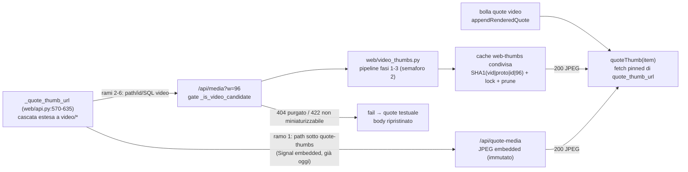

# DESIGN — Thumbnail del primo frame per messaggi VIDEO nella web UI

**Stato:** Proposta (2026-09-01; rev. 2026-09-01b — aggiunto il design
completo della **Fase 4: quote video con miniatura**, §13, con analisi
dell'impatto retroattivo su fasi 1-3 in §4.5 e §13.10). Documento di design;
**nessuna implementazione in questo documento**. Dove testo e codice
divergeranno in fase di implementazione, farà fede il codice.

**Vincoli:** Python 3.10+ · solo **web UI** (la TUI è esplicitamente fuori
scope) · nessuna nuova dipendenza obbligatoria — **ffmpeg di sistema**
(6.1.1 verificato sul sistema) e **Pillow** (già in `requirements.txt`) ·
zero regressioni sul serving completo di `/api/media` (senza `?w` resta
`FileResponse`, `web/api.py:1626`).

---

## 1. Obiettivo e non-obiettivi

**Obiettivo:** per i messaggi con `media_kind == "video"` (oggi icona 🎬 +
nome file) mostrare nella **web UI** una miniatura JPEG del **primo frame**,
mantenendo il click che apre il file completo.

**Non-obiettivi:**

- **TUI**: nessuna thumbnail video (consolidato con `docs/BUGS.md` #70 —
  rendering lazy TUI tracciato a parte; il fallback non-kitty non usa Pillow).
- **`gif`, `voice`, `audio`, `document`, `sticker`**: restano `fileAttachment`
  (icona + nome). Solo `video` cambia classe.
- **Invio/upload**: il limite web 100MB per video (`web/uploads.py:18`) è
  invariato; qui si tratta solo di **lettura**.
- **Quote video**: **decisione — Fase 4 dedicata, progettata in §13 (design
  completo), implementazione differita dopo le fasi 1-3**. Il "NO (v1)"
  originario è revocato: con la pipeline di fasi 1-3 il costo marginale è
  l'estensione del resolver (`_quote_thumb_url` emette `/api/media?w=96`
  anche per `video/*`) e **zero nuova infrastruttura** (endpoint, cache,
  semaforo riusati; per Signal l'embedded thumbnail copre già oggi il caso,
  §13.2). Resta fuori dalla consegna delle fasi 1-3 per non accoppiare il
  rollout ffmpeg alla cascata delicata del resolver quote (6 rami,
  `web/api.py:570-635`); il test `tests/test_web_quote_thumbs.py:78-100`
  sarà aggiornato nella Fase 4 (§13.9).
- **Playback inline**: il click continua ad aprire il file intero in nuova
  tab (comportamento attuale di `fileAttachment`, `web/static/app.js:602`).

## 2. Stato attuale (fatti dal codice)

| Aspetto | Dove |
|---|---|
| Thumbnail pipeline | `web/api.py:898` — `_thumbnail(path, proto, attachment_id, width)`: Pillow → JPEG, cache `~/.cache/signal-tui-client/web-thumbs/<proto>/` (`_web_thumb_dir`, :830), chiave `SHA1(path|mtime_ns|width)`, lock per-file (`_thumb_lock`, :876), prune FIFO 500MB (`_prune_thumb_cache`, :881; `_THUMB_CACHE_LIMIT`, :27) |
| Gate candidati | `web/api.py:860` — `_is_thumbnail_candidate`: **solo immagini** (esclude gif/heic/heif per estensione e content_type) |
| Endpoint media | `web/api.py:1582` — `GET /api/media/{proto}/{attachment_id:path}`: `get_attachment_path` → validazione anti-traversal (`is_relative_to(root)`, `_allowed_media_root` :810) → se `w in _THUMB_WIDTHS` ({96,240,480}, :26) prova `_thumbnail`, altrimenti `FileResponse` completo |
| Endpoint quote | `web/api.py:1628` — `/api/quote-media/{proto}/{message_row_id}`: serve **solo** file con `parent == CACHE_DIR/quote-thumbs` (embedded thumb, immagini; `?w=` via `_thumbnail`). Resta **invariato anche in Fase 4** (§13.3) |
| Resolver quote | `web/api.py:570-635` — `_quote_thumb_url`, cascata a 6 rami: (1) path sotto `quote-thumbs` → `/api/quote-media` **senza filtro content-type** (:595-596); (2) path immagine esistente → `/api/media?w=96` (:597-603); (3) id + `image/*` → `/api/media?w=96` (:604-610); (4-6) fallback SQL **image-only** per timestamp/filename/message_id (:614-632, clausola :653-657) |
| Embedded thumb Signal | `backends/signal.py:204-258` — `_extract_quote_thumbnail` estrae `quote.attachments[].thumbnail`/`thumbnailData` per **qualunque** attachment (video incluso), valida con Pillow, persiste in `CACHE_DIR/quote-thumbs/<sha1>.<ext>` |
| Dispatch frontend | `web/static/app.js:874` — `renderMessages`: `isImage = type.startsWith("image/")` → `imageAttachment` (:528: `` lazy via IntersectionObserver, `?w=480`, cache blob `state.mediaCache`, click → `openImageModal`); tutto il resto → `fileAttachment` (:580: icona 🎬/🎤/🎵/📎 + nome, click → `open()` :602, nuova tab col file intero) |
| Upload | `web/uploads.py:16-21` — `_MAX_BYTES_BY_KIND` video 100MB |
| Test correnti | `tests/test_web_thumbs.py:56-75` asserisce che per video viene servito il file originale (sarà aggiornato); `tests/test_web_quote_thumbs.py:78-100` asserisce `quote_thumb_url is None` per video (verde nelle fasi 1-3; **aggiornato in Fase 4**, §13.9) |
| Resolvers backend | WA: `backends/whatsapp.py:1547` `get_attachment_path` (fast path disco → `download_media` → fallback `get_message_media` re-download, :1576-1594); TG: `backends/telegram.py:341` `_download_media_by_ref` via `msg.download_media`; Signal: `backends/signal.py:826` + `backend/rpc.py:167-183` (dir attachments locale) |

## 3. Vincoli investigativi (VERIFICATI empiricamente)

1. **ffmpeg 6.1.1 presente sul sistema**; l'estrazione del primo frame non
   richiede il file intero.
2. **Test reale (WA)**: MP4 WhatsApp da 1.390.584 byte, moov atom **all'inizio**
   (offset 56, layout faststart). Range request di **256KB** → MP4 valido →
   ffmpeg estrae il primo frame (JPEG ~27KB). WAHA risponde
   `206 Partial Content` + `Accept-Ranges: bytes` + `Content-Range`.
3. **Caso peggiore (moov in coda, tipico dei telefonini)**: il chunk iniziale
   non basta; servono anche gli ultimi ~1-2MB. Strategia robusta:
   HEAD (o Range 0-0) per la size → Range primi ~512KB → parse box atom →
   se `moov` assente, Range ultimo ~1-2MB → concat head+tail → ffmpeg.
   **Mai più del 10-20% del file.** Il concat head+tail funziona perché gli
   offset assoluti dei contenuti nella regione head restano validi (il
   prefisso è identico) e ffmpeg trova il `moov` nella regione tail
   scansionando fino a EOF; il "buco" nel mezzo non viene mai toccato per
   estrarre il primo frame (mdat all'inizio sui file con moov in coda).
4. **WAHA purga i file** (dir `/tmp/whatsapp-files/` nel container si svuota ai
   riavvii) → bisogna SEMPRE prima forzare il download on-demand
   (`get_message_media`, vedi §4.2) e poi usare l'URL fresco.

### 3.1 Fatti sui backend (verificati)

- **WhatsApp**: `backends/whatsapp_rest.py:529` `get_message_media(chat_id,
  message_id)` fa `GET /api/{session}/chats/{chatId}/messages/{messageId}?downloadMedia=true`
  → forza il download e restituisce `media.url` fresco (es.
  `http://localhost:3000/api/files/default/<id>.mp4`). Il parsing dell'id
  avviene in `_resolve_wa_media_chat_id` (`backends/whatsapp.py:70`). Gli
  endpoint `/api/files/default/{id}` supportano **Range** (verificato: 206).
  Il rewrite `localhost:3000 → base_url` esiste già in
  `download_media` (`backends/whatsapp_rest.py:630-648`) e va riusato.
- **Telegram**: `backends/telegram.py:341` usa oggi
  `msg.download_media(file=str(target))` (download completo). Telethon
  supporta il **download parziale nativo**:
  `client.download_file(document, offset=..., limit=...)`, con
  `msg.document.size` noto **senza HEAD**.
- **Signal**: attachment già su disco locale (`SIGNAL_CLI_ATTACHMENTS_DIR`,
  `backends/signal.py:826`, `backend/rpc.py:167-183`) → file completo locale,
  ffmpeg diretto (nessun download parziale necessario).

## 4. Architettura

### 4.0 Principio

La thumbnail video è una **estensione della pipeline esistente** `_thumbnail`:
stessa cache filesystem, stesso lock per chiave, stesso prune, stesse classi
di larghezza. Cambia solo il **sorgente del frame**: da "Pillow apre il file"
a "ffmpeg estrae un frame (eventualmente su un file temporaneo assemblato da
Range) + Pillow ridimensiona". Display-only: nessuna modifica al wire né al
modello dati.

### 4.1 Endpoint — estensione di `/api/media`, nessun endpoint nuovo

`web/api.py:1582` resta l'unico endpoint. Il gate si divide:

1. immagine (ramo attuale, `_is_thumbnail_candidate`);
2. **video (nuovo)**: `_is_video_candidate(path, proto, attachment_id)` —
   `content_type` da DB (`_attachment_content_type`, :837) che inizia con
   `video/`, oppure estensione in
   `{.mp4,.m4v,.mov,.webm,.mkv,.3gp,.avi,.mpg,.mpeg}`;
3. altro (file completo, come oggi).

Per i video con `w in _THUMB_WIDTHS` si genera/prova la miniatura video:

- **successo** → `FileResponse` JPEG (stesso header
  `private, max-age=31536000, immutable`, :1624);
- **fallimento** (ffmpeg assente/fallito, video corrotto, formato non
  supportato) → **HTTP 422** (`detail="Video thumbnail unavailable"`), così il
  frontend distingue "video presente ma non miniaturizzabile" dal 404
  (media purgato/irrisolvibile, contratto invariato). Mai servire il file
  completo in risposta a `?w=` su un video (il `` scaricherebbe 100MB).

Il sorgente della pipeline è scelto per protocollo (§4.2). La sezione
"resolve path" (`get_attachment_path`, validazione `is_relative_to`) resta
**obbligatoria** anche per il ramo parziale: il fallback "file completo
locale" (Signal, `sent-*` WA/TG già scaricati) la percorre sempre.

### 4.2 Pipeline per backend

Nuovo modulo **`web/video_thumbs.py`** (plug-in consistente con
`web/uploads.py`), orchestratore duck-typed sul backend:

| Backend | Strategia sorgente | Dettaglio |
|---|---|---|
| Signal | file locale completo | `get_attachment_path` → ffmpeg diretto |
| WhatsApp | **Range remota su URL fresco** | 1) `_resolve_wa_media_chat_id` (`whatsapp.py:70`) dall'`attachment_id` → `get_message_media` (`whatsapp_rest.py:529`) → `media.url`; 2) fetch Range head (512KB) su `/api/files/default/{id}` con rewrite host come `download_media` (:630-648) e header `X-Api-Key`; 3) parse box (§4.3) → se `moov` assente, fetch Range tail (~1-2MB da EOF) → concat → file temp → ffmpeg. Fallback: file intero via `get_attachment_path` (video ≤100MB, overhead accettabile) |
| Telegram | **download parziale Telethon** | da `tgref:` risolvere il `Message` come `_download_media_by_ref` (:341); `document.size` noto → `client.download_file(document, offset=0, limit=512K)` (+ tail se serve) sul loop dedicato (`run_coroutine_threadsafe`, stesso pattern di :375) → concat → ffmpeg. Fallback: download completo esistente |
| WhatsApp/Telegram `sent-*` già su disco | file locale | come Signal (fast path, mai rete) |

**Nuovo metodo di backend (opzionale, duck-typed)**: proposta di aggiungere
sui backend WA e TG un metodo di supporto
`get_attachment_chunk(attachment_id, start: int | None, length: int) -> bytes | None`
(`start=None` = tail da EOF) che incapsula la logica per-protocollo sopra;
`web/video_thumbs.py` lo usa se presente, altrimenti ricade su
`get_attachment_path` + ffmpeg sul file completo. Signal non ne ha bisogno
(file locale). Questo mantiene il confine plug-in: il web non parla mai
direttamente con WAHA/Telethon, passa dal `BackendManager` come per l'invio
(`docs/DESIGN_WEB_PHASE2.md` §4).

### 4.3 Estrazione del frame

1. **Parse box atom (MP4/ISO-BMFF)**: scanner minimale pure-Python
   (~60 righe) nel nuovo modulo: cammina le box top-level (`size`+`type`,
   gestendo `size==1` largesize e `size==0` fino a EOF) sui byte head e
   decide se serve la tail. Per EBML (webm/mkv: magic `0x1A45DFA3`) e per i
   formati non-MP4 il parse non ha senso: si passa direttamente a ffmpeg il
   **concat head+tail generico** (EBML tollera troncamenti; ffmpeg gestisce
   come verificato in §3). Strategia generica documentata: **mai rinuncia a
   priori**, sempre ffmpeg su head+tail e 422 solo a fallimento.
2. **ffmpeg subprocess** (niente nuove dipendenze):
   `ffmpeg -hide_banner -loglevel error -ss 0 -i <src> -map 0:v:0 -frames:v 1 -f image2 -vcodec mjpeg <tmp.jpg>`
   con `subprocess.run` in forma lista (no shell), `timeout=15s`. Input
   controllato: path risolto validato o file temporaneo creato da noi.
   ffmpeg applica di default la rotazione dai metadata (display matrix): la
   miniatura è orientata correttamente.
3. **Pillow resize**: si riusa **esattamente** la logica di `_thumbnail`
   (`draft/convert("RGB")/thumbnail(BILINEAR)/JPEG quality=78`), così le
   miniature video hanno stesso aspetto e peso di quelle immagine.

### 4.4 Flusso end-to-end

```mermaid
flowchart LR
    SPA["SPA: videoThumbAttachment<br/>lazy IntersectionObserver ?w=480"]
    EP["web/api.py /api/media?w=<br/>gate _is_video_candidate"]
    VT["web/video_thumbs.py<br/>_video_thumbnail (semaforo 2)"]
    subgraph SRC["sorgente"]
      SIG["Signal/sent-*: path locale"]
      WAR["WA: get_message_media → URL fresco<br/>→ Range head(+tail) → concat"]
      TGR["TG: download_file(offset/limit)<br/>head(+tail) → concat"]
    end
    FF["ffmpeg subprocess<br/>-ss 0 -frames:v 1 → JPEG"]
    PL["Pillow resize (come _thumbnail)"]
    CACHE["cache ~/.cache/.../web-thumbs/<proto>/<br/>SHA1(primitive) + lock + prune 500MB"]
    SPA --> EP --> VT --> SRC
    SRC --> FF --> PL --> CACHE
    CACHE -- "200 JPEG" --> SPA
    VT -- "422" --> SPAFT["fallback fileAttachment 🎬"]
```



### 4.5 Contratto di riuso (vincolo per la Fase 4 — quote video)

La Fase 4 (§13) consuma la pipeline **solo via HTTP** (`/api/media?w=96`,
URL emesso dal resolver quote). Perché ciò resti vero senza rework, le fasi
1-3 devono rispettare due invarianti, qui resi **contrattuali**:

1. **Firma width-parametrica**: `web/video_thumbs.py` espone
   `_video_thumbnail(path: Path | None, proto: str, attachment_id: str, width: int) -> Path | None`,
   specchiata su `_thumbnail` (`web/api.py:898`); `width` è vincolata a
   `_THUMB_WIDTHS` e **non** assunta "solo 480" — la quote usa 96. Il ramo
   di `_thumbnail`/dispatch nel `/api/media` deve instradare i video a
   `_video_thumbnail` per qualunque `w ∈ _THUMB_WIDTHS`.
2. **Gate indipendente da `w`**: `_is_video_candidate(path, proto,
   attachment_id)` decide su content_type/estensione, mai sulla larghezza
   richiesta; qualunque `w ∈ _THUMB_WIDTHS` (96, 240, 480) attiva il ramo
   video, con identica semantica 422/404.

Entrambe sono già riflesse in §4.1-§4.3 e §5 (chiave di cache con width);
una loro regressione in implementazione **non** romperebbe i test delle
fasi 1-3 ma impedirebbe la Fase 4 — per questo sono fissate qui come
contratto e coperte dai test di §9 (caso `w=96` incluso).

## 5. Cache

- **Riutilizzo integrale** della cache esistente
  (`_web_thumb_dir`/`_thumb_lock`/`_prune_thumb_cache`); nessuna nuova root.
- **Chiave**: per sorgenti **locali** (Signal, sent-*) resta
  `SHA1(path|st_mtime_ns|width)` come oggi (il file può essere ri-scaricato:
  mtime cambia → ri-generazione corretta). Per sorgenti **remote-parziali**
  (WA/TG senza file completo) la chiave è
  `SHA1("vid"|proto|attachment_id|width)`: l'identità è la stringa
  `attachment_id` persistita in DB, stabile e indipendente da `media.url`
  (che WAHA rigenera). Estensione file sempre `.jpg`; il parse
  `rglob("*.jpg")` del prune le include automaticamente.
- **TTL WAHA / purge**: la miniatura cacheata **sopravvive** alla purge
  (desiderato: come le quote-thumbs); la 404 sul file completo non invalida
  la thumb esistente. Il name-keying su `attachment_id` evita hit errati
  quando WAHA riassegna URL.
- **Coerenza negative**: i fallimenti (422/corrotto) NON vengono cacheati a
  livello server (retry consentito alla prossima richiesta); il frontend ha
  già `state.mediaFailures` (negative cache in memoria, `app.js:500-504`).
- **Riuso da Fase 4 (quote video) — cache CONDIVISA (decisione §13.5)**: le
  miniature richieste da una quote (`/api/media?w=96` emesso da
  `_quote_thumb_url`) usano **la stessa cache e lo stesso keyspace**; una
  thumb 96px generata per una quote è servita a qualunque `?w=96` successivo
  e viceversa. Nessuna cache separata (alternativa scartata, §11).

## 6. Frontend (`web/static/app.js`)

1. **Dispatch** (`renderMessages`, :874): nuovo guard prima di
   `fileAttachment`:
   ```js
   const isVideo = item.attachment?.media_kind === "video"
       || item.attachment?.type?.toLowerCase().startsWith("video/");
   ```
   `media_kind` preferito (tassonomia v1); fallback sul mime per righe
   legacy.
2. **`videoThumbAttachment(attachment, protocol, direction, onLoad)`**:
   riusa **integralmente** la pipeline di `imageAttachment` (lazy
   IntersectionObserver, `fetchImage`, `mediaCache` blob LRU, `mediaFailures`)
   sul nuovo endpoint `?w=480`. Differenze:
   - click/Enter → **riuso della logica `open()` di `fileAttachment` (:602)**
     (nuova tab col file intero), **NON** `openImageModal`;
   - overlay ▶ (classe CSS `attachment-video-badge`) per distinguerlo da una
     foto;
   - su **404/422** → sostituisce il contenitore con `fileAttachment`
     (icona 🎬 + nome), marcando l'id in `mediaFailures` (il 404 resta
     "non disponibile", il 422 "non miniaturizzabile").
3. **Fallback garantito**: se per qualunque motivo la fetch fallisce, la
   bolla resta utilizzabile (icona + click → file completo), niente ``
   rotta.

## 7. Gestione errori e casi limite

| # | Caso | Esito | Codice |
|---|---|---|---|
| E1 | **ffmpeg assente** (`shutil.which` None) o path non avviabile | 422 → fallback 🎬; log `warning` una tantum (non per-video) | check lazy una tantum in `web/video_thumbs.py` |
| E2 | **ffmpeg fallisce/timeout** (video corrotto, codec esotico) | 422 → fallback; log `debug` | `subprocess.run(timeout=15)`, exit≠0 o output vuoto |
| E3 | **moov in coda** | seconda Range (tail ~1-2MB) → concat → retry ffmpeg | §4.3 |
| E4 | **moov assente anche in tail** (file atipico) | fallback: file completo via `get_attachment_path` → ffmpeg; se fallisce ancora → 422 | §4.2 |
| E5 | **zero-byte / size non nota** | WA: skip pipeline → `get_attachment_path`; TG: `document.size` falsy → download completo | guard pre-flight |
| E6 | **media purgato WAHA / irrisolvibile** | `get_attachment_path` None → **404** (contratto attuale, invariato); messaggio frontend "Media non più disponibile su WhatsApp." | `web/api.py:1603-1610` |
| E7 | **formati non-MP4** (webm/mkv/3gp/avi/mpg) | concat generico head+tail → ffmpeg (documentato; EBML tollerato); 422 solo a fallimento reale | §4.3 |
| E8 | **Range non supportato** (WAHA senza `Accept-Ranges`) | detect via status 200 su Range → fallback file completo | §4.2 WA |
| E9 | **attachment_id WA non decomponibile** in chat_id+media_name | `_resolve_wa_media_chat_id` ritorna `(None, name)` → fallback `get_attachment_path` completo | `whatsapp.py:70` |
| E10 | **Enter/click durante generazione** | il click apre sempre il file completo (nel peggiore dei casi il file intero è richiesto), non la miniatura | §6 |

## 8. Performance e sicurezza

**Performance:**

- **Concorrenza**: semaforo modulo-livello `_VIDEO_THUMB_SEMAPHORE = 2`
  (ffmpeg è un processo; evitare fork bomb da chat ricche di video,
  specchio del pattern `_quote_resolve_semaphore` in TUI). Sotto attesa,
  l'endpoint sync-def gira comunque nel threadpool anyio: acquisizione con
  timeout (es. 20s) → oltre, 422.
- **Timeouts**: fetch Range 10s; ffmpeg 15s; TG `run_coroutine_threadsafe`
  timeout 30s (pattern :375-376). Il lazy loading lato SPA
  (IntersectionObserver, rootMargin 300px) limita gli in-flight.
- **Bytes scaricati**: ≤ ~512KB (faststart) o ≤ ~2.5MB (moov coda) — nel
  caso peggiore resta <10-20% del file (§3); solo su fallback file
  completo si scarica tutto (≤100MB, come oggi).
- **Costo ffmpeg**: singolo frame (`-frames:v 1`), decenni-ms su video
  telefonici; il semaforo+disk cache rendono il costo una tantum.

**Sicurezza:**

- **No injection**: ffmpeg invocato come lista argv (`subprocess.run([...])`,
  `shell=False`); l'input è un path validato (`is_relative_to(root)` come
  oggi) o un file temporaneo creato dal pipeline (`tempfile`, `0o600`,
  cleanup in `finally`, pattern di `web/uploads.py`).
- **Input controllato**: `-map 0:v:0 -frames:v 1` limita decodifica e
  output; nessun arg derivato da input utente.
- **SSRF-by-proxy**: le Range request WA puntano a URL prodotti dal backend
  WAHA con lo stesso rewrite e gli stessi header di `download_media`
  (`whatsapp_rest.py:630-657`); nessun URL client-supplied viene fetchato.
- **Traversal**: la validazione path (E6) resta identica; il parse box non
  introduce nuove superfici (legge solo i byte fetchati/scaricati).
- **Auth**: endpoint già dietro Bearer (`web/auth.py`); header di risposta
  invariati.

## 9. Test previsti

**Unit (nuovi):**

- `tests/test_web_video_thumbs.py`:
  1. **parse box atom**: buffer sintetico con `ftyp+moov` (faststart) → nessuna
     tail; `ftyp+mdat...` → tail richiesta; scanner suggerisce EOF per
     `size==0`/`size==1`.
  2. **ffmpeg mockato** (`subprocess.run` patchato): comandi con forma lista,
     `-frames:v 1`, `-map 0:v:0`, timeout; exit≠0 → 422.
  3. **pipeline WA**: `get_message_media` mockato, Range client fake con
     `Content-Range`, concat head+tail, chiave cache `vid|proto|id|w`;
     verificato rewrite host.
  4. **pipeline TG**: `download_file` mockato con `(offset, limit)`;
     `document.size` falsy → fallback completo.
  5. **Signal/locale**: ffmpeg chiamato sul path risolto, nessuna rete.
  6. **422 vs 404**: video corrotto → 422; media purgato → 404.
  7. **fallback formati**: `.webm` → concat generico, niente parse MP4.

**Aggiornamento test esistenti:**

- `tests/test_web_thumbs.py:56-75` (`test_non_thumbnail_media_...`):
  il ramo **video** non asserisce più "file originale per video"; gif/heic
  restano invariati. Il video va asserito come 200 JPEG (ffmpeg mockato) o
  422 (mock fallito).
- `tests/test_web_quote_thumbs.py:78-100`: **resta verde nelle fasi 1-3**;
  sarà aggiornato nella Fase 4 (§13.9), quando il ramo video del resolver
  emetterà `/api/media?w=96` invece di `None`.
- Frontend (stile `test_spa_*`, node `vm`):
  - dispatch: `media_kind="video"` → container `attachment` con `` e
    badge ▶; legacy (solo mime `video/mp4`) → stesso ramo.
  - **fallback**: apiFetch che lancia 404/422 → il contenitore diventa
    `fileAttachment` con icona 🎬; click della miniatura usa `open()` (nuova
    tab), non `openImageModal`.
- **E2E manuale** (checklist): video WA reale (faststart e moov-in-coda),
  video TG reale, video Signal; ffmpeg assente (PATH vuoto) → fallback
  pulito; purge WAHA → 404; >1 video → semaforo rispettato.

## 10. Roadmap e decisioni aperte

**Roadmap:**

| Fase | Deliverable | Rischio |
|---|---|---|
| 1 | `web/video_thumbs.py` (parse box + ffmpeg + Pillow), gate video su `/api/media`, semaforo, 422 | medio |
| 2 | Frontend: dispatch video, `videoThumbAttachment`, fallback | basso |
| 3 | Backend chunk methods: WA (`get_message_media`+Range) e TG (`download_file` offset/limit) + fallback completo | medio |
| 4 | **Quote video (§13, progettata)**: resolver `_quote_thumb_url` esteso a `video/*`, fallback SQL generalizzati, badge ▶ quote, optimistic path; **riuso integrale** della pipeline fasi 1-3 via `/api/media?w=96`, nessun endpoint nuovo | basso |
| 5 (opz.) | Badge durata sulla bolla, negative cache server per thumb rotte, pre-warming | basso |

**Decisioni aperte (con raccomandazione):**

| Tema | Opzioni | Raccomandazione |
|---|---|---|
| ffmpeg: subprocess sistema vs `imageio-ffmpeg` | A: `ffmpeg` di sistema via subprocess | **A**: già presente (6.1.1), zero dipendenze; `imageio-ffmpeg` aggiungerebbe un binario a `requirements-web.txt` per nulla |
| Parse box: manuale vs lib | A: scanner ~60 righe nel modulo | **A**: due casi (`size`, largesize) bastano; una dipendenza (pymp4/construct) non è giustificata |
| Quote video | A: no; B: in v1 (fasi 1-3); C: fase dedicata progettata | **C**: §13 — design completo ora, implementazione dopo le fasi 1-3: disaccoppia il rollout ffmpeg dalla cascata del resolver (6 rami, reconciliation); il costo marginale è minimo e il Signal embedded è già gratis (§13.1) |
| Chunk size default | 256KB (minimo verificato) / 512KB head | **512KB head, 1-2MB tail**: marginale in byte, copre moov più grandi; su file < ~1MB si scarica tutto in un colpo |
| Status di fallimento | 422 vs 404 vs 200-file | **422**: distingue corrotto/non supportato da purgato (404) e impedisce il download implicito del file intero |

## 11. Decisioni scartate

| Alternativa | Motivo dello scarto |
|---|---|
| Endpoint dedicato `/api/video-thumb/...` | Duplica routing e auth; `/api/media?w=` è già il punto unico per le miniature; il frontend conosce già il fall back su 404/422 |
| Servire il file completo quando la thumb fallisce | Un `` scaricherebbe fino a 100MB; il 422 + fallback istantaneo è corretto |
| Download completo WA/TG per ogni video | Fino a 100MB per una JPEG da ~27KB; i vincoli §3 dimostrano che bastano Range/chunk parziali |
| Nuova dipendenza (`av`, `opencv`, `imageio-ffmpeg`) | ffmpeg di sistema + subprocess copre tutto; nessuna nuova dip obbligatoria |
| Thumbnail lato backend (nel `ingest`) | La generazione è un artefatto display-only della web UI; anticiparla nell'ingest lega i backend a ffmpeg e rompe il confine plug-in |
| Estendere `_is_thumbnail_candidate` ai video in place | La funzione è image-only per contratto (Pillow); un gate separato `_is_video_candidate` preserva i rami esistenti senza regressioni |
| Cache chiave su `media.url` WAHA (o size) | `media.url` è volatile (purge/ri-resolve) e identita' instabile; `attachment_id` (DB) è la chiave stabile. Size colliderebbe tra video diversi |
| Cache separata per le quote-video (es. sotto `quote-thumbs`) | Duplica keyspace, lock e prune; la chiave `SHA1("vid"\|proto\|id\|96)` è già stabile (purge-safe) e condivisibile tra contesti; una entry 96px pesa ~5-15KB sul budget 500MB (§13.5) |
| Estendere `/api/quote-media` a generare thumb video | Quell'endpoint serve sorgenti embedded sotto `quote-thumbs`; la generazione video vive solo dietro `/api/media?w=` — un solo punto di generazione, un solo semaforo, una sola classe di 422 (§13.3) |
| Endpoint dedicato `/api/quote-video-thumb` | Stesso motivo dell'endpoint video-thumb dedicato (sopra): `/api/media?w=96` è già il punto unico; il resolver compone l'URL server-side, il frontend resta generico (§13.6) |
| Download completo del video quotato per estrarne il frame | Fino a 100MB per una miniatura da 96px; la pipeline chunk di fasi 1-3 (Range WA / `download_file` TG) è già disponibile e riusata (§13.3) |

## 12. File toccati (previsti)

- `web/video_thumbs.py` (**nuovo**) — parse box atom, Range fetch WA,
  concat head/tail, subprocess ffmpeg, `_video_thumbnail` + semaforo.
- `web/api.py` — gate `_is_video_candidate` + dispatch nel `/api/media`
  (:1582), 422 mapping.
- `backends/whatsapp.py` / `backends/whatsapp_rest.py` — helper
  `get_attachment_chunk` (Range su `media.url` fresco).
- `backends/telegram.py` — helper `get_attachment_chunk` via
  `client.download_file(document, offset, limit)` sul loop dedicato.
- `web/static/app.js` — dispatch video (:874), `videoThumbAttachment`,
  badge CSS (`web/static/style.css`).
- `tests/test_web_video_thumbs.py` (**nuovo**), `tests/test_web_thumbs.py`
  (aggiornato), `tests/test_web_quote_thumbs.py` (invariato nelle fasi 1-3;
  aggiornato in Fase 4, §13.9).
- `docs/BUGS.md` (nota di chiusura del gap video-thumb alla consegna),
  `docs/CHECKLIST_MANUAL_KITTY.md` non toccato (TUI esclusa).

**Fase 4 — quote video con miniatura (§13):**

- `web/api.py` — `_quote_thumb_url` (:570-635): rami path/id estesi a
  `video/*`; generalizzazione delle helper `_quoted_image_*` (clausola SQL +
  regex filename) a media. **Nessuna modifica** agli endpoint `/api/media`
  e `/api/quote-media`.
- `web/static/app.js` — `startReply` (:687: flag `isVideo`), `submitMessage`
  (:1648: `optimistic.quote_thumb_url` anche per video), badge ▶ in
  `appendRenderedQuote` (:758) + CSS (`web/static/style.css`).
- `tests/test_web_quote_thumbs.py` (aggiornato :78-100 + nuovi casi §13.9);
  eventuale `tests/test_web_quote_video_thumbs.py` (**nuovo**).
- `backends/signal.py` — **nessuna modifica**: `_extract_quote_thumbnail`
  (:204) è già content-type agnostico.

## 13. Fase 4 — Quote video con miniatura (design dettagliato)

### 13.1 Obiettivo e decisione

**Obiettivo:** quando nella web UI un messaggio quota (risponde a) un video,
la bolla quote mostra la **miniatura JPEG del primo frame (96px)** invece
del solo testo/icona, così l'utente riconosce a colpo d'occhio a quale video
sta rispondendo — lo stesso valore che hanno oggi le quote immagine.

**Decisione: Fase 4 dedicata, progettata ora, implementata dopo le fasi
1-3 (non in v1).** Motivazione:

1. **Costo marginale minimo, ma nel punto più delicato del codice**: il
   resolver `_quote_thumb_url` è una cascata a 6 rami con semantica di
   reconciliation (path → id → 3 fallback SQL, `web/api.py:570-635`).
   Toccarlo nello stesso rollout della pipeline ffmpeg (fasi 1-3)
   raddoppierebbe il blast radius di un eventuale bug. Si separano i
   rischi: prima la pipeline, poi il resolver.
2. **Nessun prerequisito mancante**: gate video su `/api/media?w=`,
   pipeline chunk/ffmpeg, cache per width — tutto è nelle fasi 1-3.
   L'unico vincolo retroattivo è **contrattuale**, non di rework (§4.5,
   §13.10).
3. **Signal già coperto gratis dove possibile**: `_extract_quote_thumbnail`
   (`backends/signal.py:204`) estrae l'embedded thumbnail per **qualunque**
   attachment (video incluso) e il ramo 1 del resolver (path sotto
   `quote-thumbs`) è già content-type agnostico (`web/api.py:595-596`): una
   quote video Signal con thumbnail embedded renderizza **già oggi**. Il
   gap reale è WA/TG (nessuna embedded) e Signal senza embedded.
4. **Alternativa scartata — includere in v1 (fasi 1-3)**: accoppierebbe due
   superfici di rischio diverse (subprocess ffmpeg vs. SQL/resolver) e
   renderebbe più difficile attribuire regressioni ai test.

### 13.2 Stato attuale quote (fatti dal codice, verificati)

| Aspetto | Dove |
|---|---|
| Resolver | `web/api.py:570-635` — cascata: (1) path sotto `quote-thumbs` → `/api/quote-media`, **senza filtro content-type** (:595-596); (2) path immagine esistente → `/api/media?w=96` (:597-603); (3) id + `image/*` (o estensione immagine legacy) → `/api/media?w=96` (:604-610); (4) `_quoted_image_attachment_id` per timestamp esatto/finestra ±2s (:638-…); (5) fallback nome file (:617-626); (6) fallback `reply_to_message_id` (:628-632); altrimenti None |
| Clausola SQL | `content_type LIKE 'image/%' OR lower(attachment_id) LIKE '%.jpg/.jpeg/.png/.gif/.webp'` (:653-657) — image-only; le helper `_quoted_image_by_filename`/`_by_message_id` analoghe |
| Embedded Signal | `backends/signal.py:204-258` — `quote.attachments[0].thumbnail|thumbnailData` → base64/bytes → validazione Pillow (`Image.load()`) → `CACHE_DIR/quote-thumbs/<sha1[:16]>.<ext>`; **nessun check sul content_type** → video incluso |
| Endpoint quote-media | `web/api.py:1628-1680` — lookup `quote_attachment_path` by row id; gate `path.parent == quote-thumbs` root; `?w=` via `_thumbnail` (Pillow); 404 altrimenti |
| Frontend | `quoteThumb()` (`app.js:737-756`) **generico**: ritorna null senza `quote_thumb_url`; `fetchQuoteThumb` (:716-735) fa fetch **pinnato** (mai evitato dalla LRU 50 né revocato da `pruneOrphanObjectUrls`); su errore → `fail` rimuove la `` e ripristina il body (:744-747, :778-783) |
| Payload | `quote_content_type` **già esposto** (`tests/test_web_quote_thumbs.py:92,98`) — il badge ▶ non richiede cambi di schema |
| Optimistic | `submitMessage` (:1648-1660): solo `reply.isImage` (e non Signal) → `quote_media_type="image"` + `quote_thumb_url=/api/media/...?w=96`; `startReply` (:687-698) calcola `isImage`, non `isVideo`; reconciliation backfill (:841-845) copia `quote_thumb_url` dal confermato — generico |
| Test | `tests/test_web_quote_thumbs.py:78-100` — ramo id video (`video/mp4`) → `quote_thumb_url is None` (asserzione da aggiornare) |

### 13.3 Architettura — nessun endpoint nuovo, riuso di `/api/media?w=96`

**Decisione chiave:** per le quote video il resolver emette lo **stesso URL
delle quote immagine remote** — `/api/media/{proto}/{attachment_id}?w=96` —
invece di estendere `/api/quote-media`. La generazione è un sottoprodotto
delle fasi 1-3:

- `w=96 ∈ _THUMB_WIDTHS` (`web/api.py:26`) → gate `_is_video_candidate`
  (Fase 1) → `web/video_thumbs.py` (Fasi 1-3) → JPEG 96px;
- **lazy**: la thumb si genera alla prima renderizzazione della quote, non
  all'ingest né al caricamento della chat;
- semaforo 2, timeout, semantica 422/404: identici alla bolla principale
  (§7, §8);
- `/api/quote-media` **resta immutato**: serve solo le embedded thumb
  (immagini) sotto `quote-thumbs`; per i video non viene mai chiamato.



Ordine di preferenza nel resolver (embedded gratis > generazione):

1. path sotto `quote-thumbs` → `/api/quote-media` (copre Signal embedded
   per video **già oggi**; ramo invariato);
2. rami video su `/api/media?w=96` (estensione Fase 4);
3. `None` → quote testuale (fallback garantito).

### 13.4 Resolver — estensione della cascata (ordine invariato)

Estensioni minime, ramo per ramo (`web/api.py:570-635`):

- **Ramo 2 (path)**: oggi `is_image` → estendere a `is_image or is_video`,
  dove `is_video = content_type.startswith("video/") or path endswith
  estensioni video`; se il file esiste → `_media_url(path)` (copre
  Signal/sent-* con attachment locale, :592-603).
- **Ramo 3 (id)**: oggi `is_image` → `is_image or is_video` con
  `is_video = quote_content_type.startswith("video/") or (not
  quote_content_type and id endswith estensioni video)` →
  `_media_url(quote_attachment_id)` (:604-610).
- **Rami 4-6 (fallback SQL)**: la clausola image-only (:653-657) diventa
  media: `content_type LIKE 'image/%' OR content_type LIKE 'video/%' OR
  estensioni immagini OR estensioni video`. Le tre helper
  `_quoted_image_*` vanno **generalizzate con un parametro kind** (o
  rinominate `_quoted_media_*`) per non duplicare la logica di match
  timestamp/filename/message_id; il filename fallback riconosce oggi il
  pattern `nome.ext — 🖼️` → estendere la regex alle estensioni video e al
  placeholder 🎬.
- **Set di estensioni video unico**: `{.mp4,.m4v,.mov,.webm,.mkv,.3gp,
  .avi,.mpg,.mpeg}` condiviso con `_is_video_candidate` (Fase 1) — una
  sola fonte di verità (`_VIDEO_EXTENSIONS`).

Compatibilità: nessun campo nuovo nel payload — solo `quote_thumb_url`
valorizzato per più messaggi; client vecchi ricevono un URL in più gestito
dal `fail` generico.

### 13.5 Cache — CONDIVISA (decisione), nessuna cache separata

- La thumb 96px della quote è la **stessa entry** di `/api/media?w=96`:
  chiave `SHA1("vid"|proto|attachment_id|96)` (§5). Generata da una quote,
  riusata da qualunque `?w=96` successivo e viceversa.
- Cache separata (es. sotto `quote-thumbs`) **scartata** (§11):
  duplicherebbe keyspace, lock e prune; la chiave per `attachment_id` è
  già stabile tra purge WAHA; una entry 96px pesa ~5-15KB — impatto nullo
  sul budget 500MB (`_THUMB_CACHE_LIMIT`, :27).
- Le embedded thumb Signal restano in `quote-thumbs` (file sorgente) e le
  loro resize 96px nella cache web-thumbs via `_thumbnail` — invariato.
- Prune FIFO: i `*.jpg` video rientrano nel `rglob` esattamente come le
  thumb immagine (§5) — nessuna modifica.

### 13.6 Frontend (`web/static/app.js`)

1. `quoteThumb()` / `fetchQuoteThumb` **inalterati** (generici; il fetch è
   pinned per evitare la revoca LRU, :716-735).
2. **Badge ▶**: in `appendRenderedQuote` (:758-794), quando
   `item.quote_content_type` inizia con `video/`, la thumb viene wrappata in
   un contenitore con overlay ▶ (classe `message-quote-thumb-video`,
   specchio di `attachment-video-badge` §6), così la quote video si
   distingue da una foto. `quote_content_type` è già nel payload.
3. **Optimistic**: `startReply` (:687-698) aggiunge
   `isVideo: Boolean(item.attachment?.type?.toLowerCase().startsWith("video/")
   || item.attachment?.media_kind === "video")`; in `submitMessage`
   (:1648-1660) il ramo `reply.isImage` diventa
   `(reply.isImage || reply.isVideo)` per costruire
   `optimistic.quote_thumb_url = /api/media/...?w=96` anche rispondendo a un
   video (stessa encoding per segmento di :1650). La reconciliation
   (:841-845) copia già `quote_thumb_url` dal messaggio confermato —
   nessuna modifica.
4. **Fallback**: 404/422 → handler `fail` esistente → body testuale
   ripristinato (:744-747, :778-783). Nessuna `` rotta, nessuno stato
   nuovo, nessun nuovo percorso di errore.

### 13.7 Errori e fallback

| # | Caso | Esito |
|---|---|---|
| Q1 | Video quotato purgato (WAHA)/irrisolvibile | 404 da `/api/media` → `fail` → quote testuale (come oggi per immagini) |
| Q2 | ffmpeg assente/fallito sul video quotato | 422 → `fail` → quote testuale |
| Q3 | Generazione lenta (WA Range + ffmpeg) | come le quote immagine odierne: thumb eager, body ripristinato su `fail`; da cache il 200 arriva in genere <10ms |
| Q4 | Reply legacy senza metadati (fallback SQL) | clausola estesa a video; nessun match → None → testuale |
| Q5 | Signal video quote senza embedded thumb | ramo 2/3 → `/api/media?w=96` sul file locale → ffmpeg locale (Fase 1, strategia Signal) |
| Q6 | Chat con molte quote video rotte | retry a ogni render (come per le immagini oggi); opzionale in Fase 5: negative cache server in memoria (TTL ~5min) — **non in Fase 4** |

### 13.8 Performance e sicurezza

**Performance:**

- **Costo cache-miss per quote video**: identico alla Fase 1 a `w=96`:
  ≤512KB (faststart) / ≤2.5MB (moov coda) di Range WA o chunk TG, 0 byte di
  rete per Signal/sent-*; 1 frame ffmpeg + resize 96. Cache hit: una
  lettura da disco di ~5-15KB.
- **Eager vs lazy**: `quoteThumb` è eager per design (Safari + blob,
  :742-743); una chat con N quote video emette N fetch immediate, ma la
  generazione è serializzata dal semaforo 2 condiviso con le thumb della
  bolla (§8) e i timeout (fetch 10s, ffmpeg 15s, acquire timeout → 422)
  garantiscono il fallback. Non si introduce lazy loading per le quote in
  Fase 4 (coerenza con le immagini).
- **Accodamento**: le quote condividono il semaforo con le thumb bolla: una
  chat con molti video + molte quote video accoda; accettato perché le
  quote sono poche per chat rispetto ai media.

**Sicurezza:**

- **Nessuna superficie nuova**: l'URL è composto server-side dal resolver;
  il resolver legge solo colonne DB già esistenti (nessun input client
  nuovo).
- **SSRF-by-proxy**: il fetch WA riusa rewrite host + header `X-Api-Key` di
  `download_media` (`whatsapp_rest.py:630-648`) come in Fase 3; nessun URL
  client-supplied viene fetchato.
- **Auth**: `/api/media?w=96` è dietro lo stesso Bearer (`web/auth.py`);
  header di risposta invariati.
- **Pillow/ffmpeg**: stessa rigidità della Fase 1 (argv lista, path
  validato `is_relative_to`, temp file `0o600` con cleanup).

### 13.9 Test (Fase 4)

**Aggiornamento esistente:**

- `tests/test_web_quote_thumbs.py:78-100`: il caso `video/mp4` con
  `quote_attachment_id` ora asserisce
  `quote_thumb_url == "/api/media/telegram/<encoded-id>?w=96"` (non più
  `None`); il ramo image resta invariato.

**Nuovi (stesso file o `tests/test_web_quote_video_thumbs.py`):**

1. **ramo path video**: path esistente fuori da `quote-thumbs` →
   `/api/media/<path>?w=96`;
2. **regressione ramo 1**: path sotto `quote-thumbs` (embedded Signal) →
   `/api/quote-media/...` resta primo della cascata anche con
   `quote_content_type="video/*"`;
3. **fallback SQL generalizzati**: match video per timestamp esatto e per
   finestra ±2s; filename fallback con `.mp4` e placeholder 🎬; clash
   immagine+video nella stessa chat → scelto il più specifico;
4. **legacy senza content_type**: id che termina in `.mp4` → URL video;
5. **end-to-end resolver→endpoint**: GET dell'URL emesso → 200 JPEG con
   ffmpeg mockato / 422 con mock fallito / 404 su purgato;
6. **Frontend (node `vm`, stile `test_spa_*`)**: `startReply` sul video →
   `isVideo=true`; `submitMessage` → `optimistic.quote_thumb_url` valorizzato;
   badge ▶ con `quote_content_type="video/mp4"`; 422 → body testuale
   ripristinato;
7. **E2E manuale (checklist)**: quote video WA (purgata e non), TG, Signal
   con e senza embedded; verifica che la stessa thumb 96 serva poi anche
   `?w=96` dalla bolla (cache condivisa).

### 13.10 Impatto retroattivo su fasi 1-3 — checklist di compatibilità

| Requisito per la Fase 4 | Dove si garantisce | Tipo |
|---|---|---|
| `/api/media?w=96` genera thumb video | Fase 1: gate `_is_video_candidate` indipendente da `w` (96 ∈ `_THUMB_WIDTHS`) | **contratto (§4.5), zero rework** |
| `_video_thumbnail(..., width)` parametrizzata | Fase 1: firma specchiata su `_thumbnail` (`web/api.py:898`) | contratto (§4.5) |
| Chiave cache include width → entry 96 e 480 coesistono | §5: `SHA1("vid"\|proto\|id\|width)` | già in design |
| 422/404 distinguibili dal frontend quote | Fase 1: mapping 422; `fail` generico esistente (:744) | già esistente |
| `/api/quote-media` immutato | Fase 4 non lo tocca (§13.3) | fuori scope Fase 4 |
| `tests/test_web_quote_thumbs.py:78-100` | Fase 4: aggiornamento asserzione video | **modifica differita** (§13.9) |
| Resolver + helper SQL | Fase 4: unico file `web/api.py` (resolver) + `web/static/app.js` + test | nessun impatto su fasi 1-3 |

**Conclusione:** le fasi 1-3 **non richiedono modifiche di implementazione**
per ospitare la Fase 4; serve solo che la firma width-parametrica e il gate
indipendente da `w` siano consegnati come progettati (contratto §4.5). Le
sezioni §4.5 e §5 lo fissano perché non vada perso in implementazione.
