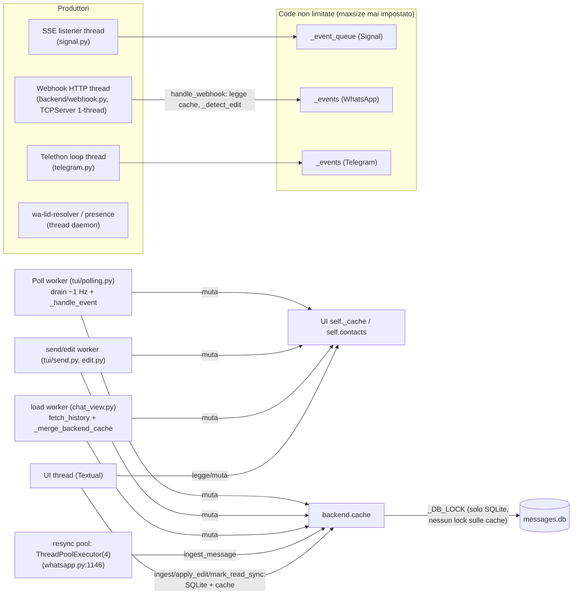

# Architect Review — signal-tui-client

> Autore: agente Architect
> Data: 2026-08-23
> Scope: codebase su `master` (commit `89cdf24`, documentazione inclusa) — `backend/`, `backends/`, `tui/`, `models.py`, `signal_tui.py`, `device_link_screen.py`, `docker-compose.yml`, `.env.example`
> Scopo: base di confronto con l'agente Doc. Ogni affermazione è verificata sul codice (file:riga). Non è una lista di bug tattici già fissati: è una critica alle **decisioni strutturali** e ai **rischi latenti**.

---

## 1. Sintesi esecutiva

L'architettura a strati (UI Textual → `BackendManager` → `ChatBackend` → servizi esterni) è concettualmente sana e la documentazione in `documentation/` la descrive fedelmente. Il problema principale non è il disegno a scatole ma **il modello di esecuzione**: il sistema è di fatto *multi-thread shared-state* (≥6 thread che leggono/scrivono le stesse strutture senza alcun lock applicativo), con una superficie async (`ChatBackend`/`BackendManager`) che è in gran parte **cerimoniale** — la TUI non la usa, e le implementazioni "async" eseguono I/O bloccante nel corpo della coroutine.

Tre aree concentrano il rischio:

1. **Superficie di rete in ingresso** (webhook WAHA): non autenticata, bind `0.0.0.0`, server single-threaded senza timeout → spoofing di messaggi e DoS della ricezione (P1-1).
2. **Integrità dei dati**: la combinazione `_update_message_id` (UPDATE multi-riga senza finestra né LIMIT) + `_dedup_messages_by_id` al boot può cancellare messaggi legittimi (P1-3); le identità dei messaggi restano euristiche a finestre (P2-5).
3. **Affidabilità della ricezione**: retry SSE a 1 Hz senza backoff né segnalazione alla UI, race di `restart_sse` (doppio listener), loop Telethon leaked a ogni reconnect, code eventi illimitate con guardia drop-oldest irraggiungibile (P1-4, P2-2, P2-9).

Le decisioni "scomode ma documentate" (typing WhatsApp OFF, retention 200/contatto, daemon Signal lasciato vivo) sono in gran parte **corrette come trade-off**, ma con modi di fallimento *silenziosi*: nessun segnale in UI, gate di configurazione incoerenti (`.env` consultato solo per 3 chiavi), e commenti/docstring che in alcuni punti descrivono un comportamento diverso dal codice.

Conteggio: **4 problemi P1, 9 P2, 6 P3**.

---

## 2. Mappa del modello a thread (evidenza per P1-2)

**Nessuna delle frecce verso `backend.cache` / `self._cache` / `self.contacts` è protetta da lock.** L'unico lock del sistema (`_DB_LOCK`, `backend/db.py:28`) serializza solo SQLite.

---

## 3. Problemi

## P1 — Critici

### P1-1. Webhook WAHA non autenticato, esposto su `0.0.0.0`, single-threaded e senza timeout

**(a) Descrizione.** Il server webhook (`backend/webhook.py`) è un `socketserver.TCPServer` puro: gestisce **una richiesta alla volta**, su socket senza timeout, in ascolto su tutte le interfacce (`0.0.0.0:8088`), senza alcuna autenticazione né segreto condiviso nel path/header. Chiunque raggiunga la porta (LAN, o qualsiasi container della macchina) può `POST /webhook` con un payload arbitrario.

**(b) Evidenza.**
- `backend/webhook.py:93-97`: `socketserver.TCPServer(("0.0.0.0", WEBHOOK_PORT), _WebhookHTTPHandler)` — non `ThreadingTCPServer`.
- `backend/webhook.py:39-59`: `do_POST` → `json.loads` → `target(data)` → sempre 200. Nessun controllo di token/origine.
- `backend/webhook.py:43-44`: `self.rfile.read(length)` bloccante, nessun `settimeout` sul socket, nessun limite a `Content-Length`.
- Il payload finisce in `WhatsAppBackend.handle_webhook` (`backends/whatsapp.py:178`) che costruisce eventi anche con `fromMe: true` → `is_mine=True` (`backends/whatsapp.py:314-331`).

**(c) Impatto.**
- *Spoofing/poisoning*: un attaccante locale inietta messaggi falsi (anche "inviati da te"), receipt e typing finti; vengono **persistiti in SQLite** e mostrati in UI come autentici.
- *Disponibilità*: un client che apre la connessione e non manda mai il body blocca l'unico thread del server → **tutta la ricezione WhatsApp si ferma** (slow-loris accidentale o voluto). WAHA nel frattempo riceve risposte solo quando la connessione si chiude; gli eventi si accodano lato WAHA e vanno in retry.
- *Memoria*: `Content-Length` arbitrario → `read(length)` alloca quanto dichiarato.

**(d) Mitigazione.** (1) Bind su `127.0.0.1` + route esplicita per il container (o sull'IP del bridge docker, es. `172.17.0.1`, risolvendo `host.docker.internal`); (2) segreto nel path (`/webhook/<token128>` generato al primo avvio e registrato via `_configure_webhook`) o header `X-Webhook-Token` verificato prima del parse; (3) passare a `ThreadingTCPServer` + `settimeout(10)` sul socket + tetto a `Content-Length` (es. 1 MB); (4) rifiutare payload con `fromMe: true` non riconducibili a un invio locale recente (la `_seen_message_keys` conosce già gli id emessi).

---

### P1-2. Stato mutabile condiviso tra ≥6 thread senza lock applicativi; I/O bloccanti sul thread UI

**(a) Descrizione.** Le cache (`backend.cache`, `self._cache`, `self.contacts`, `_typing_contacts`, `_unread_counts`) sono lette e scritte da: thread UI, poll worker, send worker, edit worker, load worker, pool di resync (4 thread), webhook thread, Telethon loop. Non esiste alcun lock o canale di ownership: la correttezza poggia sul GIL e sulla fortuna. Inoltre il thread UI esegue direttamente scritture SQLite e chiamate REST.

**(b) Evidenza.**
- Poll worker → mutazioni UI data: `tui/events.py:93-115` (`self._cache[cache_key].append(...)`), `tui/events.py:62-68` (`self.contacts.append(...)`), `tui/events.py:119-123` (`_typing_contacts`/`_typing_mumbling`), `tui/events.py:78-84` (`contact.last_message_ts`).
- UI thread → backend/SQLite: `tui/send.py:120` (`ingest_backend.ingest_message(...)` sul thread UI), `tui/edit.py:130-134` (`backend.apply_edit(...)` → `_update_message_text` → SQLite, sul thread UI), `tui/contacts.py:708` (`mark_read_sync` → per WhatsApp una **POST REST sincrona** `backends/whatsapp.py:1270-1276` sul thread UI a ogni selezione di contatto).
- Load worker → UI cache: `tui/chat_view.py:456` (`_merge_backend_cache` muta `self._cache` da worker thread; di più: `chat_view.py:653` fa `ui_msgs.append(m)` condividendo **gli stessi dict** tra backend cache e UI cache — le mutazioni dell'uno si riflettono nell'altra senza copia).
- Pool resync: `backends/whatsapp.py:1146-1147` (4 worker che chiamano `fetch_history` → `ingest_message` → `_add_cached_message` → `list.sort`).
- Pattern check-then-act non atomico: `backends/whatsapp.py:1514-1559` (`_message_already_cached` → append), identico in `signal.py:887-934` e `telegram.py:1176-1262`. Due ingest concorrenti dello stesso messaggio (es. echo webhook + fetch_history nel pool) possono **entrambi** superare il dedup → riga doppia in DB.

**(c) Impatto.** Race a finestra stretta ma reale: duplicati sporadici, `list mutated during iteration` durante i `sort`/`sorted()` concorrenti, stati UI/DB divergenti. Le POST REST e le scritture SQLite sul thread UI (selezione contatto, edit ottimistico) sono freeze potenziali dell'interfaccia (documentate come "micro-lag" in `docs/PERF_ANALYSIS.md` R1, ma con WAHA lento il `mark_read` arriva a secondi).

**(d) Mitigazione.** A breve termine: (1) spostare `mark_read_sync` e `apply_edit` fuori dal thread UI (`run_worker(thread=True)`); (2) un `threading.RLock` per backend attorno a `ingest_message`/`apply_edit`/`process_receipt`/`_add_cached_message` (granularità per-backend è sufficiente, i contatti non si toccano tra backend); (3) `_merge_backend_cache` deve copiare i dict (`dict(m)`), non condividerli. A medio termine: un **event loop unico di mutazione** (modello actor): i producer fanno solo enqueue, un solo consumer applica a cache+DB+UI queue; è il disegno verso cui il codice già tende (`handle_webhook` docstring "single-mutation-point") ma non realizza.

---

### P1-3. `_update_message_id` aggiorna più righe; al boot `_dedup_messages_by_id` le cancella come "duplicati"

**(a) Descrizione.** `_update_message_id` aggancia l'id server alla riga ottimistica matchando per `(protocol, contact_number, text, is_mine)` **senza finestra temporale e senza `LIMIT 1`**: tutte le righe id-less con lo stesso testo nella chat ricevono lo **stesso** `msg_id` (e lo stesso timestamp sovrascritto). Al prossimo avvio `_dedup_messages_by_id` (eseguito dentro `_load_cache`, quindi a ogni boot per ogni backend) raggruppa per `(protocol, contact_number, msg_id, text)` e **cancella tutte le copie tranne una**.

**(b) Evidenza.**
- `backend/db.py:281-286`: `UPDATE messages SET msg_id = ?, timestamp = ? WHERE protocol = ? AND contact_number = ? AND text = ? AND is_mine = ? AND (msg_id IS NULL OR msg_id = '')` — nessun vincolo di unicità né di `timestamp`.
- `backend/db.py:531-579` (`_dedup_messages_by_id`): `DELETE FROM messages WHERE rowid IN (... rn > 1)` su partizione `(protocol, contact_number, msg_id, text)`.
- `_load_cache` chiama sempre `_dedup_messages_by_id()` (`backend/db.py:156-157`), ed è chiamato da tutti e tre i backend al connect (`backends/signal.py:330`, `whatsapp.py:447`, `telegram.py:1128`).
- Righe id-less legittime esistono davvero: il retry di un messaggio fallito (`tui/send.py:507-517`) riparte **senza** `persist` e senza id; il path WAHA senza id nella risposta (`backends/whatsapp.py:1236-1238`) è previsto.

**(c) Impatto.** Scenario concreto: l'utente invia "ok", il send fallisce (riga id-less), riprova e invia "ok" di nuovo (altra riga id-less), poi un echo aggancia l'id reale → entrambe le righe prendono lo stesso `msg_id` → al riavvio una viene **cancellata dal DB** (perdita permanente di un messaggio). È un data-loss silenzioso, non rilevabile dai test attuali (i test coprono il caso a riga singola).

**(d) Mitigazione.** In `_update_message_id`: aggiungere `AND timestamp BETWEEN ?-? AND ?+?` (finestra echo per protocollo) e limitare a una riga (`... ORDER BY ABS(timestamp - ?) LIMIT 1` via subquery su `id`, come già fa `_update_message_status_by_text` a `backend/db.py:467-470`). Rendere `_dedup_messages_by_id` difensivo: non cancellare quando la partizione contiene righe con `timestamp` distanti oltre la finestra echo (segnale di id assegnato due volte per errore — loggare invece di cancellare).

---

### P1-4. Lifecycle del listener SSE Signal: race in `restart_sse`, retry a 1 Hz senza backoff, log fuorviante, `restart_sse` mai chiamato

**(a) Descrizione.** Quattro difetti convergenti sullo stesso componente:

1. **Race doppio listener**: `restart_sse` imposta `_polling_active=False`, azzera `_sse_thread`, poi `_start_sse_listener()` riporta `_polling_active=True` e assegna il **nuovo** thread. Il vecchio thread, bloccato in `urlopen` (timeout 30 s), al risveglio ri-valuta la guardia del `while` — `_polling_active` (di nuovo True) `and self._sse_thread is not None` (di nuovo non-None) → **riconnette anche lui**: due connessioni SSE attive, ogni envelope accodato due volte.
2. **Retry senza backoff**: il loop riprova ogni ~1 s all'infinito (`for _ in range(10): sleep(0.1)`), senza jitter, senza tetto, senza mai segnalare lo stato alla UI.
3. **Log fuorviante**: dopo un fallimento la generator `listen_events` ritorna senza yield → `if envelope:` valuta una variabile **mai assegnata** (NameError catturato dal `except Exception`) oppure **stale** dall'iterazione precedente → il log dice `connection lost, retrying... (name 'envelope' is not defined)` o stampa `SSE: envelope received` spurio. La causa reale (daemon giù) non appare mai.
4. **`restart_sse` è dead code**: non ha chiamanti (`grep` su `tui/`, `backends/`, root: solo la definizione). Il flusso di re-link (`_reconnect_touched_backends` → `_connect_signal` → `_connect_sync`) **non** riavvia l'SSE se il thread è vivo (guard in `_start_sse_listener`), quindi dopo un re-link il listener può restare su una connessione morta — coerente col sintomo storico "invio ma non ricevo dopo il link".

**(b) Evidenza.** `backends/signal.py:1016-1023` (`restart_sse`), `1034-1055` (loop; `if envelope:` a `1045-1046`), `1004-1014` (guard idempotente); `backend/rpc.py:444-447` (`listen_events` ingoia l'eccezione e ritorna → il chiamante non distingue "fine stream" da "connection refused"); commento stale a `backends/signal.py:138-140` ("reconnects every 5s" — reale: ~1 s); file handler `/tmp/signal-sse.log` a livello DEBUG (`backends/signal.py:32-36`) che cresce ~1 riga/s durante un outage.

**(c) Impatto.** Outage prolungato del daemon (crash signal-cli, reboot del servizio) → riconnessioni a 1 Hz indefinite, log che cresce, UI che non mostra nulla (nessun indicatore "Signal disconnesso"); dopo un re-link, o listener doppio (eventi duplicati → doppie ingest, mitigato dal dedup ma non per receipt/typing) o listener morto (ricezione ferma fino al riavvio dell'app).

**(d) Mitigazione.** (1) Token di generazione: `self._sse_generation += 1` a ogni restart; il thread cattura la sua generazione ed esce se diversa (elimina la race senza dipendere da flag condivisi). (2) Backoff esponenziale con tetto (1 s → 30 s, jitter) + contatore di fallimenti consecutivi che, oltre soglia, emette un `ChatEvent` di stato verso la UI (la status bar ha già il canale). (3) Spostare `if envelope:` dentro il `for` o eliminarlo. (4) Decidere: o chiamare `restart_sse()` nel flusso di re-link, o rimuoverlo. (5) Far propagare la causa da `listen_events` (raise invece di `return` silenzioso) e loggarla una volta per transizione di stato, non per retry.

---

## P2 — Medi

### P2-1. Configurazione: `.env` consultato solo per 3 chiavi → drift silenzioso con docker-compose

**(a) Descrizione.** `_load_dotenv()` è usato **solo** da `get_whatsapp_api_key`, `get_telegram_api_id`, `get_telegram_api_hash`. Tutte le altre chiavi operative (`WHATSAPP_API_URL`, `WHATSAPP_API_PORT`, `CLIENT_WEBHOOK_PORT`, `WAHA_WEBHOOK_URL`, `WHATSAPP_SESSION_NAME`, `WAHA_PRESENCE_SUBSCRIBE`) leggono solo `os.environ`/`config.json`. Ma `.env` è il canale documentato per docker-compose (`env_file:` in `docker-compose.yml:52-55`) e `.env.example` vi dichiara `CLIENT_WEBHOOK_PORT=8088` con la nota "both values must match".

**(b) Evidenza.** `backends/config.py:30-52` (loader), call site unici: `config.py:149`, `config.py:224`, `config.py:243`. Env-only: `config.py:99` (`WHATSAPP_API_PORT`), `config.py:181` e `backend/webhook.py:24` (`CLIENT_WEBHOOK_PORT`), `config.py:196` (`WAHA_WEBHOOK_URL`). `.env.example:22` dichiara `CLIENT_WEBHOOK_PORT` in `.env`.

**(c) Impatto.** Caso concreto: l'utente edita `CLIENT_WEBHOOK_PORT=8090` in `.env` → compose sostituisce `${CLIENT_WEBHOOK_PORT}` in `WAHA_WEBHOOK_URL` → WAHA posta sulla 8090 → il client continua ad ascoltare sulla 8088 → **ricezione WhatsApp totalmente ferma, senza nessun errore in UI**. Stesso drift per `WHATSAPP_API_PORT` (WAHA si sposta, `_local_waha_reachable` fallisce → backend WhatsApp silenziosamente non registrato, `config.py:163-171`). Non è solo incoerenza percepita: è una trappola operativa già armata dalla documentazione.

**(d) Mitigazione.** Unificare la precedenza in `backends/config.py::_get` → `os.environ` → `config.json` → `.env` → default, per **tutte** le chiavi (il loader esiste già); oppure dichiarare esplicitamente che `.env` è solo per docker-compose e rimuovere da `.env.example` le chiavi che il client legge. La prima opzione costa 5 righe e chiude la classe di errore.

### P2-2. Code eventi illimitate; guardia drop-oldest irraggiungibile; pipeline webhook at-most-once

**(a) Descrizione.** Tutte e tre le code eventi sono `queue.Queue()` senza `maxsize` (`backends/whatsapp.py:157`, `backends/signal.py:91`, `backends/telegram.py:95`). La guardia `except queue.Full` in `_enqueue_event` (`backends/whatsapp.py:1342-1348`) è **codice morto**: con `maxsize=0` `put_nowait` non solleva mai `Full`. Inoltre `_seen_message_keys` (`whatsapp.py:161`) e `_seen_msg_ids` (`telegram.py:98`) crescono senza bound per tutta la sessione.

**(b) Evidenza.** `backends/whatsapp.py:157` (no maxsize), `1338-1348` (guardia morta), `161` (set non limitato). Producer di `_events` WhatsApp = il webhook thread (rete, potenzialmente avversariale — vedi P1-1); consumer = poll worker a cadenza ~1 s (`tui/polling.py:93-96`) che per ogni evento può fare scritture SQLite. Lato affidabilità: il webhook risponde 200 **prima** della persistenza (enqueue volatile in memoria; `backend/webhook.py:52-59`): un crash tra ack e drain perde i messaggi accodati — WAHA non rispedisce (200 ricevuto), il dedup anti-retry in memoria è sparito col processo.

**(c) Impatto.** Burst (sync iniziale di un gruppo attivo, retry storm di WAHA, flood da un host locale) → crescita di memoria e latenza di visualizzazione non limitate; il caso crash → perdita silenziosa. Il set `_seen_message_keys` su sessioni lunghe è un leak lento (3-tuple per messaggio).

**(d) Mitigazione.** `queue.Queue(maxsize=10000)` (rende viva la guardia drop-oldest, che però va ripensata: droppare il *più vecchio* messaggio in una chat app è discutibile; meglio coalescenza typing/receipt e contatore di drop loggato); persistenza **prima** del 200 è impossibile con l'handler sincrono attuale, quindi accettare il trade-off ma documentarlo, oppure spostare l'ack dopo l'enqueue + fsync differito (batch). Bound ai set: `collections.OrderedDict` come LRU (es. 5000 chiavi) o reset a ogni connect.

### P2-3. Typing WhatsApp OFF di default: decisione sensata, esecuzione silent-broken

**(a) Descrizione.** La subscription presence è gated da `_PRESENCE_SUBSCRIBE_ENABLED`, **valutato a import-time come attributo di classe** (`backends/whatsapp.py:917-919`) e letto solo da `os.environ` — quindi non riattivabile via `.env` né via `config.json`, e non riattivabile a runtime/test senza reimport. Il parser `_event_from_typing` resta attivo e sia docker-compose (`docker-compose.yml:44-45`) sia `_configure_webhook` (`whatsapp.py:537`) continuano a chiedere `presence.update` a WAHA. Nessun segnale in UI che il typing WA è disattivato.

**(b) Evidenza.** `backends/whatsapp.py:909-919` (commento WON'T FIX + gate import-time), `whatsapp.py:469`, `1008`, `227`, `357` (call site lazy/sweep tutti no-op quando OFF), `backends/whatsapp_events.py:518-589` (parser vivo). La documentazione (`documentation/architecture/BACKEND_COMPONENTS.md:90`) lo dichiara onestamente.

**(c) Impatto.** Feature morta nella configurazione standard senza feedback: l'utente vede il typing funzionare su Signal/Telegram e lo percepisce "rotto" su WhatsApp. Riattivarlo richiede un export di shell non documentato (non basta editare `.env`, a differenza di quanto un utente ragionevolmente tenterebbe dopo aver letto `.env.example`).

**(d) Mitigazione.** Accettare la decisione (WEBJS non supporta `subscribePresence`) ma: (1) leggere il flag via `_get` unificato (P2-1) e **a call-time** (funzione, non attributo di classe valutato a import); (2) togliere `presence.update` dagli eventi richiesti finché il flag è OFF (risparmia traffico e aspettative); (3) una riga nella status bar/README: "typing WhatsApp disabilitato (limite WAHA WEBJS)".

### P2-4. L'interfaccia async di `ChatBackend`/`BackendManager` è cerimoniale; `get_pairing_qr` viola Liskov

**(a) Descrizione.** La superficie async del manager (`connect_all`, `disconnect_all`, `send_message`, `mark_read`) **non è chiamata da nessuna parte nella TUI** (verificato con grep su `tui/`, root: zero call site): il flusso reale usa `connect_sync`/`send_message_sync`/`mark_read_sync` da worker thread. Le implementazioni "async" sono sync travestite, e alcune bloccano l'event loop se qualcuno le usasse davvero. Il caso `get_pairing_qr` è il sintomo più netto: `async` in base, override **sync** in Telegram, `async`-ma-bloccante in WhatsApp, e la UI che bypassa l'interfaccia chiamando `wa._rest.get_pairing_qr()` direttamente.

**(b) Evidenza.**
- `backends/base.py:37-83` (astratti async), `base.py:188` (`async def get_pairing_qr`).
- `backends/whatsapp.py:429-431`: `async def connect` → `self.connect_sync()` nel corpo (fino a 40 s di `_wait_session_ready` sull'event loop, `whatsapp.py:471-512`); `whatsapp.py:1158-1175`: `async def send_message` → sync nel corpo (REST fino a 30 s); `whatsapp.py:421-425`: `async def get_pairing_qr` → REST bloccante nel corpo.
- `backends/telegram.py:182-183`: `async def connect` **no-op** ("Not used"); `telegram.py:676-700`: `async def send_message` → `future.result(timeout=30)` nel corpo (blocca il chiamante); `telegram.py:1319`: `def get_pairing_qr` — **sync**, firma incompatibile con la base.
- Bypass dalla UI: `device_link_screen.py:730` (`wa._rest.get_pairing_qr()`), `device_link_screen.py:766-768` (`await to_thread(tb.get_pairing_qr)` — corretto per il caso sync, ma dimostra che il contratto async non è fidato).
- `backends/manager.py:52-63`, `115-139`: metodi async inusati; `manager.py:65-75` `list_contacts` legge l'attributo `backend.contacts` con `except AttributeError` (duck typing sul contratto).

**(c) Impatto.** Doppio modello mentale (async per contratto, sync per realtà) → chi estende il sistema (o un agente che legge `base.py`) scrive codice che sembra sicuro e blocca la UI. `receive()` (`base.py:76-84`, `signal.py:1057-1071`) è anch'esso inusato (la TUI usa `poll_once`), e `SignalBackend.receive()` muta `_polling_active` (`signal.py:1064`) — un consumer che riaccende il flag di lifecycle dopo un disconnect. Il costo non è oggi (i path usati sono corretti) ma ogni nuovo chiamante della superficie async è una trappola.

**(d) Mitigazione.** Decidere e dichiarare: o l'interfaccia diventa **sync-first** (`*_sync` come contratto primario, wrapper async generati con `asyncio.to_thread` nella base — esattamente come già fatto per `edit_message`/`list_address_book` in `base.py:115-124`, `169-174`), oppure le implementazioni async fanno davvero `to_thread`. Allineare `get_pairing_qr` (scegliere sync + `to_thread` nel chiamante, uniforme coi tre backend). Deprecare `receive()` o implementare il poll worker su di esso. Nota: questo è il punto dove la documentazione (`documentation/api-contracts/CONTRACTS.md`) rischia di descrivere il contratto aspirazionale invece di quello reale — vedi "Domande aperte".

### P2-5. Identità dei messaggi e dedup: euristiche a finestre, tuple type-mixed, echo window di 10 minuti che ignora l'id

**(a) Descrizione.** L'identità di un messaggio è `(protocol, cache_key, ts, text)` con quattro finestre di dedup diverse per protocollo (Signal in ±2 s / out ±5 s, Telegram 2 s, WhatsApp in ±5 s / echo 10 min) e con l'id usato "quando c'è". Tre fragilità concrete:

1. **Echo window WhatsApp (10 min) che non veta l'id mismatch**: per un outgoing con `msg_id`, una riga cached con **id diverso** ma stesso testo entro 10 min matcha comunque → due "ok" inviati a 8 minuti di distanza (il secondo da un altro device) collassano in uno.
2. **Timestamp ack WAHA**: il path ack in `handle_webhook` fa `int(ts) * 1000` **incondizionato**, mentre `_event_from_message` usa l'euristica `< 10**12` — se una build WAHA emette ms nell'ack, l'evento sintetico ha timestamp nell'anno 51382 (ordinamento/dedup rotti per quel messaggio).
3. **Tuple type-mixed**: `_seen_message_ids`/`_shown_in_log` contengono sia `(proto, key, int_ts, text)` sia `(proto, key, str_message_id, text)` — stesso slot, due tipi; funziona perché gli int non collidono con le stringhe, ma è fragile e illeggibile dai test.

**(b) Evidenza.** `backends/whatsapp.py:1448-1473` (`_message_already_cached`; branch `elif msg_id:` a 1465-1470), `whatsapp.py:1804-1812` (costanti), `whatsapp.py:228-230` vs `backends/whatsapp_events.py:231-237` (doppia regola ts), `tui/edit.py:147-159` (`_rewrite_message_identity` inserisce la variante `str(message_id)`), `tui/chat_view.py:525-532` (stessa doppia forma), `backends/signal.py:58-66` (finestre Signal), `backends/telegram.py:53` (finestra TG). La documentazione (`DESIGN_MESSAGE_IDENTITY_AND_CACHE.md` §1, §3) descrive correttamente il disegno ma non i casi di collasso.

**(c) Impatto.** Perdita silenziosa di messaggi ripetuti a distanza ravvicinata (stesso testo entro la finestra), divergenza tra cache backend e UI se le euristiche di `chat_view._merge_backend_cache` (finestre copiate a mano, `chat_view.py:606-632`) driftano da quelle del backend; la doppia regola sui timestamp ack è un bug in attesa di una build WAHA diversa.

**(d) Mitigazione.** Centralizzare le finestre in `models.py` (una costante per protocollo, importata da backend e UI — oggi gli stessi 5000/600000 sono scritti due volte); nell'echo WA: se la riga cached ha un id e l'id è diverso → **non** matchare (veto), la finestra vale solo per righe id-less; unificare la conversione ts (secondi↔ms) in un helper unico usato da ack e message path; tipizzare le identity tuple con un `NamedTuple`/`dataclass(frozen=True)` invece dello slot polimorfo.

### P2-6. Macchina a stati degli status: rank duplicato in 7 punti, `sent`→`failed` impossibile, update a 4 store non atomico

**(a) Descrizione.** La tabella di rank `pending=0, failed=0, sent=1, delivered=2, read=3` è **ricopiata in 7 punti** (3 volte come SQL `CASE` in `backend/db.py`, 4 volte come dict in `backends/`+`tui/`). Edge case:

1. `failed` e `pending` condividono rank 0 → la guardia SQL (`<=`) permette `failed`→`pending` (voluto, per il retry) ma anche che una transizione `pending` scriva sopra `failed` in una race; e **blocca `sent`→`failed`**: un messaggio già marcato sent dall'echo il cui invio è poi fallito non potrà mai mostrarsi fallito.
2. Il fallback `by_text` (`_update_message_status_by_text`) aggiorna "la riga outgoing più recente con quel testo": con testi ripetuti ("ok") può avanzare la riga sbagliata, lasciando l'altra pending per sempre.
3. `_transition_outgoing_status` aggiorna in sequenza DB → backend cache → UI cache → widget (via `call_from_thread`): 4 store, nessuna atomicità; un crash a metà lascia stati divergenti fino al reload.
4. Il fallback "unique id-less" di `process_receipt` WhatsApp scansiona **tutte le chat** se `contact_id` manca: con due chat con bolle pending, nessun upgrade (safe ma il receipt è perso); con una sola, l'upgrade può colpire la chat sbagliata se lo scope è assente.

**(b) Evidenza.** Rank: `backend/db.py:390-393` (e identico in `402-437`, `440-480`), `backends/whatsapp.py:1667-1673`, `backends/telegram.py:1060-1066`, `backend/rpc.py:280-286`, `tui/chat_view.py:27`, `tui/backend_connect.py:21`. Sequenza 4-store: `tui/send.py:322-414`. Fallback by-text: `backend/db.py:440-480`. Fallback unique id-less: `backends/whatsapp.py:1716-1750`. La documentazione (`DESIGN_OUTGOING_MESSAGE_STATUS.md` §1-3) copre la macchina ma non questi edge case.

**(c) Impatto.** Drift del rank tra copie (un quinto stato andrebbe toccato in 7 punti); bolle che restano `sent`/`pending` spurie; nella casistica "stesso testo ripetuto" lo stato visibile può attaccarsi alla bolla sbagliata.

**(d) Mitigazione.** Rank in `models.py` (`STATUS_RANK` unico, importato ovunque; per il SQL, generare la stringa CASE dalla stessa tabella); permettere `sent`→`failed` solo da `_transition_outgoing_status` con `expected_statuses=("pending","sent")` esplicito (decisione consapevole, non effetto collaterale del rank); fallback by-text vincolato a una finestra temporale (es. ±60 s) oltre che al testo; rendere il fallback id-less strettamente scoped per chat (se manca `contact_id`, loggare e non applicare).

### P2-7. Flusso edit: layer violati, DB sul thread UI, edit su messaggio mai visto scartato

**(a) Descrizione.** L'edit attraversa tre layer con responsabilità sfumate: `tui/edit.py` orchestra (ottimistico + rollback) ma chiama `backend.apply_edit` — dichiarato in `base.py` come "punto UNICO di mutazione lato backend" per gli edit **ricevuti** — per l'edit **locale ottimistico**, eseguendo una scrittura SQLite sul thread UI; e fa "chirurgia" sui set d'identità della UI (`_rewrite_message_identity`) che è conoscenza del layer di render. Inoltre: un edit WhatsApp ricevuto per un messaggio **mai visto** (inviato da un altro device e editato prima di qualsiasi fetch) produce un evento `message_edit` il cui `apply_edit` ritorna `None` → l'handler scarta l'evento → il messaggio **non comparirà mai** finché un fetch storico non lo porta (come già editato).

**(b) Evidenza.** `tui/edit.py:100-145` (`_submit_edit`/`_apply_local_edit` sul thread UI → `backend.apply_edit` → `_update_message_text`), `tui/edit.py:186-216` (rollback speculare, anch'esso con DB via backend), `backends/base.py:126-146` (docstring del contratto), `backends/whatsapp.py:239-267` (ack-edit → solo evento `message_edit`, nessun evento `message` sintetico), `tui/events.py:195-203` (`if not info: return False` — drop silenzioso).

**(c) Impatto.** Freeze potenziale della UI su ogni tasto Invio in modalità edit (SQLite + lock conteso con il resync pool); doppio uso di `apply_edit` (ricevuto vs ottimistico) rende il contratto ambiguo per chi aggiunge un backend; il caso "edit su ignoto" è perdita di contenuto visibile (anche se il DB resta coerente al prossimo fetch).

**(d) Mitigazione.** Separare le due operazioni: `apply_edit` (inbound, com'è documentato) e `apply_local_edit` (ottimistico, stessa logica ma nome/contratto espliciti); spostare la persistenza ottimistica nel worker (`_edit_message_worker` persiste prima della chiamata di rete, pattern già usato da `send.py` con `persist=`); per l'edit su ignoto: fallback "upsert come nuovo messaggio con `edited=True`" invece del drop.

### P2-8. SQLite: `_init_db` per-operazione (doppia connessione), dedup full-scan ×3 a ogni boot, prune solo nel path WhatsApp, cache Signal non filtrata per protocollo

**(a) Descrizione.** Ogni funzione di `backend/db.py` chiama `_init_db()` (che apre una connessione, fa `PRAGMA journal_mode=WAL`, verifica la migrazione) e poi apre **una seconda** connessione per il lavoro vero: due connessioni e due acquisizioni di `_DB_LOCK` per ogni insert/update. `_load_cache` esegue sempre `_dedup_messages_by_id` (scan con window function su tutta la tabella + 2 `COUNT(*)`) — e viene chiamata una volta per backend al boot. `_prune_cache` (200 msg/contatto) è chiamata **solo** da `WhatsAppBackend.resync_history` (`backends/whatsapp.py:1151-1153`): un'installazione solo-Signal/Telegram non pota mai → DB illimitato (e mai `VACUUM`). `CACHE_RETENTION_DAYS = 3` è una costante morta con docstring stale. Infine `SignalBackend._load_protocol_cache` chiama `_load_cache()` **senza filtro protocollo** → la cache in memoria di Signal contiene anche le righe WhatsApp/Telegram (chiave raw), inquinando il merge in `_on_backend_ready` con chiavi fantasma tipo `signal:39123@c.us`.

**(b) Evidenza.** `backend/db.py:104-142` (`_init_db`), `145-198` (`_load_cache` → `_dedup_messages_by_id` a 156-157), `292-317` (prune + commento sulla retention disattivata; docstring stale a 293), `18` (costante morta). Call site unico di prune: `backends/whatsapp.py:1153`. `backends/signal.py:328-330` (`return _load_cache()` senza argomento) vs `whatsapp.py:1381-1392` e `telegram.py:1123-1136` (filtrate). Merge UI: `tui/backend_connect.py:66-107`.

**(c) Impatto.** Boot che scala male col DB (3 dedup full-scan); storage illimitato per utenti senza WhatsApp; memoria e lavoro spurio nel backend Signal; nessun rischio di corruzione (il lock funziona), ma è igiene strutturale degradata.

**(d) Mitigazione.** Connessione singola per operazione (o `contextlib` helper che fa init una tantum per processo — la migrazione è già gated da `user_version`); spostare `_dedup_messages_by_id` fuori da `_load_cache` (una volta per boot, esplicita); chiamare `_prune_cache` anche dal connect Signal/Telegram; `_load_cache(protocol=PROTOCOL_SIGNAL)` in `signal.py:330`; `VACUUM` occasionale (es. a prune, se cancellate > N righe); eliminare o riattivare `CACHE_RETENTION_DAYS` e allineare la docstring.

### P2-9. Thread lifecycle: loop Telethon leaked a ogni reconnect; webhook server senza shutdown; fan-out manager fino a 75 s; `mark_read` bloccante in UI

**(a) Descrizione.** Somma di difetti di lifecycle, nessuno fatale da solo:

1. `TelegramBackend.disconnect_sync` chiama `client.disconnect()` ma **non ferma mai il loop** (`run_forever` senza `loop.stop`): il thread daemon resta vivo; `_connect_sync` ne crea uno nuovo a ogni (re)connect (`telegram.py:216-228`, `290-298`) → accumulo di loop/thread zombie durante la sessione.
2. `get_pairing_qr` di Telegram crea/chiude loop a mano con finestre in cui `self._loop` è condiviso tra il QR-wait thread e `complete_2fa` chiamato dall'UI (`telegram.py:1391-1454`) — race mitigata solo dai flag `_needs_2fa`.
3. Il webhook server (`serve_forever`, `backend/webhook.py:102-103`) non viene mai fermato (daemon thread: muore col processo, ma `on_exit` (`tui/app.py:262-269`) disconnette solo Telegram — Signal/WA/webhook chiusi per abbandono).
4. `BackendManager.list_address_book_sync` (fan-out su 3 worker) attende i `future.result(timeout=25)` **in sequenza** (`backends/manager.py:102-113`): con tutti i backend appesi, il worker chiamante resta bloccato fino a ~75 s.
5. `mark_read_sync` sul thread UI (già in P1-2, lo cito qui per il lifecycle: è nel path di `_select_contact`, `tui/contacts.py:708`).

**(b) Evidenza.** `backends/telegram.py:189-204` (disconnect senza stop), `282-287` (nuovo thread a ogni connect), `1391-1424` (QR wait thread); `backend/webhook.py:102-103`; `tui/app.py:262-269` (on_exit parziale); `backends/manager.py:97-113`.

**(c) Impatto.** Leak lento di thread (ogni Ctrl+L su Telegram ne aggiunge uno); shutdown dipendente dalla semantica "daemon muore col processo" (accettabile ma fragile: un futuro porting a contesto embedded/di test eredita thread penzolanti); picker della rubrica che può impiegare >1 minuto con backend morti.

**(d) Mitigazione.** `disconnect_sync`: schedulare `loop.stop()` dopo `client.disconnect()` (`loop.call_soon_threadsafe(loop.stop)`) e solo allora join; `manager`: valutare i future con `concurrent.futures.wait(..., timeout=25)` complessivo invece che per-future in serie; `on_exit`: chiamare `disconnect_all` (esiste già, è inusato — vedi P2-4) e `shutdown` del webhook server.

---

## P3 — Bassi / note

### P3-1. Auto-detect WAHA con probe bloccante sul thread UI e abilitazione implicita

`backends/config.py:119-127` (`_local_waha_reachable`, `socket.create_connection(timeout=1)`) è chiamato da `whatsapp_enabled()` nel costruttore di `SignalTUI` (`tui/app.py:95-97`): fino a 1 s di blocco all'avvio, e — più sottile — **il backend WhatsApp si auto-abilita se qualcosa risponde sulla 3005**, anche senza configurazione esplicita. Direzione: probe nel primo connect worker, non in `__init__`; richiedere opt-in esplicito per l'auto-enable (o almeno loggare "auto-detected" in status bar).

### P3-2. Logging: FileHandler hardcoded su `/tmp` a import-time, livello DEBUG, nessuna rotazione

`backends/signal.py:32-36` (`/tmp/signal-sse.log`), `backends/telegram.py:43-47` (`/tmp/telegram.log`), `signal_tui.py:87-91` (`/tmp/signal-link.log`): side effect a import-time, `mode="w"` (troncato a ogni avvio: perso il contesto del crash precedente), DEBUG sempre attivo, nessuna rotazione (il log SSE cresce ~1 riga/s durante un outage — vedi P1-4), path non portabili. Direzione: `logging` configurato solo nell'entry point, `RotatingFileHandler`, livello da env.

### P3-3. Docstring/commenti che descrivono codice diverso (drift)

- `backends/signal.py:138-140`: "reconnects every 5s" — reale ~1 s (`1049-1055`).
- `backends/whatsapp_rest.py:206-214`: il docstring di `list_contacts` descrive un fallback `GET /api/contacts` → `/chats` che il codice non implementa (chiama solo `/chats`).
- `backend/db.py:293`: docstring di `_prune_cache` cita la retention temporale disattivata.
- `models.py:174`: `ChatEvent` documenta il payload `receipt` come "list of updated messages" — i producer emettono dict (`{"message_ids", "is_read"}` per WA/TG; `{"receipt"}` per Signal).
- `backends/whatsapp.py:155`/`564-571`: `_polling_active`/`_connected` su WhatsApp non governano nulla (la ricezione è push) — flag residui del modello a polling.
Per Doc: questi sono i punti dove la documentazione generata rischia di ereditare l'inesattezza.

### P3-4. `config.json` riletto e riparsato a ogni getter; `USER_NUMBER` congelato a import-time

`backends/config.py:55-65` (`_load_config` senza cache) è chiamato da ogni `_get`/`_get_int` (hot path irrilevante, ma smell); `backend/rpc.py:63` (`USER_NUMBER = _get_user_number()` a import) e `SIGNAL_CLI_PATH` (`rpc.py:94`) sono snapshot: un cambio di config richiede restart anche dove non servirebbe.

### P3-5. Fallback silenziosi verso `signal_backend` e registrazione non protetta nel manager

`tui/send.py:117-119` e `393-395`: se `manager.get(protocol)` è `None`, l'ingest ottimistico / l'update di stato ricadono su `signal_backend` (inquinamento della cache Signal con chiavi straniere, o no-op confusi). `backends/manager.py:32-36`: `register()` sovrascrive silenziosamente un backend già registrato per lo stesso protocollo. `tui/backend_connect.py:209` + `218-259`: con WAHA WORKING ma 0 contatti, `_poll_wa_contacts` trattiene `_pending_backends` fino a 120 s → l'auto-selezione iniziale resta bloccata.

### P3-6. Dettagli minori verificati

- `backends/whatsapp.py:157`: annotation `queue.Queue[ChatEvent | None]` — il sentinella `None` non è mai messo in coda (`poll_once` non lo gestirebbe).
- `backends/manager.py:62-63`: `logger.debug("Backend disconnect failed", exc_info=True)` con variabile `_e` inutilizzata (pattern diffuso: `except Exception as _e` + log senza il messaggio — riduce la diagnostica).
- `tui/events.py:142`: gate `if ts and ...` — un evento con `ts=0` (payload malformato) è ingerito in cache/DB ma mai mostrato live: divergenza cache/vista fino al reload.
- `backends/whatsapp.py:1469`: `_ECHO_MATCH_WINDOW_MS = 600000` documentato come trade-off (commento a 1806-1811) ma il veto su id-mismatch assente (vedi P2-5) lo rende più ampio del descritto.

---

## 4. Copertura degli spunti richiesti

| # | Spunto | Problema | Verdetto sintetico |
|---|---|---|---|
| 1 | Presence WA off di default | P2-3 | Decisione accettabile e documentata; esecuzione silent-broken (gate import-time, non in `.env`, nessun segnale UI) |
| 2 | Coda WA illimitata / guardia morta | P2-2 (+ P1-1 come vettore) | Confermato: guardia irraggiungibile, rischio latenza/memoria sotto burst, pipeline at-most-once |
| 3 | Retry SSE ~1 s | P1-4 | Sotto fallimento prolungato: 1 Hz infinito, niente backoff, log fuorviante, nessuna superficie in UI; più race in `restart_sse` |
| 4 | `.env` parziale | P2-1 | Incoerenza reale e armata: `CLIENT_WEBHOOK_PORT`/`WHATSAPP_API_PORT` in `.env` rompono la ricezione senza errori |
| 5 | `get_pairing_qr` async | P2-4 | Sintomo di un'interfaccia async cerimoniale; override sync Telegram = violazione Liskov; UI bypassa il contratto |
| 6 | Edit/persistenza send/edit/db | P2-7 | Separazione violata nei fatti: DB scritto dal thread UI, `apply_edit` a doppio uso, edit su ignoto scartato |
| 7 | Identità `(protocol, key, ts, text)` / finestre | P2-5 | Fragilità confermate (echo 10 min senza veto id, ts ack ×1000, tuple type-mixed); disegno documentato ma con collassi noti |
| 8 | Macchina a stati status | P2-6 | Rank duplicato ×7; `sent`→`failed` bloccato; 4 store non atomici; fallback by-text ambiguo |
| 9 | Manager + fan-out | P2-4, P2-9, P3-5 | Routing OK; errori isolati; ma fan-out sequenziale fino a 75 s, register non protetto, superficie async inusata |
| 10 | Thread lifecycle | P1-4, P2-9 | SSE race + retry; loop Telethon leaked; webhook mai fermato; shutdown per daemon-abandon |
| 11 | SQLite lock unico / retention | P2-8 | Lock corretto ma `_init_db` doppio per op; prune solo se WA attivo → DB illimitato altrove; dedup ×3 a boot; cache Signal non filtrata |
| 12 | Webhook anti-retry / dedup cross-sessione | P1-1, P1-3, P2-2 | Anti-retry OK per retry benigni, ma: ack-prima-di-persist (perdita su crash), `_update_message_id` multi-riga → dedup cancella, nessuna autenticazione |

---

## 5. Domande aperte per Doc

1. **Contratto async**: `documentation/api-contracts/CONTRACTS.md` descrive `ChatBackend` come interfaccia async? Se sì, come rappresentiamo il fatto che la TUI usa solo i `*_sync` e che `WhatsAppBackend.send_message`/`connect` bloccano nel corpo? Propongo una nota esplicita "contratto aspirazionale vs flusso reale" — o è meglio che la doc spinga la migrazione sync-first (P2-4)?
2. **Typing WhatsApp**: la doc lo dichiara WON'T FIX (BACKEND_COMPONENTS.md:90). Concordi che vada aggiunta anche la *rilevabilità* (come accorgersi che è disabilitato, come riattivarlo), o preferisci che resti una decisione interna? E: va tolto `presence.update` dagli eventi richiesti finché OFF (P2-3)?
3. **Webhook security**: la documentazione attuale descrive il server webhook come componente fidato. Possiamo documentare il threat model (host singolo, LAN considerata ostile o no)? La mia proposta P1-1 (bind ristretto + token nel path) cambia il contratto con WAHA — Doc vede controindicazioni col setup docker-compose attuale?
4. **Retention**: 200 msg/contatto, prune solo se WhatsApp attivo, retention temporale disattivata ma `CACHE_RETENTION_DAYS` ancora presente. La doc dice "retention 200 messaggi per contatto" (ARCHITECTURE_OVERVIEW.md §1) — va corretta in "200 solo se il backend WhatsApp è attivo" o preferiamo prima il fix (prune per tutti) e poi la doc? E `CACHE_RETENTION_DAYS`: rimuovere la costante o riattivare la policy?
5. **Identità messaggio**: DESIGN_MESSAGE_IDENTITY_AND_CACHE.md documenta le finestre come scelte. Possiamo aggiungere una sezione "limiti noti" (collasso stesso-testo-entro-finestra, echo 10 min, doppia forma delle identity tuple) così i trade-off sono espliciti e non riscoperti a ogni bug?
6. **Dedup DB al boot**: `_dedup_messages_by_id` è documentato come idempotente e sicuro. Dopo P1-3 (multi-row id attach) — vuoi una nota di invariante ("un msg_id appartiene a una sola riga per chat") con la strategia di enforcement proposta?
7. **Lifecycle intenzionalmente rilassato**: daemon Signal lasciato vivo, webhook senza shutdown, thread daemon come strategia di exit. La doc lo presenta come "by design": manteniamo questa narrazione (con i limiti dichiarati) o apriamo un piano di shutdown pulito (P2-9)?
8. **Priorità percepita**: dalla prospettiva della documentazione, quali di questi problemi rischiano di **smentire** un documento già pubblicato (es. docstring drift P3-3) e quali sono invece coerenti con quanto scritto? Vorrei una tua mappa doc→codice dei punti che questa review invalida.
